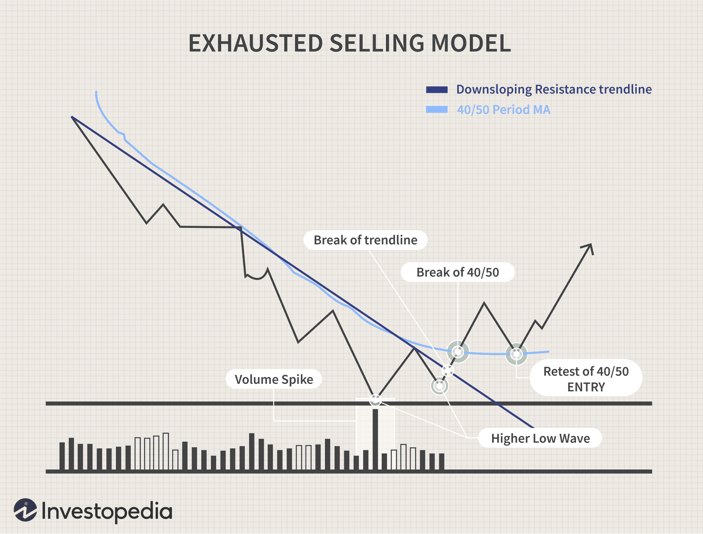

Panic selling refers to a disorderly selling of financial assets that is driven by a sudden surge in the fear of significant losses. This phenomenon typically occurs when investors react emotionally to adverse market conditions, eschewing rational analysis. Panic selling can lead to a sharp decline in asset prices, exacerbating market volatility and often triggering a cascading effect as more investors rush to unload their holdings. This behavior starkly contrasts with strategic asset liquidation, where investments are sold based on calculated decisions rather than emotional reactions.

The impact of panic selling on investment behavior is profound. Investors who engage in panic selling often experience significant financial detriment. By selling assets during a rapid market downturn, many lock in losses that could have been potentially recovered had they maintained a longer-term perspective. This behavior is frequently driven by psychological factors, including fear, uncertainty, and herd behavior, where investors follow the actions of others rather than rely on their own analysis.



In recent years, algorithmic trading has emerged as a contemporary tool to counteract the impulsive nature of panic selling. Algorithmic trading involves the use of computer programs to execute trades based on pre-set criteria and mathematical models. This method aims to minimize human emotions and errors, often optimizing for speed and efficiency. By executing trades automatically based on objective data, algorithmic trading can help mitigate the emotional bias that leads to panic-selling decisions.

The goal of this article is to provide a comprehensive overview of panic selling, examining its causes and consequences, while also exploring strategies to mitigate its effects. We will discuss how investors can develop emotional and practical strategies to avoid the pitfalls of panic selling and leverage algorithmic tools alongside traditional approaches to navigate market volatility effectively. Through historical examples and analysis, we aim to impart valuable insights that empower investors to maintain a disciplined approach amidst turbulent market conditions.

## Table of Contents

## Understanding Panic Selling

Panic selling refers to the rapid disposal of assets due to fear, uncertainty, or misinformation. It is typically characterized by a widespread, uninformed selling of stocks, bonds, or other assets, leading to sharp declines in market prices. This behavior contrasts with strategic asset liquidation, where asset sales are planned, deliberate, and informed by current market conditions or financial planning needs.

Common triggers for panic selling include market volatility, where sudden or severe price movements cause investors to fear further losses. Negative news, such as economic downturns, political instability, corporate scandals, or unexpected financial results, can also instigate panic selling. Such events tend to amplify uncertainties about the future valuation of investments, prompting investors to liquidate holdings to avoid potential losses.

Psychological factors play a significant role in panic selling. Fear is the most immediate driver, as investors worry about further market declines eroding their wealth. This fear can be exacerbated by herd behavior—a phenomenon where individuals mimic the actions of a larger group. Herd behavior leverages social proof as individuals assume the majority's actions are informed or correct, leading to a cascade of selling activity even when it is not rationally justified.

Another psychological driver is loss aversion, a concept from behavioral finance that suggests individuals prefer avoiding losses over acquiring equivalent gains. The emotional impact of potential losses often causes investors to overreact to perceived threats, contributing to impulsive decision-making such as panic selling.

By understanding these elements, investors and market analysts can better anticipate and respond to panic-driven environments, mitigating the adverse effects on financial markets and individual portfolios.

## Phases of Panic Selling

Panic selling in financial markets typically unfolds in distinct phases, from an initial trigger to eventual market stabilization. Understanding this progression can aid investors and analysts in identifying potential warning signs and mitigating risks associated with precipitous sell-offs.

**1. Initial Trigger:**

The first phase of panic selling is often sparked by a significant market event or piece of news that heightens uncertainty or fear. Common triggers include macroeconomic indicators turning negative, geopolitical tensions, corporate scandals, or financial instability like defaults. For example, the 2008 financial crisis began with the collapse of Lehman Brothers, which sowed widespread fear about the financial health of other institutions. This fear permeated the market, leading to the first wave of panic selling.

**2. Rapid Price Decline:**

Following the initial trigger, markets can experience abrupt and severe price drops as investors rush to liquidate their positions. The urgency to sell is propelled by fear of further losses and is often exacerbated by herd behavior—where individual actions are heavily influenced by the decisions of the crowd. This phase is characterized by increased [volatility](/wiki/volatility-trading-strategies) and declining asset prices, which can create a self-reinforcing cycle as declining prices fuel more selling. 

**3. Feedback Loop Intensification:**

As prices continue to drop, a feedback loop often intensifies the panic selling. Margin calls can force leveraged investors to sell off their holdings to meet [liquidity](/wiki/liquidity-risk-premium) requirements, accelerating the downward [momentum](/wiki/momentum). Additionally, [algorithmic trading](/wiki/algorithmic-trading) systems, programmed to minimize losses, may begin selling large volumes automatically, compounding the effects on the market. During this phase, market sentiment is overwhelmingly negative, and liquidity can become constrained as buyers retreat.

**4. Exhausted Selling:**

Eventually, the market may reach a state of exhausted selling. This occurs when the majority of panic-driven participants have exited their positions and selling pressure begins to subside. In some models, this phase is referred to as the "exhaustion point," where the [volume](/wiki/volume-trading-strategy) of selling diminishes and market activity starts to stabilize. At this juncture, opportunistic investors may begin to enter the market, attracted by lower valuations and the potential for recovery.

**5. Market Stabilization:**

In the final phase, the market begins to recover as investor confidence slowly returns and asset prices start to stabilize. This process can be gradual and is often aided by interventions such as monetary easing by central banks, government stimulus measures, or positive news that restores market confidence. Historical data shows that post-crisis recoveries can vary in length and intensity. For instance, after the steep declines during the 1987 market crash, markets rebounded relatively quickly, whereas the recovery from the 2008 financial crisis was more prolonged.

In visualizing these phases, models such as the exhausted selling model can be utilized to depict the dynamics of panic selling. Charts plotting volume against price levels provide insights into when selling pressure may dissipate, signaling potential opportunities for market re-entry. Below is a simple Python code that simulates a basic market decline and recovery, representing these phases:

```python
import matplotlib.pyplot as plt
import numpy as np

# Simulate market phases
days = np.arange(0, 100)
initial_phase = np.exp(-0.1 * days) * 100  # Initial trigger and rapid decline
recovery_phase = 50 + np.exp(0.1 * (days - 50))  # Exhaustion and stabilization

market_prices = np.where(days < 50, initial_phase, recovery_phase)

# Plot the phases
plt.plot(days, market_prices, label='Market Prices')
plt.axvline(x=50, color='r', linestyle='--', label='Exhaustion Point')
plt.title('Phases of Panic Selling')
plt.xlabel('Days')
plt.ylabel('Market Price')
plt.legend()
plt.show()
```

This code provides a simplified curve illustrating a hypothetical scenario where prices decline due to panic selling and then stabilize as investor confidence returns. Understanding these phases can help market participants develop strategies to better navigate periods of high volatility and uncertainty in financial markets.

## Behavioral Implications for Investors

Panic selling, a phenomenon often driven by fear and uncertainty, can have profound psychological effects on investors. When market turbulence hits, the instinctive reaction is often to sell off assets rapidly, particularly if losses appear inevitable. This reaction is primarily fueled by the emotional biases of fear and loss aversion, where the pain of losing $100 is perceived as significantly more intense than the pleasure of gaining the same amount.

The consequences of panic selling extend beyond immediate financial losses and can severely impact investor portfolios and long-term strategies. Selling in a panic often leads to realizing losses that could have been avoided with a more measured approach. This behavior disrupts the long-term investment plans, as assets sold during market lows may not be easily reacquired once the market stabilizes, leading to missed opportunities for recovery and growth. As a result, portfolio allocations become misaligned with original investment goals, potentially skewing an investor's risk profile and expected returns.

Moreover, panic-induced selling often instigates a cycle of regret and impulsive behavior. Investors who sell in haste during a market downturn frequently experience remorse when markets rebound, resulting in a psychological pattern where investors may [exit](/wiki/exit-strategy) the market altogether or re-enter at higher prices, driven by fear of missing out (FOMO). This cycle undermines confidence and fosters impulsive decision-making, which can lead to further poor investment choices in the future.

For example, an investor who sells their stock in a panic during a market decline might later regret the decision once the market recovers. This regret can manifest in either excessive optimism, leading the investor to jump back into the market at a higher price, or excessive pessimism, leading them to stay out of the market entirely. Both responses can be detrimental to achieving long-term investment objectives and maintaining a stable, risk-adjusted investment strategy.

To mitigate these behavioral pitfalls, investors need to cultivate emotional discipline and adhere to pre-defined investment plans that accommodate market volatility, helping to shield them from the psychological triggers of panic-selling scenarios.

## Role of Algorithmic Trading

Algorithmic trading offers a powerful tool to mitigate the adverse effects of panic selling in financial markets. It refers to the use of computer algorithms to automate trading activities, ensuring decisions are data-driven and devoid of human emotional biases. These algorithms can execute trades at speeds and frequencies unimaginable to a human trader, enabling better timing and execution precision.

The primary advantage of algorithmic trading is its ability to facilitate emotion-free investment decisions. Human traders are often swayed by psychological factors such as fear and greed, especially during turbulent market conditions. This emotional interplay can lead to suboptimal trading decisions, like panic selling, which algorithmic trading intrinsically avoids. Algorithms operate based on predefined criteria or models, which may involve price, timing, volume, or a combination of these. Consequently, trades are made systematically, adhering to rigorous quantitative models without succumbing to market backdrop fluctuations.

Another benefit of algorithmic trading is the capacity for [backtesting](/wiki/backtesting). Traders can use historical data to test trading strategies under different market conditions. This allows for evaluating the robustness of a strategy before actual deployment, minimizing the risk of failure. Algorithmic systems can also adjust strategies in near-real-time, responding to market dynamics and optimizing trade executions continuously.

Despite these benefits, algorithmic trading also has limitations. One significant challenge is overfitting, where a model is excessively complex and captures noise rather than underlying market patterns, leading to poor performance in live markets. Furthermore, algorithms depend heavily on accurate data and robust market models. Any inaccuracies in data or model assumptions can lead to significant trading losses. There's also the risk of technical failures; algorithmic systems might experience glitches or connectivity issues, potentially resulting in unforeseen trading outcomes.

In conclusion, while algorithmic trading provides a strategic advantage in mitigating panic selling by promoting discipline and efficiency, it is not infallible. A balanced approach, combining algorithmic insights with human oversight, may serve as an optimal strategy to navigate the complexities of financial markets.

## Strategies to Avoid Panic Selling

Panic selling, a recurring phenomenon in financial markets, can lead to substantial losses for investors. To mitigate its impact, investors can adopt a mix of emotional and practical strategies.

**Emotional Strategies:**

1. **Cultivate Emotional Resilience:**
   Emotional resilience involves the ability to remain calm under pressure. Investors can build this by practicing mindfulness or meditation, which can improve decision-making during periods of volatility.

2. **Discipline Through Perspective:**
   Maintaining a long-term perspective is critical. By focusing on long-term goals rather than short-term fluctuations, investors can reduce the emotional impact of temporary market downturns. This involves accepting market volatility as a normal part of investing without overreacting to every movement.

3. **Avoiding Herd Mentality:**
   Panic selling is often exacerbated by herd behavior. Investors should recognize the influence of crowd psychology and strive to make decisions based on rational analysis rather than following the masses.

**Practical Strategies:**

1. **Diversify Your Portfolio:**
   Diversification is a fundamental technique for managing investment risk. By holding a variety of assets, investors can mitigate the impact of a downturn in any single asset class on their overall portfolio. A well-diversified portfolio typically includes a mix of asset classes such as stocks, bonds, and real estate.

   The principle of diversification can be mathematically expressed by reducing the risk (σ) of a portfolio through the formula:
$$
   \sigma_p = \sqrt{\sum_{i=1}^{n} (w_i \sigma_i)^2 + \sum_{i \neq j} (w_i w_j \sigma_{i j})}

$$

   where $w_i$ and $w_j$ represent the weights of different assets, $\sigma_i$ and $\sigma_j$ their respective volatilities, and $\sigma_{i j}$ the covariance between asset returns.

2. **Create and Follow a Solid Trading Plan:**
   A solid trading plan acts as a road map, preventing impulsive decisions guided by fear. This plan should include investment goals, risk tolerance levels, and predefined criteria for buying or selling assets. Consistently sticking to this plan despite market fluctuations can help in maintaining focus and discipline.

   *Example of a Basic Trading Plan Layout in Python:*

   ```python
   class TradingPlan:
       def __init__(self, investment_goal, risk_tolerance, buy_criteria, sell_criteria):
           self.investment_goal = investment_goal
           self.risk_tolerance = risk_tolerance
           self.buy_criteria = buy_criteria
           self.sell_criteria = sell_criteria

       def evaluate_investment(self, market_data):
           if market_data.meets_criteria(self.buy_criteria):
               return "Buy"
           elif market_data.meets_criteria(self.sell_criteria):
               return "Sell"
           else:
               return "Hold"

   # Example usage:
   # plan = TradingPlan("Retirement", "Moderate", {"PE_ratio": "<15"}, {"PE_ratio": ">20"})
   # decision = plan.evaluate_investment(market_data)
   ```

3. **Regularly Review and Adjust Portfolios:**
   Periodic reviews ensure that the portfolio aligns with the investor's risk profile and market conditions. Adjustments might be necessary to realign with financial goals, thus minimizing the risk of panic-driven decisions.

By adopting these strategies, investors can enhance their resilience to panic selling, thereby protecting their investments and reinforcing their long-term financial strategies.

## Case Studies in Panic Selling

The phenomenon of panic selling has repeatedly surfaced in financial markets, often during significant downturns or crises. Two notable historical examples are the 1987 stock market crash, known as "Black Monday," and the 2008 financial crisis. These events offer valuable insights into the mechanics and consequences of panic selling, as well as strategies for investors to manage such scenarios.

### 1987 Market Crash (Black Monday)

On October 19, 1987, global stock markets experienced a sudden and severe decline, with the Dow Jones Industrial Average (DJIA) dropping about 22% in a single day. Several factors contributed to this event, including program trading, heightened market valuations, and international monetary concerns. The rapid decrease in stock prices was exacerbated by panic selling as investors feared significant losses.

**Outcomes for Investors:**
- **Those who Resisted Panic:** Investors who maintained their positions, abstaining from panic selling, while witnessing a loss in the short term, generally recovered as markets rebounded over the following months. By 1989, market indices had returned to pre-crash levels, rewarding those who maintained a long-term perspective.
- **Those who Succumbed to Panic:** Investors who sold off their holdings during or immediately following the crash often incurred substantial losses. The liquidation of assets at depressed prices locked in losses, preventing these investors from benefiting from the subsequent recovery.

**Lessons Learned:**
- **Importance of Market Perspective:** Investors learned that maintaining a long-term perspective can mitigate negative outcomes during market turbulence. 
- **Role of Program Trading:** The event highlighted the influence of automated trading systems in accelerating market declines, prompting changes in trading regulations and circuit breakers.

### 2008 Financial Crisis

The financial crisis of 2008 was triggered by the collapse of the housing bubble in the United States, leading to the downfall of major financial institutions and a worldwide economic downturn. Panic selling was rampant as fears of a systemic collapse spread, severely affecting stock, bond, and housing markets.

**Outcomes for Investors:**
- **Those who Resisted Panic:** Similar to the 1987 crash, investors who held their investments through the crisis, particularly in diversified portfolios, eventually saw recovery and growth in the following years.
- **Those who Succumbed to Panic:** Investors who rapidly exited the market often realized significant losses. Many missed the market bottom and the eventual recovery that began in 2009 due to selling in fear.

**Lessons Learned:**
- **Diversification and Risk Management:** The crisis underscored the critical role of diversification and the management of portfolio risk in navigating financial turbulence.
- **Financial Literacy and Understanding of Complexity:** The complexity of financial products, like mortgage-backed securities, highlighted the need for better understanding and scrutiny by investors and regulatory bodies.

In summary, historical case studies of panic selling reveal the destructive impact of fear-driven market behavior on investor portfolios. They also illustrate the benefits of maintaining emotional discipline and adhering to a strategic, long-term investment plan. By studying these events, investors can derive valuable lessons on managing their behaviors and strategies in periods of high market volatility.

## Conclusion

Panic selling is a phenomenon characterized by the impulsive and mass sell-off of assets, typically triggered by market instability or negative news. This behavior often leads to significant losses and market disruptions. Psychological factors such as fear and herd behavior amplify these reactions, prompting investors to abandon long-term strategies in favor of immediate, often detrimental actions.

The impact of panic selling on investors can be significant. It disrupts portfolios and erodes investor confidence, often resulting in a cycle of regret and impulsive decision-making. However, emotional discipline emerges as a vital asset for traders, helping to navigate these challenges. Emotional discipline involves maintaining a clear, rational perspective, which is crucial for avoiding rash decisions influenced by short-term market fluctuations.

In light of these challenges, algorithmic trading offers an innovative approach to mitigating the effects of panic selling. Algorithms operate without emotion, using pre-set criteria to execute trades, thus providing a buffer against impulsive, fear-driven actions. By automating decision-making processes, these tools help maintain consistency in trading strategies, reducing susceptibility to panic-induced errors.

Despite their advantages, algorithms are not infallible and should be used in conjunction with traditional strategies. Investors must integrate these tools with diversified portfolios and robust trading plans to manage risk effectively. This balanced approach—leveraging both technology and sound investment principles—enables better navigation through periods of market volatility and minimizes the adverse effects of panic selling.

In summary, understanding panic selling and its psychological underpinnings is crucial for developing strategies to manage its impact. By fostering emotional discipline and employing algorithmic tools, investors can maintain strategic focus and stability, ultimately enhancing their resilience against market turmoil.

## Additional Resources

For those interested in further exploring the topics of panic selling and strategies for managing market volatility, several resources provide valuable insights and data-driven approaches. 

1. **Books and Articles**:
   - "Irrational Exuberance" by Robert J. Shiller offers an in-depth look at the dynamics of market behavior and the psychological elements that drive investors, including panic selling.
   - "Against the Gods: The Remarkable Story of Risk" by Peter L. Bernstein discusses the history of risk management and how understanding risk can prevent hasty decisions like panic selling.

2. **Research Studies**:
   - The paper "Market Madness: The Case of Online Peer-to-Peer Lending" (reference available on JSTOR) examines the psychological factors contributing to panic selling and provides empirical evidence on market behavior during financial crises.
   - "Behavioral Economics and Its Applications", edited by Peter Diamond and Hannu Vartiainen, explores the theoretical framework behind decision-making processes in volatile markets.

3. **Tools and Software**:
   - QuantConnect (www.quantconnect.com) is an algorithmic trading platform allowing users to design trading strategies to minimize emotional bias and panic-driven decisions.
   - MetaTrader 4 and 5 offer algorithmic trading capabilities with tools for backtesting and strategy development, aiming to help investors navigate turbulent markets.

4. **Expert Opinions**:
   - Interviews and opinions from market analysts like Warren Buffett and Ray Dalio often highlight the importance of emotional discipline and strategic thinking in avoiding panic selling. Their insights can be accessed through business news platforms like CNBC or Bloomberg.
   - Websites like Investopedia and Financial Times frequently publish columns discussing strategies to manage emotional reactions in investing.

5. **Online Courses and Webinars**:
   - Coursera and edX offer courses in financial markets and behavior finance, featuring modules specifically about managing fear and unpredictability in trading environments.
   - Investors can benefit from webinars hosted by brokerages and financial institutions focusing on market psychology and algorithmic trading strategies.

Combining these resources can equip investors with the knowledge and tools necessary to recognize and mitigate panic selling, maintaining stability in their investment portfolios.

## References & Further Reading

[1]: Shiller, R. J. (2000). ["Irrational Exuberance."](https://press.princeton.edu/books/paperback/9780691173122/irrational-exuberance) Princeton University Press.

[2]: Bernstein, P. L. (1996). ["Against the Gods: The Remarkable Story of Risk."](https://www.amazon.com/Against-Gods-Remarkable-Story-Risk/dp/0471295639) Wiley.

[3]: Barberis, N., & Thaler, R. (2003). ["A Survey of Behavioral Finance."](https://www.nber.org/papers/w9222) National Bureau of Economic Research.

[4]: Jarrow, R. A., & Protter, P. (2005). ["Liquidity Risk and the ‘Ambiguity of Adverse Selection’: A Simple Model"](https://www.semanticscholar.org/paper/Liquidity-Risk-and-Risk-Measure-Computation-Jarrow-Protter/def627eb60801f281c051178946c5bc5e4c92bfa) Finance Research Letters, 2(4), 293-299.

[5]: Treleaven, P., Galas, M., & Lalchand, V. (2013). ["Algorithmic Trading Review."](https://dl.acm.org/doi/10.1145/2500117) Journal of Computational Science, 4(5), 320-328.