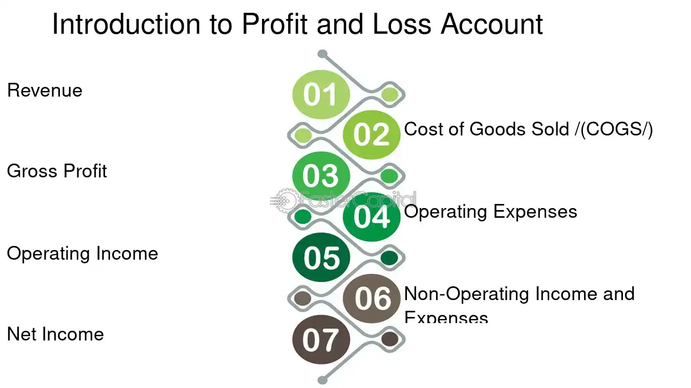

## Table of Contents

## What is paper profit?

Paper profit is the money you could make if you sold something right now, but you haven't actually sold it yet. For example, if you bought a stock for $10 and it's now worth $15, your paper profit is $5. This profit is called "paper" because it's not real until you sell the stock and get the money.

It's important to understand that paper profits can change. If the value of what you own goes down before you sell it, your paper profit can turn into a paper loss. This is why some people wait to sell until they are sure the value won't drop. But, if you never sell, you never turn that paper profit into real money.

## What is paper loss?

Paper loss is the money you would lose if you sold something right now, but you haven't sold it yet. For example, if you bought a stock for $10 and it's now worth $8, your paper loss is $2. This loss is called "paper" because it's not real until you actually sell the stock and lose the money.

Just like paper profits, paper losses can change. If the value of what you own goes up before you sell it, your paper loss can turn into a paper profit. Some people decide to sell when they see a paper loss to avoid losing more money. But, if you never sell, you might not turn that paper loss into a real loss, and the value could go back up.

## How do paper profits and losses differ from realized profits and losses?

Paper profits and losses are what you could gain or lose if you sold something right now, but you haven't sold it yet. For example, if you bought a stock for $10 and it's now worth $15, you have a paper profit of $5. But if it's now worth $8, you have a paper loss of $2. These are called "paper" because they aren't real until you actually sell and get the money or lose it.

Realized profits and losses are what happens when you actually sell something. If you sell that stock when it's worth $15, your realized profit is $5 because you get that money. If you sell it when it's worth $8, your realized loss is $2 because you lose that money. The big difference is that realized profits and losses are final - once you sell, you can't change it. But paper profits and losses can change until you sell.

## Can you provide an example of paper profit in stock trading?

Imagine you bought 100 shares of a company's stock for $10 each. That means you spent $1,000 in total. A few months later, the price of each share goes up to $15. If you were to sell all your shares at this new price, you would get $1,500. The difference between what you would get now ($1,500) and what you paid ($1,000) is your paper profit. In this case, your paper profit is $500.

This profit is called "paper" because you haven't actually sold the shares yet. If you decide to keep the shares and the price drops back to $10 or even lower, your paper profit could disappear or turn into a paper loss. But as long as the price stays at $15, you have a paper profit of $500. It's only when you sell the shares that this paper profit becomes a real, or realized, profit.

## What causes paper losses in investment portfolios?

Paper losses in investment portfolios happen when the value of the investments goes down. This can happen for many reasons. For example, if you own stocks, the price of those stocks might drop because the company is not doing well, or because something bad happens in the economy or the world. If you own bonds, their value might go down if interest rates go up. And if you have real estate, the value of your property might drop if the housing market gets worse.

These changes in value don't mean you've lost money for real yet. You only have a paper loss until you sell your investments. If you keep them and their value goes back up, your paper loss can turn into a paper profit again. But if you sell when the value is down, then your paper loss becomes a real loss. So, it's important to think carefully about when to sell, because selling at the wrong time can turn a paper loss into a real one.

## How can an investor track paper profits and losses?

An investor can track paper profits and losses by regularly checking the current value of their investments. This can be done using online brokerage accounts, financial apps, or investment tracking websites. These tools show how much the investments are worth right now compared to what the investor paid for them. If the current value is higher than the purchase price, the investor has a paper profit. If it's lower, they have a paper loss.

It's important for investors to keep an eye on these values because they can change every day. By watching the changes, investors can decide if they want to sell their investments to turn paper profits into real profits, or if they should wait and see if paper losses turn back into profits. Regular tracking helps investors make smart choices about when to buy or sell.

## What are the psychological impacts of paper profits and losses on investors?

Paper profits and losses can make investors feel a lot of different emotions. When they see their investments going up and they have paper profits, they might feel happy and excited. They might think about all the things they could do with that money if they sold their investments. But, they might also feel worried about selling too soon and missing out on even bigger profits if the value keeps going up.

On the other hand, when investors see their investments going down and they have paper losses, they can feel scared or stressed. They might worry about losing more money if the value keeps dropping. This can make them want to sell their investments quickly to stop the loss from getting worse. But, they might also feel hopeful that the value will go back up, so they wait and don't sell. These feelings can make it hard for investors to decide what to do with their investments.

## How do paper profits and losses affect tax implications?

Paper profits and losses don't affect your taxes right away. You only have to pay taxes or get tax benefits when you sell your investments and turn those paper profits or losses into real ones. If you sell something for more than you paid for it, you have a realized profit, and you might have to pay capital gains tax on that profit. If you sell something for less than you paid for it, you have a realized loss, and you might be able to use that loss to lower your taxes.

The difference between paper and realized profits and losses is important for taxes. If you just see your investments going up or down but don't sell them, you don't have to worry about taxes yet. But once you sell, you need to think about how much you made or lost and what that means for your taxes. Keeping track of when you buy and sell things can help you understand your tax situation better.

## What strategies can investors use to manage paper losses?

When investors see paper losses, they can use a few strategies to manage them. One way is to wait and see if the value of their investments goes back up. This can be a good choice if they believe the reasons for the drop in value are temporary. For example, if a company's stock goes down because of a short-term problem, waiting might let the stock recover and turn the paper loss into a paper profit again. But waiting can be risky because the value might keep going down.

Another strategy is to sell the investments that are losing value and use the money to buy other investments that might do better. This is called cutting losses. It can stop the paper loss from getting worse and give the investor a chance to make money with something else. But selling at a loss can be hard emotionally, and it's important to think carefully about whether the new investments will really do better.

A third way to manage paper losses is to use a strategy called tax-loss harvesting. This means selling investments that have gone down in value to realize the loss, and then using that loss to lower taxes on other gains or income. This can help investors save money on taxes, but it's important to follow the tax rules carefully and maybe talk to a tax advisor. Using these strategies can help investors handle paper losses and make better choices about their investments.

## How do paper profits and losses influence investment decision-making?

Paper profits and losses can really change how investors make choices about their money. When an investor sees their investments going up and they have paper profits, they might feel good and think about selling to get that money. But they might also worry about missing out on even more money if they wait and the value keeps going up. So, they have to decide if they want to take the money now or wait and hope for more. This can be a hard choice because no one knows for sure what will happen next.

On the other hand, when an investor sees their investments going down and they have paper losses, it can make them feel worried or scared. They might want to sell quickly to stop losing more money. But they might also hope that the value will go back up if they wait. This can make them think about whether they should sell now or wait and see what happens. These feelings can make it tough to decide what to do with their investments, and they have to think about what they believe will happen in the future.

## What role do paper profits and losses play in portfolio rebalancing?

When investors look at their investments, they might see some going up and some going down. These changes can make the balance of their portfolio different from what they want it to be. If some investments have gone up a lot and made paper profits, those investments might now be a bigger part of the portfolio than planned. To fix this, investors might sell some of those investments to take the paper profits and buy other things to get the balance back to what they want. This is called rebalancing.

On the other hand, if some investments have gone down and made paper losses, those investments might now be a smaller part of the portfolio. Investors might decide to sell those investments to stop the losses from getting worse, or they might buy more of them to get the balance back to what they want. Rebalancing helps investors keep their investments in line with their goals, even when the values of their investments change.

## How can advanced investors use paper profits and losses for risk management?

Advanced investors can use paper profits and losses to manage risk by keeping a close eye on how their investments are doing. If they see that some investments are making big paper profits, they might decide to sell some of those investments to take the profits and put the money into other investments that might be less risky. This can help them keep their money safe and not lose it all if the market goes down. By selling investments that have gone up a lot, they can also make sure their portfolio stays balanced and doesn't have too much money in one place.

On the other hand, if some investments are making paper losses, advanced investors might use a strategy called stop-loss orders. This means they set a price at which they will automatically sell an investment if it drops to that price. This can help stop the losses from getting worse. They might also decide to hold onto investments that are losing value if they believe the value will go back up. By carefully watching and managing their paper profits and losses, advanced investors can make smart choices to protect their money and keep their investments safe.

## What is the understanding of Paper Profit and Paper Loss?

Paper profit, often referred to as unrealized gains, is the apparent appreciation in the value of an investment that has not yet reached maturity through sale. This concept is critical in evaluating the performance of assets as it provides a view of how much profit an investment could potentially generate if sold at its current value. The calculation of paper profit is straightforward and can be expressed with the formula:

$$
\text{Paper Profit} = (\text{Current Market Price} - \text{Purchase Price}) \times \text{Number of Units}
$$

For example, in Python, this can be computed using:

```python
def calculate_paper_profit(current_price, purchase_price, units):
    return (current_price - purchase_price) * units

# Example usage:
current_price = 120
purchase_price = 100
units = 50
paper_profit = calculate_paper_profit(current_price, purchase_price, units)
print(f"The paper profit is: ${paper_profit}")
```

Similarly, paper loss refers to the diminishing value of an unsold investment, reflecting the potential losses that could be realized. The formula for calculating paper loss mirrors that of paper profit, merely reflecting a decrease in value:

$$
\text{Paper Loss} = (\text{Purchase Price} - \text{Current Market Price}) \times \text{Number of Units}
$$

Unrealized gains and losses are crucial metrics for both individual and institutional investors as they portray possible financial outcomes. They allow investors to strategically plan their trades and investment timelines, playing an essential role in risk management and opportunity evaluation. Assessing these figures enables investors to make well-founded decisions regarding whether to hold or liquidate assets based on market conditions and financial goals.

Strategically, understanding when to realize these gains or losses is key. Investors often use unrealized numbers to time the market, aiming to maximize profits while managing risks effectively. This involves a thorough analysis of market trends and behaviors, as well as personal investment strategies and objectives. By interpreting these potential outcomes, investors—whether individual or institutional—can enhance their decision-making process, balancing between holding an investment for future gains or realizing current paper profits or losses.

## What is the Role of Algo Trading in Managing Paper Profit and Paper Loss?

Algorithmic trading, commonly known as algo trading, employs sophisticated algorithms to process extensive market data and execute trades with the objective of optimizing profits and managing risks, specifically by leveraging paper profits and losses. These algorithms are designed to operate at speeds far beyond human capabilities, enabling rapid response to market fluctuations and efficient trade execution based on preset parameters. A primary aim of these systems is to maximize returns by converting paper profits into realized gains at optimal points.

One of the fundamental advantages of algo trading is its ability to utilize rigorous mathematical models and statistical analyses to make informed trading decisions. These algorithms can integrate various financial metrics, including unrealized gains and losses, allowing traders to assess potential risks and rewards continuously. For example, a [momentum](/wiki/momentum) trading strategy might exploit trends by buying assets with rising prices and selling those with declining values, often using paper profit as a benchmark for evaluating when to secure gains.

In addition to momentum strategies, statistical [arbitrage](/wiki/arbitrage) is another prevalent method within algo trading. This approach relies on sophisticated statistical models to identify price discrepancies between related financial instruments. By predicting and acting on these inefficiencies, traders can capture profits even when apparent price changes result in unrealized gains or losses. The formula for [statistical arbitrage](/wiki/statistical-arbitrage) often involves calculating the expected return within a given [volatility](/wiki/volatility-trading-strategies) framework:

$$
\text{Expected Return} = \mu + \frac{\theta}{\sigma} \cdot Z_t
$$

where $\mu$ is the average return, $\theta$ represents the mean-reverting level, $\sigma$ is the volatility, and $Z_t$ is the standardized price deviation.

The integration of paper profit and loss into [algorithmic trading](/wiki/algorithmic-trading) is not merely a matter of executing trades; it also involves sophisticated risk management tactics. Portfolio optimization often requires balancing potential returns with acceptable levels of risk. By continuously analyzing unrealized figures, algorithms can dynamically adjust asset allocations to maintain desired risk-return profiles. For instance, Python scripts can easily automate such evaluations and adjustments, allowing for real-time portfolio management:

```python
def optimize_portfolio(assets, paper_profits, losses, max_risk):
    for asset in assets:
        if paper_profits[asset] > losses[asset]:
            # Increase allocation in outperforming assets
            adjust_allocation(asset, increase=True)
        if calculate_portfolio_risk() > max_risk:
            rebalance_portfolio()

optimize_portfolio(assets_list, paper_profits_dict, losses_dict, 0.1)
```
This script logic demonstrates a simplified view of how algorithms might handle allocations based on ongoing paper profits and risk assessments.

Overall, algo trading transforms how traders engage with financial markets, providing an analytical and systematic approach to managing investments and optimizing portfolio performance by leveraging paper profits and losses.

## References & Further Reading

[1]: Bergstra, J., Bardenet, R., Bengio, Y., & Kégl, B. (2011). ["Algorithms for Hyper-Parameter Optimization."](https://dl.acm.org/doi/10.5555/2986459.2986743) Advances in Neural Information Processing Systems 24.

[2]: ["Advances in Financial Machine Learning"](https://www.amazon.com/Advances-Financial-Machine-Learning-Marcos/dp/1119482089) by Marcos Lopez de Prado

[3]: ["Evidence-Based Technical Analysis: Applying the Scientific Method and Statistical Inference to Trading Signals"](https://www.amazon.com/Evidence-Based-Technical-Analysis-Scientific-Statistical/dp/0470008741) by David Aronson

[4]: ["Machine Learning for Algorithmic Trading"](https://github.com/stefan-jansen/machine-learning-for-trading) by Stefan Jansen

[5]: ["Quantitative Trading: How to Build Your Own Algorithmic Trading Business"](https://www.amazon.com/Quantitative-Trading-Build-Algorithmic-Business/dp/1119800064) by Ernest P. Chan