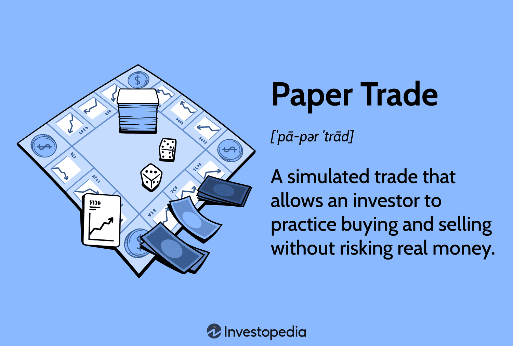

## Table of Contents

## What is paper trading and why is it important for beginners?

Paper trading is a way for people to practice buying and selling stocks without using real money. It's like playing a game where you can pretend to invest in the stock market and see how your choices would work out. You use fake money to make trades and track how your pretend investments would grow or shrink over time. This helps you learn how the stock market works without the risk of losing real money.

Paper trading is really important for beginners because it lets them try out different strategies and learn from their mistakes without any financial risk. When you're new to investing, it's easy to make mistakes that can cost you money. By using paper trading, you can see what works and what doesn't, and get a feel for how the market moves. This practice can build your confidence and help you make better decisions when you start using real money.

## How does paper trading differ from real trading?

Paper trading and real trading are similar because they both involve buying and selling stocks, but they are different in some important ways. In paper trading, you use fake money to make pretend trades. This means you can try out different strategies and see how they would work without losing any real money. In real trading, you use your own money to buy and sell stocks, so there's a real risk of losing money if your trades don't go well.

Another big difference is the emotional aspect. When you're paper trading, you don't feel the same stress and excitement that comes with using real money. In real trading, the fear of losing money can affect your decisions, and the thrill of making money can make you take bigger risks. Paper trading helps you learn the mechanics of trading without these emotions, but it can't fully prepare you for how you'll feel when real money is on the line.

Lastly, real trading involves actual market conditions and real-time data, while paper trading often uses delayed data or simulations. This means that the results you see in paper trading might not always match what happens in the real market. Real trading also comes with transaction costs, taxes, and other fees that you don't have to worry about in paper trading. These differences make it important to move from paper trading to real trading carefully, once you feel ready.

## What are the basic steps to start paper trading?

To start paper trading, first, you need to find a good platform or app that lets you do it. Many big stock trading apps and websites have a paper trading feature. You can search online for "paper trading" or "virtual trading" to find one that works for you. Once you choose a platform, you'll need to sign up and create an account. It's usually free and easy to do.

After you're signed up, you can start your paper trading journey. The platform will give you a pretend amount of money to start with, like $100,000. You can use this fake money to buy and sell stocks just like you would in real life. You'll pick the stocks you want, decide how many shares to buy, and watch how your pretend investments do over time. This is a great way to learn without any risk.

## What tools and platforms are available for paper trading?

There are many tools and platforms available for paper trading. Some popular ones include Thinkorswim by TD Ameritrade, which offers a very detailed and realistic paper trading experience. Another good choice is the paper trading feature on the E*TRADE platform, which is user-friendly and great for beginners. You can also use apps like Investopedia's Stock Simulator, which is free and easy to use on your phone or computer. These platforms let you practice trading with fake money, so you can learn without risking any real cash.

Other options include platforms like TradeStation, which has a powerful paper trading tool that's great for more advanced traders. For those who want to try out different markets, platforms like [Interactive Brokers](/wiki/interactive-brokers-api) offer paper trading for stocks, options, futures, and [forex](/wiki/forex-system). If you're looking for something simple and free, you might like the paper trading feature on the Robinhood app, which is easy to use and good for beginners. Each of these platforms has its own features and benefits, so you can pick the one that fits your needs best.

## How can one simulate market conditions effectively in paper trading?

To simulate market conditions effectively in paper trading, you need to use a platform that gives you real-time or near real-time data. This means the prices and market movements you see in your paper trading account should be as close as possible to what's happening in the real market. Some platforms, like Thinkorswim by TD Ameritrade, do a good job of this by updating prices quickly and showing you the same charts and indicators that real traders use. This helps you get a feel for how the market moves and how your trades might perform in real life.

Another way to make your paper trading more realistic is to include things like transaction costs and fees in your simulations. In real trading, you have to pay for each trade you make, and these costs can affect your profits. Some paper trading platforms let you set up these costs so you can see how they impact your trades. Also, try to trade during the same hours as the real market. This way, you'll experience the same ups and downs that real traders do, which can help you learn how to react to different market conditions.

## What common mistakes should be avoided during paper trading?

One common mistake people make during paper trading is not treating it seriously enough. Just because you're using fake money doesn't mean you should make trades without thinking. It's important to act like you're using real money, so you can learn good habits. If you're not careful, you might get used to making risky trades that you wouldn't do with real money, and that can be a problem when you start real trading.

Another mistake is not keeping track of your trades and results. It's easy to forget what you did and why, but writing down your trades and reviewing them can help you learn from your mistakes. Without this, you might keep making the same errors over and over. Also, some people get too confident after a few good trades in paper trading. Remember, it's not real money, so don't think you're a pro just because you did well in a simulation. Real trading can be very different, and it's important to stay humble and keep learning.

## How can paper trading help in developing a trading strategy?

Paper trading is a great way to develop a trading strategy because it lets you try out different ideas without risking real money. You can experiment with buying and selling at different times, using different amounts of money, and [picking](/wiki/asset-class-picking) different stocks. This helps you see what works and what doesn't. For example, you might find that a certain type of stock does better in the morning, or that you make more money when you hold onto your investments for a longer time. By trying out these strategies in a safe environment, you can figure out what fits your style and goals.

Once you have some ideas from paper trading, you can start to build a more solid strategy. You can keep track of your trades and see which ones made money and which ones didn't. This helps you learn from your mistakes and improve your approach. Over time, you can refine your strategy to make it more successful. Paper trading also lets you practice sticking to your plan, which is important because it can be hard to follow a strategy when real money is on the line. By getting used to your strategy in paper trading, you'll be more prepared and confident when you start real trading.

## What metrics should be tracked during paper trading to assess performance?

When you're paper trading, it's important to keep an eye on a few key numbers to see how well you're doing. One of the main things to track is your total return, which shows how much your fake money has grown or shrunk over time. You should also look at your win rate, which is the percentage of your trades that make money. Another useful number is your average profit per trade, which tells you how much you're making on the trades that work out. Don't forget to track your average loss per trade too, because this shows how much you're losing on the trades that don't go your way.

It's also a good idea to keep track of how long you hold onto your investments, which is called your holding period. This can help you see if you do better with short-term or long-term trades. You should also pay attention to your risk-reward ratio, which compares how much you could lose to how much you could gain on each trade. By watching these numbers, you can get a better idea of what's working and what's not, and you can make changes to your strategy to do better in the future.

## How can one transition from paper trading to live trading?

Moving from paper trading to live trading is a big step, but it can be done smoothly if you take your time and plan well. Start by reviewing all the trades you made during paper trading. Look at what worked and what didn't, and think about why. This will help you understand your strengths and weaknesses. Next, set a small amount of real money aside for trading, something you can afford to lose. This way, you won't be too worried about losing it all, and you can learn without too much stress. Begin with small trades to get used to the feeling of using real money, and stick to the strategies that worked well in your paper trading.

As you start live trading, keep tracking your performance just like you did in paper trading. Pay attention to the same metrics, like your total return, win rate, and risk-reward ratio. This will help you see if your strategy is still working in the real market. It's also important to stay calm and not let emotions take over. Real trading can be more stressful because you're using real money, so take breaks if you need to and don't make quick decisions based on fear or excitement. Over time, as you get more comfortable and confident, you can slowly increase the amount of money you trade with and try out new strategies.

## What advanced techniques can be practiced in paper trading to enhance skills?

One advanced technique you can practice in paper trading is using technical analysis. This means looking at charts and using tools like moving averages, RSI (Relative Strength Index), and MACD (Moving Average Convergence Divergence) to make your trading decisions. By practicing with these tools in paper trading, you can learn how they work and see how they can help you predict where stock prices might go next. This can make you a better trader because you'll be able to spot trends and make smarter choices about when to buy and sell.

Another technique is to try out different trading styles, like [day trading](/wiki/day-trading-spy) or swing trading. Day trading means buying and selling stocks within the same day, while swing trading means holding onto stocks for a few days or weeks. Paper trading lets you try these styles without risking real money, so you can see which one you're good at and which one fits your schedule and goals. You can also practice using options and futures, which are more complex trading tools. By getting comfortable with these in a safe environment, you'll be better prepared to use them when you start trading with real money.

## How does paper trading assist in understanding market psychology and emotional control?

Paper trading helps you understand market psychology by letting you see how different news and events can affect stock prices. You can watch how the market reacts to things like company earnings reports, economic news, or world events. This helps you learn what makes stock prices go up or down and how other traders might be feeling. By practicing in a safe environment, you can start to predict how the market might move based on these emotions, which is a big part of market psychology.

It also helps with emotional control because it lets you practice trading without the stress of losing real money. When you're paper trading, you can make mistakes and learn from them without getting too upset. This is important because real trading can be very emotional, with feelings like fear and excitement affecting your decisions. By getting used to these feelings in paper trading, you can learn to stay calm and make better choices when you start using real money.

## What are the limitations of paper trading and how can they be mitigated?

Paper trading has some limitations that you should know about. One big one is that it doesn't feel the same as real trading because you're not using real money. This means you might not feel the same stress and excitement, which can change how you make decisions. Also, paper trading often uses fake or delayed data, so it might not show you exactly what's happening in the real market. Another problem is that you don't have to pay for trades in paper trading, but in real trading, these costs can affect how much money you make or lose.

To make up for these limitations, you can do a few things. First, try to treat your paper trading as seriously as you would real trading. Pretend that the fake money is real, and think carefully about each trade. This can help you get used to the emotions of trading without the risk. Second, if you can, use a platform that gives you real-time data, so you can see what's happening in the market as it happens. Lastly, when you move to real trading, start with small amounts of money and keep track of your trades and costs. This way, you can slowly get used to the real market and learn how to handle the costs and emotions that come with it.

## References & Further Reading

[1]: Bergstra, J., Bardenet, R., Bengio, Y., & Kégl, B. (2011). ["Algorithms for Hyper-Parameter Optimization."](https://papers.nips.cc/paper/4443-algorithms-for-hyper-parameter-optimization) Advances in Neural Information Processing Systems 24.

[2]: ["Advances in Financial Machine Learning"](https://www.amazon.com/Advances-Financial-Machine-Learning-Marcos/dp/1119482089) by Marcos Lopez de Prado

[3]: ["Evidence-Based Technical Analysis: Applying the Scientific Method and Statistical Inference to Trading Signals"](https://www.amazon.com/Evidence-Based-Technical-Analysis-Scientific-Statistical/dp/0470008741) by David Aronson

[4]: ["Machine Learning for Algorithmic Trading"](https://github.com/stefan-jansen/machine-learning-for-trading) by Stefan Jansen

[5]: ["Quantitative Trading: How to Build Your Own Algorithmic Trading Business"](https://www.amazon.com/Quantitative-Trading-Build-Algorithmic-Business/dp/1119800064) by Ernest P. Chan