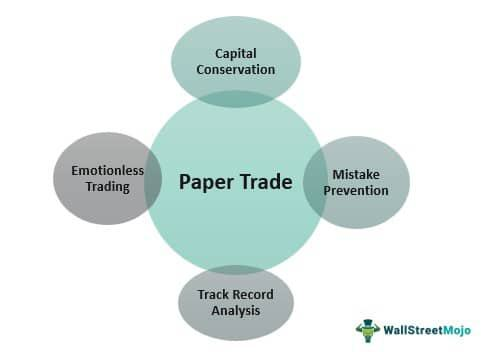

In stock trading, practice is essential before venturing into live trading. Stock trading is inherently risky, and the potential for financial loss is significant, especially for beginners. To mitigate these risks, paper trading and trading simulations provide a safe and invaluable platform for individuals to familiarize themselves with the stock market's intricacies without jeopardizing real capital.

Paper trading is a method where traders simulate buying and selling stocks using virtual money, allowing them to test their strategies and understand market operations without financial exposure. This approach helps traders comprehend market mechanisms, such as order types, market trends, and price movements, in real-time environments. Many brokerage platforms offer paper trading with real-time market data, creating an immersive experience akin to live trading.



Additionally, understanding algorithmic trading is crucial in modern stock markets. Algorithmic trading, or algo trading, uses computer programs to execute trades at speeds and volumes beyond human capability, often based on predetermined criteria. When integrated with trading simulations, algorithmic trading enables traders to refine their strategies, assess their effectiveness, and adjust them accordingly before deploying them in live markets.

By mastering the fundamentals of paper trading and leveraging the capabilities of algorithmic trading, traders can refine their skills, develop confidence, and enhance their prospects of success in live trading environments. This article aims to explore these concepts, providing insights that could empower both beginners and seasoned traders in their ongoing journey towards marketplace proficiency.

## Table of Contents

## What is Paper Trading?

Paper trading refers to the practice of simulating trading activities using virtual currency to buy and sell stocks, providing a risk-free environment for traders to hone their skills. This method allows both novice and experienced traders to evaluate their strategies, understand market patterns, and gain confidence without the pressure of financial loss. By simulating stock market transactions, traders can analyze their decision-making processes and adjust tactics accordingly.

Brokerage platforms frequently incorporate paper trading features into their offerings, providing users with access to real-time data. This data allows for a more authentic trading experience, enabling traders to practice in conditions that closely mimic the live market. The platforms utilize comprehensive tools to emulate order execution, track portfolio performance, and conduct risk analysis, effectively bridging the gap between simulation and reality.

The primary benefit of paper trading is its educational value. Beginners can familiarize themselves with trading platforms, learning how to navigate and use various tools without fear of making costly errors. It serves as a sandbox environment where traders can experiment with different strategies, such as [day trading](/wiki/day-trading-spy) or swing trading, to determine their viability. Experienced traders can also benefit by testing new approaches or refining existing strategies to improve results, all while observing market dynamics and trends in real time.

Despite its advantages, paper trading does have limitations. Most notably, the psychological factors intrinsic to live trading, such as the stress of financial risk and the impulsiveness it can trigger, are absent. As a result, traders may find that their performance in a paper trading environment does not always translate directly to live trading situations. Additionally, in paper trading, market impacts such as slippage or [liquidity](/wiki/liquidity-risk-premium) constraints might not be accurately represented, potentially leading to idealized outcomes.

In conclusion, while paper trading serves as an invaluable tool for skill development and strategy edification, traders should be mindful of its limitations and continue to seek experience in live trading environments to develop a comprehensive understanding of the stock market.

## Trading Simulation Tools

Trading simulation tools are sophisticated software platforms that emulate the stock market's environment, providing aspiring and experienced traders with virtual spaces to practice and refine their trading strategies. These tools represent an invaluable resource for those looking to gain practical experience without the financial risks associated with real trading.

One of the primary features of trading simulation tools is simulated order execution. This functionality allows users to simulate the placement of buy and sell orders, mirroring the processes involved in actual stock market trades. By imitating real-world trading scenarios, these tools enable users to understand the nuances of order types, such as market orders, limit orders, and stop-loss orders, and the impact of these choices on trading outcomes.

Another essential aspect of trading simulation tools is portfolio management. This feature helps users create and manage a diversified portfolio with virtual stocks, providing insights into asset allocation strategies and the importance of balancing risk and return. Portfolio management tools in simulations may also offer analytics for tracking performance over time, monitoring [volatility](/wiki/volatility-trading-strategies), and evaluating the effects of different trading decisions.

Risk analysis is a crucial component of any successful trading strategy, and many trading simulator tools incorporate risk assessment features. These features might include simulations of market downturns, volatility spikes, and other scenarios that could affect investment performance. By enabling traders to analyze potential risks, these tools help them develop strategies to mitigate losses and make informed decisions under various market conditions.

When selecting a trading simulation tool, several factors should be considered to maximize the learning experience. The realism of the simulation, the range of available features, user interface intuitiveness, and the ability to access real-time or historical market data are all important considerations. Integration with real market data provides users with a more authentic experience, allowing them to practice under conditions that closely mimic those of live trading. This integration often involves delayed data feeds or end-of-day pricing, ensuring that users can learn from current market trends and price movements.

Several popular trading simulation tools stand out in terms of functionality and educational value. For example, platforms like Thinkorswim by TD Ameritrade, TradeStation, and [Interactive Brokers](/wiki/interactive-brokers-api)' Trader Workstation offer comprehensive simulation capabilities, including robust charting tools, [backtesting](/wiki/backtesting) features, and support for complex trading strategies. These platforms also typically offer user-friendly interfaces and extensive educational resources to support learning.

Ultimately, trading simulation tools are vital for cultivating a disciplined trading approach and building confidence. By allowing traders to experiment and learn in a pressure-free environment, these tools contribute significantly to the development of effective trading strategies that can be carried into the live market.

## The Benefits of Stock Market Practice

Practicing stock market strategies through simulations is a crucial step for traders aiming to enhance their skills and performance. By engaging in simulated trading, individuals gain the necessary confidence and discipline required for successful real-world trading. The core advantage of stock market practice is the ability to test and refine various strategies without the financial peril associated with live trading. 

Simulations provide an environment where traders can evaluate their strategies by using historical and real-time data, thereby gaining insights into the effectiveness of their approaches. This analytical process allows traders to identify strengths and weaknesses in their strategies and make adjustments as needed. For instance, through paper trading, a trader can implement a moving average crossover strategy to assess its performance under different market conditions.

The psychological benefits of practice cannot be understated. Trading in a simulated environment helps traders cultivate a disciplined approach to decision-making. By learning to manage emotions such as fear and greed through repeated practice, traders can approach live trading situations with a more composed mindset. This discipline is foundational to executing trades based on strategy rather than emotion, a critical component in safeguarding capital during market fluctuations.

Furthermore, simulations enable traders to gain a comprehensive understanding of market dynamics. By observing patterns and trends through repeated practice, traders can anticipate market movements more accurately. This is crucial for developing a trader's intuition, enabling them to transition smoothly to live trading with a deeper appreciation for the complexities of the stock market.

In summary, the benefits of stock market practice through simulations extend beyond technical analysis, encompassing psychological and strategic development. Through consistent practice, traders can enhance their confidence and discipline, paving the way for a more informed and strategic approach to live trading.

 to Algorithmic Trading

Algorithmic trading, often referred to as algo trading, involves using computer programs to execute trades based on pre-defined criteria and strategies. These programs are designed to process large volumes of market data, identify trading opportunities, and execute trades at speeds far beyond human capability. The primary advantage of [algorithmic trading](/wiki/algorithmic-trading) is its ability to transact at high speeds, which is crucial in markets where prices can change in milliseconds.

In recent years, algorithmic trading has gained prominence in the stock market, accounting for a significant portion of trading [volume](/wiki/volume-trading-strategy). This growth can be attributed to advances in technology, increased market accessibility, and the desire for efficiency and precision in trade execution. Algo trading helps reduce human error, minimizes reaction times, and ensures consistent trade execution, often leading to better pricing and improved trading outcomes.

Integrating algorithmic trading into trading simulations offers a practical approach to testing strategies in a risk-free environment. Traders can evaluate the effectiveness of their algorithms without the immediate financial risks associated with live markets. Simulated environments replicate real market conditions, thereby providing valuable insights into how algorithms might perform in the actual trading world. This approach also allows for refining and optimizing strategies before they are deployed in real trading scenarios.

Aspiring algo traders should possess basic programming skills, as coding is central to developing trading algorithms. Python is a popular language in this context due to its extensive libraries and ease of use. A simple example of a trading algorithm in Python might look like the following:

```python
import pandas as pd
import numpy as np

# Example: Simple Moving Average Crossover Strategy
def moving_average_crossover_strategy(data, short_window, long_window):
    signals = pd.DataFrame(index=data.index)
    signals['signal'] = 0.0

    # Compute short and long moving averages
    signals['short_mavg'] = data['price'].rolling(window=short_window, min_periods=1).mean()
    signals['long_mavg'] = data['price'].rolling(window=long_window, min_periods=1).mean()

    # Create signals when short moving average crosses long moving average
    signals['signal'][short_window:] = np.where(
        signals['short_mavg'][short_window:] > signals['long_mavg'][short_window:], 1.0, 0.0
    )

    # Generate trading orders
    signals['positions'] = signals['signal'].diff()

    return signals
```

In this example, a basic moving average crossover strategy is implemented, where buy signals are generated when a short-term moving average crosses above a long-term moving average, and sell signals are generated for crosses in the opposite direction.

Platforms such as QuantConnect, Alpaca, and TradingView offer resources and environments conducive to beginner algo traders, supporting the development and backtesting of trading algorithms. These platforms provide access to historical data, strategy modeling, and paper trading, allowing users to refine their skills and gain confidence in algorithmic trading before risking real capital. As the trading landscape becomes increasingly digital, the demand for algorithmic traders with robust programming and analytical skills continues to grow, making it an essential area for traders to explore.

## Integrating Algo Trading with Simulations

Combining paper trading with algorithmic strategies creates a robust environment for testing and refining trading methods without financial risk. Algorithmic trading allows traders to use pre-defined rules and automated procedures for executing trades, thereby enhancing the speed and precision of trading simulations. This integration provides a dynamic practice ground where traders can evaluate strategies' effectiveness and optimize their algorithms.

Designing algorithmic trading strategies within simulations involves defining the rules and logic that govern the trading decisions. This often includes setting parameters like entry and [exit](/wiki/exit-strategy) points, risk management rules, and conditions for trade execution based on technical indicators or market conditions. Common algorithmic strategies include mean reversion and [momentum](/wiki/momentum) trading.

**Mean Reversion Strategy**: This strategy is based on the assumption that the price of a stock will revert to its mean or average over time. Traders using this strategy might calculate the moving average and execute trades when prices deviate significantly from this average. For instance, if the stock price falls below its moving average by a certain percentage, the algorithm might initiate a buy order, anticipating a return to the average price.

**Momentum Trading Strategy**: Unlike mean reversion, momentum trading capitalizes on the continuation of existing trends. Algorithms look for strong price trends and generate buy signals in the direction of these trends, only exiting positions when the momentum slows or reverses.

Here is an example of a Python code snippet using the popular library `pandas` and `numpy` to calculate a simple moving average (SMA) for a mean reversion strategy:

```python
import pandas as pd
import numpy as np

# Assume `data` is a DataFrame with historical stock prices
data['SMA'] = data['Close'].rolling(window=20).mean()
data['signal'] = 0   # Default signals
data.loc[data['Close'] < data['SMA'], 'signal'] = 1   # Buy signal
data.loc[data['Close'] > data['SMA'], 'signal'] = -1  # Sell signal
```

Evaluating performance metrics in algorithmic simulations is crucial. Key metrics include the Sharpe ratio, which measures risk-adjusted return, and the maximum drawdown, which quantifies the potential loss from peak to trough. Monitoring these metrics helps traders gauge the strategy's effectiveness and identify areas for improvement.

Optimizing algorithms entails adjusting parameters to improve performance. This could involve backtesting the strategy over historical data to pinpoint the best parameters and scenarios. For instance, in a momentum strategy, one might tweak the time duration over which momentum is calculated or adjust stop-loss limits to mitigate risks.

Incorporating algorithmic trading into simulations provides a structured and disciplined approach to trading practice, reducing emotional biases and allowing for comprehensive strategy testing. Such integration not only enhances a trader’s skill set but also prepares them for more effective decision-making in live trading environments.

## Conclusion

Paper trading and simulations are indispensable tools for both novice and seasoned traders. These platforms offer the opportunity to practice trading strategies without the financial risk of live markets. By using virtual money, traders can learn market mechanics, understand the impact of decisions on portfolio performance, and refine their approach to speculative trading.

Incorporating algorithmic trading into practice sessions enhances the potential benefits of these simulations. Algorithmic trading, characterized by the use of automated strategies for trade execution, allows traders to backtest strategies effectively and understand their viability under diverse market conditions. Practicing with these algorithms in a simulated environment ensures traders can fine-tune their strategies, optimize performance, and reduce the likelihood of costly errors when transitioning to real markets.

Effective use of paper trading and algorithmic simulations can lead to a more successful and confident trading journey. The practiced ability to analyze risk, execute trades with precision, and remain disciplined in strategy implementation is essential for any successful trader. Moreover, the iterative process of testing and refining trading algorithms allows traders to identify areas for improvement and develop strategies robust enough to withstand market volatility.

As the trading landscape continues to evolve, driven by advancements in technology and changes in market dynamics, continuous learning and adaptation will remain essential for trading success. This includes staying updated with new simulation tools, understanding how market regulations may affect trading strategies, and seeking further education to adjust to innovations in trading methodologies. Traders who embrace these evolving tools and strategies are better positioned to achieve long-term success in the dynamic financial markets.

## References & Further Reading

[1]: Bergstra, J., Bardenet, R., Bengio, Y., & Kégl, B. (2011). ["Algorithms for Hyper-Parameter Optimization."](https://papers.nips.cc/paper/4443-algorithms-for-hyper-parameter-optimization) Advances in Neural Information Processing Systems 24.

[2]: ["Advances in Financial Machine Learning"](https://www.amazon.com/Advances-Financial-Machine-Learning-Marcos/dp/1119482089) by Marcos Lopez de Prado

[3]: ["Evidence-Based Technical Analysis: Applying the Scientific Method and Statistical Inference to Trading Signals"](https://www.amazon.com/Evidence-Based-Technical-Analysis-Scientific-Statistical/dp/0470008741) by David Aronson

[4]: ["Machine Learning for Algorithmic Trading"](https://github.com/stefan-jansen/machine-learning-for-trading) by Stefan Jansen

[5]: ["Quantitative Trading: How to Build Your Own Algorithmic Trading Business"](https://www.amazon.com/Quantitative-Trading-Build-Algorithmic-Business/dp/1119800064) by Ernest P. Chan