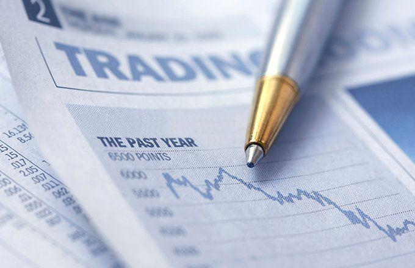

The world of trading is vast and dynamic, offering numerous opportunities for financial growth and learning. At the heart of this complex ecosystem lies paper trading, a crucial practice for both novice and experienced traders looking to test strategies without incurring financial risks. By simulating real-market conditions, paper trading allows individuals to engage in buying and selling securities in a risk-free environment, making it an indispensable tool in the trader's toolkit.

In the contexts of day trading and algorithmic trading, paper trading offers a risk-free arena for strategy refinement and skill development. Day traders, who typically engage in buying and selling financial instruments within the same day, can significantly benefit from this simulated trading by testing their strategies under various market scenarios. Similarly, algorithmic traders use paper trading to hone algorithms and evaluate their performance against historical and real-time data.



Understanding the benefits and limitations of paper trading is essential for traders to make informed decisions as they step into the live trading arena. While paper trading provides a safe environment to learn and experiment, recognizing its constraints ensures traders remain grounded when transitioning to real markets. 

Today’s fast-paced financial markets demand a comprehensive understanding of trading dynamics, and simulated trading serves as an invaluable stepping stone towards achieving long-term success. As traders navigate this ever-changing landscape, harnessing the power of paper trading can be the key to unlocking valuable insights and building a solid foundation for their trading journey.

## Table of Contents

## What is Paper Trading?

Paper trading simulates real-time trading scenarios without the use of actual money, offering a risk-free environment for traders to develop and test their strategies. This practice enables both novice and experienced traders to engage in buying and selling securities without the financial risk, making it an essential step before committing real capital. Papers trading serves as a sandbox for testing strategies across various asset classes, including stocks, exchange-traded funds (ETFs), and derivatives, using specialized paper trading platforms.

The practice of paper trading provides valuable insights into market movements and the mechanics of trading without the emotional stress associated with financial losses. This simulated approach is crucial for honing skills and building confidence in executing trades effectively. By observing the behavior of different asset classes in a real-time simulation, traders can refine their strategies and gain an understanding of market dynamics.

Furthermore, paper trading allows for experimentation and learning from trial and error in a controlled environment. It involves replicating the conditions of live trading as closely as possible while eliminating financial risk. Traders can adjust their approaches based on the performance of their strategies in varied market conditions, all while using virtual capital.

While paper trading does not introduce real-world psychological pressures, it is an invaluable tool for strategy testing and skill development. This form of trading is integral to transitioning seamlessly into live trading by building a robust foundation of knowledge and experience in understanding how different trading strategies might perform in the actual markets.

## Setting Up a Day Trading Account

Day traders are individuals who engage in buying and selling financial instruments within the same trading day, aiming to profit from short-term price fluctuations. Setting up a [day trading](/wiki/day-trading-spy) account with a paper trading option allows traders to simulate these activities without financial risk. It is beneficial to choose a paper trading account provided by the same brokerage that will be used for live trading. This ensures familiarity with the trading platform and minimizes surprises when transitioning from simulated to actual trading.

When selecting a brokerage for paper trading, it is essential to choose platforms that offer live market feeds and a comprehensive suite of trading tools. Live market feeds provide real-time data, enabling traders to make timely and informed decisions. Trading tools can include charting software, technical indicators, and algorithm [backtesting](/wiki/backtesting) capabilities, all of which are crucial for evaluating strategies under current market conditions.

Brokers like [Interactive Brokers](/wiki/interactive-brokers-api) and TradeStation are known for their robust simulation features, which are crucial for an authentic day trading experience. These platforms typically offer paper trading accounts that closely mimic real trading environments, with minimal latency in data and execution. This allows traders to practice and refine their skills in a realistic setting.

Understanding the technical variations between simulated and real trading is crucial for avoiding potential pitfalls. While paper trading provides an excellent approximation of live trading, certain disparities exist. Factors such as slippage, where actual transaction prices differ from expected prices due to market [volatility](/wiki/volatility-trading-strategies), and the impact of trading fees, are typically not fully reflected in simulations. Being aware of these differences ensures that traders remain cautious and do not overestimate the effectiveness of their strategies when transitioning to real market conditions.

## Paper Trading Tips

To optimize the experience of paper trading, one must focus on maintaining a detailed trading journal. This practice involves recording each trade's parameters, such as entry and [exit](/wiki/exit-strategy) points, asset type, and market conditions. By systematically logging this data, traders can identify patterns and improve their strategies. A comprehensive record facilitates review and reflection, allowing traders to discern the strengths and weaknesses of their strategies.

Backtesting strategies across diverse market conditions is another vital aspect of effective paper trading. This involves running your trading algorithms or strategies through historical data to observe their performance. By exposing strategies to various market scenarios, traders can assess their robustness and adaptability. This step is crucial in ensuring that a strategy remains effective over time, even as market conditions change.

Regular practice in paper trading should not cease once a trader transitions into live trading. It is beneficial to continue testing new strategies in a risk-free environment. This ongoing practice allows traders to refine their approaches continuously and adapt to evolving market landscapes without incurring financial risk.

Engaging with realistic trading scenarios is important to understand the emotional and psychological challenges involved in trading decisions. Simulating different market situations, including volatile or unexpected market shifts, helps traders prepare for the emotional pressures of real trading. It is essential to evaluate how emotions such as fear and greed can impact decision-making processes, ensuring that one’s strategies are not solely reliant on ideal conditions.

In conclusion, consistency in paper trading is key to achieving better performance in live trading environments. By rigorously applying these practices, traders can develop a disciplined approach that lays the groundwork for successful trading careers.

## Pros of Paper Trading

Paper trading presents several advantages for traders, particularly those new to the market or experimenting with new strategies. Primarily, it involves no financial risk, which allows individuals to explore and learn without the fear of monetary loss. This risk-free environment is ideal for refining trading strategies and gaining practical experience before risking actual capital. 

By using paper trading, traders can build confidence and competence with various trading tools and platforms. Familiarizing oneself with the nuances of a trading platform is crucial, and paper trading offers a safe space to do so. It provides an opportunity to understand the technical aspects of financial instruments, such as execution, order types, and the mechanics of market movements.

Moreover, paper trading enables traders to learn risk management techniques and test different trading styles, from conservative strategies to more aggressive approaches. This flexibility allows traders to assess the effectiveness of different methodologies and adapt them according to their objectives and risk tolerance.

A significant advantage of paper trading is the elimination of emotional stress associated with financial loss. Trading often involves navigating complex psychological factors that can influence decision-making. In a simulated environment, traders can focus on developing disciplined strategies without the added pressure of real financial stakes. This helps in forming rational decision-making processes that can later be applied in live trading scenarios.

In summary, paper trading is an effective method to learn, experiment, and enhance trading skills without any financial repercussions. It serves as a foundational step in preparing for the transition to live trading, supporting the development of a solid trading strategy and mindset.

## Cons of Paper Trading

Paper trading offers an invaluable opportunity to hone trading skills without the financial risk, but this absence of real financial stakes can inadvertently lead traders to overestimate their trading prowess. In a simulated environment, the repercussions of bad decisions don't manifest in financial losses, making it easy to overlook the gravity of certain mistakes or forget the pressure faced when real money is on the line. This detachment from reality may foster an inflated sense of confidence, potentially leading traders to take undue risks when transitioning to live trading.

Moreover, paper trading often fails to account for market psychology and the emotional stress that accompanies actual financial losses. The emotional detachment in a simulated setting does not prepare traders for the psychological toll that sudden market downturns or unexpected losses can take. Emotional resilience is a crucial component of successful trading, and failure to cultivate this through practical experience may result in poor decision-making when engaging in real-world trading.

Another limitation of paper trading is its tendency to misrepresent certain market dynamics, such as fees, slippage, and commissions, which can significantly impact strategy effectiveness. In live trading, transaction costs from fees and slippage—where the execution price differs from the expected price—can erode profits. These elements are often not simulated with high accuracy in paper trading platforms, leading to potentially misleading conclusions about the viability of a strategy. For instance, if your backtested strategy has a small edge that can be nullified by high slippage or transaction fees, you might overestimate its potential based on paper trading results.

The security and predictability of paper trading may also instill a false sense of safety that does not translate into the volatile nature of live markets. In real trading environments, market conditions can change rapidly and unpredictably, whereas paper trading tends to be more controlled and devoid of the chaotic conditions that traders must navigate in real markets.

Finally, traders may develop complacency due to the controlled environment paper trading inherently presents. Simulations can never fully replicate the complexities and uncertainties of financial markets. This disconnection can lead to oversimplified risk management practices or unrealistic expectations about market behaviors and outcomes. This complacency could be detrimental when facing the unpredictable and often unforgiving conditions present in live trading scenarios.

## Practicing Algo Trading with Paper Trading

Algorithmic trading leverages computer programs to automatically [carry](/wiki/carry-trading) out trades according to predefined conditions. This approach has gained prominence due to its ability to execute trades with speed and precision, which can be advantageous in capturing even slight market inefficiencies. Paper trading serves as an ideal platform for testing these algorithmic strategies without risking actual financial capital.

One significant advantage of paper trading algorithms is the ability to analyze their performance across both historical and real-time data. By backtesting an algorithm, traders can examine how it would have performed under various market conditions. For example, using historical data from previous years, a trader can simulate their algorithm's actions and evaluate its profitability or and potential drawdowns. This can be achieved using a variety of tools and platforms, which often provide integrated historical data feeds and programming interfaces.

For instance, consider the following simple [momentum](/wiki/momentum)-based trading algorithm in Python, using a backtesting framework such as Backtrader:

```python
import backtrader as bt

class MomentumStrategy(bt.Strategy):
    def __init__(self):
        self.sma = bt.indicators.SimpleMovingAverage(self.data.close, period=20)

    def next(self):
        if self.sma > self.data.close:
            self.buy()
        elif self.sma < self.data.close:
            self.sell()

cerebro = bt.Cerebro()
cerebro.addstrategy(MomentumStrategy)
data = bt.feeds.YahooFinanceData(dataname='AAPL', fromdate=datetime(2020, 1, 1), todate=datetime(2021, 1, 1))
cerebro.adddata(data)
cerebro.run()
```

This code defines a simple strategy that buys when the price is above a 20-day simple moving average and sells when it is below. Such algorithms can be tested on paper trading platforms to measure their performance without financial risk.

Continual refinement is essential in [algorithmic trading](/wiki/algorithmic-trading). Once a strategy has been initially tested through paper trading, modifications and improvements may be necessary to adapt to current market conditions or to optimize performance metrics such as return and risk. As traders build experience, they may want to start with simpler models and gradually incorporate more complexity, such as [machine learning](/wiki/machine-learning) techniques or multi-[factor](/wiki/factor-investing) models. This incremental approach allows traders to develop a deeper understanding of their algorithms, improving their capability to handle more advanced strategies.

Finally, monitoring the algorithm's performance in a paper trading environment helps identify potential flaws or instabilities that might not manifest immediately. This ongoing validation process ensures the algorithm remains robust in the face of market dynamics and unexpected events.

## The Bottom Line

Paper trading is an invaluable tool for traders at all stages, particularly for those new to the landscape of financial markets. By providing a risk-free environment, paper trading enables traders to grasp the intricacies of market dynamics and refine their strategies without the fear of financial loss. This simulated trading experience allows for the analysis and adjustment of trading methodologies, fostering a deeper understanding of market behavior and technical indicators.

As traders become comfortable with paper trading, a gradual transition to live trading is recommended. This phased approach helps mitigate the psychological impact of real financial risk and allows traders to adapt their strategies to real market conditions. Continuous practice in simulations ensures that traders remain adept at handling market fluctuations and can confidently execute trades once real money is involved.

Harnessing the benefits of paper trading could be crucial for achieving long-term success in trading. It serves not only as a practice ground but also as a platform to experiment with diverse trading styles and risk management techniques. For example, utilizing Python scripts to backtest strategies can further enhance a trader's confidence in their approach.

Despite its advantages, it is essential to recognize that paper trading alone is insufficient. To ensure a seamless transition to live trading, real-world factors such as market psychology, slippage, and transaction costs must be incorporated into strategy development. This holistic approach will prepare traders for the multifaceted challenges of the financial markets, making paper trading a foundational step towards becoming a proficient trader.

## References & Further Reading

[1]: Bergstra, J., Bardenet, R., Bengio, Y., & Kégl, B. (2011). ["Algorithms for Hyper-Parameter Optimization."](https://papers.nips.cc/paper/4443-algorithms-for-hyper-parameter-optimization) Advances in Neural Information Processing Systems 24.

[2]: ["Advances in Financial Machine Learning"](https://www.amazon.com/Advances-Financial-Machine-Learning-Marcos/dp/1119482089) by Marcos Lopez de Prado

[3]: ["Evidence-Based Technical Analysis: Applying the Scientific Method and Statistical Inference to Trading Signals"](https://www.amazon.com/Evidence-Based-Technical-Analysis-Scientific-Statistical/dp/0470008741) by David Aronson

[4]: ["Machine Learning for Algorithmic Trading"](https://github.com/stefan-jansen/machine-learning-for-trading) by Stefan Jansen

[5]: ["Quantitative Trading: How to Build Your Own Algorithmic Trading Business"](https://www.amazon.com/Quantitative-Trading-Build-Algorithmic-Business/dp/1119800064) by Ernest P. Chan