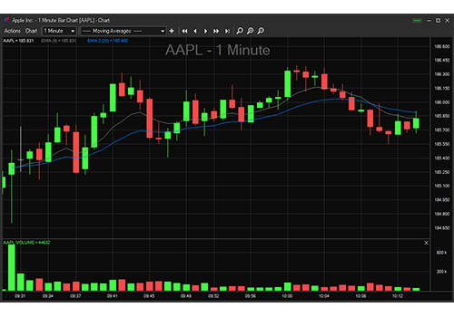

## Table of Contents

## What is paper trading and why is it important for beginners?

Paper trading is a way for people to practice buying and selling stocks without using real money. It's like playing a game where you can pretend to invest in the stock market and see how your choices would work out. You can use special apps or websites that let you do this, and they keep track of how your pretend investments are doing.

It's really important for beginners because it helps them learn how the stock market works without risking any money. They can try out different strategies and see what happens, which helps them understand the market better. It's a safe way to make mistakes and learn from them, so when they start using real money, they'll be more prepared and confident.

## How does paper trading simulate real market conditions?

Paper trading simulates real market conditions by using the same stock prices and market data that you would see if you were trading with real money. When you make a pretend trade, the app or website uses the current stock price to show you how much you would have spent or earned. This means you get to see how your choices would work out in the real world, without actually spending any money.

It also lets you practice dealing with things like market ups and downs, which can be scary for beginners. You can see how your pretend investments go up or down with the market, and you can try different ways to handle these changes. This helps you get used to the idea that the stock market can be unpredictable, and it gives you a chance to figure out how you might react in real situations.

## What are the key differences between paper trading and live trading?

Paper trading and live trading are different because paper trading uses pretend money, while live trading uses real money. In paper trading, you can practice buying and selling stocks without losing any money if you make a mistake. It's like playing a game where you can try different things and see what happens, but you don't get to keep any real profits. Live trading, on the other hand, involves real money, so if you make a good trade, you can make real money, but if you make a mistake, you can lose real money too.

Another key difference is the emotional aspect. When you're paper trading, you don't feel the same stress or excitement as you do with live trading. In live trading, the fear of losing money and the thrill of making money can affect your decisions. This emotional side can make live trading more challenging than paper trading, where you're just practicing and learning without real financial consequences.

## Which platforms offer the best paper trading tools for day trading practice?

For day trading practice, some of the best platforms for paper trading are Thinkorswim by TD Ameritrade and TradeStation. Thinkorswim is really good because it has a lot of tools that help you practice day trading. It shows you real-time stock prices and lets you make pretend trades just like you would in real life. It also has a lot of charts and tools that help you learn how to analyze the market. TradeStation is another great choice because it's easy to use and has a lot of features for practicing day trading. It also gives you real-time data and lets you try different trading strategies without using real money.

Another platform that's good for paper trading is Interactive Brokers. It's known for being really accurate and giving you a lot of the same tools that professional traders use. This makes it a great place to practice day trading because you can see how things work in the real world. All these platforms are good for beginners because they let you practice without risking any money, and they have a lot of tools to help you learn and get better at day trading.

## How can one set up a paper trading account?

To set up a paper trading account, you first need to choose a platform that offers this feature, like Thinkorswim by TD Ameritrade, TradeStation, or Interactive Brokers. Once you've picked a platform, go to their website and look for an option to sign up for a paper trading or demo account. You'll need to fill out some basic information like your name and email address. After you submit your information, you'll usually get an email to confirm your account. Once your account is confirmed, you can log in and start practicing trading with pretend money.

After you're logged in, you'll see a dashboard that looks a lot like a real trading platform. You can start by choosing stocks or other investments you want to practice with. The platform will give you a pretend amount of money to use, like $100,000, so you can make pretend trades. You can buy and sell stocks just like you would in real life, but you won't lose any real money if you make a mistake. This is a great way to learn how to trade without any risk.

## What strategies should beginners practice using paper trading?

Beginners should start by practicing simple strategies like buying low and selling high. This means they should try to buy stocks when the price is low and sell them when the price goes up. They can also practice setting stop-loss orders, which automatically sell a stock if its price drops to a certain level. This helps them learn how to limit their losses. Another good strategy to practice is diversification, which means buying different kinds of stocks or investments to spread out the risk. By trying these strategies in a paper trading account, beginners can see how they work without risking real money.

Another important strategy for beginners to practice is understanding market trends. They can look at charts and try to spot patterns that might help them decide when to buy or sell. This can be fun and educational, as they learn to read the ups and downs of the market. They should also practice using different types of orders, like limit orders, which let them set a specific price at which they want to buy or sell a stock. By practicing these strategies, beginners can get a feel for how the stock market works and become more confident in their trading skills before they start using real money.

## How can paper trading help in developing a trading plan?

Paper trading is a great way to help beginners make a trading plan. When you use paper trading, you can try out different strategies and see what works best for you without losing any real money. You can pretend to buy and sell stocks and see how different choices affect your pretend money. This helps you figure out what kind of trading plan you want to follow. Maybe you find that you like to buy stocks when they are cheap and sell them when they go up, or maybe you like to spread your money across different kinds of investments. By practicing, you can decide what strategies fit your style and goals.

Once you have tried different strategies in paper trading, you can start to write down your trading plan. This plan can include things like how much money you want to pretend to invest, what kinds of stocks you want to buy, and when you want to buy or sell them. You can also set rules for yourself, like always using stop-loss orders to limit your losses. By practicing with paper trading, you can see if your plan works and make changes if you need to. This way, when you start trading with real money, you'll have a solid plan that you've already tested and improved.

## What are common mistakes to avoid while paper trading?

One common mistake people make while paper trading is getting too confident. Just because you're doing well in a pretend account doesn't mean you'll do the same with real money. The stock market can be unpredictable, and real trading comes with real emotions that can affect your decisions. So, don't think you're an expert just because you did well in paper trading. Keep learning and stay humble.

Another mistake is not taking it seriously enough. Paper trading is a great way to practice, but you need to treat it like real trading to get the most out of it. Set up a real trading plan, stick to it, and review your trades to see what worked and what didn't. If you don't take it seriously, you won't learn as much, and you might make the same mistakes when you start using real money.

## How can one transition from paper trading to live trading effectively?

To transition from paper trading to live trading effectively, start by reviewing your paper trading results. Look at what strategies worked well and what mistakes you made. Use this information to create a solid trading plan that you can follow when you start using real money. It's also a good idea to start small when you begin live trading. Instead of putting all your money into the market right away, begin with a small amount that you can afford to lose. This way, you can get used to the real emotions and risks of trading without risking too much.

Once you start live trading, keep practicing the strategies you learned in paper trading. Remember that real trading can be more emotional because you're using real money, so it's important to stick to your plan and not let fear or excitement make you do something you'll regret. Keep learning and improving your skills by reading about the market, watching videos, and maybe even talking to other traders. Over time, as you get more comfortable and confident, you can slowly increase the amount of money you're trading with.

## What advanced techniques can be practiced through paper trading?

Paper trading is a great way to practice more advanced techniques like options trading. Options are a bit more complicated than just buying and selling stocks, but they can be a powerful tool for traders. In paper trading, you can pretend to buy and sell options to see how they work without risking any real money. You can try different strategies, like buying call options if you think a stock's price will go up, or buying put options if you think it will go down. This lets you get a feel for how options work and how they can be used to make money or protect your investments.

Another advanced technique you can practice is using technical analysis. This means looking at charts and patterns to try to predict where a stock's price might go next. Paper trading lets you practice spotting these patterns and using them to make pretend trades. You can try out different indicators, like moving averages or the Relative Strength Index (RSI), to see how they can help you decide when to buy or sell. By practicing these advanced techniques in a safe environment, you can get better at them and be more ready when you start trading with real money.

## How can paper trading be used to test and refine trading algorithms?

Paper trading is a great way to test and refine trading algorithms because it lets you see how your algorithm would work in the real market without using real money. You can set up your algorithm to make pretend trades based on the rules you've programmed into it. Then, you can watch how it performs over time, seeing if it makes money or loses money in your pretend account. This helps you find any problems or mistakes in your algorithm, like if it's buying or selling at the wrong times. You can then make changes to improve it, trying out different versions until you find one that works well.

Once you've tested your algorithm in paper trading, you can keep refining it by trying different settings or adding new rules. For example, you might find that your algorithm works better if it only trades during certain times of the day, or if it uses different indicators to decide when to buy or sell. By practicing with paper trading, you can make your algorithm better and better, getting it ready for when you start using real money. This way, you can be more confident that your trading algorithm will work well in the real market.

## What metrics should be tracked to evaluate the effectiveness of paper trading?

When you're doing paper trading, it's important to keep track of some key numbers to see how well you're doing. One important number is your total return, which shows how much money you've made or lost in your pretend account. You should also look at your win rate, which is the percentage of your trades that make money. Another useful number is your risk-reward ratio, which compares how much you could lose on a trade to how much you could gain. By watching these numbers, you can see if your trading strategies are working and where you might need to make changes.

It's also a good idea to keep an eye on how long you hold onto your trades, known as the average holding period. This can help you understand if you're better at short-term or long-term trading. Additionally, tracking your drawdowns, which are the biggest drops in your account value, can show you how much risk you're taking. By paying attention to these metrics, you can get a clear picture of your trading performance and make smarter decisions when you start trading with real money.

## References & Further Reading

[1]: Bergstra, J., Bardenet, R., Bengio, Y., & Kégl, B. (2011). ["Algorithms for Hyper-Parameter Optimization."](https://papers.nips.cc/paper/4443-algorithms-for-hyper-parameter-optimization) Advances in Neural Information Processing Systems 24.

[2]: ["Advances in Financial Machine Learning"](https://www.amazon.com/Advances-Financial-Machine-Learning-Marcos/dp/1119482089) by Marcos Lopez de Prado

[3]: ["Evidence-Based Technical Analysis: Applying the Scientific Method and Statistical Inference to Trading Signals"](https://www.amazon.com/Evidence-Based-Technical-Analysis-Scientific-Statistical/dp/0470008741) by David Aronson

[4]: ["Machine Learning for Algorithmic Trading"](https://github.com/stefan-jansen/machine-learning-for-trading) by Stefan Jansen

[5]: ["Quantitative Trading: How to Build Your Own Algorithmic Trading Business"](https://www.amazon.com/Quantitative-Trading-Build-Algorithmic-Business/dp/1119800064) by Ernest P. Chan