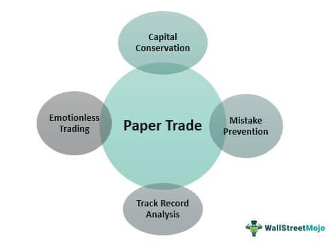

Paper trading is a fundamental aspect of algorithmic trading that enables traders to simulate the buying and selling of securities without incurring any financial risk. By replicating the trading environment and utilizing virtual funds, individuals can refine their strategies and build confidence before entering live markets. This practice is particularly beneficial for beginners, as it offers a platform to understand trading mechanics without the pressure of financial loss. The significance of paper trading extends to experienced traders as well, providing them with a safe space to test and optimize strategies in changing market conditions.

This article examines the importance of paper trading in algorithmic trading and its role as a vital tool for traders at all levels. It covers the practical aspects of implementing paper trading and the educational benefits it provides. By highlighting its limitations and comparing paper trading to live trading, the article seeks to equip traders with the knowledge necessary to transition effectively from simulated to live markets.

Understanding paper trading is crucial for anyone starting their journey in trading or looking to enhance their existing strategies. It allows traders to identify potential pitfalls and opportunities in their strategies without the financial consequences of live trading. The insights gained from this practice help traders develop resilience and adaptability, essential traits for navigating the complexities of real market conditions.

Join us as we explore the critical role of paper trading in modern trading practices, enhancing trader preparedness for real market challenges.

## Table of Contents

## What is Paper Trading?

Paper trading, often referred to as simulated trading, provides an opportunity for traders to engage in the buying and selling of stocks without risking actual capital. This virtual trading is a crucial tool, especially for those looking to test and refine their trading strategies in a risk-free environment before venturing into live markets. By allowing the replication of market conditions, paper trading serves as a sandbox for learning and understanding the intricate dynamics of stock markets through the use of historical data. This historical data enables traders to make informed decisions and enhances their strategic planning without incurring financial loss.

Platforms such as AlgoTest.in are at the forefront, offering sophisticated paper trading experiences. These platforms provide users with access to real-time data and simulate market conditions, facilitating effective learning and comprehension of trading mechanisms. By mimicking actual market scenarios, traders can hone their skills, build confidence, and gauge the effectiveness of their strategies under varying conditions without the financial stakes.

The process of paper trading not only involves the theoretical execution of trades but also encompasses the monitoring and analysis of potential market outcomes based on hypothetical trades. This can be particularly useful for understanding the repercussions of different market events on trading strategies. By engaging in this practice, traders develop the necessary acumen to navigate live trading environments, armed with the knowledge and insights gained from these simulations.

## Importance of Paper Trading in Algo Trading

Paper trading stands as an essential tool for algorithmic traders, particularly due to its capacity to offer a risk-free environment for experimentation and learning. This feature allows both novice and experienced traders to test and refine their trading strategies without incurring financial losses. The following are the key reasons that underscore the significance of paper trading in [algorithmic trading](/wiki/algorithmic-trading):

1. **Strategy Development and Testing**: Paper trading plays a crucial role in enabling traders to test their strategies under diverse market conditions. These simulations empower traders to evaluate the efficacy of their methodologies, identifying which strategies are effective and which need re-evaluation. By providing a practical testing ground, traders can optimize their strategies before deploying them in live markets.

2. **Analysis of Market Trends and Economic Impacts**: Through paper trading, traders can gain a deep understanding of prevalent market trends and how economic events might affect trading outcomes. This process involves simulating trades in response to historical market data and economic scenarios, helping traders devise robust strategies and response plans to actual market changes.

3. **Simulation of Real Trading Nuances**: While paper trading might not capture every detail of live trading, it allows for the simulation of crucial factors like slippage and transaction costs. These elements are vital for understanding the potential discrepancies between a strategy's theoretical performance and its real-world execution. Though paper trading has inherent limitations—such as not fully replicating emotional influences—it still offers invaluable insights.

4. **Learning from Mistakes and Market Feedback**: Mistakes made and lessons learned during paper trading carry no financial consequences, making it an ideal environment for learning and refinement. By observing market feedback on paper trades, traders can adjust and enhance their algorithms accordingly. This continuous improvement cycle is pivotal for honing trading strategies that align with actual market behaviors.

Through these features, paper trading serves as an indispensable phase in the journey of algorithmic traders. By enabling thorough testing and refinement of strategies, paper trading not only mitigates risks but also enhances the preparedness and adaptability of traders to tackle the complexities of live trading environments.

## The Realities of Paper Trading vs Live Trading

Paper trading serves as an essential framework for exploring the structural dynamics of live trading. However, it falls short in replicating the emotional intensity and real-world pressures inherent in financial markets. One significant limitation is its inability to accurately capture market slippage, which is the difference between the expected price of a trade and the actual price. Slippage can adversely impact trading results, particularly during times of high [volatility](/wiki/volatility-trading-strategies) when prices can change rapidly. 

Order latency, another critical element, refers to the delay between the initiation of a trade and its execution. In live trading, latency can affect the price at which trades are executed, especially in fast-moving markets. Paper trading platforms, on the other hand, often assume instantaneous execution at a price that may not be achievable in a dynamic market environment.

Furthermore, paper trading does not encompass the emotional reactions that arise from actual financial gain or loss. Traders in real markets may experience stress and pressure, leading to impulsive decisions that paper trading does not simulate.

A discrepancy arises between the theoretical prices at which paper trades are executed and the prices in real market scenarios. This is attributed to the complexities of order execution, which rely on market depth, transaction costs, and available [liquidity](/wiki/liquidity-risk-premium)—an aspect not faithfully represented in paper trading environments.

The primary focus of paper trading should be to determine if the patterns identified are sustainable and actionable in real-time markets. It is about validating the soundness of strategies rather than replicating exact financial outcomes recorded during paper trading. This approach is instrumental in bridging the gap between theoretical performance and real-world applicability.

Recognizing these differences between paper and live trading is crucial for traders as they prepare to transition into markets where financial risk is tangible. Understanding these operational disparities builds psychological resilience, equipping traders to handle market conditions and emotional pressures in live trading contexts effectively.

## How to Use Paper Trading to Test and Refine Trading Strategies

Paper trading serves as an indispensable tool for validating and refining trading strategies in algorithmic trading. When a strategy is developed, it usually goes through a [backtesting](/wiki/backtesting) process using historical data to assess its potential effectiveness. However, paper trading provides an additional layer of verification by allowing traders to confirm these strategies in a simulated environment that mirrors current market conditions.

To begin, traders should use paper trading to forward test new hypotheses about market behavior. This means implementing the strategy in a simulated setting, observing outcomes, and making necessary adjustments based on those observations. For example, if a trader hypothesizes that a certain market event impacts stock prices differently than accounted for in the past, paper trading can be used to test this hypothesis without any financial risk.

Determining the appropriate duration for paper trading is essential before transitioning to live trades. There is no universal rule for how long one should paper trade, as this largely depends on the specific strategy and market conditions. However, some experts recommend using partial real investments after a certain period to obtain more tangible feedback while still mitigating significant risk. This gradual transition can help in spotting nuanced issues that might not arise in purely virtual environments.

Incorporating paper trading with backtesting results is highly beneficial as it provides a comprehensive feedback loop. Backtesting may highlight a strategy's historical success, but coupling these insights with live simulated data offers a more robust evaluation. This iterative process, where strategies are continuously tested and improved, is crucial in adapting to dynamic market conditions.

For traders lacking extensive backtesting data, paper trading presents a valuable opportunity to refine strategies safely. By simulating real market conditions, traders can explore different scenarios and outcomes, identifying strengths and weaknesses in their approach. This method enables traders to gain confidence and insights without the immediate pressures or risks associated with live trading.

In summary, paper trading is a pivotal stage in the strategy development process, bridging the gap between theoretical backtesting and real-world trading. By leveraging this tool effectively, traders can iteratively refine their strategies, ensuring they are well-prepared for the challenges of live markets.

## The Transition from Paper Trading to Live Trading

Transitioning from paper trading to live trading is a crucial phase for traders who aim to implement their strategies in real markets. This process involves careful planning and an incremental approach to mitigate risks effectively. Initiating trades with small, real investments enables traders to gain confidence and refine their strategies under real market conditions. This cautious beginning helps manage financial risk while providing insights into the practical workings of the market dynamics encountered during live trading.

A critical aspect of this transition is the application of [statistics](/wiki/bayesian-statistics) and metrics derived from paper trading reports to evaluate performance in the live scenario. These quantitative measures include average returns, volatility, and the win-loss ratio, which provide a benchmark to gauge the effectiveness of trading strategies. Consistency in employing these metrics facilitates a seamless transition by offering data-driven insights into strategy performance.

Risk management becomes particularly vital during this phase. Traders must resist over-leveraging their investments, which can lead to substantial financial losses, especially in volatile markets. Developing strong emotional control is equally important, as real trading introduces psychological pressures not experienced in the simulated environment of paper trading. Emotional stability helps traders stick to their strategies and maintain discipline, which is often tested with real money at stake.

Applying position sizing techniques, such as the Kelly Criterion, can inform decisions on investment amounts per trade. The Kelly Criterion helps in determining the optimal size of a series of bets to maximize wealth growth over time, calculated using the formula:

$$
f^* = \frac{bp - q}{b}
$$

where $f^*$ is the fraction of the portfolio to wager, $b$ is the odds received on the bet (i.e., the net odds), $p$ is the probability of winning, and $q$ is the probability of losing. While theoretically sound, traders should exercise caution by initially applying it conservatively with smaller amounts to avoid excessive risk.

Ultimately, traders may feel ready to transition from paper to live trading when they achieve consistent success in simulations and develop emotional resilience. These factors collectively suggest a preparedness to handle the complexities and emotional demands of live market trading, thereby enhancing the likelihood of success in real trading environments.

## Conclusion

Paper trading remains a cornerstone in developing and refining trading strategies for both novice and seasoned algo traders. This risk-free environment is invaluable as it enables traders to rigorously test and validate their strategies without the immediate monetary pressure inherent in live trading. By simulating trades, traders gain a comprehensive understanding of market mechanisms, including order execution and the impact of market dynamics on trading strategies, without the complications of financial loss.

However, despite its advantages, paper trading cannot replicate the emotional challenges faced in real trading. The psychological aspects such as fear and greed, which can significantly influence trading decisions, remain largely unaddressed during simulations. Nevertheless, paper trading is instrumental in providing traders with a solid grasp of market operations, enhancing their readiness for future live trading endeavors.

One of the primary benefits of paper trading is the insights it offers, which can be leveraged when transitioning to live trading. Traders, armed with these insights and tested strategies, can navigate real market conditions more confidently and efficiently. The educational aspect of paper trading not only helps in honing technical skills but also serves as a foundational tool, fostering effective and responsible trading practices in real market scenarios. Consequently, paper trading is not just a preliminary step but a vital component of a trader’s ongoing education and skill development.

## References & Further Reading

[1]: Bergstra, J., Bardenet, R., Bengio, Y., & Kégl, B. (2011). ["Algorithms for Hyper-Parameter Optimization."](https://papers.nips.cc/paper/4443-algorithms-for-hyper-parameter-optimization) Advances in Neural Information Processing Systems 24.

[2]: ["Advances in Financial Machine Learning"](https://www.amazon.com/Advances-Financial-Machine-Learning-Marcos/dp/1119482089) by Marcos Lopez de Prado

[3]: ["Evidence-Based Technical Analysis: Applying the Scientific Method and Statistical Inference to Trading Signals"](https://www.amazon.com/Evidence-Based-Technical-Analysis-Scientific-Statistical/dp/0470008741) by David Aronson

[4]: ["Machine Learning for Algorithmic Trading"](https://github.com/stefan-jansen/machine-learning-for-trading) by Stefan Jansen

[5]: ["Quantitative Trading: How to Build Your Own Algorithmic Trading Business"](https://books.google.com/books/about/Quantitative_Trading.html?id=j70yEAAAQBAJ) by Ernest P. Chan