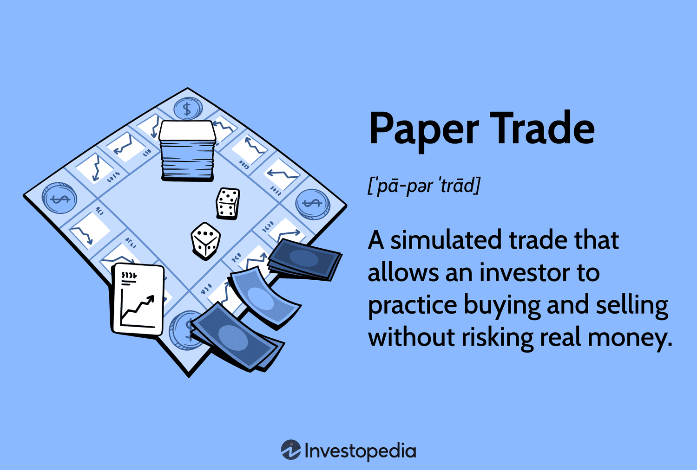

## Table of Contents

## What is paper trading?

Paper trading is a way for people to practice buying and selling stocks without using real money. It's like playing a game where you can pretend to be a stock trader and see how well you do without any risk. You can use websites or special software that let you make fake trades and track how your pretend investments would perform in the real market.

This method is really helpful for beginners who want to learn about the stock market. It lets them try out different strategies and see what works best without losing any money. It's also a good way for experienced traders to test new ideas before they use real money. Overall, paper trading is a safe and educational tool for anyone interested in investing.

## Why is paper trading important for beginners?

Paper trading is important for beginners because it lets them practice trading without losing real money. When you're new to the stock market, it can be scary to start investing right away. Paper trading gives you a safe place to make mistakes and learn from them without any financial risk. You can try out different strategies, see how the market works, and get comfortable with trading before you use your own money.

It also helps beginners understand how to use trading platforms and tools. Many trading apps and websites have features that can be confusing at first. By using paper trading, you can explore these tools, learn how to place orders, and get familiar with the interface. This practice can make you more confident when you decide to start trading with real money, as you'll already know how everything works.

## How can one start paper trading?

To start paper trading, you can use a website or an app that offers this feature. Many online brokers and investment platforms have a paper trading option. You'll need to sign up for an account, which is usually free. Once you're signed up, you'll get some pretend money to use for trading. This lets you practice buying and selling stocks without any real risk.

After you set up your account, you can start making pretend trades. You'll see how the stocks you choose go up or down in value, just like in the real market. This helps you learn how to pick stocks, when to buy or sell, and how to use the trading tools. It's a great way to practice and learn before you start using real money.

## What are the best platforms for paper trading?

Some of the best platforms for paper trading are Thinkorswim by TD Ameritrade and [Interactive Brokers](/wiki/interactive-brokers-api)' Trader Workstation. Thinkorswim is really popular because it's easy to use and has a lot of tools that help you learn about trading. You can practice trading stocks, options, and even futures. Interactive Brokers' Trader Workstation is another great choice. It's known for being powerful and having lots of features, which makes it good for both beginners and more experienced traders.

Another good platform is E*TRADE's Power E*TRADE. It's user-friendly and has a lot of educational resources to help you learn as you practice. Plus, it lets you trade stocks, options, and ETFs. For those who want a more straightforward experience, Robinhood offers a simple paper trading feature through their app. It's easy to use and great for beginners who want to start with the basics of trading.

## What are the limitations of paper trading?

Paper trading isn't perfect because it can't copy everything about real trading. One big problem is that it doesn't feel the same as using real money. When you're practicing, you might not feel the same worry or excitement as when you're using your own money. This can make you take more risks or make choices you wouldn't in real life. Also, paper trading can't show you all the little costs you might have in real trading, like fees for buying and selling stocks.

Another issue is that paper trading uses pretend prices that might not be exactly the same as real market prices. Sometimes, there can be a small delay between the pretend prices and the real ones, which can make a big difference in how your trades turn out. Plus, paper trading can't show you how other people in the market might react to what you're doing. In real trading, other traders can affect prices and make things more unpredictable. So, while paper trading is a great way to learn, it's important to remember it's not the same as the real thing.

## How does paper trading differ from real trading?

Paper trading and real trading are different in a few big ways. First, paper trading uses pretend money, so you don't feel the same emotions as when you're using your own money. When you're practicing, you might take more risks or make choices you wouldn't in real life because you're not worried about losing anything. Real trading, on the other hand, can make you feel nervous or excited because your money is on the line. This emotional difference can affect how you trade.

Second, paper trading can't show you all the little costs you might have in real trading, like fees for buying and selling stocks. These costs can add up and affect how much money you make or lose. Also, paper trading uses pretend prices that might not be exactly the same as real market prices. There can be a small delay between the pretend prices and the real ones, which can make a big difference in how your trades turn out. In real trading, other people in the market can also affect prices and make things more unpredictable, which you can't see in paper trading.

## Can paper trading help in developing a trading strategy?

Paper trading is really helpful for developing a trading strategy because it lets you try out different ideas without any risk. You can pretend to buy and sell stocks, see how they do, and figure out what works best for you. This practice helps you understand the stock market better and learn how to make smart choices. You can test different ways of [picking](/wiki/asset-class-picking) stocks, deciding when to buy or sell, and see how your strategy would work in real life.

Even though paper trading isn't the same as real trading, it's a great way to practice and get better. You can use what you learn from paper trading to build a strategy that you feel good about. When you're ready, you can start using real money, knowing you've already tried out your ideas and made adjustments. This can make you feel more confident and ready to trade for real.

## What psychological aspects of trading can be practiced through paper trading?

Paper trading can help you practice dealing with your feelings when trading. When you're using pretend money, you might not feel as worried or excited as you would with real money. But it's still a good way to see how you react to wins and losses. You can practice staying calm and making smart choices even when things don't go your way. This can help you learn to control your emotions better, so you don't make quick, bad decisions when you start trading for real.

Another important thing you can practice is patience. In the stock market, it can take time for your investments to grow. Paper trading lets you try waiting for the right moment to buy or sell without the pressure of losing real money. You can see how different waiting times affect your results and learn to be patient. This practice can help you stick to your trading plan and not rush into things just because you're feeling impatient.

## How accurate are the results from paper trading compared to live trading?

The results from paper trading are not always the same as live trading because they use pretend money and prices. When you paper trade, you might not feel the same emotions as when you're using real money. This can make you take more risks or make different choices than you would in real life. Also, the prices in paper trading might not be exactly the same as the real market prices. There can be a small delay, which can change how your trades turn out.

Even though paper trading isn't perfect, it's still a good way to learn and practice. You can try out different strategies and see how they might work without losing any money. It helps you get used to the stock market and understand how things work. But remember, when you start trading for real, things might be different because of the emotions and real costs involved. So, while paper trading can give you a good idea of how your strategies might work, the results won't be exactly the same as in live trading.

## What advanced techniques can be tested using paper trading?

Paper trading is a great way to try out advanced trading techniques without risking real money. You can practice using options strategies, like buying and selling options to make money from stock price movements. This lets you see how options work and learn about things like strike prices and expiration dates. You can also test out more complicated strategies like spreads, where you buy and sell different options at the same time to limit your risk. This practice helps you understand how these strategies work and what might happen in different market situations.

Another advanced technique you can test is [algorithmic trading](/wiki/algorithmic-trading). This is when you use computer programs to make trades based on certain rules. Paper trading lets you write and test these programs to see if they work well without losing any money. You can try different algorithms and see how they perform over time. This practice can help you fine-tune your algorithms and get ready to use them in real trading. Overall, paper trading is a safe way to experiment with advanced techniques and learn how to use them effectively.

## How can one transition from paper trading to live trading?

Moving from paper trading to live trading is a big step, but it can be done smoothly if you follow a few simple steps. Start by reviewing your paper trading results and seeing what strategies worked well for you. Think about what you learned and how you can use that knowledge in real trading. It's also a good idea to set a small amount of real money aside for trading, so you can start without risking too much. Choose a reputable broker and make sure you understand all the fees and costs involved in real trading.

Once you're ready to start live trading, begin with small trades. This way, you can get used to the feeling of using real money without too much risk. Keep track of your trades and compare them to your paper trading results. You might find that your emotions affect your decisions more than they did in paper trading, so it's important to stay calm and stick to your plan. As you gain more experience and confidence, you can slowly increase the amount you trade. Remember, the key is to learn from each trade and keep improving your skills.

## What are some common mistakes to avoid in paper trading?

One common mistake in paper trading is not taking it seriously enough. Because you're using pretend money, it's easy to make trades without thinking carefully. You might take big risks or make quick decisions that you wouldn't make with real money. To get the most out of paper trading, treat it like real trading. Make a plan, stick to it, and think about each trade as if it were real.

Another mistake is not keeping track of your trades and results. It's important to write down what you did and how it turned out so you can learn from it. If you don't keep records, you won't be able to see what works and what doesn't. This can make it hard to improve your strategy. Always review your trades and think about what you can do better next time.

## What is the transition from paper trading to live trading like?

Transitioning from paper trading to live trading is a crucial phase for traders who aim to implement their strategies in real markets. This process involves careful planning and an incremental approach to mitigate risks effectively. Initiating trades with small, real investments enables traders to gain confidence and refine their strategies under real market conditions. This cautious beginning helps manage financial risk while providing insights into the practical workings of the market dynamics encountered during live trading.

A critical aspect of this transition is the application of [statistics](/wiki/bayesian-statistics) and metrics derived from paper trading reports to evaluate performance in the live scenario. These quantitative measures include average returns, [volatility](/wiki/volatility-trading-strategies), and the win-loss ratio, which provide a benchmark to gauge the effectiveness of trading strategies. Consistency in employing these metrics facilitates a seamless transition by offering data-driven insights into strategy performance.

Risk management becomes particularly vital during this phase. Traders must resist over-leveraging their investments, which can lead to substantial financial losses, especially in volatile markets. Developing strong emotional control is equally important, as real trading introduces psychological pressures not experienced in the simulated environment of paper trading. Emotional stability helps traders stick to their strategies and maintain discipline, which is often tested with real money at stake.

Applying position sizing techniques, such as the Kelly Criterion, can inform decisions on investment amounts per trade. The Kelly Criterion helps in determining the optimal size of a series of bets to maximize wealth growth over time, calculated using the formula:

$$
f^* = \frac{bp - q}{b}
$$

where $f^*$ is the fraction of the portfolio to wager, $b$ is the odds received on the bet (i.e., the net odds), $p$ is the probability of winning, and $q$ is the probability of losing. While theoretically sound, traders should exercise caution by initially applying it conservatively with smaller amounts to avoid excessive risk.

Ultimately, traders may feel ready to transition from paper to live trading when they achieve consistent success in simulations and develop emotional resilience. These factors collectively suggest a preparedness to handle the complexities and emotional demands of live market trading, thereby enhancing the likelihood of success in real trading environments.

## References & Further Reading

[1]: Bergstra, J., Bardenet, R., Bengio, Y., & Kégl, B. (2011). ["Algorithms for Hyper-Parameter Optimization."](https://papers.nips.cc/paper/4443-algorithms-for-hyper-parameter-optimization) Advances in Neural Information Processing Systems 24.

[2]: ["Advances in Financial Machine Learning"](https://www.amazon.com/Advances-Financial-Machine-Learning-Marcos/dp/1119482089) by Marcos Lopez de Prado

[3]: ["Evidence-Based Technical Analysis: Applying the Scientific Method and Statistical Inference to Trading Signals"](https://www.amazon.com/Evidence-Based-Technical-Analysis-Scientific-Statistical/dp/0470008741) by David Aronson

[4]: ["Machine Learning for Algorithmic Trading"](https://github.com/stefan-jansen/machine-learning-for-trading) by Stefan Jansen

[5]: ["Quantitative Trading: How to Build Your Own Algorithmic Trading Business"](https://books.google.com/books/about/Quantitative_Trading.html?id=j70yEAAAQBAJ) by Ernest P. Chan