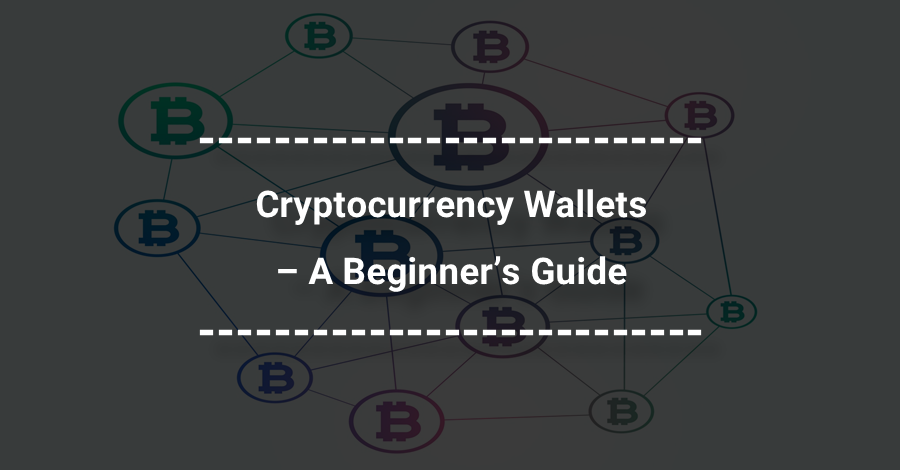

Cryptocurrency has fundamentally transformed conventional perceptions of money and transactions. While the excitement surrounding investment and trading captures much attention, securing these digital assets remains paramount. As cryptocurrencies operate on decentralized networks, the risk of hacks, theft, and other security breaches makes understanding safe storage solutions essential for any investor. This article addresses various methods of cryptocurrency storage, particularly focusing on paper wallets and their security implications, as well as the roles they might play alongside algorithmic trading (algo trading).

The rapid evolution of the crypto market has necessitated sophisticated tools and techniques to manage and protect digital assets. Investors need to comprehend the intricacies of available storage options to consciously safeguard their assets. As tools and strategies for managing cryptocurrencies become more advanced, staying informed on the latest developments is crucial for security and success.



We'll examine what constitutes a crypto wallet, detailing the nature of paper wallets and comparing them with other storage solutions. Additionally, we'll explore their intersection with algorithmic trading, discussing the potential integrations and security considerations involved. Understanding these factors can empower investors to make educated choices, optimizing their venture into the crypto industry.

## Table of Contents

## What is a Crypto Wallet?

A crypto wallet is an essential digital tool that facilitates the secure storage and management of cryptocurrencies. The primary function of a crypto wallet is to safeguard the user's private and public keys, which are critical for authenticating and executing transactions of digital assets such as coins and tokens. Unlike traditional wallets that hold physical currency, crypto wallets are designed to handle digital currencies, allowing for seamless sending and receiving processes across a blockchain network.

Crypto wallets are available in several forms, each offering a unique set of advantages and drawbacks. The most common types include software wallets, hardware wallets, and paper wallets. Software wallets, which can be further categorized into desktop, mobile, and online wallets, are applications or platforms that store keys digitally. They offer convenience and ease of access for frequent transactions, but their online nature can expose them to potential cybersecurity threats.

Hardware wallets, in contrast, store cryptocurrencies offline on a physical device, often resembling a USB drive. This form of "cold storage" is known for its enhanced security, as it is immune to online hacking attempts, making it an ideal option for long-term asset storage. However, hardware wallets require careful handling to prevent loss or physical damage.

Paper wallets represent another form of cold storage, where keys are printed or written on a physical piece of paper. These are virtually unhackable since they remain offline but demand meticulous management to avoid physical degradation or loss.

Security is a paramount consideration when choosing a crypto wallet. The selection process should carefully balance needs such as transaction frequency and risk tolerance. For instance, frequent traders might prefer the accessibility of software wallets, whereas long-term investors may prioritize the security offered by hardware or paper wallets.

Crypto wallets can be categorized into custodial and non-custodial types. Custodial wallets are managed by third-party service providers who hold the private keys on behalf of the user, which can offer convenience but with the trade-off of relinquishing control. Non-custodial wallets, on the other hand, allow users to retain full control over their private keys, thereby ensuring complete ownership and responsibility for their digital assets. Understanding these distinctions is crucial for effective crypto asset management.

## Understanding Paper Wallets

Paper wallets are a form of cold storage for cryptocurrencies wherein users print their public and private keys on a physical piece of paper. This method often incorporates QR codes to facilitate easy scanning and quick access to the keys for transactions. 

Due to their offline nature, paper wallets were a favored early solution for securing [cryptocurrency](/wiki/cryptocurrency). Unlike digital storage solutions, which can be vulnerable to hacking and malware, paper wallets are entirely immune to online threats. This advantage provided a significant level of security, especially when digital security infrastructure was comparatively nascent.

However, the physical form of paper wallets introduces its own set of challenges. Being susceptible to physical damage or loss, such as from fire, water, or theft, they require stringent measures for safe storage. Users must ensure they choose a secure, accessible location, preferably a safe or a safety deposit box, to avoid accidental damage or unauthorized access.

Despite offering high security, paper wallets lack the convenience that digital interfaces provide for regular transactions. Their setup usually involves generating keys in a secure manner, such as using an air-gapped computer or trusted software that could output the keys onto paper. This process can be cumbersome and prone to error if not performed correctly. Moreover, once funds are transferred from a paper wallet, it is generally recommended not to reuse it to ensure continued security, necessitating the creation of new paper wallets for new transactions.

The simplicity of paper wallets makes them ideal for long-term holding without frequent access. They are analogous to a physical wallet, where the safeguarding of the physical document is paramount to ensuring the safety of its stored value. Nonetheless, advancements in security technology and the demand for more dynamic interfaces have seen a decline in their usage in favor of more user-friendly solutions like hardware wallets.

## Pros and Cons of Paper Wallets

Paper wallets offer a unique approach to cryptocurrency storage, providing a set of distinct advantages primarily centered around security. By storing the cryptographic keys on a physical piece of paper, these wallets remain entirely offline. This offline storage confers several benefits. Firstly, it provides enhanced security by making the wallet immune to digital threats such as malware, hacks, and phishing attacks. In contrast to digital wallets that might be exposed to cybersecurity threats, paper wallets eliminate the risk of unauthorized online access. Additionally, since paper wallets ensure that the owner has physical possession of their keys, they provide true cryptocurrency ownership without reliance on third-party services.

However, this method of storage is not without its challenges. One significant drawback of paper wallets is their susceptibility to physical damage or loss. Since the keys are printed on paper, they can be easily damaged by water, fire, or general wear and tear, which underscores the importance of durable and safe storage solutions. Furthermore, the physical nature of paper wallets exposes them to risks of theft or accidental destruction, which could result in the irreversible loss of cryptocurrency.

Moreover, paper wallets can be complex for beginners due to the technical know-how required to generate and secure them properly. The setup process involves understanding both cyber security and physical storage strategies to ensure that the keys are not exposed during or after their creation. This complexity might deter new users from using this method, especially when more user-friendly alternatives are available.

Paper wallets are best suited for those aiming for long-term holding without frequent need for access, as they lack the convenience and ease of use required for regular transactions. To manage cryptocurrency with paper wallets over time, one must be prepared to adopt stringent security measures and possibly use complementary methods of storage to allow for operational flexibility. Balancing the offline security benefits with the practical concerns of access and storage is crucial for effective use.

## Algorithmic Trading in Cryptocurrency

Algorithmic trading, or algo trading, has significantly influenced the dynamic cryptocurrency market by automating trading processes using mathematical models and sophisticated algorithms. This method enables high-frequency trading decisions, which are well-suited to the crypto market's inherent [volatility](/wiki/volatility-trading-strategies) and its uninterrupted trading hours. Unlike traditional financial markets, cryptocurrencies operate 24/7, allowing algo trading systems to exploit price movements at any time, thus enhancing trading efficiencies and opportunities.

To effectively implement [algorithmic trading](/wiki/algorithmic-trading) in cryptocurrency, a robust technological infrastructure is essential. This includes high-speed internet connections, powerful computing systems, and access to real-time market data and trading platforms. Moreover, technical expertise is crucial for developing and refining these algorithms to ensure optimal functionality in diverse market conditions. Algorithms can be designed for various strategies, including [market making](/wiki/market-making), [arbitrage](/wiki/arbitrage), and [trend following](/wiki/trend-following), each tailored to maximize returns in different scenarios.

Despite the advantages, algorithmic trading presents integration challenges with certain crypto storage methods, particularly traditional ones like paper wallets. Paper wallets, being a form of cold storage, are entirely offline, enhancing security but hindering the quick access required by algo trading systems. Unlike hot storage solutions, which facilitate frequent transactions, paper wallets require additional steps to transfer funds to a hot wallet before engaging in live trading, thus delaying potential opportunities.

The interplay between algo trading and crypto storage can be streamlined by adopting hybrid solutions. Traders might maintain a small portion of funds in accessible, online wallets for active trading while keeping long-term holdings in paper or other cold storage formats. This dual approach balances security and operational efficiency, ensuring that algorithmic trading systems can operate without compromising the safety of the assets involved.

Ultimately, successful algorithmic trading in cryptocurrency demands not only a keen understanding of market mechanics and advanced computational methods but also strategic management of storage solutions to safeguard digital assets while maximizing trading performance.

## Securing Your Cryptocurrency

Securing cryptocurrency requires a balanced approach to selecting between hardware, software, and paper wallets, each offering a unique blend of security and convenience. When choosing the appropriate wallet, the primary consideration should be the security features that match your transaction needs and risk appetite.

For algorithmic traders, integrating secure wallet practices is vital to mitigate risks while optimizing trading efficiency. Algo traders often engage in high-frequency transactions that necessitate an infrastructure capable of rapid execution without compromising on security. Implementing strong authentication measures, such as two-[factor](/wiki/factor-investing) authentication and secure private key management, can help safeguard assets during trades.

Regular audits are crucial in maintaining the security health of cryptocurrency holdings. Routine checks help identify potential vulnerabilities in storage solutions and ensure compliance with best practices. Cold storage, primarily utilized for funds not actively in use, offers enhanced security by keeping assets offline and insulated from cyber threats. Using cold storage for unused funds significantly reduces exposure to hacking attempts.

Separating wallets for trading and long-term storage enhances security and operational efficiency. A dedicated trading wallet allows for easier tracking and management of assets involved in active trading, while a separate storage wallet maintains the security of long-term holdings.

Maintaining up-to-date knowledge on security practices is essential to protect against evolving threats in cryptocurrency storage and trading. This includes keeping software and devices current with the latest security patches, understanding emerging cyber threats, and adjusting strategies accordingly. Consider implementing technologies such as [machine learning](/wiki/machine-learning) algorithms for threat detection or using blockchain analytics for monitoring suspicious activities.

Here is an exemplar Python code snippet that demonstrates setting up two-factor authentication for enhanced security in a cryptocurrency wallet implementation:

```python
import pyotp

# Generate a base32 secret key for user
secret = pyotp.random_base32()
print("Your secret key for 2FA is:", secret)

# Generate a TOTP object
totp = pyotp.TOTP(secret)

# Function to verify TOTP code from user
def verify_totp(user_input_code):
    return totp.verify(user_input_code)

# Example usage
user_input_code = input("Enter your TOTP code: ")
if verify_totp(user_input_code):
    print("TOTP code verified successfully.")
else:
    print("Invalid TOTP code. Authentication failed.")
```

Such proactive measures are pivotal in ensuring secure cryptocurrency management and achieving resilience against emerging threats in the dynamic crypto environment.

## Conclusion

The cryptocurrency ecosystem offers a plethora of options tailored for storing and trading digital assets securely. Each method, whether for storage or trading, provides unique advantages and challenges, necessitating careful consideration by investors.

Paper wallets remain one of the most secure methods for storing cryptocurrencies due to their offline nature, safeguarding against online threats like hacking and malware. However, this high level of security requires meticulous handling to prevent physical damage or loss. To maximize efficiency and security, it is advisable to complement paper wallets with other forms of storage, such as hardware or software wallets, particularly for assets that require more frequent transactions.

On the trading front, algorithmic trading stands out as a highly attractive strategy, leveraging computational algorithms to execute trades swiftly and accurately. This approach can capitalize on the volatility of cryptocurrency markets, operating around the clock. However, the integration of algorithmic trading with robust storage practices is crucial to mitigate risks and protect assets. Secure practices, such as regular audits and using separate wallets for trading and storage, are essential to harness the full potential of algorithmic trading without compromising security.

As the technological landscape gradually evolves, gaining a comprehensive understanding of the specific advantages and disadvantages of each storage method and trading strategy becomes critical. Armed with this knowledge, investors are better equipped to optimize their cryptocurrency endeavors, ensuring both security and efficiency in their digital asset management.

## References & Further Reading

[1]: ["Mastering Bitcoin: Unlocking Digital Cryptocurrencies"](https://books.google.com/books/about/Mastering_Bitcoin.html?id=IXmrBQAAQBAJ) by Andreas M. Antonopoulos

[2]: "Narayanan, A., Bonneau, J., Felten, E., Miller, A., & Goldfeder, S. (2016). Bitcoin and Cryptocurrency Technologies: A Comprehensive Introduction. Princeton University Press."

[3]: Eskandari, S., Clark, J., Barrera, D., & Stobert, E. (2018). ["A first look at the usability of bitcoin key management."](https://arxiv.org/abs/1802.04351) In Financial Cryptography and Data Security.

[4]: Nakamoto, S. (2008). ["Bitcoin: A Peer-to-Peer Electronic Cash System."](https://nakamotoinstitute.org/library/bitcoin/)

[5]: Yermack, D. (2017). "Corporate Governance and Blockchains." Review of Finance, 21(1), 7-31.

[6]: "Cryptocurrency: How Bitcoin and Digital Money are Challenging the Global Economic Order" by Paul Vigna and Michael J. Casey

[7]: Böhme, R., Christin, N., Edelman, B., & Moore, T. (2015). ["Bitcoin: Economics, Technology, and Governance."](https://www.aeaweb.org/articles?id=10.1257/jep.29.2.213) The Journal of Economic Perspectives, 29(2), 213-238.

[8]: Jeong, S., & Kim, Y. (2019). ["Paper-Based Cryptocurrency Wallets: A Comparative Investigation and Practical Considerations."](https://www.sciencedirect.com/science/article/pii/S1057521918305271) IEEE Access. 

[9]: ["Algorithmic Trading & DMA: An introduction to direct access trading strategies"](https://www.amazon.com/Algorithmic-Trading-DMA-introduction-strategies/dp/0956399207) by Barry Johnson