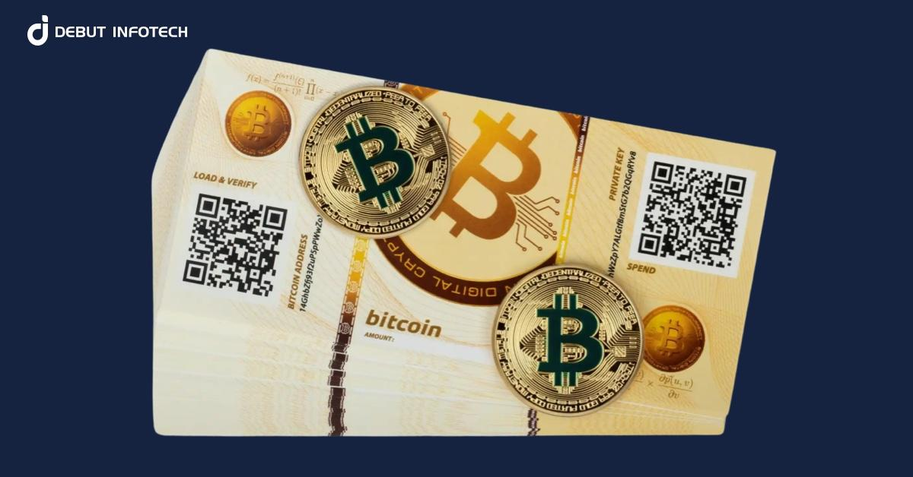

## Table of Contents

## What is a paper wallet in cryptocurrency?

A paper wallet in cryptocurrency is a physical document that contains your private and public keys for a cryptocurrency wallet. It's called a "paper wallet" because you usually print these keys on a piece of paper. The private key is like a secret password that lets you spend your cryptocurrency, while the public key is like your account number that others can see. By keeping your keys on paper, you don't have to worry about hackers getting into your computer or phone to steal your money.

To make a paper wallet, you can use special websites that generate the keys for you. Once you have the keys, you print them out and keep the paper in a safe place, like a locked drawer or a safe. It's important to keep your paper wallet secure because if someone else gets your private key, they can take your cryptocurrency. Paper wallets are good for people who want to store their cryptocurrency for a long time without worrying about digital security, but they can be risky if not kept safe.

## How do you create a paper wallet?

To create a paper wallet, you first need to find a reliable website that offers a paper wallet generator. Some popular ones are available for different cryptocurrencies like Bitcoin. Once you find a good website, you go to their paper wallet generator page. There, you'll see a button that says something like "Generate New Address." When you click it, the website will create a new set of keys for you. These keys include a public address, which is like your account number, and a private key, which is like your secret password.

After the keys are generated, you'll see them on your screen. You need to print these keys on a piece of paper. Make sure you're using a printer that's not connected to the internet to keep your keys safe. Once printed, you have your paper wallet. Keep this paper in a very safe place, like a locked drawer or a safe, because if someone else gets your private key, they can take your [cryptocurrency](/wiki/cryptocurrency). Remember, paper wallets are good for storing cryptocurrency for a long time, but they can be risky if not kept secure.

## What are the benefits of using a paper wallet for storing cryptocurrencies?

Using a paper wallet for storing cryptocurrencies has some big benefits. One main benefit is that it keeps your money safe from hackers. Since the keys are on a piece of paper and not on a computer or phone, hackers can't get to them through the internet. This makes paper wallets a good choice for people who want to keep their cryptocurrency safe for a long time without worrying about digital security.

Another benefit is that paper wallets are simple and don't need any special technology. You don't need to know a lot about computers or have fancy software. All you need is a printer and a safe place to keep the paper. This makes it easy for anyone to use a paper wallet, even if they're not very tech-savvy.

## What are the potential risks associated with paper wallets?

One big risk with paper wallets is that they can be lost or damaged. If you lose the piece of paper with your keys, or if it gets wet, burned, or torn, you might not be able to use your cryptocurrency anymore. It's important to keep your paper wallet in a very safe place, but even then, things can happen that you don't expect. If someone else finds your paper wallet, they can take your cryptocurrency because they'll have your private key.

Another risk is that it can be hard to use the money in a paper wallet. When you want to spend or move your cryptocurrency, you have to type in the private key from the paper. If you make a small mistake typing it, you could lose your money. Also, if you're not careful, you might accidentally show your private key to someone else or a website, which could let them steal your cryptocurrency. So, while paper wallets are good for keeping your money safe from hackers, they need a lot of care to use them right.

## How do you safely store a paper wallet?

To safely store a paper wallet, you should keep it in a place where it won't get lost or damaged. A good spot might be a locked drawer or a safe. Make sure this place is dry and away from fire or water, because if the paper gets wet or burned, you could lose your cryptocurrency. It's also a good idea to tell someone you trust where you keep your paper wallet, just in case something happens to you.

Another important thing is to keep your paper wallet secret. Don't tell anyone about it or show it to them, because if someone else gets your private key, they can take your cryptocurrency. You might also want to make a copy of your paper wallet and keep it in a different safe place, just in case something happens to the first one. But remember, the more copies you make, the more careful you have to be to keep them all safe.

## Can you use a paper wallet for multiple cryptocurrencies?

A paper wallet is usually made for one type of cryptocurrency at a time. For example, if you make a paper wallet for Bitcoin, it won't work for Ethereum or any other cryptocurrency. Each cryptocurrency has its own special keys, so you need a different paper wallet for each one you want to store.

If you want to store multiple cryptocurrencies, you'll need to make a separate paper wallet for each one. This means you'll have to use a different website or tool to generate the keys for each cryptocurrency and print them out on separate pieces of paper. Keeping track of multiple paper wallets can be a bit tricky, so make sure you store them all in safe places and keep them organized.

## How do you deposit funds into a paper wallet?

To deposit funds into a paper wallet, you need to send your cryptocurrency to the public address that's printed on your paper wallet. This public address is like your account number. You can send money to it from another wallet, like a digital wallet on your phone or computer. Just make sure you type the public address correctly, because if you make a mistake, your money could go to the wrong place and you might lose it.

Once you've sent the cryptocurrency to the public address on your paper wallet, the money is stored there safely. You can check the balance of your paper wallet by looking up the public address on a blockchain explorer website. These websites let you see how much money is in any public address. Just remember, after you deposit funds into your paper wallet, keep the paper in a safe place so no one else can get to it and take your money.

## How do you withdraw funds from a paper wallet?

To withdraw funds from a paper wallet, you need to move the cryptocurrency to another wallet, like a digital wallet on your phone or computer. First, you have to import the private key from your paper wallet into the digital wallet. This private key is like a secret password that lets you spend the money. Be very careful when you type in the private key, because if you make a mistake, you could lose your money. Once the private key is in the digital wallet, you can send the cryptocurrency to wherever you want it to go.

After you've moved the money out of your paper wallet, it's a good idea to destroy the paper wallet. You can tear it up or burn it to make sure no one else can use it. Remember, once you've used the private key, the paper wallet isn't safe anymore because someone could find it and take your money if you leave it lying around. So, always keep your paper wallet secret and destroy it after you're done using it.

## What should you do if your paper wallet is lost or damaged?

If your paper wallet is lost or damaged, you might not be able to use your cryptocurrency anymore. This is because the paper wallet has your private key, which is like a secret password. If you lose the paper or if it gets wet, burned, or torn, you can't get to your money. That's why it's a good idea to make a copy of your paper wallet and keep it in a different safe place. If something happens to your main paper wallet, you can use the copy to get your money.

If you don't have a copy and your paper wallet is gone, you're in a tough spot. You won't be able to spend or move your cryptocurrency without the private key. In this case, you might have to say goodbye to the money in that wallet. That's why it's really important to keep your paper wallet safe and think about making a backup copy, just in case something bad happens.

## How does the security of a paper wallet compare to other forms of cryptocurrency storage?

A paper wallet is very safe from hackers because it's not connected to the internet. Hackers can't get to your money if it's on a piece of paper instead of a computer or phone. This makes paper wallets a good choice for keeping your cryptocurrency safe for a long time. But, paper wallets can be lost or damaged easily. If you lose the paper or if it gets wet or torn, you might not be able to use your money anymore. So, while paper wallets are great for keeping your money safe from hackers, they need a lot of care to make sure they don't get lost or damaged.

Other forms of cryptocurrency storage, like digital wallets on your phone or computer, are easier to use but can be less safe. Digital wallets are connected to the internet, so hackers might try to get into them. To keep your money safe in a digital wallet, you need to use strong passwords and maybe even special security software. Hardware wallets, which are like USB drives, are another option. They're not connected to the internet all the time, so they're safer than digital wallets but still easier to use than paper wallets. Each type of storage has its own pros and cons, so you have to think about what's most important to you: ease of use, safety from hackers, or keeping your money safe from being lost or damaged.

## Are there any tools or software recommended for managing paper wallets?

For managing paper wallets, one popular tool is the website called "BitAddress." This website lets you make a new paper wallet for Bitcoin easily. You just go to the website, click a button to generate new keys, and then print them out. BitAddress is good because it works right in your web browser and doesn't need any special software. Just make sure you're using a safe computer and printer that aren't connected to the internet to keep your keys secret.

Another tool you might use is "MyEtherWallet" if you're dealing with Ethereum. This website also helps you make a paper wallet, but for Ethereum instead of Bitcoin. Like BitAddress, you go to the website, generate your keys, and print them out. MyEtherWallet is easy to use and works well for people who want to store Ethereum safely. Remember, after you make your paper wallet with these tools, keep it in a safe place and don't tell anyone about it to keep your money secure.

## What are the advanced security measures one can take to protect a paper wallet?

To keep your paper wallet extra safe, you can use a few special tricks. One good idea is to use a security feature called "lamination." This means you cover your paper wallet with a thin plastic sheet to protect it from water and tears. Another trick is to use a safe deposit box at a bank. This is a very secure place where you can keep your paper wallet, and it's hard for anyone else to get to it. You can also split your private key into parts and store each part in a different safe place. This way, even if someone finds one part, they can't use your money without the other parts.

Another advanced way to protect your paper wallet is to use a technique called "cold storage." This means you make your paper wallet on a computer that's never been connected to the internet. This keeps your keys safe from hackers right from the start. You can also use a special kind of ink that disappears if someone tries to copy your paper wallet. This makes it harder for someone to steal your keys. Remember, the more careful you are with these advanced security measures, the safer your cryptocurrency will be.

## References & Further Reading

[1]: ["Mastering Bitcoin: Unlocking Digital Cryptocurrencies"](https://books.google.com/books/about/Mastering_Bitcoin.html?id=IXmrBQAAQBAJ) by Andreas M. Antonopoulos

[2]: "Narayanan, A., Bonneau, J., Felten, E., Miller, A., & Goldfeder, S. (2016). Bitcoin and Cryptocurrency Technologies: A Comprehensive Introduction. Princeton University Press."

[3]: Eskandari, S., Clark, J., Barrera, D., & Stobert, E. (2018). ["A first look at the usability of bitcoin key management."](https://arxiv.org/abs/1802.04351) In Financial Cryptography and Data Security.

[4]: Nakamoto, S. (2008). ["Bitcoin: A Peer-to-Peer Electronic Cash System."](https://nakamotoinstitute.org/library/bitcoin/)

[5]: Yermack, D. (2017). "Corporate Governance and Blockchains." Review of Finance, 21(1), 7-31.

[6]: "Cryptocurrency: How Bitcoin and Digital Money are Challenging the Global Economic Order" by Paul Vigna and Michael J. Casey

[7]: Böhme, R., Christin, N., Edelman, B., & Moore, T. (2015). ["Bitcoin: Economics, Technology, and Governance."](https://www.aeaweb.org/articles?id=10.1257/jep.29.2.213) The Journal of Economic Perspectives, 29(2), 213-238.

[8]: Jeong, S., & Kim, Y. (2019). ["Paper-Based Cryptocurrency Wallets: A Comparative Investigation and Practical Considerations."](https://www.sciencedirect.com/science/article/pii/S1057521918305271) IEEE Access. 

[9]: ["Algorithmic Trading & DMA: An introduction to direct access trading strategies"](https://www.amazon.com/Algorithmic-Trading-DMA-introduction-strategies/dp/0956399207) by Barry Johnson