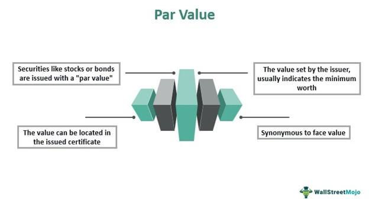

Understanding financial terminology is crucial for investors and traders alike, especially when navigating complex markets. Financial concepts such as face value, par value, and algorithmic trading are integral to shaping investment and trading strategies, significantly affecting decision-making processes and risk assessment. This article provides insights into what these terms mean, their applications in the financial world, and their interrelations.

Face value refers to the nominal value of a security, such as bonds or stocks, as declared by its issuer. It is a constant value used as a benchmark despite market price fluctuations. Similarly, par value, often linked to bonds, indicates the redemption price at maturity and is crucial for determining interest payments and assessing bond yields. Algorithmic trading, on the other hand, involves using complex computer algorithms to execute trades based on specific criteria, leveraging computational speed and large datasets for strategic advantage.



Grasping these concepts is essential not only for seasoned traders but also for financial novices. It enhances market interactions by enabling more informed and strategic engagement with financial markets, thus empowering investors to make better investment choices and mitigate risks effectively. Through this exploration, we aim to provide a comprehensive guide to help investors navigate the complexities of modern financial markets with confidence and competence.

## Table of Contents

## Understanding Face Value

Face value, also known as nominal value, refers to the stated value of a security as issued by its creator. This concept is prevalent in the bond and stock markets, serving as a critical reference point for investors.

In the bond market, face value indicates the specific amount that a bond issuer commits to repay the bondholder upon maturity of the bond. For instance, if a bond has a face value of $1,000, this means that the bondholder will receive $1,000 when the bond matures, irrespective of the market price fluctuations that may occur during its lifespan. Typically, coupon payments, which are the periodic interest payments made to bondholders, are calculated as a percentage of this face value. Therefore, understanding the face value is essential for comprehending the bond's expected income and cash flows.

In the stock market, the face value, often synonymous with par value, denotes the base value assigned to a stock upon issuance. This value is generally nominal, often set at a minimal amount like $0.01 per share in order to fulfill legal and accounting requirements. While the face value of stocks has less impact on their market pricing and trading, it holds legal and accounting significance for the issuing corporation. Notably, market dynamics frequently result in trade prices that differ significantly from the stock's face value, highlighting the distinction between face value and market value in stock assessments. 

Despite the market's price [volatility](/wiki/volatility-trading-strategies), the face value remains constant, acting as a stabilizing benchmark. Assessing this nominal value alongside the more variable market value can provide investors with a comprehensive view of a security's true worth. By understanding how face value contrasts with current market value, investors can make more informed decisions about whether a security is over or undervalued, thus determining its investment potential.

## Diving Deeper into Par Value

Par value is a critical concept in the bond market, serving as the nominal value of a bond that is paid to the holder upon its maturity. This fixed amount is distinct from its issue price or face value, especially when considering stocks. In the context of bonds, par value is crucial for determining coupon payments, which are calculated as a percentage of this amount. These regular interest payments allow investors to gauge the expected income from a bond over time.

A bond's trading price often fluctuates above or below its par value based on market conditions, interest rates, and the issuer's creditworthiness. When bonds trade at a premium, it indicates a price above par value, often due to attractive coupon rates exceeding prevailing market rates. Conversely, bonds trading at a discount reflect a price below par, typically resulting from rising market interest rates or deteriorating credit conditions for the issuer. Despite these fluctuations, the par value remains a cornerstone in calculating the bond’s yield to maturity (YTM)—an essential metric for investors assessing long-term returns on a bond:

$$
YTM = \frac{C + \frac{(F - P)}{n}}{\frac{(F + P)}{2}}
$$

Where:
- $C$ is the annual coupon payment.
- $F$ is the face value of the bond.
- $P$ is the price paid for the bond.
- $n$ is the number of years to maturity.

For issuing companies, setting a par value on stock represents a nominal or minimum value, guiding the lowest price at which shares might be initially offered—critical for maintaining legal standards and shareholders' equity expectations.

Understanding par value's intricacies equips investors with the skill to interpret a bond's return potential, intrinsic value, and associated risks. By mastering how par value underpins bond pricing mechanisms and yield expectations, investors are better positioned to make strategic decisions that align with their investment goals and risk appetite.

## Algorithmic Trading Explained

Algorithmic trading, commonly referred to as 'algo trading,' involves the use of computer algorithms to automate trading decisions and execution. The essence of [algorithmic trading](/wiki/algorithmic-trading) lies in its ability to process and analyze extensive datasets with a speed and precision unattainable by human traders. This capability enables these systems to detect patterns in market data and execute trades automatically based on predefined criteria.

Algo trading significantly enhances market efficiency by enabling rapid trade execution, which minimizes market impact and reduces the chances of human error. The execution speed of algorithmic systems allows them to operate in milliseconds, facilitating trading across multiple markets simultaneously. This high-frequency trading contributes to tighter bid-ask spreads and increased [liquidity](/wiki/liquidity-risk-premium), resulting in more competitive markets.

Algorithmic trading employs various strategies to capitalize on market opportunities. One such strategy is [arbitrage](/wiki/arbitrage), where algorithms exploit price differentials between correlated instruments in different markets. For example, if a stock is trading at different prices on two exchanges, an algorithm can simultaneously buy at the lower price and sell at the higher price, profiting from the temporary discrepancy.

Another common strategy is [market making](/wiki/market-making), which involves providing liquidity by continuously placing buy and sell orders. These algorithms adjust prices dynamically to maintain a spread, [earning](/wiki/earning-announcement) profits from the difference between bid and ask prices over time. Market-making algorithms contribute to market depth and reduce volatility.

Trend-following is another widely used strategy, where algorithms identify and exploit sustained market movements. By tracking moving averages or other [momentum](/wiki/momentum) indicators, these algorithms enter trades in the direction of the prevailing trend and [exit](/wiki/exit-strategy) when the trend shows signs of reversal.

As technology evolves, algorithmic trading continues to reshape financial markets, drawing interest from both institutional and retail investors. Institutions benefit from enhanced trade execution and risk management capabilities, while individual traders leverage these systems to access sophisticated trading strategies previously unavailable to non-professionals.

Programming languages like Python are often employed to develop and implement algorithmic trading systems. Libraries such as NumPy, pandas, and scikit-learn facilitate data manipulation and analysis, enabling traders to backtest strategies and refine algorithms based on historical data. Here's an example of a simple moving average crossover strategy in Python:

```python
import numpy as np
import pandas as pd

# Sample data
data = pd.DataFrame({
    'price': [100, 101, 102, 105, 107, 110, 112, 115, 117, 120]
})

# Calculate moving averages
data['short_ma'] = data['price'].rolling(window=3).mean()
data['long_ma'] = data['price'].rolling(window=5).mean()

# Generate buy/sell signals
data['signal'] = 0
data.loc[data['short_ma'] > data['long_ma'], 'signal'] = 1
data.loc[data['short_ma'] < data['long_ma'], 'signal'] = -1

print(data)
```

In this example, a simple moving average crossover strategy is implemented, where buy signals are generated when the short-term moving average crosses above the long-term moving average, and sell signals are triggered when it crosses below.

Overall, algorithmic trading represents a transformative force in the financial industry, continually driving innovation and efficiency. As markets grow increasingly complex, the reliance on algorithmic solutions is expected to expand, necessitating continuous learning and adaptation from traders.

## The Interplay Between Financial Terms and Trading

Combining an understanding of face and par values with algorithmic trading can offer traders valuable strategic insights. For algorithmic traders, awareness of these values is crucial in developing algorithms that are attuned to price indicators and market movements. Face value, the nominal worth of a security, provides a stable benchmark that can be instrumental in evaluating potential deviations from market prices. This stability is particularly valuable when building predictive models where accurate baseline values are essential.

Par values, particularly relevant in bond trading, hold significant sway over pricing models in algorithmic trading. These values determine the bond's redemption price at maturity and significantly influence coupon payments. Therefore, they play a critical role in calculating yields and pricing strategies within algorithms. Understanding par value can guide traders in anticipating changes in a bond's market price, accounting for interest rates, demand fluctuations, and changing market conditions, all of which affect profit margins and yield expectations.

Algorithmic trading thrives on precision and speed, and incorporating static elements like face and par values into trading algorithms allows for more refined risk assessments and decision-making. By anchoring algorithms to these constants, traders can fine-tune their trading strategies to spot discrepancies between current market prices and intrinsic values suggested by face and par values. This can lead to constructing portfolios that optimize risk-reward ratios by leveraging accurate price predictions based on solid, unchanging data points.

Here's a sample Python snippet that illustrates how one might use these values in a simple algorithmic trading decision:

```python
def evaluate_trade(face_value, market_price, risk_threshold):
    """
    Evaluates whether a trade should be executed based on face value and market price.

    :param face_value: The face value of the asset.
    :param market_price: The current market price of the asset.
    :param risk_threshold: The acceptable level of risk or deviation from face value.
    :return: A boolean indicating whether to execute the trade.
    """
    deviation = abs(market_price - face_value) / face_value
    return deviation <= risk_threshold

# Example usage
face_value = 1000
market_price = 1050
risk_threshold = 0.05  # 5% allowable deviation

if evaluate_trade(face_value, market_price, risk_threshold):
    print("Execute the trade.")
else:
    print("Hold off on the trade.")
```

In this scenario, the algorithm determines trade execution by evaluating whether the market price diverges from the face value within an acceptable risk threshold, emphasizing the importance of integrating well-understood financial terms into trading strategies to maximize fiscal efficiency and reduce risk.

## Conclusion

Understanding the interconnectedness of financial concepts such as face value, par value, and algorithmic trading is crucial in making informed investment decisions. Although these terms might appear unrelated, they play a pivotal role in unraveling market dynamics and enhancing investment strategies. Mastery of these concepts simplifies market complexities, allowing investors to critically assess securities and develop robust trading strategies.

Algorithmic trading, which relies on the precise execution of trades using programmed strategies, benefits immensely from an in-depth understanding of face and par values. The constant nature of face value offers a reference point for evaluating market-price fluctuations, while par value influences the pricing models used in algorithms, impacting trading strategies and profit margins. Integrating these financial concepts into trading algorithms can provide a significant competitive edge for both institutional and retail investors.

The ever-evolving financial landscape demands continuous learning and adaptation. As new technologies and methodologies emerge, staying informed enables investors to refine their strategies and optimize risk-reward ratios. This dynamic environment presents opportunities for those who are equipped with the knowledge and skills necessary to navigate changes effectively.

In conclusion, a solid grasp of face value, par value, and algorithmic trading empowers investors with the confidence and competence to navigate complex financial markets. By staying informed and continuously adapting, investors are better positioned to make strategic decisions, ultimately enhancing their market interactions.

## Additional Resources

For further reading, exploring comprehensive financial textbooks and tutorials can offer valuable insights into bond markets and stock valuations. Books like "The Bond Book" by Annette Thau provide foundational knowledge on bond dynamics, covering various types and their roles in investment strategies. Similarly, "Security Analysis" by Benjamin Graham and David Dodd remains a pivotal resource for understanding stock valuation techniques.

Online courses in algorithmic trading offer the chance to engage directly with live data and trading platforms, facilitating practical learning. Platforms like Coursera, Udemy, and edX host courses designed to equip learners with the skills needed to implement algorithmic trading strategies effectively. These courses often cover essential tools and languages such as Python, allowing participants to build and test algorithms in real-market environments.

Staying updated through financial news outlets and blogs is critical for gaining insights into market trends and the practical application of financial terms. Websites like Bloomberg, Financial Times, and Investopedia regularly publish articles analyzing market conditions, innovations in trading technology, and economic indicators affecting financial markets.

Engaging in dedicated forums and community discussions can be immensely beneficial for experience-sharing among traders and investors. Platforms like Reddit (e.g., r/algotrading), Stack Exchange, and TradingView offer spaces where individuals can discuss strategies, share coding advice, and exchange market insights. These communities foster collaborative learning and provide diverse perspectives on navigating the complexities of modern financial markets.

## References & Further Reading

[1]: Thau, A. (2010). ["The Bond Book: Everything Investors Need to Know About Treasuries, Municipals, GNMAs, Corporates, Zeros, Bond Funds, Money Market Funds, and More."](https://archive.org/details/bondbookeverythi0002thau) McGraw-Hill Education.

[2]: Graham, B., & Dodd, D. (2008). ["Security Analysis: Sixth Edition, Foreword by Warren Buffett."](https://archive.org/details/security-analysis-benjamin-graham-6th-edition-pdf-february-24-2010-12-08-am-3-0-meg) McGraw-Hill Education.

[3]: Lopez de Prado, M. (2018). ["Advances in Financial Machine Learning."](https://www.amazon.com/Advances-Financial-Machine-Learning-Marcos/dp/1119482089) John Wiley & Sons.

[4]: Chan, E. P. (2008). ["Quantitative Trading: How to Build Your Own Algorithmic Trading Business."](https://github.com/ftvision/quant_trading_echan_book) Wiley.

[5]: Aronson, D. R. (2006). ["Evidence-Based Technical Analysis: Applying the Scientific Method and Statistical Inference to Trading Signals."](https://www.amazon.com/Evidence-Based-Technical-Analysis-Scientific-Statistical/dp/0470008741) John Wiley & Sons.