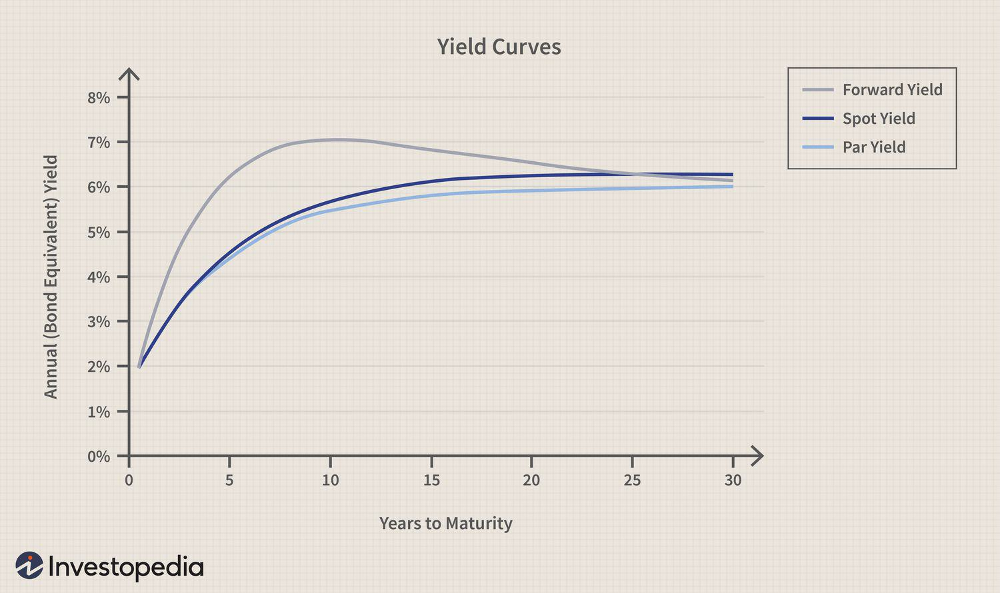

The bond market serves as a fundamental component of the global financial system, facilitating capital allocation and economic growth while providing a wide range of investment opportunities for individuals and institutions alike. A critical aspect of this market lies in the determination of interest rates, where bond yields play a central role. Bond yields, derived from various types of bonds including government, municipal, and corporate bonds, not only indicate the return an investor can expect but also influence interest rates, investment decisions, and economic policies.

Understanding the dynamics of bond yield curves, particularly par yield curves and spot yield curves, is essential for both investors and traders. These curves serve as graphical representations of yields across different maturities, offering insights into market expectations for future interest rates, economic conditions, and inflation. Par yield curves specifically reflect the yields of hypothetical securities priced at par, serving as a benchmark for evaluating other fixed-income securities. Conversely, the spot yield curve, or zero-coupon yield curve, highlights yields of zero-coupon bonds, aiding in the understanding of the term structure of interest rates.



The knowledge of these yield curves is especially crucial in the context of algorithmic trading, a method that utilizes computational algorithms to execute trades at optimal times and prices based on predefined criteria. Algorithmic traders leverage yield curves to develop trading strategies that anticipate market movements and interest rate changes. By analyzing the patterns and shifts in yield curves, traders can make more informed decisions, potentially enhancing trading performance and risk management.

This article will explore the fundamentals of bond yields and the significance of different yield curves, examining their applications in algorithmic trading. Through this exploration, readers will gain an understanding of how mastering these elements can lead to better investment strategies and financial decision-making.

## Table of Contents

## Understanding Bond Yields

Bond yields represent the income an investor can expect from holding a bond, expressed as a percentage of its purchase price. At their core, bond yields are essential indicators of a bond’s performance and the associated risk. Several key yield types are instrumental in understanding the overall landscape of bond investments, including current yield, yield to maturity (YTM), and yield to call.

### Current Yield
The current yield is a simple measure that calculates the annual income (coupon) generated by a bond relative to its current market price. It is given by the formula:

$$

\text{Current Yield} = \frac{\text{Annual Coupon Payment}}{\text{Current Market Price of the Bond}} 
$$

This yield type is often used for evaluating the bond's income potential in the short term. However, it does not account for any capital gains or losses that might be realized if the bond is sold for more or less than its purchase price.

### Yield to Maturity (YTM)
Yield to Maturity is a more comprehensive measure that reflects the total return anticipated on a bond if it is held until it matures. YTM considers the bond's current market price, its par value, the coupon interest payments, and the time remaining until maturity. Calculating YTM often involves solving the following equation, where $P$ is the current price of the bond, $C$ is the coupon payment, $F$ is the face value, $n$ is the total number of periods, and $r$ is the YTM rate:

$$
P = \sum_{t=1}^{n} \frac{C}{(1+r)^t} + \frac{F}{(1+r)^n}
$$

This equation typically requires iterative methods or financial calculators to solve, as it involves finding the value of $r$ that equates the present value of all future cash flows to the bond's current market price.

### Yield to Call
Another variant, yield to call, applies to callable bonds—those that can be redeemed by the issuer before their maturity date at a specified call price. Yield to call is calculated similarly to YTM but assumes that the bond will be called at the earliest call date. Here, the present value computations are adjusted to account for the call price and the shorter time horizon:

$$
P = \sum_{t=1}^{\text{call date}} \frac{C}{(1+r)^t} + \frac{\text{Call Price}}{(1+r)^{\text{call date}}}
$$

Yield to call is particularly important for investors considering bonds in an environment where interest rates might fall, making it beneficial for issuers to refinance their debt at lower rates.

### Conclusion
Thorough comprehension of these various bond yields is crucial for investors, as they each provide different insights into the potential income, growth, and risk associated with bond investments. Assessing these yields aids investors in making informed decisions and optimizing their fixed-income portfolios for both current income and future capital appreciation.

## The Par Yield Curve: Definition and Importance

The par yield curve is an important tool in the bond market, representing the yields of hypothetical Treasury securities that are priced at par value. This curve is computed with the assumption that each bond's price is equal to its face value. Consequently, the coupon rate of these hypothetical bonds corresponds directly to their yield to maturity, providing a clear and straightforward benchmark for evaluating other fixed-income securities.

The par yield curve serves several crucial functions in financial markets. It is widely used for benchmarking purposes, assisting investors in evaluating the relative value of other securities. By providing a standard yield level, it offers a reference point from which other bond yields are compared, which is vital for assessing expected returns on a variety of bond investments.

Another significant role of the par yield curve is in the calibration of fixed-income models and evaluations of bond pricing. Investors frequently rely on this curve to gauge expected bond performance against a standard measure. For instance, if a corporate bond's yield is significantly higher than the par yield for a Treasury security of equivalent maturity, it may suggest the bond is undervalued or carries higher risk.

Overall, the par yield curve's importance lies in its function as a benchmark for both assessing the attractiveness of bond investments and aiding in the determination of pricing and risk evaluation strategies for fixed-income portfolios. Understanding and employing the par yield curve assists investors in making informed decisions in their engagements with the bond market.

## Spot Yield Curve: Definition and Significance

The spot yield curve, commonly referred to as the zero-coupon yield curve, is a graphical representation that depicts the yields of zero-coupon bonds across various maturities. Unlike bonds that pay periodic coupons, zero-coupon bonds do not provide interim interest payments. Instead, they are sold at a discount to face value and provide a return at maturity. This unique nature makes spot yield curves essential for understanding the term structure of interest rates and the time value of money.

The curve operates by plotting the yield to maturity of these bonds against their respective maturities. The yields derived from this curve are essentially the pure interest rates that financial markets offer at different time periods. This attribute is crucial for evaluating the fair value of future cash flows and pricing complex financial instruments.

In practical applications, spot yield curves are instrumental in deriving forward rates, which are the implied future interest rates between two time periods. The relationship between spot rates ($S_t$) and forward rates ($f_{t,t+1}$) can be expressed mathematically as follows:

$$
(1 + S_t)^t = (1 + S_{t-1})^{t-1} \times (1 + f_{t-1,t})
$$

Understanding the spot yield curve enables investors to determine risk-free discount rates, essential for accurately pricing bonds. It is also pivotal in assessing bond risks, particularly in identifying embedded options such as call or put provisions that might render conventional yield measures like yield to maturity insufficient.

Moreover, the shape of the spot yield curve provides insights into market expectations regarding [interest rate](/wiki/interest-rate-trading-strategies) changes and economic conditions. An upward-sloping curve often indicates expectations of rising interest rates and economic expansion, while an inverted curve might suggest an anticipated downturn.

In conclusion, mastering the intricacies of the spot yield curve allows investors and analysts to make informed decisions, optimizing their pricing strategies and effectively managing portfolio risks.

## Deriving Yield Curves Using Bootstrapping

Bootstrapping is a quantitative method employed to construct a zero-coupon yield curve, which is crucial for understanding the term structure of interest rates. This technique involves deriving the zero-coupon rates from the observed prices and yields of coupon-bearing bonds. The fundamental principle underlying bootstrapping is to sequentially solve for the zero-coupon or spot rates, starting from the shortest maturities and progressing to longer ones. This ensures that each consecutive spot rate is derived using the data points of previously calculated shorter maturities.

To illustrate the bootstrapping process, consider a scenario with a set of coupon bonds with different maturities and known market prices. Each bond pays a series of fixed annual coupons and a face value at maturity. The objective is to extract zero-coupon rates that would allow discounting these cash flows back to the present value, precisely matching the given market prices of these bonds.

The process begins with the shortest maturity bond, often a one-year bond. For this bond, which effectively acts like a zero-coupon bond, the spot rate can be directly computed from its yield. For the subsequent maturities, the bootstrapping formula calculates the spot rate by setting the present value of the bond’s cash flows (cash inflows are discounted at the spot rates) equal to its market price.

For a bond with a face value (FV), coupon (C), and price (P) maturing in $n$ periods, the equation is:

$$
P = \frac{C}{(1 + z_1)} + \frac{C}{(1 + z_2)^2} + \cdots + \frac{C + FV}{(1 + z_n)^n}
$$

Where:

- $z_1, z_2, \ldots, z_n$ represent the spot rates for periods 1 to $n$.

The spot rate for the nth period is derived by solving this equation after substituting the known spot rates for earlier periods.

Here is a simple Python function that employs bootstrapping to find zero-coupon rates:

```python
def bootstrap(coupons, prices, maturities):
    """Calculate zero-coupon rates using the bootstrapping method.

    Parameters:
        coupons: List of annual coupon payments
        prices: List of bond prices
        maturities: List of maturities (in years) for each bond

    Returns:
        List of zero-coupon rates for each maturity
    """
    spot_rates = []

    for i in range(len(prices)):
        price = prices[i]
        maturity = maturities[i]
        coupon = coupons[i]

        cash_flows = [coupon] * (maturity - 1) + [coupon + 100]

        sum_terms = sum([cash_flows[j] / (1 + spot_rates[j]) ** (j + 1) for j in range(i)])

        z = ((cash_flows[-1] / (price - sum_terms)) ** (1 / maturity)) - 1
        spot_rates.append(z)

    return spot_rates

# Example usage:
coupons = [5, 5, 5, 5]
prices = [99, 98, 97, 95]
maturities = [1, 2, 3, 4]

spot_rates = bootstrap(coupons, prices, maturities)
print(spot_rates)
```

Through bootstrapping, investors and traders can derive a zero-coupon yield curve that provides crucial insights into the future path of interest rates. This allows for better pricing of securities, identification of [arbitrage](/wiki/arbitrage) opportunities, and more informed portfolio management decisions. Moreover, having an accurate yield curve is essential for assessing bond risks and developing strategies that hinge on yield curve dynamics.

## Algorithmic Trading with Yield Curves

Algorithmic trading leverages computational algorithms to execute trades based on pre-determined criteria derived from mathematical models and extensive historical data analysis. Yield curves, which graphically depict the relationship between interest rates and the maturity of debt securities, are fundamental elements in these models due to their capacity to encapsulate expectations about future interest rates and economic conditions.

Yield curves are essential as they provide pivotal signals for determining the optimal timing and selection of trades. These curves, through their various forms such as the par yield curve and the spot yield curve, offer distinct insights into market perceptions and potential future interest rate movements. For instance, a rising yield curve typically signals expectations of increasing interest rates, which might inform strategies like anticipating drops in bond prices or shifts in fixed income allocations.

Mathematically, yield curves help in forecasting interest rate changes and assessing the time value of money, which are crucial for calculating the present value of future cash flows from bonds. The relation between bond yields and prices is inversely proportional; thus, an understanding of yield movements is vital for predicting price variations and executing timely trades.

For instance, [algorithmic trading](/wiki/algorithmic-trading) strategies might involve the use of the yield spread, which is the difference in yield between two bonds, to capture arbitrage opportunities. A Python implementation to calculate yield spreads might look like this:

```python
def calculate_yield_spread(yield_bond_a, yield_bond_b):
    return yield_bond_a - yield_bond_b

# Example usage
bond_a_yield = 0.05  # 5%
bond_b_yield = 0.03  # 3%
spread = calculate_yield_spread(bond_a_yield, bond_b_yield)
print(f"Yield spread is {spread * 100:.2f} basis points")
```

Algorithmic traders utilize these yield movements, alongside historical data, to optimize trading strategies. By simulating scenarios based on historical yield curve shifts, traders can tailor strategies to capitalize on anticipated changes in interest rates and macroeconomic conditions. In addition, [machine learning](/wiki/machine-learning) models can be trained on yield curve data to provide predictive insights, enhancing the accuracy and efficiency of trading decisions.

Moreover, yield curves serve as benchmarks for measuring portfolio performance and risk management. Strategies might involve hedging interest rate risks by aligning the portfolio's sensitivity to yield movements, thus ensuring a balanced risk-return profile.

In conclusion, an adept understanding of yield curves significantly enhances the efficacy of algorithmic trading strategies. By integrating yield curve insights with algorithmic execution, traders can achieve a competitive edge within financial markets.

## Applications in Trading and Portfolio Management

Yield curves are fundamental tools in the pricing, valuation, and risk management of bond portfolios. They offer insights into interest rate movements and expected future fluctuations, guiding traders and portfolio managers in their decision-making processes. Traders utilize yield curves to pinpoint arbitrage opportunities by comparing the current market prices of bonds to the theoretical prices suggested by the yield curve. For instance, if a discrepancy is noted between the actual yield of a bond and the yield implied by the curve, it indicates a potential arbitrage opportunity.

Moreover, yield curves play a pivotal role in managing interest rate risk. By examining the slope and shape of the yield curve, traders can infer market expectations regarding future interest rate changes. An upward-sloping curve suggests that rates are expected to rise, prompting strategies that protect against increasing rates, such as shortening the duration of bond holdings. Conversely, a downward-sloping curve indicates anticipated rate declines, potentially encouraging a shift to longer-term bonds to lock in higher rates.

For portfolio managers, yield curves are essential in the construction of diversified portfolios. They utilize information from the yield curves to adjust their investment strategies, tailoring them to optimize returns while minimizing risks. For example, shifts in the yield curve could prompt rebalancing of the portfolio to align with predicted economic conditions. Managers may also employ techniques like immunization to ensure that the portfolio’s duration matches the investment horizon, mitigating the impact of interest rate fluctuations.

Python, with libraries such as NumPy and SciPy, is frequently used to model and analyze yield curves. For example, bootstrapping techniques can be implemented to derive zero-coupon yield curves from existing market data, enhancing the accuracy of bond pricing models. This form of mathematical modeling is vital in developing strategies that capitalize on yield curve movements.

```python
import numpy as np
from scipy.optimize import fsolve

def bootstrap(cash_flows, market_prices):
    """
    Calculates spot rates using bootstrapping.

    :param cash_flows: List of cash flows (coupons + face value) for bonds.
    :param market_prices: List of market prices for these bonds.
    :return: List of derived spot rates.
    """
    spot_rates = []
    for i, cash_flow in enumerate(cash_flows):
        def equation(spot_rate):
            return np.sum([cf / ((1 + spot_rate) ** (j + 1)) for j, cf in enumerate(cash_flow)]) - market_prices[i]

        spot_rate = fsolve(equation, 0.05)[0]
        spot_rates.append(spot_rate)
    return spot_rates

# Example cash flows and market prices
bond_cash_flows = [[5, 5, 105], [6, 106]]  # Simplified example cash flows
bond_market_prices = [100, 102]  # Market prices for the bonds

spot_rates = bootstrap(bond_cash_flows, bond_market_prices)
print("Calculated Spot Rates:", spot_rates)
```

This Python function demonstrates a straightforward approach to deriving spot rates through bootstrapping, fostering accurate and effective portfolio management and trading decisions based on precise yield curve analytics. Understanding and leveraging yield curves allow traders and managers to navigate bond markets with greater precision, harnessing predictive insights to enhance performance and manage risks effectively.

## Conclusion

Grasping the intricacies of bond yield curves is crucial for investors, traders, and financial analysts. Yield curves, whether par or spot, provide essential information for navigating financial markets, making them indispensable tools in benchmarking, trading, and risk management. They offer insights into interest rate expectations and the economic outlook, facilitating informed decision-making.

Yield curves are pivotal in algorithmic trading, which relies on sophisticated mathematical models to execute trades efficiently. For instance, Python libraries like NumPy and pandas are extensively used to analyze yield curve data. Understanding how yield curves affect bond pricing and market dynamics allows traders to develop strategies that capitalize on yield movements and anticipate interest rate changes.

The accurate interpretation and application of yield curves can significantly enhance trading outcomes. For example, by identifying shifts in the yield curve, traders can pinpoint arbitrage opportunities and optimize portfolio allocations. Yield curves also enable effective interest rate risk management, allowing portfolio managers to adjust their strategies to hedge against potential market fluctuations.

As algorithmic trading grows in prominence, mastering yield curve usage will be of increasing importance. The ability to decode yield curves will empower financial professionals to stay competitive, optimize returns, and mitigate risks in a rapidly evolving market landscape. Thus, developing a solid understanding of yield curves is not only beneficial but essential for those engaged in the financial sector.

## References & Further Reading

[1]: Fabozzi, F. J. (Ed.). (2007). ["Fixed Income Analysis"](https://books.google.com/books/about/Fixed_Income_Analysis.html?id=lujLawVLS3YC). John Wiley & Sons.

[2]: Hull, J. C. (2021). ["Options, Futures, and Other Derivatives"](https://elibrary.pearson.de/book/99.150005/9781292410623) (11th ed.). Pearson.

[3]: Mishkin, F. S. (2019). ["The Economics of Money, Banking, and Financial Markets"](https://www.pearsonhighered.com/assets/preface/0/1/3/4/0134855388.pdf) (12th ed.). Pearson.

[4]: ["Quantitative Finance for Dummies"](https://www.amazon.com/Quantitative-Finance-Dummies-Steve-DPhil/dp/1118769465) by Steve Bell

[5]: ["The Handbook of Fixed Income Securities"](https://www.amazon.com/Handbook-Fixed-Income-Securities-Ninth/dp/1260473899) by Frank J. Fabozzi