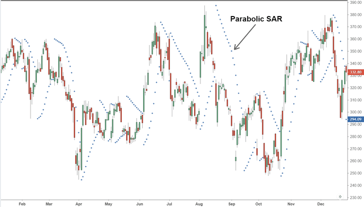

## Table of Contents

## What is the Parabolic SAR indicator?

The Parabolic SAR indicator is a tool used in trading to help people decide when to buy or sell assets like stocks or currencies. It looks like a series of dots on a chart, and it helps show the direction of the price movement. When the dots are below the price, it suggests that the price might keep going up, which could be a good time to buy. If the dots are above the price, it suggests that the price might go down, which could be a good time to sell.

This indicator was created by a man named J. Welles Wilder Jr., who also made other tools for traders. The Parabolic SAR helps traders by giving them clear signals about when to enter or exit a trade. However, it's not perfect and should be used along with other tools to make better decisions. It works best in markets that have a clear trend, either up or down, and might not be as helpful in markets that are moving sideways.

## Who developed the Parabolic SAR indicator and when?

The Parabolic SAR indicator was developed by J. Welles Wilder Jr. He is a famous person in the world of trading because he created many useful tools for traders. Wilder introduced the Parabolic SAR in his book called "New Concepts in Technical Trading Systems," which he published in 1978.

The Parabolic SAR is a simple tool that helps traders see if a price might go up or down. It uses dots on a chart to show this. When the dots are below the price, it might be a good time to buy. When the dots are above the price, it might be a good time to sell. Traders like this tool because it gives clear signals, but it works best when the market is moving in a clear direction, either up or down.

## What does SAR stand for in Parabolic SAR?

In Parabolic SAR, SAR stands for "Stop and Reverse." This name tells us what the indicator does. It helps traders know when to stop their current trade and start a new one in the opposite direction.

The Parabolic SAR was made by J. Welles Wilder Jr. He put it in his book in 1978. Traders use it to see if they should buy or sell. When the dots are below the price, it might be a good time to buy. When the dots are above the price, it might be a good time to sell.

## How is the Parabolic SAR calculated?

The Parabolic SAR is calculated using a formula that involves the price of the asset, the acceleration factor, and the previous SAR value. The acceleration factor starts at a small number, usually 0.02, and it can increase up to a maximum, often set at 0.20. Each time the price hits a new high or low, the acceleration factor goes up by a small amount, like 0.02. This makes the SAR dots move closer to the price, showing that the trend might be getting stronger.

To find the new SAR value, you take the previous SAR and add or subtract the difference between the previous SAR and the extreme point (the highest high or lowest low since the last reversal) multiplied by the acceleration factor. If the price is going up, you subtract this value from the previous SAR. If the price is going down, you add it. When the SAR value touches or crosses the price, it's time to reverse the trend, and the SAR becomes the new extreme point. This way, the Parabolic SAR helps traders see when a trend might change direction.

## What are the key components of the Parabolic SAR formula?

The Parabolic SAR formula has three main parts: the price of the asset, the acceleration factor, and the previous SAR value. The acceleration factor starts small, usually at 0.02, and can grow to a maximum of 0.20. Each time the price reaches a new high or low, the acceleration factor increases by a small amount, like 0.02. This makes the SAR dots move closer to the price, showing that the trend might be getting stronger.

To calculate the new SAR value, you use the previous SAR and the difference between it and the extreme point, which is the highest high or lowest low since the last reversal. This difference is then multiplied by the acceleration factor. If the price is going up, you subtract this value from the previous SAR. If the price is going down, you add it. When the SAR value touches or crosses the price, it's a sign to reverse the trend, and the SAR becomes the new extreme point. This helps traders see when a trend might change direction.

## How does the Parabolic SAR appear on a price chart?

The Parabolic SAR appears on a price chart as a series of dots. These dots are placed either above or below the price line, depending on the direction of the trend. When the price is going up, the dots will be below the price line. This tells traders that it might be a good time to buy. When the price is going down, the dots will be above the price line. This tells traders that it might be a good time to sell.

As the trend continues, the dots move closer to the price line. This happens because of something called the acceleration factor, which makes the dots get closer with each new high or low in the price. When the dots switch from being below the price to above it, or vice versa, it's a signal that the trend might be changing direction. This helps traders decide when to stop their current trade and start a new one in the opposite direction.

## What do the dots of the Parabolic SAR indicate?

The dots of the Parabolic SAR show traders the direction of the price trend. When the dots are below the price, it means the price is going up, and it might be a good time to buy. When the dots are above the price, it means the price is going down, and it might be a good time to sell. These dots help traders see if they should keep their current trade or change to the opposite direction.

As the price keeps going up or down, the dots get closer to the price line. This happens because of something called the acceleration factor, which makes the dots move closer with each new high or low in the price. When the dots switch from being below the price to above it, or the other way around, it's a sign that the trend might be changing. This helps traders decide when to stop their current trade and start a new one in the opposite direction.

## How can the Parabolic SAR be used to determine entry and exit points in trading?

The Parabolic SAR helps traders know when to buy or sell by showing dots on a price chart. When the dots are below the price, it means the price is going up, and this could be a good time to buy. Traders might enter a long position, hoping the price will keep going up. If the dots switch from being below the price to above it, it's a sign that the trend might be changing. This is when traders might think about selling to take their profits or cut their losses.

When the dots are above the price, it means the price is going down, and this could be a good time to sell. Traders might enter a short position, hoping the price will keep going down. If the dots switch from being above the price to below it, it's a sign that the trend might be changing again. This is when traders might think about buying back to close their short position or start a new long position. The Parabolic SAR helps traders by giving clear signals about when to enter or exit a trade, but it works best when used with other tools to make better decisions.

## What are the advantages of using the Parabolic SAR in trading strategies?

The Parabolic SAR is a helpful tool for traders because it gives clear signals about when to buy or sell. When the dots are below the price, it tells traders that the price might keep going up, which could be a good time to buy. When the dots are above the price, it means the price might go down, which could be a good time to sell. This makes it easier for traders to know when to enter or exit a trade without having to guess as much. It's especially useful in markets that are moving in a clear direction, either up or down.

Another advantage of the Parabolic SAR is that it helps traders manage their trades. The dots moving closer to the price as the trend continues can show traders how strong the trend is. If the trend is strong, the dots get closer faster, which can help traders feel more confident in their trades. Also, when the dots switch from being below the price to above it, or the other way around, it gives a clear signal to stop the current trade and start a new one in the opposite direction. This can help traders make quick decisions and possibly make more money or lose less.

## What are the limitations or potential drawbacks of using the Parabolic SAR?

The Parabolic SAR works best when the market is moving in a clear direction, either up or down. But if the market is moving sideways, the Parabolic SAR can give false signals. This means it might tell you to buy or sell when the price isn't really going anywhere. This can lead to traders making bad choices and losing money. Also, the Parabolic SAR can be slow to react to quick changes in the market. If the price suddenly changes direction, the Parabolic SAR might not give you a signal fast enough, and you could miss out on a good trade.

Another problem with the Parabolic SAR is that it can lead to too many trades. Because it gives a signal to reverse every time the dots cross the price, traders might keep buying and selling too often. This can add up to a lot of trading costs, like fees and taxes, which can eat into any profits. To make better decisions, traders should use the Parabolic SAR along with other tools, like trend lines or other indicators. This way, they can get a fuller picture of what's happening in the market and make smarter trades.

## How can the Parabolic SAR be combined with other technical indicators for more effective trading strategies?

The Parabolic SAR can be combined with other technical indicators to create more effective trading strategies. One common way is to use it with the Moving Average Convergence Divergence (MACD). The Parabolic SAR helps traders know when to enter or exit a trade by showing dots above or below the price. The MACD, on the other hand, shows if the trend is strong or weak and if it might change soon. By using both together, traders can get a better idea of the market's direction. For example, if the Parabolic SAR suggests buying and the MACD shows a strong upward trend, it can give traders more confidence in their decision to buy.

Another useful combination is the Parabolic SAR with the Relative Strength Index (RSI). The RSI measures how fast the price is moving and if it's overbought or oversold. When the Parabolic SAR signals a buy and the RSI is not in the overbought zone, it can be a good time to enter a trade. On the other hand, if the Parabolic SAR signals a sell and the RSI is in the oversold zone, it might be a good time to exit a trade. This combination helps traders avoid entering trades when the market might be about to reverse, making their strategies more effective and helping them make better trading decisions.

## Can you provide examples of successful trading strategies that incorporate the Parabolic SAR?

One successful trading strategy that uses the Parabolic SAR is combining it with the Moving Average Convergence Divergence (MACD). When the Parabolic SAR dots are below the price, it's a signal to buy. But to make sure it's a good time, traders also look at the MACD. If the MACD line crosses above the signal line and the histogram bars are getting bigger, it means the upward trend is strong. This gives traders more confidence to buy. They can then hold the trade until the Parabolic SAR dots switch to above the price, which is a signal to sell. Using both indicators together helps traders avoid false signals and make better trades.

Another good strategy is using the Parabolic SAR with the Relative Strength Index (RSI). When the Parabolic SAR dots are below the price and the RSI is below 70 (not overbought), it can be a good time to buy. Traders can stay in the trade as long as the Parabolic SAR dots stay below the price. If the Parabolic SAR dots move above the price and the RSI is above 30 (not oversold), it's a signal to sell. This strategy helps traders enter trades when the market is not overbought and exit when it's not oversold, which can lead to more successful trades.

## What is Understanding Parabolic SAR?

The Parabolic SAR (Stop and Reverse) is a technical analysis tool widely used among traders to analyze market trends and forecast future price movements. Developed by J. Welles Wilder Jr., a prominent figure in the trading community, Parabolic SAR was introduced in his 1978 book, "New Concepts in Technical Trading Systems". The tool’s primary purpose is to identify potential reversals in the price direction of traded assets by generating trailing stop levels.

Parabolic SAR operates on a straightforward principle: it plots a series of dots above or below the price of an asset. These dots, known as SAR dots, represent potential points of trend reversal. When the trend is upward, the SAR dots appear below the price chart. Conversely, when indicating a downward trend, the dots are plotted above it. This visual representation helps traders understand the current market direction and assists in making informed trading decisions.

The calculation of Parabolic SAR involves several components: Prior SAR (PSAR), Extreme Point (EP), and an acceleration [factor](/wiki/factor-investing) (AF). The basic formula for upward trends can be described as:

$$
\text{SAR}_{\text{new}} = \text{SAR}_{\text{old}} + \left( \text{AF} \times (\text{EP} - \text{SAR}_{\text{old}}) \right)
$$

For a downward trend, the calculation is reversed. The AF begins with a predetermined value and is incrementally increased each time the EP makes a new high (or new low, depending on the trend), typically to a maximum set value.

Parabolic SAR is effective in trending markets where clear price directions facilitate the tool’s predictive abilities. One of its major advantages is its simplicity and ease of use for determining entry and [exit](/wiki/exit-strategy) points. However, it may yield false signals in volatile or sideways markets. Therefore, it is often recommended to use Parabolic SAR alongside other indicators to enhance decision-making accuracy.

In essence, Parabolic SAR serves as an intuitive method for traders to visualize potential trend reversals and effectively manage trades, enhancing their overall strategy. Its integration into trading systems can be highly beneficial, providing timely alerts for market entry and exit based on quantifiable trends.

## What are the challenges and limitations?

Parabolic SAR (Stop and Reverse) is a popular technical analysis indicator used to identify potential entry and exit points in trading. While it has its benefits, there are significant challenges and limitations traders must be aware of when relying on this indicator.

One of the primary risk factors associated with Parabolic SAR-based strategies is the indicator's performance in certain market conditions. Parabolic SAR can be less reliable during volatile and range-bound markets. In trending markets, the Parabolic SAR performs well by signaling when to buy or sell effectively, but in a range-bound market, the frequent shifting of signals can lead to "whipsaws." This is where the indicator gives false signals due to the oscillating nature of the price within a confined range.

In volatile markets, the indicator may react too quickly to price changes, leading to premature signals. The formula that defines Parabolic SAR is:

$$
\text{SAR}_{\text{new}} = \text{SAR}_{\text{current}} + \alpha (\text{EP} - \text{SAR}_{\text{current}})
$$

where $\alpha$ is the acceleration factor and EP is the extreme point in the current trend (either the highest high or the lowest low). In volatile markets, the rapid price changes can cause the SAR to flip direction frequently, resulting in incorrect entries and exits.

To overcome these challenges, traders can tweak algorithm parameters such as the acceleration factor $\alpha$. Adjusting $\alpha$ allows the SAR to become more or less sensitive to price movements, depending on market conditions. A higher acceleration factor will result in faster signal changes, which may be preferable in strong trends, while a lower factor might be beneficial in choppy markets to avoid frequent whipsaws.

Moreover, combining Parabolic SAR with other indicators can enhance its reliability. For instance, using it alongside moving averages or the Relative Strength Index (RSI) can provide additional context and reduce false signals. A Python snippet below demonstrates how to integrate Parabolic SAR with a simple moving average:

```python
import pandas as pd

# Assume df is a DataFrame with columns 'High', 'Low', and 'Close'
df['SMA'] = df['Close'].rolling(window=30).mean()

def parabolic_sar(high, low, af=0.02, af_max=0.2):
    trend = long = True
    sar = low[0]
    ep = high[0]
    af_ = af
    sar_out = [sar]

    for i in range(1, len(high)):
        if trend:
            sar = sar + af_ * (ep - sar)
            if low[i] < sar:
                trend = False
                sar = ep
                af_ = af
            else:
                if high[i] > ep:
                    ep = high[i]
                    af_ = min(af_ + af, af_max)

        else:
            sar = sar + af_ * (ep - sar)
            if high[i] > sar:
                trend = True
                sar = ep
                af_ = af
            else:
                if low[i] < ep:
                    ep = low[i]
                    af_ = min(af_ + af, af_max)

        sar_out.append(sar)
    return sar_out

df['SAR'] = parabolic_sar(df['High'], df['Low'])
```

Real-world examples of limitations often include periods of high market noise, where the Parabolic SAR's simplistic logic struggles to capture complex price dynamics. For instance, during a sideways market with frequent but small fluctuations, the SAR may issue multiple buy and sell signals in quick succession, thereby increasing transaction costs without corresponding gains in profitability.

In conclusion, while the Parabolic SAR is a valuable tool, it requires careful parameter adjustment and possibly the support of additional indicators to mitigate its limitations. Traders must be cautious and adaptable, continually monitoring performance to refine their strategies effectively.

## References & Further Reading

[1]: Wilder, J. W. (1978). ["New Concepts in Technical Trading Systems."](https://archive.org/details/newconceptsintec00wild) Trend Research.

[2]: Aronson, D. R. (2007). ["Evidence-Based Technical Analysis: Applying the Scientific Method and Statistical Inference to Trading Signals."](https://onlinelibrary.wiley.com/doi/book/10.1002/9781118268315) Wiley.

[3]: Jansen, S. (2020). ["Machine Learning for Algorithmic Trading: Predictive models to extract signals from market and alternative data for systematic trading strategies."](https://www.amazon.com/Machine-Learning-Algorithmic-Trading-alternative/dp/1839217715) Packt Publishing.

[4]: Chan, E. P. (2009). ["Quantitative Trading: How to Build Your Own Algorithmic Trading Business."](https://github.com/ftvision/quant_trading_echan_book) Wiley Trading.

[5]: Lopez de Prado, M. (2018). ["Advances in Financial Machine Learning."](https://www.amazon.com/Advances-Financial-Machine-Learning-Marcos/dp/1119482089) Wiley.