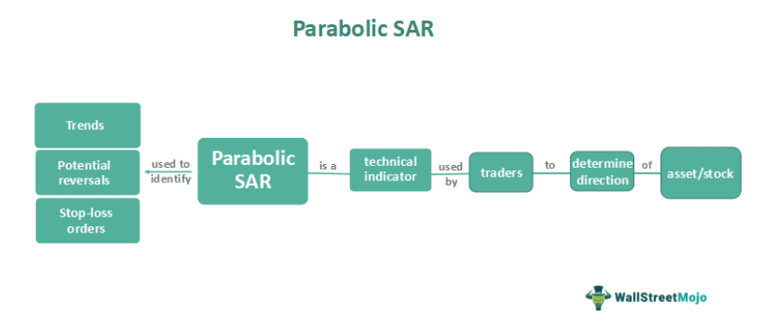

In technical analysis, the Parabolic SAR is a pivotal tool for traders. Developed by J. Welles Wilder Jr., this indicator helps identify trend direction and potential reversals in the price movement of assets. The Parabolic SAR is represented by a series of dots on a price chart, strategically positioned above or below the current asset price. These dots serve as signals for potential entry and exit points, making the indicator especially useful for traders seeking to optimize their strategies.

The appearance of dots above the asset price usually indicates a bearish trend, suggesting that it may be time to sell or short the asset. Conversely, dots positioned below the asset price signal a bullish trend, implying that buying or holding the asset could be advantageous. This dynamic tool provides traders with continuous updates, offering insights into the ongoing market conditions.



By understanding the fundamentals of the Parabolic SAR, traders can effectively incorporate it into algorithmic trading strategies. This article will further explore its application and best practices, illustrating how the Parabolic SAR can enhance decision-making processes and improve trading outcomes. Through a detailed examination of this indicator, traders can harness its potential to navigate complex market environments and make informed trading decisions.

## Table of Contents

## Understanding the Parabolic SAR Indicator

The Parabolic SAR, abbreviated as "stop and reverse," is a technical analysis tool developed by J. Welles Wilder Jr. in 1978. Its primary function is to identify the direction of an asset's price movement and potential reversals. The indicator achieves this through a method known as trailing stop and reverse. This approach aids traders in determining when to enter or exit a trade based on trends. The Parabolic SAR is visually represented on price charts as a series of dots positioned either above or below the price bars. When the market is bearish, the dots appear above the price bars, while they are below during bullish markets.

One key feature of the Parabolic SAR is its mechanical nature, which provides continuous signals. These signals are derived from the constant positioning of the dots relative to the price bars. Traders use this continuous mechanic to anticipate potential changes in market direction. By design, the indicator helps traders identify crucial entry and exit points. The computation of the Parabolic SAR involves an iterative calculation process. In essence, the SAR for the current period depends on the previous period's SAR, the extreme price (EP), and an acceleration factor (AF), as represented by the formula:

$$
SAR_{t+1} = SAR_t + AF \times (EP - SAR_t)
$$

Here, the acceleration [factor](/wiki/factor-investing) (AF) starts at a base value and increases incrementally based on market conditions and extreme prices, ensuring that the SAR constantly adapts to market fluctuations.

The Parabolic SAR indicator's simplicity and ability to automate signals make it a practical tool in both manual and [algorithmic trading](/wiki/algorithmic-trading) strategies. Its straightforward computation allows for easy integration into trading software, enabling traders to harness its trend-following capabilities.

## Benefits and Drawbacks of the Parabolic SAR

The Parabolic SAR (Stop and Reverse) stands as a widely-used indicator in technical analysis, providing traders with simple visual cues for identifying trend reversals and directions. One of its notable benefits lies in its straightforward approach—it plots dots directly on the price chart to signal potential buy or sell opportunities. When the dots are below the price, it suggests a bullish trend; conversely, dots above the price indicate a bearish trend. This design enables traders to quickly assess market conditions and make informed decisions.

Despite its simplicity and ease of use, the Parabolic SAR is not without limitations. A significant drawback is its tendency to generate false signals during choppy or sideways markets. Since it is fundamentally a trend-following tool, it performs best in trending markets where the direction is clear. However, in volatile or range-bound conditions, the indicator may flip frequently, leading to premature exits or entries that can result in losses.

Additionally, the Parabolic SAR can lag behind price movements. This lag is a consequence of its mathematical structure, which involves a moving factor—the acceleration factor. While this feature allows the indicator to adapt as trends mature, it also means that traders might miss the earliest parts of a movement, potentially reducing profit margins. The formula for the Parabolic SAR is typically expressed as:

$$
SAR_{n+1} = SAR_{n} + AF \times (EP - SAR_{n})
$$

where:
- $SAR_{n+1}$ is the next period’s SAR value,
- $AF$ is the acceleration factor, starting at 0.02 and increasing by 0.02 up to a maximum of 0.2 as the trend continues,
- $EP$ is the extreme point in the current trend (i.e., the highest or lowest price reached).

Adjusting the acceleration factor can help tailor the sensitivity of the Parabolic SAR to better suit specific commodities or asset classes, yet finding the optimal settings requires historical testing and experience.

In essence, while the Parabolic SAR is an efficient tool for identifying trends, traders should be cautious and consider complementing it with other indicators to enhance accuracy and optimize trade strategies.

## Complementary Indicators for Parabolic SAR

Relying solely on the Parabolic SAR may lead to suboptimal trade results due to its tendency to generate false signals in sideways markets. To enhance its efficacy, it is often combined with other technical indicators. One popular combination is the use of the Parabolic SAR with moving averages. Moving averages, particularly the long-term ones, help smooth out price data to identify the direction of the trend. When paired with the Parabolic SAR, they can provide stronger buy or sell signals by confirming the longer-term trend direction. For example, a buy signal might be considered more reliable if the price is above a long-term moving average and the Parabolic SAR switches from above to below the price.

In addition to moving averages, traders often use the stochastic oscillator alongside the Parabolic SAR. The stochastic oscillator measures the [momentum](/wiki/momentum) of price and indicates overbought or oversold conditions. By confirming Parabolic SAR signals with the stochastic oscillator, traders can filter out false entries and focus on trades with higher potential.

Another effective complementary tool is the Average Directional Index (ADX). The ADX is used to quantify trend strength. A strong trend indicated by a high ADX value can confirm the signals generated by the Parabolic SAR. Conversely, a low ADX suggests a weak trend or a sideways market, where Parabolic SAR signals are less reliable.

Using these indicators in conjunction with the Parabolic SAR can improve the overall accuracy of trading decisions. For instance, the integration of these tools can be automated in Python using libraries like TA-Lib. Here's a basic example of implementing this strategy:

```python
import talib
import numpy as np

# Assume 'close_prices' is a numpy array of closing prices
sar = talib.SAR(high, low, acceleration=0.02, maximum=0.2)
sma = talib.SMA(close_prices, timeperiod=50)
stoch_k, stoch_d = talib.STOCH(high, low, close_prices)
adx = talib.ADX(high, low, close_prices)

# Example logic: Buy signal where SAR is below price, price above SMA, and ADX indicates a strong trend
buy_signals = np.where((close_prices > sma) & (sar < close_prices) & (adx > 25) & (stoch_k < 20))
```

This blend of indicators provides a robust framework for making trading decisions. By confirming signals across multiple tools, traders can effectively reduce the risk of false entries and capitalize on more reliable market movements.

## Implementing Parabolic SAR in Algorithmic Trading

Algorithmic traders often value the Parabolic SAR due to its straightforward calculation and the unbiased nature of its signals. This makes it an ideal candidate for inclusion in automated trading strategies. One of the primary advantages of using the Parabolic SAR in algorithmic trading is that it offers systematic buy and sell signals without the ambiguity that can often plague more complex indicators. 

When implementing the Parabolic SAR in algorithmic trading, traders frequently utilize Python libraries such as TA-Lib (Technical Analysis Library), which simplifies the process of applying technical analysis by providing developers with pre-built functions. Utilizing TA-Lib, traders can automate the calculation of the Parabolic SAR, seamlessly integrating it into trading algorithms that can operate consistently without human intervention.

The calculation of the Parabolic SAR involves a recursive formula to update the position of the dots on the price chart, which the algorithm follows to define trade directions. The formula includes parameters such as the Extreme Point (EP), which is the highest high or lowest low reached during the current trend, the Acceleration Factor (AF), and the current SAR value. Python code leveraging the TA-Lib library can execute these calculations efficiently:

```python
import talib
import numpy as np

# Sample price data
high_prices = np.array([110, 112, 111, 115, 118])
low_prices = np.array([107, 109, 108, 112, 115])

# Calculate Parabolic SAR
sar = talib.SAR(high=high_prices, low=low_prices, acceleration=0.02, maximum=0.2)

print(sar)
```

This simple Python snippet initializes arrays of high and low prices, which are necessary inputs for the SAR calculation. The `talib.SAR` function is called with specified acceleration and maximum values, which control the sensitivity of the SAR to price changes. The output is an array of SAR values that can be used to decide trade actions: entering a buy trade when the SAR moves below the actual price or a sell trade when it moves above.

For more advanced strategies, traders can modify the acceleration factor dynamically based on market [volatility](/wiki/volatility-trading-strategies) or combine the SAR with other indicators to filter out potential false signals. This adaptability allows traders to tailor the Parabolic SAR to specific assets and market conditions, optimizing the effectiveness of their algorithmic strategies.

Incorporating the Parabolic SAR within algorithmic frameworks not only aids in achieving efficient trade execution but also enables [backtesting](/wiki/backtesting) strategies over historical data. This testing can refine parameters, leading to improved trade outcomes in live markets. Owing to its simplicity and the objective signals it provides, the Parabolic SAR remains a widely-used tool among algorithmic traders seeking to streamline their trading processes.

## Best Practices for Using Parabolic SAR

To effectively use the Parabolic SAR indicator, traders should prioritize adapting their strategies to align with prevailing market trends, thereby minimizing the occurrence of false signals. In trending markets, the Parabolic SAR is most effective as it clearly shows entry and [exit](/wiki/exit-strategy) points. However, in sideways or choppy markets, the indicator can produce misleading signals due to the lack of a clear direction. Therefore, it is prudent to trade in the direction of the major trend to enhance the reliability of signals.

Adjusting the acceleration factor is another essential best practice for optimizing the use of the Parabolic SAR. The indicator utilizes an acceleration factor that is set to increase as the trend progresses, enhancing the sensitivity of the Parabolic SAR to price changes. By default, this factor often starts at 0.02 and may increase up to 0.2. Traders should regularly adjust the acceleration factor based on the specific market or timeframe they are analyzing to improve the accuracy of the signals. For instance, a lower acceleration factor can be used in more volatile markets to reduce sensitivity and prevent premature reversals, while a higher factor can be employed in stable markets to increase responsiveness.

Below is an example of how you can adjust the Parabolic SAR acceleration factor using Python with the TA-Lib library:

```python
import talib
import numpy as np

# Example price data
high_prices = np.array([47.50, 47.74, 48.00, 47.75, 47.89])
low_prices = np.array([47.00, 47.10, 47.12, 46.63, 47.08])

# Calculate Parabolic SAR with a custom acceleration factor
sar = talib.SAR(high_prices, low_prices, acceleration=0.02, maximum=0.2)

print(sar)
```

This flexibility in adjusting the acceleration factor allows traders to tailor the Parabolic SAR to different trading contexts, ensuring that the signals generated align more closely with the characteristics of the particular market they are analyzing. With these practices, the Parabolic SAR can be a more effective tool, aiding traders in making informed decisions across various trading environments.

## Conclusion

The Parabolic SAR, when effectively integrated into a trading strategy, serves as a significant asset for traders aiming to navigate the complexities of financial markets. Understanding its mechanism allows traders to utilize it confidently to forecast market movements. By identifying potential entry and exit points, it aids in decision-making processes, which is crucial in both volatile and trending markets. 

However, the inherent limitations of the Parabolic SAR, such as susceptibility to false signals in non-trending markets, necessitate a cautious approach. It is most effective when used in combination with other indicators, like moving averages or the ADX, to validate its signals and enhance accuracy. This complementary use helps to confirm trends and filter out sideways market noise, optimizing the potential for profitable trades.

In algorithmic trading, the Parabolic SAR's straightforward calculation and clear signals render it a popular choice for automated strategies. By incorporating it into algorithmic platforms, traders can design systems that promptly react to market conditions, streamlining the execution process and minimizing human error.

In conclusion, the Parabolic SAR's simplicity and precision offer substantial benefits for traders. While it does not replace a comprehensive trading strategy, it undeniably improves it by providing structured and clear trading signals. As with any technical tool, its effectiveness is maximized when traders adjust configurations like the acceleration factor and integrate complementary indicators for robust decision-making across multiple market scenarios.

## References & Further Reading

[1]: Wilder, J. W. (1978). ["New Concepts in Technical Trading Systems."](https://archive.org/details/newconceptsintec00wild) Trend Research.

[2]: Pring, M. J. (2002). ["Technical Analysis Explained: The Successful Investor's Guide to Spotting Investment Trends and Turning Points."](https://www.amazon.com/Technical-Analysis-Explained-Fifth-Successful/dp/0071825177) McGraw-Hill.

[3]: Murphy, J. J. (1999). ["Technical Analysis of the Financial Markets: A Comprehensive Guide to Trading Methods and Applications."](https://archive.org/details/technicalanalysi0000murp) New York Institute of Finance.

[4]: Appel, G. (2005). ["Technical Analysis: Power Tools for Active Investors."](https://www.amazon.com/Technical-Analysis-Power-Active-Investors/dp/0132930048) FT Press.

[5]: Schwager, J. D. (1999). ["Technical Analysis."](https://archive.org/download/MoneyTalksBettonJLetalCNA1970.rOpts_20181129/Trading/GettingStartedInTechnicalAnalysis%20SchwagerJD%201999.r-opts.pdf) Wiley.

[6]: Jansen, S. (2020). ["Machine Learning for Algorithmic Trading: Predictive models to extract signals from market and alternative data for systematic trading strategies."](https://www.amazon.com/Machine-Learning-Algorithmic-Trading-alternative/dp/1839217715) Packt Publishing.

[7]: Ardle, C. O. (2023). ["Financial Data Analysis in Python: Explore the World of Machine Learning, Quantitative Finance, and Algorithmic Trading."](https://pmc.ncbi.nlm.nih.gov/articles/PMC10481214/) Packt Publishing.