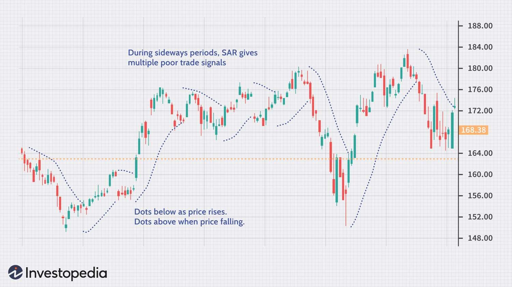

## Table of Contents

## What is Parabolic SAR and what does it stand for?

Parabolic SAR is a technical analysis tool used by traders to determine the direction of a stock's price movement and potential reversal points. It stands for "Parabolic Stop and Reverse," which reflects its purpose of helping traders know when to stop their current position and reverse to a new one. The indicator appears on a chart as a series of dots placed either above or below the price, depending on the trend direction.

When the dots are below the price, it suggests that the trend is upward, and traders might consider buying or holding their positions. Conversely, when the dots are above the price, it indicates a downward trend, suggesting that it might be a good time to sell or short the stock. The Parabolic SAR is particularly useful for setting trailing stop-loss orders, as it adjusts with the price movement, helping traders manage their risk more effectively.

## Who developed the Parabolic SAR indicator and when was it introduced?

The Parabolic SAR indicator was developed by a man named J. Welles Wilder Jr. He introduced it in his book called "New Concepts in Technical Trading Systems" which was published in 1978. Wilder was a famous engineer and a trader who created many other tools that traders use to understand the stock market better.

The Parabolic SAR is one of the tools that Wilder made to help traders decide when to buy or sell stocks. It's simple to use because it shows dots on a chart that tell you if the price is going up or down. Traders like it because it helps them know when to change their trading plan, which is why it's called "Stop and Reverse."

## How does the Parabolic SAR indicator work?

The Parabolic SAR indicator helps traders see if a stock's price is going up or down. It puts little dots on a chart. If the dots are under the price line, it means the price is going up, and traders might want to buy or keep their stocks. If the dots are above the price line, it means the price is going down, and traders might want to sell or short the stock. The dots move closer to the price as time goes on, which helps traders decide when to make a move.

The way the Parabolic SAR works is by using a formula that changes the position of the dots. It starts with a small distance from the price and gets closer over time. This makes it useful for setting a stop-loss, which is a way to limit how much money you can lose. When the price hits a dot, it's a signal to stop your current trade and maybe start a new one in the opposite direction. That's why it's called "Stop and Reverse."

## What are the key components of the Parabolic SAR formula?

The Parabolic SAR formula has two main parts: the acceleration factor and the extreme price. The acceleration factor starts small, usually at 0.02, and it grows a little bit each time the price keeps going in the same direction. This makes the dots move closer to the price over time. The extreme price is the highest high or the lowest low of the current trend. It's the point that the dots are trying to catch up to.

When you calculate the Parabolic SAR, you use the previous SAR value, the acceleration factor, and the extreme price. If the price is going up, you add the difference between the extreme price and the previous SAR, multiplied by the acceleration factor, to the previous SAR. If the price is going down, you subtract that difference instead. This way, the SAR adjusts with the price movement, helping traders see when a trend might be changing.

## How can the Parabolic SAR be used to determine entry and exit points in trading?

The Parabolic SAR helps traders figure out when to buy or sell a stock by showing dots on a chart. When the dots are below the price, it means the price is going up, and traders might want to buy the stock or hold onto it if they already own it. This is a good time to enter a long position. If the price keeps going up and the dots stay below it, traders can feel confident in their choice. But, if the price starts to drop and touches a dot, it's a sign that the trend might be changing, and it could be time to sell and exit the position.

On the other hand, when the dots are above the price, it means the price is going down, and traders might want to sell the stock or short it if they think the price will keep falling. This is a good time to enter a short position. As the price keeps going down and the dots stay above it, traders can keep their short position open. But, if the price starts to rise and touches a dot, it's a sign that the trend might be reversing, and it could be time to cover the short position and exit. By using the Parabolic SAR, traders can make decisions about when to enter and exit trades based on clear signals from the dots on the chart.

## Can you explain the concept of 'SAR dots' in relation to price movement?

The Parabolic SAR, or SAR dots, help traders see if a stock's price is going up or down. These dots appear on a chart, and their position compared to the price tells you about the trend. If the dots are below the price, it means the price is going up. This is a good sign for traders who want to buy the stock or keep holding it if they already own it. The dots act like a guide, showing that the upward trend is strong as long as the price stays above them.

On the other hand, if the dots are above the price, it means the price is going down. This is a signal for traders to sell the stock or maybe even short it if they think the price will keep falling. The dots move closer to the price over time, which helps traders decide when to make a move. When the price touches a dot, it's a sign that the trend might be changing, and it could be time to stop the current trade and start a new one in the opposite direction.

## What are the default settings for the Parabolic SAR and how can they be adjusted?

The default settings for the Parabolic SAR are an initial acceleration factor of 0.02 and a maximum acceleration factor of 0.20. These settings mean that the SAR starts moving slowly towards the price and can speed up to a certain point as the trend continues. Traders can use these default settings or change them to fit their own trading style and the specific market they are trading in.

Adjusting the acceleration factor can change how quickly the SAR dots move towards the price. If you increase the initial acceleration factor, the dots will move faster, which can lead to more trade signals but might also result in more false signals. On the other hand, if you decrease it, the dots will move slower, which might give fewer but more reliable signals. The maximum acceleration factor sets a limit on how fast the dots can move, so changing this can also affect how the SAR reacts to price changes.

## How does the acceleration factor affect the Parabolic SAR's sensitivity?

The acceleration factor in the Parabolic SAR changes how quickly the SAR dots move towards the price. When you start with a higher acceleration factor, the dots will move faster. This makes the Parabolic SAR more sensitive to price changes, which means you might get more signals to buy or sell. But, it can also lead to more false signals because the dots might move too fast and catch up to the price too soon.

If you use a lower acceleration factor, the dots will move more slowly. This makes the Parabolic SAR less sensitive, which means you might get fewer signals. Fewer signals can be good because they are often more reliable, but it might also mean you miss out on some trading opportunities. The choice of acceleration factor depends on what kind of trader you are and how much risk you are willing to take.

## In what types of markets is the Parabolic SAR most effective?

The Parabolic SAR works best in markets that have clear trends. This means it's good for stocks or other things that go up or down in a steady way over time. If the price is going up and up, or down and down, the Parabolic SAR can help traders see that trend and decide when to buy or sell. It's like a guide that shows you the direction the price is moving.

But, the Parabolic SAR might not be as helpful in markets that move sideways or change direction a lot. If the price goes up a little, then down a little, and keeps doing that without a clear trend, the Parabolic SAR can give confusing signals. Traders might get false signals to buy or sell, which can lead to mistakes. So, it's best to use the Parabolic SAR in markets with strong, clear trends.

## What are the limitations and potential drawbacks of using the Parabolic SAR?

The Parabolic SAR can be tricky to use because it might give you wrong signals in markets that don't have a clear trend. If the price goes up and down a lot without going in one direction for a long time, the dots on the chart might tell you to buy or sell at the wrong times. This can make you lose money if you follow those signals without thinking about the bigger picture of the market.

Another problem with the Parabolic SAR is that it can be too quick to tell you to stop and reverse your trade. Sometimes, the price might just be taking a small break before it keeps going in the same direction, but the Parabolic SAR might make you think the trend is changing. This can lead to you getting out of a good trade too early. So, it's important to use the Parabolic SAR along with other tools and not rely on it alone to make your trading decisions.

## How can the Parabolic SAR be combined with other technical indicators for better results?

Using the Parabolic SAR with other technical indicators can help traders make better decisions. One common way is to use it with the Moving Average. The Moving Average smooths out price changes over time and can show the overall trend. When the Parabolic SAR's dots are below the price and the price is also above the Moving Average, it's a strong sign that the trend is up. Traders might feel more confident buying or holding their stocks. On the other hand, if the dots are above the price and the price is below the Moving Average, it's a good sign that the trend is down, and it might be time to sell or short the stock.

Another useful combination is with the Relative Strength Index (RSI). The RSI measures how fast the price is moving and if it's overbought or oversold. When the Parabolic SAR signals a trend change, traders can check the RSI to see if it supports that change. For example, if the Parabolic SAR's dots flip from below to above the price, and the RSI is also moving from overbought to a more neutral level, it adds more confidence to the sell signal. By using these indicators together, traders can get a clearer picture of the market and make more informed trading choices.

## Can you provide a case study or example of how the Parabolic SAR was used successfully in a trading scenario?

Imagine a trader named Sarah who uses the Parabolic SAR to trade stocks. Sarah is looking at the stock of a company called TechGrow, which has been going up steadily for the past few weeks. She sees that the Parabolic SAR dots are below the price line, which tells her that the upward trend is strong. Sarah decides to buy shares of TechGrow because the dots are giving her a clear signal to enter a long position. As the weeks go by, the price keeps going up, and the dots stay below it, so Sarah holds onto her shares. One day, the price touches a dot, and Sarah knows it's time to think about selling. She checks other indicators like the Moving Average and RSI, which also suggest that the trend might be changing. Sarah sells her shares and makes a good profit.

In another example, a trader named Mike uses the Parabolic SAR to trade in the forex market. He is watching the EUR/USD currency pair, which has been going down for a while. The Parabolic SAR dots are above the price, signaling a strong downward trend. Mike decides to short the EUR/USD pair, hoping to make money as the price falls. The price continues to drop, and the dots stay above it, so Mike keeps his position open. After some time, the price starts to rise and touches a dot. Mike sees this as a sign that the trend might be reversing. He checks the RSI, which is moving from oversold to a more neutral level, supporting the idea of a trend change. Mike covers his short position and avoids a potential loss as the price begins to climb.

## How is the Construction of Parabolic SAR done?

The Parabolic SAR (Stop and Reverse) indicator is constructed by calculating SAR values that are unique for each trend using a formula that incorporates key elements such as the Extreme Point (EP) and an Acceleration Factor (AF). 

### Basic Calculation
The SAR for the next period is calculated using the formula:

$$
\text{SAR}_{n+1} = \text{SAR}_{n} + \text{AF} \times (\text{EP} - \text{SAR}_{n})
$$

- **SAR**: Current SAR value.
- **EP (Extreme Point)**: The highest high of the current uptrend or the lowest low of the current downtrend. It updates to new highs or lows whenever they occur.
- **AF (Acceleration Factor)**: Starts typically at 0.02 and increases by 0.02 each time a new EP is recorded, capped at a maximum value (often 0.2).

In essence, as the price moves in the current trend's direction, the SAR value moves closer to the price line, driven progressively by the AF.

### Sensitivity and Trend Adjustment
The role of the EP and AF is central to adjusting the sensitivity and responsiveness of the SAR line. The value of the AF determines how close the SAR is to the current price. A higher AF results in the SAR moving closer to the price, which can capture reversals more quickly but may lead to more false signals. Conversely, a lower AF makes the SAR less sensitive to small price fluctuations, potentially missing some reversals.

### Special Considerations
The Parabolic SAR formula considers specific conditions to refine its predictive accuracy. If the calculated SAR for the next period is within or beyond the current or prior period's price range, it adjusts the SAR value to reflect potential reversals:

1. **Switching Direction**: If the next period's SAR value would be above (in a downtrend) or below (in an uptrend) the current period's price, it signals a possible trend reversal.

2. **Boundary Adjustments**: The SAR is reset to the EP of the previous period when a trend reversal is confirmed. This quick resets ensure alignment with the new trend direction.

### Implementation Example
For practical implementation, consider using Python to automate these calculations for use in trading algorithms:

```python
def calculate_sar(prices, af_start=0.02, af_step=0.02, af_max=0.2):
    sar = [0] * len(prices)
    af = af_start
    ep = prices[0]
    direction = 1  # 1 for uptrend, -1 for downtrend

    sar[0] = ep

    for i in range(1, len(prices)):
        sar[i] = sar[i-1] + af * (ep - sar[i-1])

        if direction == 1:
            if prices[i] > ep:
                ep = prices[i]
                af = min(af + af_step, af_max)
            if sar[i] > prices[i]:
                direction = -1
                sar[i] = ep
                ep = prices[i]
                af = af_start
        else:
            if prices[i] < ep:
                ep = prices[i]
                af = min(af + af_step, af_max)
            if sar[i] < prices[i]:
                direction = 1
                sar[i] = ep
                ep = prices[i]
                af = af_start

    return sar

# Example usage
prices = [39, 38, 36, 35, 34] # Example price data
sar_values = calculate_sar(prices)
print(sar_values)
```

With the adaptive features of EP and AF, and special rules to handle unique conditions, the Parabolic SAR dynamically guides traders through evolving market landscapes, reinforcing its utility as a trend-following indicator.

## References & Further Reading

[1]: Wilder Jr, J. W. (1978). ["New Concepts in Technical Trading Systems."](https://archive.org/details/newconceptsintec00wild) Trend Research.

[2]: Aronson, D. R. (2006). ["Evidence-Based Technical Analysis: Applying the Scientific Method and Statistical Inference to Trading Signals."](https://www.amazon.com/Evidence-Based-Technical-Analysis-Scientific-Statistical/dp/0470008741) John Wiley & Sons.

[3]: Lopez de Prado, M. (2018). ["Advances in Financial Machine Learning."](https://www.amazon.com/Advances-Financial-Machine-Learning-Marcos/dp/1119482089) John Wiley & Sons.

[4]: Chan, E. P. (2009). ["Quantitative Trading: How to Build Your Own Algorithmic Trading Business."](https://github.com/ftvision/quant_trading_echan_book) John Wiley & Sons.

[5]: Jansen, S. (2020). ["Machine Learning for Algorithmic Trading."](https://github.com/stefan-jansen/machine-learning-for-trading) Packt Publishing.