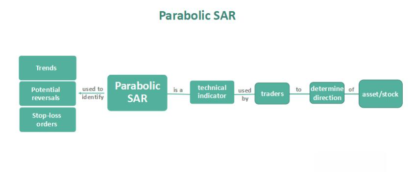

In algorithmic trading, technical indicators are essential tools that assist traders in making informed decisions. Among these indicators, the Parabolic SAR stands out as a robust method developed by J. Welles Wilder Jr. It is designed to help identify potential reversals in market price direction. The Parabolic SAR, often used in conjunction with other indicators, provides traders with critical signals that guide entry and exit decisions in trading strategies. This article will discuss the Parabolic SAR, outline its construction, and explore its application within algorithmic trading systems. Understanding how to use the Parabolic SAR effectively can significantly enhance a trader's ability to optimize their trading operations and improve profitability.

## Table of Contents



## Understanding Parabolic SAR

The Parabolic SAR (Stop and Reverse) is a robust trend-following indicator designed to assist traders in setting trailing stop losses and making informed decisions about entering or exiting trades. It is predicated on the principle that time works against a losing trade, urging traders to quickly exit unprofitable positions. This concept is crucial for mitigating potential losses and preserving capital in volatile markets.

The Parabolic SAR is particularly effective in trending markets. In such environments, it provides clear visual cues to identify and capture potential price reversals. The indicator aids traders by plotting dots above or below the price chart, which signifies possible trend reversals. When the dots are positioned below the price, it suggests a bullish trend, prompting traders to potentially enter or maintain a long position. Conversely, dots appearing above the price signal a bearish trend, indicating an opportunity to enter or maintain a short position.

As the market trends, the dots move closer to the price, signaling an impending reversal. This dynamic feature of the Parabolic SAR offers traders a clear exit strategy as the trend shows signs of exhaustion. The proximity of these dots to the current price acts as a trailing stop-loss mechanism. As the trend continues, the SAR value adjusts, tightening the stop loss, thereby locking in profits and minimizing risk exposure.

It is essential to acknowledge that the Parabolic SAR is most effective in steady trending markets. In sideways or choppy markets, frequent false signals may occur, leading to unprofitable trades. Therefore, traders often complement the Parabolic SAR with other technical indicators, such as moving averages or the Average Directional Index (ADX), to confirm trends and improve decision-making accuracy.

## Construction of Parabolic SAR

The Parabolic SAR (Stop and Reverse) indicator is constructed by calculating SAR values that are unique for each trend using a formula that incorporates key elements such as the Extreme Point (EP) and an Acceleration Factor (AF). 

### Basic Calculation
The SAR for the next period is calculated using the formula:

$$
\text{SAR}_{n+1} = \text{SAR}_{n} + \text{AF} \times (\text{EP} - \text{SAR}_{n})
$$

- **SAR**: Current SAR value.
- **EP (Extreme Point)**: The highest high of the current uptrend or the lowest low of the current downtrend. It updates to new highs or lows whenever they occur.
- **AF (Acceleration Factor)**: Starts typically at 0.02 and increases by 0.02 each time a new EP is recorded, capped at a maximum value (often 0.2).

In essence, as the price moves in the current trend's direction, the SAR value moves closer to the price line, driven progressively by the AF.

### Sensitivity and Trend Adjustment
The role of the EP and AF is central to adjusting the sensitivity and responsiveness of the SAR line. The value of the AF determines how close the SAR is to the current price. A higher AF results in the SAR moving closer to the price, which can capture reversals more quickly but may lead to more false signals. Conversely, a lower AF makes the SAR less sensitive to small price fluctuations, potentially missing some reversals.

### Special Considerations
The Parabolic SAR formula considers specific conditions to refine its predictive accuracy. If the calculated SAR for the next period is within or beyond the current or prior period's price range, it adjusts the SAR value to reflect potential reversals:

1. **Switching Direction**: If the next period's SAR value would be above (in a downtrend) or below (in an uptrend) the current period's price, it signals a possible trend reversal.

2. **Boundary Adjustments**: The SAR is reset to the EP of the previous period when a trend reversal is confirmed. This quick resets ensure alignment with the new trend direction.

### Implementation Example
For practical implementation, consider using Python to automate these calculations for use in trading algorithms:

```python
def calculate_sar(prices, af_start=0.02, af_step=0.02, af_max=0.2):
    sar = [0] * len(prices)
    af = af_start
    ep = prices[0]
    direction = 1  # 1 for uptrend, -1 for downtrend

    sar[0] = ep

    for i in range(1, len(prices)):
        sar[i] = sar[i-1] + af * (ep - sar[i-1])

        if direction == 1:
            if prices[i] > ep:
                ep = prices[i]
                af = min(af + af_step, af_max)
            if sar[i] > prices[i]:
                direction = -1
                sar[i] = ep
                ep = prices[i]
                af = af_start
        else:
            if prices[i] < ep:
                ep = prices[i]
                af = min(af + af_step, af_max)
            if sar[i] < prices[i]:
                direction = 1
                sar[i] = ep
                ep = prices[i]
                af = af_start

    return sar

# Example usage
prices = [39, 38, 36, 35, 34] # Example price data
sar_values = calculate_sar(prices)
print(sar_values)
```

With the adaptive features of EP and AF, and special rules to handle unique conditions, the Parabolic SAR dynamically guides traders through evolving market landscapes, reinforcing its utility as a trend-following indicator.

## Using Parabolic SAR in Algorithmic Trading

In [algorithmic trading](/wiki/algorithmic-trading), the Parabolic SAR is instrumental for automating decision-making by providing robust signals for potential trend reversals. The indicator's ability to set automatic trailing stops makes it particularly useful for traders looking to protect gains while optimizing both entry and [exit](/wiki/exit-strategy) points.

To integrate the Parabolic SAR into a trading system, traders typically program their algorithms to recognize the SAR signals as cues for action. When the current price rises above the SAR, it indicates a potential upward price movement, suggesting that the trader should maintain a long position or initiate a buy. Conversely, when the price falls below the SAR, it suggests a possible downturn, signaling a sell or the continuation of a short position.

This adaptability is further enhanced when the Parabolic SAR is combined with complementary indicators. For example, merging the Parabolic SAR with the Average Directional Index (ADX) can improve the accuracy of identifying trend strength. The ADX, which quantifies the trend's [momentum](/wiki/momentum), pairs well with the SAR by helping confirm the significance of a reversal signal. When both indicators align—say, a rising ADX and the price breaking above the SAR—the likelihood of a true bullish trend increases.

To effectively implement the Parabolic SAR in an algorithmic trading strategy, consider incorporating the following Python code snippet, which demonstrates the calculation and integration of Parabolic SAR into a trading algorithm:

```python
import talib
import numpy as np
import pandas as pd

# Sample data: prices of a specific stock
data = pd.DataFrame({
    'high': [120, 121, 123, 124, 125],
    'low': [119, 120, 121, 122, 123],
    'close': [119.5, 121, 122, 124, 124.5]
})

# Calculate Parabolic SAR
data['sar'] = talib.SAR(data['high'], data['low'], acceleration=0.02, maximum=0.2)

# Example logic to execute trades based on Parabolic SAR and ADX
adx_threshold = 25  # Threshold for a strong trend
data['adx'] = talib.ADX(data['high'], data['low'], data['close'], timeperiod=14)

# Buy signal
buy_signals = (data['close'] > data['sar']) & (data['adx'] > adx_threshold)

# Sell signal
sell_signals = (data['close'] < data['sar']) & (data['adx'] > adx_threshold)

data['buy_signal'] = np.where(buy_signals, 1, 0)
data['sell_signal'] = np.where(sell_signals, -1, 0)

print(data[['close', 'sar', 'adx', 'buy_signal', 'sell_signal']])
```

This method of integration enables traders to automatically execute trades based on pre-defined criteria, ensuring consistency and speed that manual trading cannot achieve. By leveraging these technical indicators within algorithmic systems, traders enhance their abilities to navigate complex market environments, adapting swiftly to price movements and optimizing their strategies for better profitability.

## Statistical Analysis and Results

Studies conducted over various [backtesting](/wiki/backtesting) periods reveal that the Parabolic SAR exhibits varying degrees of effectiveness as a trading tool, underlining its potential when combined with suitable chart types and market conditions. One significant study focused on the Dow Jones Industrial Average (DJIA) stocks highlights this variability in success rates when employing Parabolic SAR on different chart types.

The study found that using standard Open-High-Low-Close (OHLC) charts yielded a relatively modest success rate of 19%. This might be attributed to the traditional OHLC chart's sensitivity to market noise and abrupt price fluctuations, which can lead to frequent and potentially misleading signals when using Parabolic SAR alone.

However, when the Parabolic SAR was applied to Heikin Ashi charts, the success rate increased significantly to 63%. Heikin Ashi charts differ from OHLC charts as they use modified candlesticks to emphasize the overall trend by averaging price data, hence smoothing out price action and reducing market noise. This smoother representation of market trends likely provides clearer signals for the Parabolic SAR indicator, enhancing its ability to accurately identify trend reversals and optimize entry and exit points.

These findings emphasize the critical role that the choice of chart type plays in the effectiveness of technical indicators like Parabolic SAR. The stark contrast in success rates between standard OHLC and Heikin Ashi charts suggests that traders should carefully consider chart selection and prevailing market conditions to enhance the reliability of Parabolic SAR signals. By doing so, traders can leverage the strengths of Parabolic SAR more effectively, potentially improving the profitability of their trading strategies. 

This data not only supports the argument for strategic chart selection in algorithmic trading but also underscores the necessity for traders to continuously test and refine their methodologies in response to evolving market conditions.

## Conclusion

The Parabolic SAR stands as a significant tool among technical indicators for algorithmic traders, providing essential insights into market trends. Understanding its construction enables traders to set accurate trailing stops and determine optimal entry and exit points. The Parabolic SAR's ability to signal potential trend reversals offers a strategic advantage, particularly in trending markets.

Traders who effectively integrate the Parabolic SAR can enhance their trading strategies, promoting improved profitability. Its application, especially when combined with other indicators like the Average Directional Index, can increase the reliability of trading signals, ultimately leading to more informed decision-making.

However, the ever-changing nature of financial markets necessitates continual research and adaptation. Factors such as market [volatility](/wiki/volatility-trading-strategies), chart type, and overall economic conditions can influence the effectiveness of the Parabolic SAR. As such, ongoing analysis and strategy adjustments are vital for traders seeking to maximize the utility of this indicator. By remaining adaptable and informed, traders can harness the full potential of the Parabolic SAR, thereby enhancing their algorithmic trading endeavors.

## References & Further Reading

[1]: Wilder Jr, J. W. (1978). ["New Concepts in Technical Trading Systems."](https://archive.org/details/newconceptsintec00wild) Trend Research.

[2]: Aronson, D. R. (2006). ["Evidence-Based Technical Analysis: Applying the Scientific Method and Statistical Inference to Trading Signals."](https://www.amazon.com/Evidence-Based-Technical-Analysis-Scientific-Statistical/dp/0470008741) John Wiley & Sons.

[3]: Lopez de Prado, M. (2018). ["Advances in Financial Machine Learning."](https://www.amazon.com/Advances-Financial-Machine-Learning-Marcos/dp/1119482089) John Wiley & Sons.

[4]: Chan, E. P. (2009). ["Quantitative Trading: How to Build Your Own Algorithmic Trading Business."](https://github.com/ftvision/quant_trading_echan_book) John Wiley & Sons.

[5]: Jansen, S. (2020). ["Machine Learning for Algorithmic Trading."](https://github.com/stefan-jansen/machine-learning-for-trading) Packt Publishing.