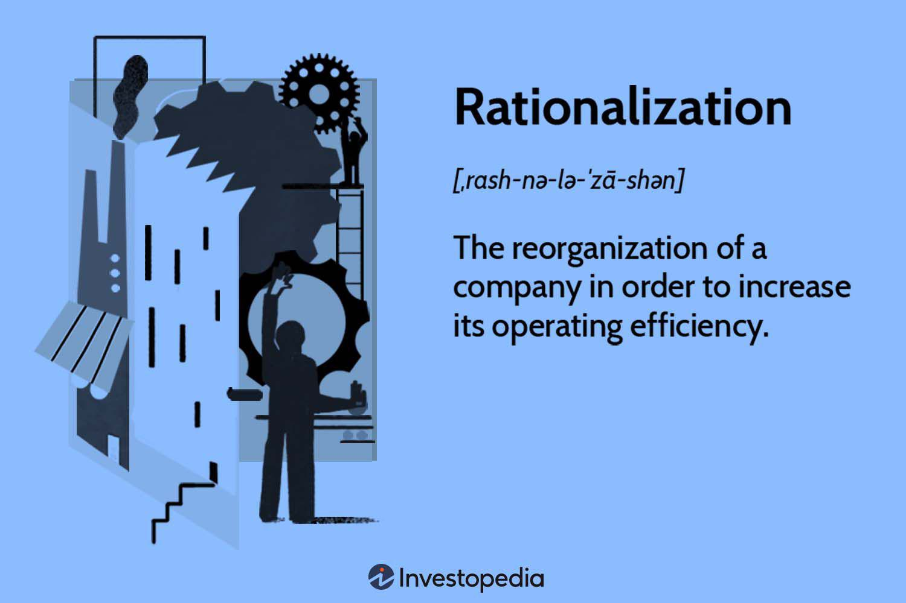

Algorithmic trading operates on the premise that decisions are made through a methodical and rational approach, where data and quantitative models generate trades. However, the paradox of rationality complicates this notion by suggesting that choices which may initially appear irrational can sometimes lead to superior outcomes. This paradox arises in complex systems where strict adherence to rational models might not accommodate unforeseen variables or behaviors influencing the markets.

In examining the intersection of rational decision-making, paradoxes, and algorithmic trading, it becomes evident that traditional economic models of rationality are often at odds with real-world outcomes. Behavioral economics provides critical insights by revealing how cognitive biases and emotional influences can drive decisions away from purely rational pathways. For instance, phenomena like loss aversion and overconfidence can significantly impact a trader's strategy, leading to deviations from expected rational behavior.



The implications of these insights extend to the development of trading algorithms. By integrating concepts from behavioral and evolutionary economics, developers can challenge traditional rational choice theories and adapt algorithms that anticipate and respond to market anomalies. This approach advocates for the creation of systems capable of learning and evolving, thereby enhancing their ability to navigate the unpredictable nature of financial markets.

As we explore how these theories apply to trading algorithms, it is apparent that embracing a broader understanding of decision-making dynamics can result in more resilient and adaptive trading strategies. This progression marks a shift towards incorporating diverse economic perspectives, which can ultimately lead to algorithms that achieve better performance in complex market environments.

## Table of Contents

## What Is the Paradox of Rationality?

The paradox of rationality suggests that in certain contexts, choices deemed rational by conventional standards can lead to suboptimal outcomes. This paradox is well articulated in game theory, where certain situations reveal that irrational strategies might yield better payoffs. A primary example of such a conundrum is the Nash equilibrium concept, which is ubiquitously illustrated by the prisoner's dilemma.

In the prisoner's dilemma, two rational individuals might not cooperate, even if it appears that cooperation would be beneficial to both. The dilemma can be described in terms of players and their respective strategies. Player A and Player B each have two options: Cooperate (C) or Defect (D). The optimal outcome occurs when both players choose to cooperate, resulting in mutually beneficial payoffs. However, given the payoff matrix, each player's rational strategy leans toward defection, thereby leading to a suboptimal Nash equilibrium wherein both players are worse off.

Here's a simple representation of the payoff matrix:

|          | B: Cooperate | B: Defect    |
|----------|--------------|--------------|
| A: Cooperate | (3, 3)        | (0, 5)        |
| A: Defect | (5, 0)        | (1, 1)        |

In this payoff matrix, the numbers in parentheses represent the payoffs to Players A and B respectively. The strategy leading to mutual cooperation yields a payoff of (3, 3). However, if one player chooses to defect while the other cooperates, the defector receives the highest possible payoff of 5, while the cooperator receives the lowest payoff of 0. Consequently, the rational temptation to defect ultimately brings both to the (1, 1) outcome, which is suboptimal compared to (3, 3).

Understanding this paradox is essential in [algorithmic trading](/wiki/algorithmic-trading), where market dynamics may emulate these intricate scenarios. Traders and algorithm designers must recognize that strictly rational models, based purely on the Nash equilibrium, might not always be adequate to predict actual market behavior. Real-world markets often exhibit complexities that mirror the game-theoretical paradoxes, and incorporating insights from these paradoxes can enhance trading strategies to better navigate such complexities. By acknowledging potential deviations from pure rationality and incorporating adaptive strategies, algorithmic traders can aspire to achieve optimal outcomes even amidst seemingly paradoxical market conditions.

## Understanding the Paradox in Decision-Making

Game theory frequently examines the contradictions between theoretically rational strategies and the decisions made in practice. A central concept in game theory, Nash equilibrium, postulates that each player's strategy is optimal, given the strategies of others. However, real-world applications reveal that participants often deviate from these equilibrium strategies, suggesting a collapse in purely rational decision-making processes. For example, in the prisoner's dilemma, theoretically rational actors would betray each other to minimize personal risk. Yet, empirical studies and simulations show cooperation frequently emerges, highlighting deviations from predicted rational behavior.

Behavioral economics seeks to address these anomalies by introducing psychological factors such as cognitive biases and emotional influences. Cognitive biases like overconfidence, anchoring, and loss aversion can lead individuals to make suboptimal decisions that deviate from classical rational models. Emotional states further complicate the decision-making process, as stress or overexcitement can trigger irrational financial decisions. For instance, overconfidence might lead a trader to maintain an over-leveraged position, ignoring potential risks—a behavior contrary to risk-averse rationality.

Algorithmic traders must consider these irrational components to optimize their trading strategies effectively. By incorporating behavioral insights, algorithms can anticipate and adapt to likely irrational behaviors in the market. This can involve designing systems that detect and respond to patterns indicative of cognitive biases or emotional decision-making. For example, [machine learning](/wiki/machine-learning) models can be trained on historical trading data to identify instances of herd behavior or panic selling, enabling algorithms to adjust their strategies accordingly.

In essence, the reconciliation of rational decision-making with observed irrational behaviors in game theory and economics enhances the efficacy of trading algorithms. This is achieved by integrating psychological dimensions and constructing adaptive systems capable of responding to market anomalies driven by human behavior.

## Behavioral Economics and Its Impact on Algorithmic Trading

Behavioral economics applies psychological principles to the analysis of economic decisions, highlighting how real-world decision-making often deviates from theoretical models of rationality due to cognitive biases and emotional states. In algorithmic trading, where decisions are executed at high speeds and large volumes, these deviations can have significant implications for performance and profitability.

Cognitive biases such as overconfidence, loss aversion, and herd behavior can cause traders to make decisions that are inconsistent with rational models. For instance, overconfidence might lead a trader to overestimate the accuracy of their information, resulting in excessive trading. Loss aversion, where the pain of a loss outweighs the pleasure of a gain, can lead traders to hold onto losing positions longer than rational models would suggest. Herd behavior, or the tendency to follow the actions of a larger group, can lead to market bubbles or crashes as traders collectively make irrational decisions.

Algorithmic trading systems, typically designed around rational economic models, must adapt to account for these unpredictable human behaviors. This adaptation could enhance the system's performance by making it more robust to the kinds of deviations observed in human trading behavior. Techniques from [artificial intelligence](/wiki/ai-artificial-intelligence) and machine learning can be employed to identify patterns indicative of cognitive biases and adaptively adjust trading strategies in real time.

For instance, machine learning algorithms can analyze historical trading data to detect patterns associated with cognitive biases. By incorporating this analysis, an algorithm could recognize when a trader might be holding onto a position due to loss aversion and prompt actions that align more closely with rational trading principles.

A practical implementation could be as follows in Python:

```python
import numpy as np
import pandas as pd
from sklearn.preprocessing import StandardScaler
from sklearn.svm import SVC

# Sample DataFrame with historical trading data
df = pd.DataFrame({
    'price_movement': np.random.randn(100),
    'volume': np.random.randn(100),
    'historical_bias': np.random.choice([0, 1], size=100)  # Simulated bias feature
})

# Features and labels
X = df[['price_movement', '[volume](/wiki/volume-trading-strategy)']]
y = df['historical_bias']

# Standardize the features
scaler = StandardScaler()
X_scaled = scaler.fit_transform(X)

# Support Vector Classifier to detect bias pattern
clf = SVC(probability=True)
clf.fit(X_scaled, y)

# Predict new data point and adjust the trading strategy accordingly
new_data = np.array([[0.5, 0.8]])
new_data_scaled = scaler.transform(new_data)
bias_probability = clf.predict_proba(new_data_scaled)[0][1]

if bias_probability > 0.5:
    print("Potential cognitive bias detected, recommending strategy adjustment.")
else:
    print("No significant bias detected, proceed with the standard strategy.")
```

Insights from behavioral economics are critical for enhancing the adaptability and robustness of algorithmic trading systems. By employing these insights, algorithms can be refined and adjusted to preemptively address suboptimal trades influenced by human biases. This incorporation helps in optimizing decision-making processes, potentially leading to improved trading outcomes.

## New Institutional Economics and Trading Algorithms

New Institutional Economics (NIE) posits that economic decision-making is significantly impacted by the broader social and institutional environment. This perspective challenges traditional economic theories that often isolate transactions from their contextual backgrounds. In algorithmic trading, where decisions are typically driven by mathematical models and quantitative data, understanding these institutional influences becomes crucial for improving algorithm performance.

Social and institutional contexts have a profound effect on the rational decision-making processes embedded within algorithmic systems. Factors such as regulatory changes, market norms, and organizational structures can alter the underlying assumptions of economic models. For instance, a sudden shift in governmental policy can modify market conditions, leading to unexpected outcomes if these factors are not considered by the trading algorithms. Consequently, an algorithm solely designed on past data without accounting for such contexts risks becoming obsolete or inefficient in new or changing environments.

To address these challenges, trading algorithms should be inherently adaptive, leveraging both market data and socio-economic factors. This can be achieved by integrating institutional data sources into algorithmic models, enabling a more dynamic response to market conditions. For example, machine learning algorithms can be designed to incorporate real-time institutional changes, allowing the trading system to adjust its strategies in response to new information, such as legislative reforms or market sentiment shifts.

Incorporating institutional factors can significantly enhance trading algorithms by providing a holistic view of market environments. For example, consider an algorithm designed to trade stocks based on technical indicators. By incorporating data on corporate governance practices or industry regulatory trends, the algorithm can adjust its predictions about stock price movements, potentially leading to more accurate trading decisions. Python libraries, such as Pandas for data manipulation and Scikit-learn for machine learning, can be instrumental in developing such adaptive systems.

```python
import pandas as pd
from sklearn.ensemble import RandomForestRegressor

# Load market data and institutional data
market_data = pd.read_csv('market_data.csv')
institutional_data = pd.read_csv('institutional_data.csv')

# Merge datasets on a common key, such as date
combined_data = pd.merge(market_data, institutional_data, on='date')

# Define features and target
features = combined_data.drop(columns=['target'])
target = combined_data['target']

# Train a machine learning model
model = RandomForestRegressor()
model.fit(features, target)

# Predict future market movements
predictions = model.predict(features)
```

This code snippet illustrates a simple way to integrate institutional data into a machine learning model, enhancing an algorithm’s ability to predict market movements. Trading strategies informed by NIE principles are better equipped to navigate the complexities of financial markets. As such, analysts and developers should prioritize the incorporation of social and institutional considerations to maximize algorithmic efficiency and adaptability in volatile market landscapes.

## Evolutionary Economics: A New Perspective

Evolutionary Economics offers a framework that diverges from traditional economic theories by incorporating insights from biology and psychology. This approach suggests that economic behaviors, including those related to trading, are not solely the result of rational decision-making but are also influenced by evolutionary pressures. Cognitive biases, which are systematic patterns of deviation from norm or rationality, can be understood as adaptive responses that have evolved to increase decision-making efficiency under certain conditions.

In the context of algorithmic trading, simulating evolutionary processes could lead to the development of more adaptive strategies. Traders could engineer algorithms that utilize evolutionary approaches, such as genetic algorithms, allowing trading systems to adapt to changing market environments. These algorithms function by mimicking processes like natural selection and genetic drift, evolving trading strategies over time based on performance metrics. Such adaptive algorithms not only react to immediate market data but also learn from historical trends, thus potentially yielding more robust trading strategies.

Moreover, evolutionary economics posits that institutions themselves evolve and influence market behaviors. Within algorithmic trading, this perspective encourages the consideration of institutional dynamics, such as regulatory changes and cultural shifts, as additional variables in the creation of responsive, flexible trading systems. By incorporating these elements, trading algorithms can predict and adapt to the complex interactions of market forces, enhancing their capability to withstand and exploit fluctuations in the market.

This evolutionary perspective offers a paradigm shift for algorithmic traders, encouraging the development of systems that are not merely rule-based but are capable of learning and evolving. This capacity for adaptation can be critical in navigating the complexities and uncertainties of financial markets, providing a competitive edge in achieving optimal trading outcomes.

## The Role of Rationality in Algorithmic Trading

Rational models in algorithmic trading are often employed to predict market movements, optimize portfolios, and manage risk. These models typically rely on assumptions of rational market behavior, suggesting that all market participants act in their own best interest based on all available information. However, the dynamic nature of financial markets often reveals anomalies where irrational choices lead to better outcomes than purely rational approaches. To address these anomalies, integrating elements of irrationality within the design and function of trading algorithms can enhance their effectiveness.

One significant area of focus is understanding when irrational decisions outperform rational ones. Behavioral economics offers insights that reveal these circumstances often involve cognitive biases such as overconfidence, loss aversion, or herding behavior. For instance, herding can sometimes drive short-term market trends that a rational model might miss. Incorporating models that can detect and adapt to such trends can improve trading decisions. Python libraries like Pandas and NumPy can be used to simulate and analyze market scenarios in which irrational behavior might lead to advantageous results.

```python
import numpy as np
import pandas as pd

# Simulate irrational vs. rational strategy outcomes
np.random.seed(42)
market_behavior = np.random.randn(100)  # Simulate market behavior

# Rational strategy assumes market reverts to mean
rational_strategy_roi = market_behavior.mean()

# Irrational strategy assumes momentum (herding effect)
irrational_strategy_roi = market_behavior[market_behavior > 0].mean()

```

Traders must also consider the unpredictability of markets, which often reflects a blend of rational and irrational behavior among participants. While a rational framework provides a strong foundation, it is the adaptability to unexpected market behaviors that can distinguish successful algorithmic trading. This adaptability can be achieved through machine learning algorithms capable of learning from new data and adjusting strategies accordingly. Reinforcement learning, for example, allows algorithms to evaluate the outcomes of their actions and update their strategies in real time.

Continuing advances in economics and psychology offer valuable insights that feed into the refinement of these algorithms, ensuring they remain robust against market irregularities. Research on prospect theory, for example, can provide frameworks to model and predict how traders react to potential losses compared to equivalent gains. Incorporating such theories into algorithmic decision-making processes allows traders to anticipate market movements more accurately.

Ultimately, the effective application of trading algorithms requires a careful balance between rational models and the nuanced understanding of market irrationalities. This balance not only provides a competitive edge in navigating complex market landscapes but also aligns with the evolving understanding of human behavior in economic contexts.

## Conclusion

The intersection of the paradox of rationality and decision-making presents both challenges and opportunities in algorithmic trading. Recognizing that rational decisions do not always yield optimal results requires a shift in how trading algorithms are designed and implemented. By understanding and incorporating the paradox of rationality, traders can create algorithms that are more robust, capable of navigating the complexities of financial markets with greater success.

As algorithmic trading continues to evolve, the integration of insights from behavioral and institutional economics will play an increasingly important role. Behavioral economics provides valuable insight into how cognitive biases and emotional influences can lead to seemingly irrational decision-making. On the other hand, New Institutional Economics underscores the significance of social and institutional contexts in shaping economic behaviors. Together, these disciplines offer a more comprehensive understanding of market dynamics, allowing for the development of algorithms that are better suited to cope with real-world complexities.

Ultimately, leveraging theories from behavioral and institutional economics, alongside the acknowledgment of rationality paradoxes, can lead to the creation of more effective trading strategies. These strategies will be better equipped to achieve superior payoffs in the dynamic landscape of modern financial markets. By implementing these interdisciplinary insights, traders can enhance the adaptability and performance of their algorithmic systems, ensuring competitiveness and resilience in the face of ever-evolving market conditions.

## References & Further Reading

[1]: "Thinking, Fast and Slow" by Daniel Kahneman

[2]: Lo, A. W. (2004). "The Adaptive Markets Hypothesis: Market Efficiency from an Evolutionary Perspective." Journal of Portfolio Management, 30(5), 15-29.

[3]: Shleifer, A. (2000). "Inefficient Markets: An Introduction to Behavioral Finance." Oxford University Press.

[4]: "Nudge: Improving Decisions About Health, Wealth, and Happiness" by Richard H. Thaler and Cass R. Sunstein

[5]: Camerer, C. F., & Loewenstein, G. (2003). "Behavioral Economics: Past, Present, Future." In Advances in Behavioral Economics. Princeton University Press.

[6]: "Misbehaving: The Making of Behavioral Economics" by Richard H. Thaler