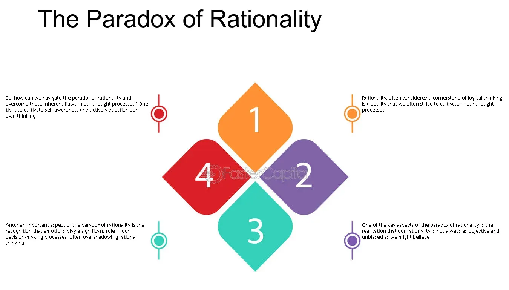

## Table of Contents

## What is the paradox of rationality?

The paradox of rationality is a situation where being too logical and reasonable can actually lead to bad results. Imagine a group of people trying to work together. If everyone only thinks about what's best for themselves and uses strict logic, they might not cooperate well. This can make things worse for everyone, even though they are all trying to be rational.

For example, in a game where players can choose to work together or compete, being too rational might make each player decide to compete to get the best personal outcome. But if everyone competes, they all end up worse off than if they had cooperated. So, being too rational can sometimes lead to irrational results for the group. This shows that sometimes, being a little less rational and more cooperative can lead to better outcomes for everyone.

## How does the paradox of rationality relate to decision-making?

The paradox of rationality shows us that being too logical when making decisions can sometimes lead to bad results. When people only think about what's best for themselves and use strict logic, they might not work well with others. For example, in a group project, if everyone decides to only do what benefits them the most, the project might fail. This happens because everyone is trying to be rational, but their decisions don't help the group as a whole.

This paradox is important in decision-making because it tells us that sometimes, being a little less rational and more cooperative can lead to better outcomes. If people in a group think about what's good for everyone, not just themselves, they can make decisions that help the whole group succeed. So, when making decisions, it's good to balance being rational with being cooperative to avoid the negative effects of the paradox of rationality.

## Can you explain the paradox of rationality with a simple example?

Imagine you and your friends are playing a game where you can either share your treats or keep them all to yourself. If everyone shares, everyone gets a lot of treats and everyone is happy. But if everyone decides to be rational and keep their treats, no one gets to enjoy any extra treats. This is the paradox of rationality: when everyone tries to be smart and keep their treats, everyone ends up with less than if they had shared.

In real life, this can happen in a group project at school. If everyone thinks, "I'll do the least amount of work so I can get a good grade without working too hard," the project might not be good enough to get a high grade. If everyone had worked together and shared the workload, the project would have been better, and everyone would have gotten a better grade. So, being too rational and thinking only about yourself can sometimes make things worse for everyone.

## What are the key components that contribute to the paradox of rationality?

The paradox of rationality happens when people try to be too logical and only think about what's best for themselves. This can lead to bad results for everyone. The main thing that causes this paradox is when people don't work together. If everyone only cares about their own benefit, they might make choices that hurt the group. For example, in a game where you can share or keep things, if everyone decides to keep everything, no one gets to enjoy sharing.

Another important part of the paradox is that being too rational can make people miss out on better outcomes. When everyone tries to be smart and only thinks about their own gain, they might not see that working together could be better for everyone. This can happen in real life, like in a group project at school. If everyone tries to do the least work possible, the project might not be good enough. But if everyone worked together, the project could be much better, and everyone would benefit more. So, the paradox shows that sometimes being a little less rational and more cooperative can lead to better results for everyone.

## How does the concept of bounded rationality tie into the paradox of rationality?

Bounded rationality is the idea that people can't always make perfect decisions because they have limits on their time, information, and ability to think. When people try to be rational but can't know everything or think through every possibility, they might make choices that seem logical but aren't the best. This ties into the paradox of rationality because even when people try to be rational, their decisions can still lead to bad results for everyone if they don't have all the information or can't see the bigger picture.

For example, in a group project, if everyone tries to do the least work possible because they think it's the rational choice, they might not know that the project needs more effort to succeed. Their bounded rationality means they can't see that working together would be better for everyone. So, the paradox of rationality shows up when people's limited ability to be fully rational leads them to make choices that hurt the group, even though they're trying to be logical.

## What are some common misconceptions about the paradox of rationality?

A common misconception about the paradox of rationality is that being rational always leads to the best outcomes. People often think that if everyone makes logical choices, everything will work out well. But the paradox shows that when everyone tries to be too rational and only thinks about themselves, it can lead to bad results for the group. For example, if everyone in a group project tries to do the least work possible because they think it's smart, the project might fail, and everyone gets a bad grade.

Another misconception is that the paradox only applies to big, complicated situations. In reality, it can happen in everyday life, like in games or simple group activities. If everyone decides to keep their treats instead of sharing, no one gets to enjoy more treats. The paradox of rationality reminds us that sometimes being a little less rational and more cooperative can lead to better results for everyone.

## How do different fields like economics and psychology interpret the paradox of rationality?

In economics, the paradox of rationality is often seen in game theory and decision-making models. Economists use these models to show how people trying to be rational can end up making choices that are bad for everyone. For example, in the famous "Prisoner's Dilemma," two people might choose not to cooperate because they think it's the best choice for them, but both end up worse off. Economists study this to understand why markets and groups sometimes don't work as well as they could. They learn that sometimes, people need to think about more than just their own gain to make things better for everyone.

In psychology, the paradox of rationality is looked at through how people think and make decisions. Psychologists are interested in why people sometimes make choices that seem logical but lead to bad results. They study things like how people's emotions and limited information can affect their decisions. Psychologists find that people often think they are being rational, but their choices can still hurt the group. They learn that understanding human behavior and encouraging cooperation can help solve the problems caused by the paradox of rationality.

## What are the implications of the paradox of rationality for game theory?

In game theory, the paradox of rationality shows that when everyone tries to be smart and only think about what's best for themselves, they can end up making choices that are bad for everyone. This is often seen in games like the Prisoner's Dilemma, where two people might choose not to work together because they think it's the best choice for them. But if both people make this choice, they end up worse off than if they had cooperated. Game theorists use this to understand why people sometimes don't work together even when it would be better for everyone. They learn that sometimes, people need to think about more than just their own gain to make things better for everyone.

This paradox also helps game theorists see that being too rational can lead to bad results in many different games and situations. For example, in a game where players can share or keep things, if everyone decides to keep everything, no one gets to enjoy sharing. This shows that in game theory, it's important to think about how people's choices affect each other. Game theorists study this to find ways to encourage people to work together and make choices that help everyone, not just themselves.

## How can understanding the paradox of rationality improve personal decision-making?

Understanding the paradox of rationality can help you make better choices by showing you that being too logical and only thinking about yourself can sometimes lead to bad results. If you're working on a group project, for example, trying to do the least work possible might seem smart, but if everyone thinks this way, the project will fail. By knowing about the paradox, you can see that sometimes it's better to work together and share the effort, even if it means doing a bit more work yourself. This can lead to better results for everyone in the group.

In everyday life, understanding the paradox can help you make decisions that consider other people's needs, not just your own. For instance, if you're playing a game where you can share or keep treats, choosing to share can make everyone happier, even if keeping them all seems like the rational choice. By being aware of the paradox, you can balance being rational with being cooperative, which can lead to better outcomes in your personal and social life.

## What are some advanced theories or models that attempt to resolve the paradox of rationality?

One advanced theory that tries to solve the paradox of rationality is called "bounded rationality." This theory says that people can't always make perfect decisions because they have limits on their time, information, and thinking ability. Instead of trying to be completely rational, people often use shortcuts and rules of thumb to make choices. By understanding these limits, we can see why people sometimes make decisions that seem logical but lead to bad results for everyone. This theory helps us realize that being a little less rational and more cooperative can lead to better outcomes.

Another model that tries to resolve the paradox is called "behavioral game theory." This model looks at how people actually behave in games, not just how they should behave if they were perfectly rational. It takes into account things like emotions, fairness, and how people learn from each other. Behavioral game theory shows that people often care about more than just their own gain and are willing to cooperate if they think it's fair. By studying these behaviors, we can find ways to encourage people to work together and make choices that help everyone, not just themselves.

## How has the paradox of rationality evolved in academic discourse over time?

The paradox of rationality has been talked about a lot in academic circles over the years. It started with early ideas in game theory, where people saw that being too logical could lead to bad results. For example, in the Prisoner's Dilemma, two people might choose not to work together because they think it's the best choice for them, but both end up worse off. As time went on, more people started to study this paradox and see how it applies to many different situations, not just games. They realized that in real life, like in group projects or sharing treats, being too rational and only thinking about yourself can make things worse for everyone.

Over time, the way people talk about the paradox of rationality has changed and grown. New ideas like bounded rationality and behavioral game theory have come up to help explain why people sometimes make choices that seem logical but lead to bad results. Bounded rationality says that people can't always make perfect decisions because they have limits on their time, information, and thinking ability. Behavioral game theory looks at how people actually behave in games, taking into account things like emotions and fairness. These new theories help us understand the paradox better and find ways to encourage people to work together and make choices that help everyone, not just themselves.

## What are the current debates and future research directions concerning the paradox of rationality?

Right now, people are still talking a lot about the paradox of rationality. One big debate is about how much people should be rational versus cooperative. Some think that being rational is always good, but others say that being too rational can hurt everyone. They argue that we need to find a balance where people think about what's good for the group, not just themselves. Another debate is about how to teach people to make better choices. Some researchers think that if we can help people understand the paradox better, they might make decisions that help everyone more often.

In the future, researchers want to study the paradox of rationality even more. They want to look at how it shows up in different situations, like in business, politics, and everyday life. They also want to find new ways to encourage people to work together and make choices that help everyone. One idea is to use technology, like apps or games, to teach people about the paradox and show them how being a little less rational can lead to better results. By studying these things, researchers hope to help people make better decisions and create a world where everyone can benefit more from working together.

## References & Further Reading

[1]: "Thinking, Fast and Slow" by Daniel Kahneman

[2]: Lo, A. W. (2004). "The Adaptive Markets Hypothesis: Market Efficiency from an Evolutionary Perspective." Journal of Portfolio Management, 30(5), 15-29.

[3]: Shleifer, A. (2000). "Inefficient Markets: An Introduction to Behavioral Finance." Oxford University Press.

[4]: "Nudge: Improving Decisions About Health, Wealth, and Happiness" by Richard H. Thaler and Cass R. Sunstein

[5]: Camerer, C. F., & Loewenstein, G. (2003). "Behavioral Economics: Past, Present, Future." In Advances in Behavioral Economics. Princeton University Press.

[6]: "Misbehaving: The Making of Behavioral Economics" by Richard H. Thaler