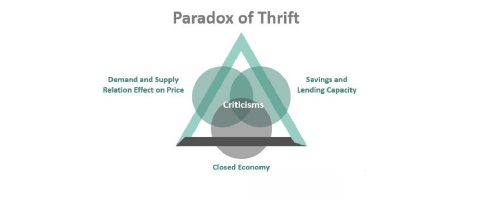

Savings is a critical component of personal finance, serving as a foundation for financial security and stability. When individuals save money, they create a safety net for unexpected expenses, accumulate wealth for future goals such as buying a home or funding education, and ensure a comfortable retirement. Beyond individual benefits, savings are vital for economic growth, providing the capital necessary for investments in businesses, infrastructure, and innovation. A robust savings culture can enhance economic resilience by reducing dependency on external borrowing and fostering domestic investment.

The paradox of thrift, a concept rooted in Keynesian economics, presents an intriguing dilemma: while individual saving is beneficial, increased collective saving can potentially lead to a decrease in overall economic activity. This paradox arises because as individuals save more, they reduce their consumption, leading to a decline in aggregate demand. A lower demand can result in reduced production, job losses, and slower economic growth, creating a vicious cycle of reduced income and further saving. Thus, what seems prudent on a microeconomic level may have adverse macroeconomic consequences.

Behavioral economics offers insights into savings behavior by examining the psychological factors influencing financial decisions. Concepts like loss aversion, where individuals fear losses more than they value gains, mental accounting, which involves compartmentalizing finances in irrational ways, and temporal discounting, where people favor immediate rewards over future benefits, are pivotal in understanding why people save or spend. By recognizing these cognitive biases, strategies can be developed to encourage more effective saving practices.

Algorithmic trading, or algo trading, plays an increasingly significant role in modern finance. It involves the use of computer algorithms to automate trading decisions, enabling rapid execution of trades based on predefined criteria. This technology has transformed financial markets, offering potential benefits such as increased market liquidity and reduced transaction costs. However, it also introduces complexities and risks, such as increased volatility and the potential for market manipulation.

These concepts—savings behavior, the paradox of thrift, behavioral economics, and algorithmic trading—are interconnected with profound implications for the economy. Understanding how they interact can help individuals make informed financial decisions and guide policymakers in creating environments that foster both individual prosperity and broader economic stability.

## Table of Contents

## Understanding the Paradox of Thrift

The Paradox of Thrift is a concept rooted in Keynesian economics that suggests an increase in collective savings can lead to a reduction in overall economic demand and, consequently, economic activity. This principle was introduced by John Maynard Keynes during the Great Depression as a counterintuitive economic phenomenon. Keynes argued that while saving is generally viewed as a prudent individual decision, if everyone increases their savings simultaneously, it can result in decreased aggregate demand, leading to a reduction in total economic output and potentially causing a recession.

Historically, instances of the Paradox of Thrift can be observed during significant economic downturns. For example, during the Great Depression, widespread panic led to a substantial increase in personal savings as individuals sought to protect themselves against future uncertainty. However, this collective behavior resulted in reduced consumer spending, which exacerbated the economic crisis. Similarly, the 2008 financial crisis witnessed a surge in savings rates and a decline in consumption, contributing to the global economic slowdown.

In examining the impact of the Paradox of Thrift on financial stability, it becomes evident that individual and collective economic behaviors are interconnected. On a microeconomic level, increased savings might enhance personal financial health by providing a buffer against unforeseen circumstances. However, on a macroeconomic scale, if a significant portion of the population adopts similar saving habits during times of economic uncertainty, it can lead to a decline in demand, business revenues, and subsequent job losses, undermining broader financial stability.

Behavioral tendencies such as fear-driven saving play a significant role in perpetuating the Paradox of Thrift. During economic downturns, individuals may become more risk-averse, influenced by cognitive biases like loss aversion—the tendency to prefer avoiding losses over acquiring equivalent gains. This behavior leads to increased savings as people focus on preserving wealth rather than spending it. While this may seem beneficial for individuals, it can lead to a vicious cycle where decreased spending contributes to an economic slowdown, further reinforcing the initial fears that drove the increase in saving.

## Behavioral Economics in Savings Patterns

Behavioral economics provides valuable insights into savings patterns, highlighting the psychological influences that affect financial decision-making. Three key concepts in this domain are loss aversion, mental accounting, and temporal discounting.

Loss aversion, a principle derived from prospect theory formulated by Daniel Kahneman and Amos Tversky, suggests that individuals experience losses more intensely than equivalent gains. This can lead to risk-averse behavior, causing individuals to avoid investments perceived as risky, potentially limiting their savings' growth. For instance, a person might keep money in a low-yield savings account rather than investing in stocks due to the fear of a potential loss, even if the long-term gain is statistically more likely.

Mental accounting refers to the cognitive process of categorizing, evaluating, and managing financial activities in separate mental accounts. This can result in suboptimal savings decisions, as individuals might treat money differently based on its source or intended use. For example, a bonus may be spent more readily than regular income, even though it could be more beneficially allocated to savings. This compartmentalization often leads to inconsistent saving behaviors that do not align with overall financial objectives.

Temporal discounting, or time preference, involves the tendency to value immediate rewards more highly than future ones. This can negatively impact savings when individuals opt for short-term gratification over long-term financial security. The concept of discount rates, which convert future benefits to their present value, can mathematically describe this behavior. The present value $PV$ is given by:

$$

PV = \frac{FV}{(1+r)^n} 
$$

where $FV$ is the future value, $r$ is the discount rate, and $n$ is the time period.

Cognitive biases such as these can significantly undermine effective savings strategies. For example, the availability heuristic might lead individuals to overestimate the likelihood of financial setbacks, prompting excessive saving or overly cautious investment strategies. Confirmation bias can lead individuals to reinforce existing financial behaviors or beliefs, despite evidence suggesting more beneficial savings practices.

To overcome these biases, various strategies can be employed. One effective method is setting up automatic savings plans, which reduce the impact of mental accounting by seamlessly transferring funds into savings or investment accounts. Additionally, using goal-setting techniques with clear, quantifiable targets can help counteract the effects of temporal discounting. Techniques like the "SMART" goals (Specific, Measurable, Achievable, Relevant, Time-bound) framework can formalize this process, encouraging disciplined savings behavior.

The concept of "nudges," popularized by Richard Thaler and Cass Sunstein, involves subtle policy shifts that encourage better decision-making without limiting freedom of choice. In the context of savings, nudges could include default enrollment in retirement plans or the use of apps that round up purchases and deposit the difference into savings accounts. These interventions have proven effective in increasing savings rates by leveraging behavioral tendencies rather than attempting to change them outright.

By understanding and addressing these psychological factors, individuals can develop more robust savings strategies, ultimately enhancing financial well-being and stability.

## The Rise of Algorithmic Trading

Algorithmic trading, commonly known as algo trading, refers to the use of computer algorithms to execute trading orders within financial markets. These sophisticated algorithms are programmed to make trading decisions based on pre-defined criteria, which include price, timing, and [volume](/wiki/volume-trading-strategy). By leveraging computational power and complex mathematical models, algo trading is designed to execute orders at optimal times, potentially improving investment outcomes.

The prominence of [algorithmic trading](/wiki/algorithmic-trading) has surged dramatically in recent years, underpinned by advances in technology, increased data availability, and a competitive trading environment. According to several estimates, algorithmic trading accounts for a significant proportion of trading activity in various markets, notably accounting for more than 60% of all trades in the equity markets in the United States. This widespread adoption is attributed to the efficiency, speed, and precision with which algorithms can operate, significantly outpacing human capabilities.

Algorithmic trading can enhance market [liquidity](/wiki/liquidity-risk-premium), which refers to the ease with which an asset can be bought or sold without affecting its price. By facilitating numerous small trades rapidly, algo trading can reduce bid-ask spreads and contribute to a more liquid market. However, there are concerns about increased [volatility](/wiki/volatility-trading-strategies), particularly in cases where algorithmic strategies are improperly calibrated or interact in unforeseen ways. Instances such as the Flash Crash of 2010 exemplified how algorithms can exacerbate price fluctuations under certain conditions.

For individual investors, algo trading offers distinct advantages. It can democratize access to sophisticated trading strategies that were historically the domain of large financial institutions. For example, algorithmic methods can be used to optimize order execution, leading to cost savings and potentially better price discovery. Moreover, the automation of trading processes can help mitigate behavioral biases, such as overreacting to short-term market movements, thus aligning better with long-term savings strategies.

Nevertheless, algo trading is not without risks. One primary concern is the potential for systemic risk, where the failure of a single, large algorithm could have cascading effects on financial markets. Moreover, algorithmic strategies often rely heavily on historical data, which may not always accurately predict future market conditions, leading to strategic missteps. Issues such as latency [arbitrage](/wiki/arbitrage), where faster traders exploit slower participants, also present ethical and regulatory challenges.

In conclusion, while algorithmic trading has transformed financial markets by increasing the efficiency and accessibility of trading practices, it simultaneously introduces new complexities and risks. These developments necessitate careful consideration by investors and regulators alike to harness the benefits while mitigating potential downsides.

## Interconnections and Economic Implications

The paradox of thrift, a fundamental concept in Keynesian economics, suggests that while saving is beneficial for individual financial security, excessive saving can lead to reduced aggregate demand, ultimately hindering economic growth. Behavioral economics provides insight into how cognitive biases such as loss aversion and temporal discounting can shape savings behavior, potentially exacerbating the paradox. For instance, during economic downturns, fear and uncertainty may drive individuals to increase their savings, reducing consumption and investment, and thereby prolonging a recession. Understanding and addressing these behaviors is critical for managing the paradox of thrift's impact on the economy.

Algorithmic trading (algo trading), which uses computer algorithms to execute trades at high speeds, has transformed financial markets by increasing market liquidity and efficiency. However, its implications for savings and investment are twofold. On the positive side, algo trading can offer individual investors better opportunities for portfolio diversification and risk management, potentially enhancing the returns on their savings. Conversely, the volatility associated with algorithmic trading poses risks that can discourage investment, affecting the savings rate and its role in economic stability.

Technological advances and behavioral insights offer potential strategies for mitigating the paradox of thrift. For example, financial technology (fintech) applications can provide personalized nudges to encourage optimal saving and spending patterns, aligning individual behaviors with broader economic needs. Such interventions can help balance personal financial goals with collective economic health, reducing the likelihood of saving behaviors that could destabilize the economy.

In terms of policy implications, governments and financial institutions should consider strategies that encourage sustainable consumption and investment alongside personal savings growth. Policies such as incentivizing investment in education and infrastructure can promote long-term economic growth, counteracting the dampening effects of excessive saving. Moreover, regulatory frameworks could be refined to manage the risks associated with algorithmic trading, ensuring market stability while promoting its potential benefits.

In conclusion, integrating behavioral economics, financial technology, and regulatory policies can help navigate the complexities of savings behavior and its broader economic implications. By addressing the interplay between savings patterns, algo trading, and economic policies, we can foster a more resilient and dynamic economic environment.

## Conclusion

In this discussion, we explored the multifaceted relationship between savings behavior, the paradox of thrift, and algorithmic trading. Understanding these concepts is crucial for both individual financial planning and broader economic stability. The paradox of thrift illustrates how increased individual saving, while seemingly beneficial, can reduce overall economic activity by limiting consumer spending. This creates a tension between personal financial security and collective economic vitality.

Behavioral economics offers insights into savings patterns, revealing that cognitive biases such as loss aversion and mental accounting significantly influence how people save. By recognizing these biases, individuals can employ strategies and nudges to improve savings outcomes, ensuring more rational decision-making processes.

Algorithmic trading represents a modern shift in financial markets, providing enhanced market liquidity and potentially more efficient savings strategies for individual investors. However, it also poses risks, like increased market volatility, that require careful consideration. The integration of algorithmic trading with personal financial strategies underscores the growing link between technology and economic activity.

The interplay between these factors—behavioral insights, algorithmic advances, and economic theories like the paradox of thrift—highlights the need for a balance between personal financial goals and collective economic health. This balance is vital for sustaining economic growth and improving individual well-being. 

Looking ahead, the future of savings behavior and economic stability will likely depend on the continued application and evolution of behavioral insights and technological innovation. Policymakers and financial institutions must collaborate to develop strategies that address the complexities of these interconnections. By fostering an environment that supports both savings and economic stability, we can strive for a more resilient and equitable financial future.

## References & Further Reading

[1]: Keynes, J. M. (1936). ["The General Theory of Employment, Interest, and Money"](https://www.files.ethz.ch/isn/125515/1366_KeynesTheoryofEmployment.pdf). Palgrave Macmillan.

[2]: Kahneman, D., & Tversky, A. (1979). "Prospect Theory: An Analysis of Decision under Risk." Econometrica, 47(2), 263-292. [Link to JSTOR](http://web.mit.edu/curhan/www/docs/Articles/15341_Readings/Behavioral_Decision_Theory/Kahneman_Tversky_1979_Prospect_theory.pdf).

[3]: Thaler, R. H., & Sunstein, C. R. (2008). ["Nudge: Improving Decisions About Health, Wealth, and Happiness"](https://www.researchgate.net/publication/257178709_Nudge_Improving_Decisions_About_Health_Wealth_and_Happiness_RH_Thaler_CR_Sunstein_Yale_University_Press_New_Haven_2008_293_pp). Penguin Books.

[4]: Chaboud, A. P., Chiquoine, B., Hjalmarsson, E., & Vega, C. (2009). ["Rise of the Machines: Algorithmic Trading in the Foreign Exchange Market"](https://papers.ssrn.com/sol3/papers.cfm?abstract_id=1501135). International Finance Discussion Papers.

[5]: Lo, A. W. (2004). "The Adaptive Markets Hypothesis: Market Efficiency from an Evolutionary Perspective." Journal of Portfolio Management, 30(5), 15-29. [Link to Journal](https://papers.ssrn.com/sol3/papers.cfm?abstract_id=602222).