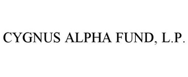

Parallax Volatility Advisers has established itself as a prominent entity in the domain of algorithmic trading, particularly with its emphasis on volatility strategies. This article aims to provide an insight into who Parallax Volatility Advisers are, their distinct approach to algorithmic trading, and their influence on the financial markets. The focus will be on the mechanics of their trading systems, the role of volatility in their strategies, and the attributes that distinguish Parallax Volatility Advisers from their industry rivals.

Parallax Volatility Advisers operates at the junction of technology and finance, showcasing how such integration is pivotal in the contemporary trading industry. The company employs cutting-edge technologies and methodologies to navigate the complexities faced in today's financial landscape. Understanding their operations provides valuable insights into current market trends and the future directions of financial trading.



Throughout this exploration, we will examine Parallax's trading strategies, and highlight their significance in shaping the evolving environment of financial trading. We invite you to explore the complexities and innovative approaches employed by Parallax Volatility Advisers as they navigate the changing dynamics of the markets.

## Table of Contents

## About Parallax Volatility Advisers

Founded in the early 2000s, Parallax Volatility Advisers is recognized as a formidable entity in the trading industry. The firm's core competencies lie in options trading and volatility strategies, capitalizing on sophisticated algorithms to automate and enhance their trading operations. Situated in San Francisco, Parallax prides itself on its revolutionary trading methodologies and unwavering dedication to the forefront of financial technology innovation.

Parallax Volatility Advisers assembles a distinguished team of experts in finance, mathematics, and computer science, whose expertise is pivotal in crafting systems capable of adeptly navigating the multifaceted nature of financial markets. The firm's profound focus on data-driven decision-making processes and real-time analytics equips it to swiftly adapt to market fluctuations, thereby optimizing trading performance.

Options trading, a significant facet of Parallax's strategy, involves contracts that offer buyers the opportunity, not the obligation, to purchase or sell a security at a pre-determined price before a specific expiration date. In this context, volatility represents the extent of variation in the price of a financial instrument. Its intricate role in financial markets can be leveraged to generate superior returns, contingent on the ability to effectively model and predict price movements. A comprehensive understanding of volatility dynamics enables Parallax to excel in its focus area, paving the way for innovative trading solutions.

Parallax's avant-garde approach to algorithm development and enhancement empowers the firm to execute trades rapidly and efficiently, mitigating risks whilst maximizing returns. The firm's practices are characterized by real-time data analysis and continuous algorithm refinement, which ensure optimal responsiveness to market conditions.

Through its pursuit of technological progression and emphasis on assembling world-class talent, Parallax Volatility Advisers not only sustains its competitive edge but accelerates its growth and influence in the trading domain. These attributes make the company a beacon of cutting-edge trading strategies and innovation in the ever-evolving financial landscape.

## The Role of Volatility in Algo Trading

Volatility is a central concept in financial markets, indicating the extent of variation in the price of a financial instrument over time. It reflects the degree of uncertainty or risk regarding the size of changes in an asset's value. For traders, this [volatility](/wiki/volatility-trading-strategies) can be a double-edged sword: it presents opportunities to capitalize on price fluctuations but also poses risks due to potential losses from adverse movements.

Algorithmic trading, or algo trading, leverages computational techniques to exploit these price movements. Through sophisticated algorithms, traders can analyze extensive datasets rapidly, pinpointing favorable moments to execute trades. This technology is particularly advantageous in volatile markets, where timely decisions are critical to maximizing returns and minimizing risks. For instance, a simple algorithm might aim to buy when prices are lower than a moving average and sell when prices rise above it.

Parallax Volatility Advisers excels in such volatile environments. The firm utilizes advanced algorithms capable of swift analysis and execution, which are essential in capturing profitable opportunities when market prices are subject to frequent changes. These algorithms are not only fast but also adaptive, evolving in response to shifting market dynamics to optimize performance continually.

Understanding the impact of volatility on pricing and [liquidity](/wiki/liquidity-risk-premium) is crucial for Parallax. When volatility increases, the likelihood of price gaps and market illiquidity also rises. This can affect the bid-ask spread and the execution price of a trade, making precise modeling and forecasting vital for successful algo trading strategies. By recognizing these conditions, Parallax's algorithms are designed to adjust their risk management techniques accordingly, ensuring they maintain efficiency and profitability.

Mathematical models often play a significant role, with the Black-Scholes model being one example commonly used to price options by considering volatility. Through Python, one can implement such a model to gain insights:

```python
import numpy as np
from scipy.stats import norm

def black_scholes(S, K, T, r, sigma, option_type='call'):
    d1 = (np.log(S / K) + (r + sigma ** 2 / 2) * T) / (sigma * np.sqrt(T))
    d2 = d1 - sigma * np.sqrt(T)

    if option_type == 'call':
        price = S * norm.cdf(d1) - K * np.exp(-r * T) * norm.cdf(d2)
    elif option_type == 'put':
        price = K * np.exp(-r * T) * norm.cdf(-d2) - S * norm.cdf(-d1)

    return price
```

In conclusion, volatility is not just a parameter in financial models; it is a key driver of opportunities and challenges in trading. By mastering its nuances and employing cutting-edge tech, Parallax Volatility Advisers remains adept at leveraging volatility to its advantage, setting benchmarks in the landscape of [algorithmic trading](/wiki/algorithmic-trading).

## Parallax's Algorithmic Trading Strategies

Parallax's trading strategies leverage advanced technology and profound market knowledge to capture opportunities in volatile market conditions. The firm's algorithms are adept at analyzing large volumes of financial data, identifying patterns and trends that might not be immediately visible to human traders. This algorithmic approach enables Parallax to execute trades with high speed and precision, a crucial [factor](/wiki/factor-investing) in rapidly fluctuating markets.

One of the notable characteristics of Parallax's strategies is the emphasis on statistical [arbitrage](/wiki/arbitrage). This involves using statistical models to identify mispriced securities and executing trades that capitalize on expected price movements. A simplified representation of a [statistical arbitrage](/wiki/statistical-arbitrage) strategy might involve the following Python snippet using a linear regression model to find the relationship between two co-integrated stocks:

```python
import numpy as np
import pandas as pd
from sklearn.linear_model import LinearRegression

# Assume data is a DataFrame with two time series 'stock1' and 'stock2'
data = pd.DataFrame({'stock1': np.random.random(100), 'stock2': np.random.random(100)})

# Perform linear regression
model = LinearRegression()
model.fit(data[['stock1']], data['stock2'])

# Get the coefficients
beta = model.coef_[0]
alpha = model.intercept_

# Expected value of stock2 based on stock1
data['expected_stock2'] = alpha + beta * data['stock1']

# Calculate z-score to find divergence
data['z_score'] = (data['stock2'] - data['expected_stock2']) / data['stock2'].std()

# Define buy/sell signals
buy_signal = data['z_score'] < -2
sell_signal = data['z_score'] > 2
```

The use of [machine learning](/wiki/machine-learning) models forms a core aspect of Parallax's strategy, allowing them to continuously refine and adapt their algorithms to environmental changes in financial markets. The application of machine learning can be anything from deep-learning networks for predictive modeling to [reinforcement learning](/wiki/reinforcement-learning) algorithms for dynamic strategy formation.

Risk management is integrated into every step of Parallax's trading methodology. By processing vast datasets in real-time, Parallax ensures that potential risks are assessed and mitigated efficiently during the execution phase. This capability not only optimizes the trading process but also preserves capital during volatile conditions.

To remain competitive, Parallax Volatility Advisers invests significantly in the iterative development of their algorithms. These refinements include adopting the latest technological advancements in algorithm design and computational power, ensuring that the firm maintains a lead in the fast-paced world of algorithmic trading.

Through these sophisticated techniques and their commitment to technological advancement, Parallax constructs well-diversified portfolios that balance risk and reward effectively. The iterative and adaptive nature of their algorithmic systems ensures sustained performance and competitive advantage in the market.

## Technology and Innovation at Parallax

Parallax Volatility Advisers has a well-established reputation for prioritizing technological advancement and innovation in trading. The firm allocates substantial resources toward research and development, ensuring that its algorithms and software are among the industry's most sophisticated.

Parallax employs cloud computing, [artificial intelligence](/wiki/ai-artificial-intelligence), and big data analytics, creating a robust infrastructure that supports its trading operations. This infrastructure is designed to manage high-frequency trading and large transaction volumes effectively, maintaining both speed and accuracy. The firm’s use of cloud computing enables flexibility and scalability, allowing it to process significant data loads and execute trades swiftly. Parallax’s AI models are continuously developed and trained on large datasets to predict market movements more effectively, enhancing their decision-making processes.

In particular, the company's technology stack is capable of handling the extensive data flow required for trading across various markets. This stack supports the implementation of highly complex algorithms capable of executing sophisticated trading strategies, such as machine learning models for pattern recognition and statistical arbitrage strategies. The integration of these technologies allows Parallax to analyze market data in real-time and capitalize on fleeting opportunities.

Parallax fosters a culture that encourages pushing the limits of algorithmic trading possibilities. It invests in training and empowering its employees to innovate, encouraging collaboration to refine and develop new trading models. Continuous refinement of algorithms is vital in response to the dynamic nature of financial markets. By maintaining stringent performance metrics and back-testing, Parallax ensures its systems are optimized for the most current market conditions, maintaining an edge over its competitors.

The firm's commitment to innovation extends beyond technological tools; it involves a holistic approach that includes risk management and regulatory compliance considerations. This ensures that while advancing technologically, Parallax also adheres to the highest standards of operational integrity and investor trust.

## Challenges and Considerations in Algo Trading

Algorithmic trading, although replete with advantages such as speed, precision, and the ability to process vast datasets, is not without its challenges. The dynamic nature of financial markets entails a set of complexities and risks that must be managed effectively for successful algo trading operations.

**Market Unpredictability**

One of the primary challenges in algorithmic trading is market unpredictability. Financial markets are influenced by numerous factors, including economic indicators, geopolitical events, and investor sentiment, which can cause sudden and unforeseen fluctuations. These can trigger aberrant algorithm behavior, leading to substantial financial losses if not managed properly. To mitigate such risks, algorithms must be designed to adapt to changing market conditions by incorporating dynamic risk management techniques and adaptive learning mechanisms.

**Regulatory Compliance**

Algorithmic trading firms must continuously adhere to regulatory requirements set forth by financial governing bodies such as the U.S. Securities and Exchange Commission (SEC) and the Financial Conduct Authority (FCA). Regulations are designed to prevent market manipulation and ensure fair trading practices. Compliance involves implementing strict audit trails, maintaining transparency in trading activities, and ensuring that algorithms adhere to regulations like the Markets in Financial Instruments Directive II (MiFID II) in Europe.

**Technological Failures**

Technology is both a boon and a potential pitfall for algorithmic traders. System failures, network latencies, and software bugs can lead to execution errors and unintended positions in the market. Robust technological infrastructure is paramount, involving redundancy systems, regular software updates, and thorough testing of algorithms across various scenarios. Firms such as Parallax Volatility Advisers employ sophisticated IT frameworks to preemptively address these issues, ensuring continuity in trading operations.

**Risk Management and Compliance Frameworks**

Risk management is integral to safeguarding against the inherent risks associated with algorithmic trading. Parallax Volatility Advisers has developed comprehensive frameworks that not only focus on compliance with existing regulations but also involve the use of advanced risk assessment models. These frameworks are essential for monitoring trades in real-time, detecting anomalies, and undertaking corrective actions swiftly.

**Ethical Considerations**

The ethical implications of automated trading necessitate a strong sense of responsibility among firms. Issues such as market fairness, transparency, and the potential for abusive trading practices must be addressed to maintain investor trust and uphold industry standards. Algorithmic trading systems should be designed to avoid exploiting market inefficiencies unfairly and must operate within ethically defined boundaries.

In conclusion, while algorithmic trading offers significant advantages in terms of efficiency and profitability, it is encumbered with challenges that demand meticulous attention. By leveraging advanced risk management techniques, ensuring regulatory compliance, maintaining robust technological systems, and adhering to ethical standards, firms like Parallax Volatility Advisers can navigate these complexities and sustain their competitive edge in the financial markets.

## Conclusion

Parallax Volatility Advisers has established itself as a leading figure in algorithmic trading, with a particular focus on leveraging market volatility. By continually advancing their technological infrastructure and developing sophisticated trading strategies, Parallax has carved out a significant niche within the financial sector. Their innovative methodologies not only enhance trading efficiency but also provide a substantial competitive edge, placing them at the forefront of industry leaders.

As financial markets continue their rapid transformation, companies such as Parallax Volatility Advisers are poised to play a critical role in determining trading strategies and outcomes. Their approach of integrating cutting-edge technology with meticulous strategy development positions them as pivotal contributors to the future landscape of trading.

Research and development remain at the core of Parallax's strategy. Their commitment to innovation is evident in their continuous effort to optimize and refine algorithmic models. This focus on R&D ensures that they maintain a leading position in financial technological advancements, adapting to new market conditions and staying ahead of emergent trends.

For investors and traders, an understanding of Parallax Volatility Advisers' operations and market achievements offers key insights into the evolving field of algorithmic trading. Studying their successes provides a comprehensive perspective on how advanced algorithms and strategic innovation can yield significant advantages in a dynamic trading environment.

## References & Further Reading

[1]: Aldridge, I. (2013). ["High Frequency Trading: A Practical Guide to Algorithmic Strategies and Trading Systems"](https://www.wiley.com/en-us/High+Frequency+Trading%3A+A+Practical+Guide+to+Algorithmic+Strategies+and+Trading+Systems%2C+2nd+Edition-p-9781118343500). Wiley.

[2]: Cartea, Á., Jaimungal, S., & Penalva, J. (2015). ["Algorithmic and High-Frequency Trading"](https://assets.cambridge.org/97811070/91146/frontmatter/9781107091146_frontmatter.pdf). Cambridge University Press.

[3]: Narang, R. K. (2013). ["Inside the Black Box: A Simple Guide to Quantitative and High Frequency Trading"](https://www.amazon.com/Inside-Black-Box-Quantitative-Frequency/dp/1118362411). Wiley.

[4]: Black, F., & Scholes, M. (1973). ["The Pricing of Options and Corporate Liabilities."](https://www.cs.princeton.edu/courses/archive/fall09/cos323/papers/black_scholes73.pdf) Journal of Political Economy, 81(3), 637-654.

[5]: Chan, E. P. (2009). ["Quantitative Trading: How to Build Your Own Algorithmic Trading Business"](https://github.com/ftvision/quant_trading_echan_book). Wiley.

[6]: Lopez de Prado, M. (2018). ["Advances in Financial Machine Learning"](https://www.amazon.com/Advances-Financial-Machine-Learning-Marcos/dp/1119482089). Wiley.

[7]: Bertsimas, D., & Lo, A. W. (1998). ["Optimal Control of Execution Costs."](http://web.mit.edu/dbertsim/www/papers/Finance/Optimal%20control%20of%20execution%20costs.pdf) Journal of Financial Markets, 1(1), 1-50.