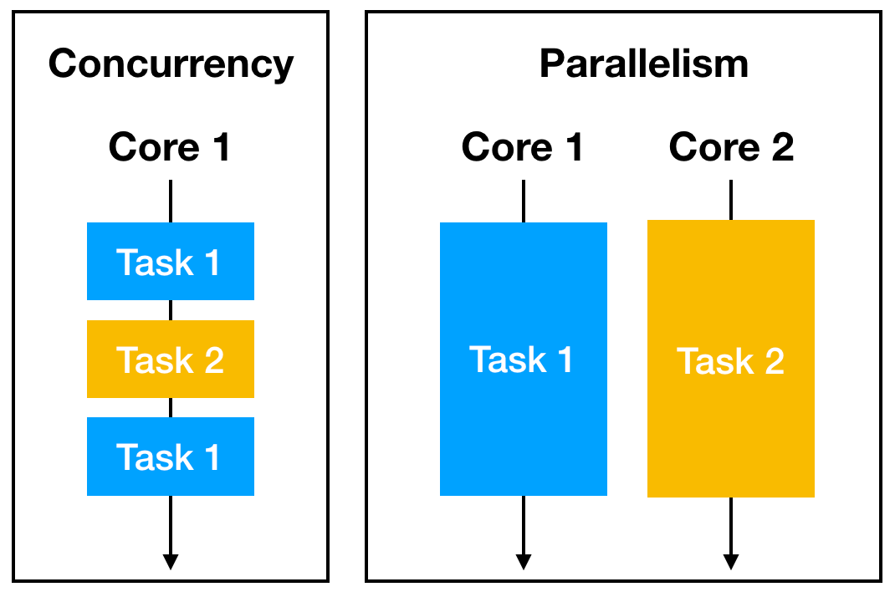

## Table of Contents

## What is parallel computing and why is it important in Python?

Parallel computing is when a computer uses more than one processor or core at the same time to solve a problem faster. It's like having many people working together on different parts of a big project instead of one person doing it all alone. In Python, you can use parallel computing to make your programs run quicker, especially when you have a lot of data to process or many tasks to do.

This is important in Python because it helps you get more done in less time. For example, if you're working with big data sets or running complex calculations, using parallel computing can make your program finish much faster. Python has tools like multiprocessing and threading that make it easier to use parallel computing, so even if you're not an expert, you can still speed up your work.

## What are the main differences between threading and multiprocessing in Python?

Threading and multiprocessing are two ways to make your Python programs run faster by using more than one part of your computer at the same time. Threading uses multiple threads within a single process. This means all the threads share the same memory space, which can be good for tasks that need to share data quickly. However, because of something called the Global Interpreter Lock (GIL) in Python, only one thread can run Python bytecode at a time, which can limit how much faster your program can run.

On the other hand, multiprocessing uses multiple processes, each with its own memory space. This means you can use all the cores of your computer to run different parts of your program at the same time, which can make your program much faster, especially for CPU-heavy tasks. The downside is that because each process has its own memory, sharing data between processes can be more complicated and slower than with threads.

In simple terms, if your program needs to do a lot of calculations and can be split into parts that don't need to share a lot of data, multiprocessing might be better. But if your program needs to share data a lot and the GIL isn't a big problem for your specific task, threading could be the way to go.

## How does the Global Interpreter Lock (GIL) affect threading in Python?

The Global Interpreter Lock, or GIL, is like a traffic rule in Python that stops more than one thread from running Python code at the same time. Imagine you have many cars (threads) on a road, but only one car can go at a time. This means if your program has many threads, they have to take turns using the computer's processor, which can make things slower than you might expect.

However, the GIL isn't all bad. It makes it easier for Python to manage memory and keep things safe when threads are running. But if your program needs to do a lot of calculations and you want to use multiple threads to speed it up, the GIL can be a problem. For tasks that don't involve a lot of Python code, like waiting for things to happen or doing input/output work, threads can still be useful even with the GIL.

## What are the basic steps to implement threading in Python?

To use threading in Python, you start by importing the threading module. Then, you define a function that will run in a separate thread. This function should contain the code you want to run at the same time as other parts of your program. After defining the function, you create a Thread object and pass your function to it. You can start the thread by calling the start() method on the Thread object. This tells Python to run your function in a new thread.

Once you've started your threads, you might want to wait for them to finish before moving on with the rest of your program. You can do this by calling the join() method on each thread. This makes your main program wait until the thread is done. Remember, because of the GIL, if your threads are doing a lot of Python code, they might not speed things up as much as you hope. But for tasks like waiting for things or doing input/output, threading can still be very helpful.

## How can you use the `threading` module to create and manage threads?

To use the `threading` module in Python, you first need to import it. Once you have the module, you can define a function that will run in a separate thread. This function should contain the code you want to run at the same time as other parts of your program. After defining the function, you create a `Thread` object and pass your function to it using the `target` parameter. To start the thread, you call the `start()` method on the `Thread` object. This tells Python to run your function in a new thread, allowing your program to do multiple things at once.

After starting your threads, you might want to wait for them to finish before moving on with the rest of your program. You can do this by calling the `join()` method on each thread. This makes your main program wait until the thread is done. It's important to remember that because of the Global Interpreter Lock (GIL), if your threads are doing a lot of Python code, they might not speed things up as much as you hope. However, for tasks like waiting for things to happen or doing input/output work, threading can still be very helpful in making your program more efficient.

## What are the advantages and disadvantages of using threads in Python?

Using threads in Python can make your program run faster and be more responsive. Threads are good for tasks like waiting for things to happen or doing input/output work. For example, if your program needs to download files from the internet, you can use threads to download many files at the same time. This can make your program finish quicker. Threads also share the same memory space, so it's easy for them to share data with each other, which can be helpful for certain tasks.

However, threads in Python have some downsides because of the Global Interpreter Lock (GIL). The GIL means that only one thread can run Python code at a time, which can slow down your program if you're doing a lot of calculations. Also, because threads share the same memory, you have to be careful to avoid problems where threads try to change the same data at the same time. This can make your code more complicated and harder to debug. So, while threads can be useful, they might not always make your program faster, especially for CPU-heavy tasks.

## How do you implement multiprocessing in Python using the `multiprocessing` module?

To use multiprocessing in Python, you first need to import the `multiprocessing` module. Once you have the module, you define a function that you want to run in a separate process. This function should contain the code you want to run at the same time as other parts of your program. After defining the function, you create a `Process` object and pass your function to it using the `target` parameter. To start the process, you call the `start()` method on the `Process` object. This tells Python to run your function in a new process, allowing your program to do multiple things at once.

After starting your processes, you might want to wait for them to finish before moving on with the rest of your program. You can do this by calling the `join()` method on each process. This makes your main program wait until the process is done. Unlike threads, processes don't share the same memory space, which means they can use all the cores of your computer to run different parts of your program at the same time. This can make your program much faster, especially for CPU-heavy tasks. However, because each process has its own memory, sharing data between processes can be more complicated and slower than with threads.

## What are the key considerations when choosing between threading and multiprocessing for a specific task?

When choosing between threading and multiprocessing, it's important to think about what your program needs to do. If your program involves a lot of calculations and can be split into parts that don't need to share much data, multiprocessing is usually better. This is because multiprocessing can use all the cores of your computer at the same time, making your program run faster. But, if your program needs to share a lot of data between different parts, multiprocessing can be tricky because each process has its own memory space.

On the other hand, threading can be a good choice if your program needs to share data a lot or if it's doing things like waiting for things to happen or doing input/output work. Threads share the same memory space, which makes sharing data easier. However, because of the Global Interpreter Lock (GIL) in Python, threads might not speed up CPU-heavy tasks as much as you'd hope because only one thread can run Python code at a time.

So, the choice between threading and multiprocessing depends on what your program is doing. If it's about speed and you can handle separate memory spaces, go for multiprocessing. If it's about sharing data and handling tasks that don't need a lot of CPU power, threading might be the better option.

## How can you use `concurrent.futures` to simplify parallel task management in Python?

The `concurrent.futures` module in Python makes it easier to handle tasks that you want to run at the same time. It has two main tools: `ThreadPoolExecutor` for using threads and `ProcessPoolExecutor` for using processes. You don't need to worry about starting and joining threads or processes yourself. Instead, you can just give `concurrent.futures` a list of functions or tasks to run, and it will take care of running them in parallel and giving you the results when they're done.

Using `concurrent.futures` is as simple as creating an executor, submitting your tasks, and then collecting the results. For example, if you want to download many files at the same time, you can use `ThreadPoolExecutor` to handle the downloads in separate threads. If you're doing a lot of calculations, `ProcessPoolExecutor` can use multiple processes to make your program run faster. This way, you can focus on what your program needs to do, and `concurrent.futures` will handle the hard part of managing the parallel tasks for you.

## What are some common pitfalls and how to avoid them when using threading and multiprocessing?

When using threading, a common problem is the Global Interpreter Lock (GIL), which stops more than one thread from running Python code at the same time. This can make your program slower if you're doing a lot of calculations. To avoid this, use threading for tasks that don't need a lot of CPU power, like waiting for things to happen or doing input/output work. Another problem is that threads share the same memory, so you have to be careful to avoid issues where threads try to change the same data at the same time. You can use locks or other tools to make sure threads don't mess up each other's work.

With multiprocessing, a common issue is that each process has its own memory space, which makes sharing data between processes harder. If you need to share a lot of data, you might need to use special tools like queues or shared memory, which can make your code more complicated. To avoid this, try to design your program so that each process can work on its own without needing to share a lot of data. Also, starting and stopping processes can take more time than starting and stopping threads, so use multiprocessing for tasks that will take a long time to run, not for quick tasks.

Using `concurrent.futures` can help you avoid some of these problems because it makes it easier to manage threads and processes. It handles starting and stopping them for you, so you can focus on what your program needs to do. Just remember to choose the right executor for your task: `ThreadPoolExecutor` for tasks that need to share data a lot or don't need a lot of CPU power, and `ProcessPoolExecutor` for tasks that need a lot of calculations and can work on their own.

## How can you measure and compare the performance of threading versus multiprocessing in Python?

To measure and compare the performance of threading versus multiprocessing in Python, you can use the `time` module to time how long it takes for your program to run using both methods. First, write a function that does the task you want to test, like calculating something or downloading files. Then, run this function using threading and multiprocessing separately, and use `time.time()` to record the start and end times for each method. By subtracting the start time from the end time, you can see how long each method took to finish the task. This way, you can compare the times and see which method made your program run faster.

When you do this, remember that the results can be different depending on what your program is doing. If your task involves a lot of calculations, multiprocessing might be faster because it can use all the cores of your computer at the same time. But if your task is about sharing data or doing things like waiting for files to download, threading might be better because threads can share memory easily. Also, the Global Interpreter Lock (GIL) can make threading slower for CPU-heavy tasks, so keep that in mind when you're comparing the two. By running your tests a few times and looking at the average times, you can get a good idea of which method works best for your specific task.

## What advanced techniques can be used to optimize parallel processing in Python for expert-level applications?

For expert-level applications, one advanced technique to optimize parallel processing in Python is using asynchronous programming with the `asyncio` module. This method is great for tasks that involve a lot of waiting, like downloading files or making API calls. With `asyncio`, you can write code that looks like it's running one task at a time but actually runs many tasks at once. This can make your program much faster because it doesn't waste time waiting for one task to finish before starting another. You can combine `asyncio` with `aiohttp` for web requests or `aiomysql` for database operations to handle many tasks at the same time without blocking.

Another technique is using distributed computing with tools like `Dask` or `Ray`. These tools let you use many computers at the same time to solve big problems. If your task is too big for one computer, you can split it into smaller parts and run them on different machines. `Dask` is good for working with big data sets and can use both threads and processes to speed up your work. `Ray` is great for [machine learning](/wiki/machine-learning) tasks and can handle complex workflows that need to be run in parallel across many machines. By using these tools, you can make your program run much faster and handle tasks that would be too big for one computer.

A third technique involves fine-tuning the use of `multiprocessing` and `threading` together. For example, you can use multiprocessing to handle CPU-heavy tasks and threading within each process to manage I/O-bound tasks. This hybrid approach can maximize the use of your computer's resources. By carefully managing the number of processes and threads, and using tools like `concurrent.futures` to simplify the management, you can achieve a balance that optimizes performance for complex applications. This method requires careful planning and testing to ensure that the overhead of managing both processes and threads doesn't outweigh the performance gains.

## References & Further Reading

[1]: Bergstra, J., Bardenet, R., Bengio, Y., & Kégl, B. (2011). ["Algorithms for Hyper-Parameter Optimization."](https://proceedings.neurips.cc/paper/2011/file/86e8f7ab32cfd12577bc2619bc635690-Paper.pdf) Advances in Neural Information Processing Systems 24.

[2]: ["Advances in Financial Machine Learning"](https://www.amazon.com/Advances-Financial-Machine-Learning-Marcos/dp/1119482089) by Marcos Lopez de Prado

[3]: ["Evidence-Based Technical Analysis: Applying the Scientific Method and Statistical Inference to Trading Signals"](https://www.amazon.com/Evidence-Based-Technical-Analysis-Scientific-Statistical/dp/0470008741) by David Aronson

[4]: ["Machine Learning for Algorithmic Trading"](https://github.com/stefan-jansen/machine-learning-for-trading) by Stefan Jansen

[5]: ["Quantitative Trading: How to Build Your Own Algorithmic Trading Business"](https://books.google.com/books/about/Quantitative_Trading.html?id=j70yEAAAQBAJ) by Ernest P. Chan