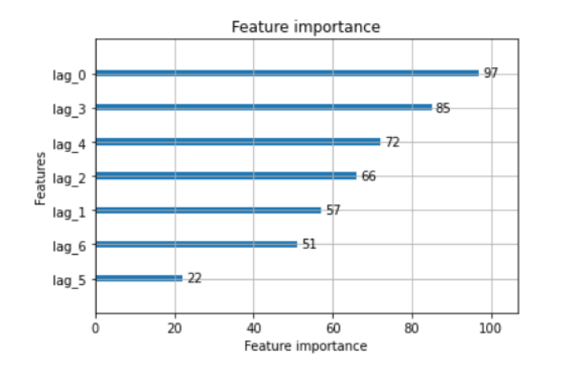

Algorithmic trading, a modern cornerstone of financial markets, relies heavily on the accurate selection and analysis of data features to optimize trading strategies. In this context, feature importance becomes critical as it helps in identifying which variables have the most significant impact on market movements and trading outcomes. Understanding which features drive decision-making within trading algorithms allows for more informed adjustments and improvements in trading models.

Feature importance not only aids in refining these models for increased accuracy but also plays a pivotal role in avoiding pitfalls such as overfitting. Overfitting can occur when a model learns the noise in the training data instead of the actual signal, leading to poor performance on unseen data. By focusing on the most relevant features, traders can enhance the robustness and generalization of their models, ensuring consistent performance in dynamic market conditions.



Parallelization in algorithmic strategies refers to the execution of multiple computations simultaneously, leveraging multi-core processors and distributed computing resources. This method significantly boosts computational efficiency and facilitates the handling of large datasets, which are typical in financial markets. By parallelizing processes, computational bottlenecks can be minimized, resulting in faster decision-making and the capacity to process vast amounts of financial data in real-time.

The implementation of parallelized solutions in feature importance computations comes with various benefits and challenges. On the positive side, parallelization can dramatically reduce processing times, allowing for more complex models to be utilized without sacrificing speed. This capability is crucial in environments where quick adaptation to rapidly changing data is necessary. However, challenges exist, including the need for robust infrastructure, potential difficulties in maintaining data consistency, and the complexity of coding for parallel execution.

This article aims to provide a comprehensive exploration of feature importance and parallelization within the context of algorithmic trading. It will cover the critical aspects of feature selection, delve into the techniques for parallelized computing, and discuss the practical applications and obstacles encountered when implementing these advanced technologies. Through this exploration, the article will emphasize the transformative potential of these methodologies in enhancing the performance and reliability of trading algorithms.

## Table of Contents

## Importance of Feature Selection in Algo Trading

Feature selection is a critical component in [algorithmic trading](/wiki/algorithmic-trading), particularly within financial [machine learning](/wiki/machine-learning) pipelines. Its primary function is to identify and select the most relevant variables that contribute significantly to predictive modeling, which in turn enhances the model's performance and robustness. In the volatile and data-heavy environment of financial markets, selecting the right features can lead to more accurate predictions of asset prices, ultimately aiding in the development of profitable trading strategies.

One of the key methods used in feature selection is Mean Decrease Impurity (MDI). MDI is employed in decision tree-based models and evaluates feature importance by measuring the total decrease in node impurity brought by a feature split across all trees within the model. In essence, MDI provides insight into how a single feature contributes to the predictive strength of the overall model. The calculation of node impurity typically uses metrics like Gini impurity or entropy.

Another crucial technique is Mean Decrease Accuracy (MDA). Unlike MDI, MDA assesses feature importance by observing the impact on the model's accuracy when a feature is randomly shuffled. This method is particularly useful as it captures the decrease in prediction accuracy caused by the disruption of a feature's relationship with the target variable, thereby highlighting its importance to the model's predictive capability.

Shuffle Feature Importance (SFI) is a variation of these techniques that specifically focuses on the robustness of the model. This method involves creating several permutations of the dataset where the feature values are randomly shuffled. By comparing the model's performance on these permuted datasets to the original one, SFI helps identify features that are genuinely important as opposed to those that may lead to overfitting.

The careful selection and evaluation of features using these techniques help prevent overfitting—a common problem in financial models where the algorithm captures noise instead of the underlying pattern. Overfitting leads to models that perform well on in-sample data but poorly on out-of-sample data. Feature selection methods like MDI, MDA, and SFI play a pivotal role in addressing this issue by ensuring that the model generalizes well on unseen data.

Furthermore, these feature importance methodologies enhance model robustness, a crucial attribute in trading where market conditions are dynamic and unpredictable. By focusing on truly valuable predictors, the model's predictive power remains stable even as market conditions change, thereby improving the reliability of the trading strategy. The adoption of robust feature selection techniques ultimately leads to more resilient trading systems capable of generating superior risk-adjusted returns over time.

## Concept of Parallelization in Machine Learning

Parallelization in machine learning refers to the process of distributing computation tasks across multiple processors or machines to improve efficiency and performance. By breaking down tasks into smaller subtasks that can be executed simultaneously, parallelization significantly reduces computation time, enabling the handling of larger datasets and complex models that would otherwise be prohibitive.

In the context of machine learning, parallelization is crucial as it allows algorithms to process vast amounts of data faster and more effectively. This is particularly beneficial when training models on extensive datasets, where the time taken for computations can act as a bottleneck. For instance, tasks such as matrix operations, which are fundamental in several machine learning algorithms, can be efficiently handled using parallel computing techniques.

Parallelized computing can notably speed up processing times by taking advantage of both multicore processors within a single machine and multiple machines in distributed systems. Consider a machine learning task where repeated computations are required, such as hyperparameter optimization or cross-validation. By distributing these computations across several processors, each executing a part of the task concurrently, the overall processing time can be drastically reduced.

The primary benefit of employing multiprocessor systems in feature selection and evaluation lies in their ability to perform extensive computations in a manageable timeframe. Feature selection, an essential step in preparing data for machine learning, involves evaluating each feature's importance or contribution to the model. Techniques like Recursive Feature Elimination (RFE), which rely on iterative processing, become significantly more efficient when computations are parallelized.

For instance, in Python, one could leverage libraries such as Dask or Joblib, which provide easy-to-use interfaces for parallel computing. Here is a simple example of parallelizing a loop using Joblib:

```python
from joblib import Parallel, delayed

def evaluate_feature_importance(feature):
    # Hypothetical function to evaluate the importance of a feature
    return compute_importance(feature)

features = ['feature1', 'feature2', 'feature3']
results = Parallel(n_jobs=-1)(delayed(evaluate_feature_importance)(f) for f in features)
```

In this example, the computation of feature importance for each feature is distributed across available processors, allowing for simultaneous execution.

In conclusion, parallelization is a powerful technique in machine learning, especially pertinent to tasks requiring vast computational resources or involving large datasets. It enables practitioners to handle larger data, reduce computation times for model training and evaluation, and consequently, enhance the performance of machine learning applications. Utilizing parallel computing frameworks allows for effective resource management and fosters the development of more robust and scalable machine learning solutions.

## Implementing Parallelized Feature Importance Techniques

Implementing parallelized feature importance techniques, such as the Mean Decrease Impurity (MDI), Mean Decrease Accuracy (MDA), and Single Feature Importance (SFI), can significantly enhance the efficiency of algorithmic trading strategies. This section provides a detailed guide on how to parallelize these techniques, the required technology stack, and a step-by-step process for setting up a system for parallelized feature importance computation.

### Parallelizing Techniques: MDI, MDA, and SFI

1. **Mean Decrease Impurity (MDI):** This technique assesses the importance of a feature based on its ability to decrease the impurity of the model. It is often used in tree-based models, utilizing Gini impurity or information gain to score features.

2. **Mean Decrease Accuracy (MDA):** Involves permuting a feature and measuring the decrease in model accuracy. A significant drop in accuracy indicates a crucial feature.

3. **Single Feature Importance (SFI):** Evaluates the significance of each feature individually by testing its contribution to the model's predictive power, one feature at a time.

### Technology Stack for Parallelization

For parallelizing feature importance calculations, a robust technology stack is crucial. The following components are generally required:

- **Programming Language:** Python is commonly used due to its extensive libraries and frameworks for data science and machine learning.

- **Libraries and Frameworks:** 
  - **scikit-learn**: Provides tools for evaluating feature importance using ensemble methods.
  - **Dask or Spark:** For distributed computing, enabling the parallel processing of large datasets.

- **Hardware:** 
  - Multi-core processors or Cloud-based solutions to facilitate high computational loads.

- **Version Control:** Git for managing changes in code implementation and collaboration among developers.

### Setting Up a Parallelized Feature Importance Computation System

1. **Environment Setup:** 
   - Install necessary libraries and dependencies using Python's package manager, pip.
   - Configure Dask or Spark for distributed computing, ensuring compatibility with the existing system configuration.

   ```bash
   pip install scikit-learn dask
   ```

2. **Data Preparation:** 
   - Load the dataset and perform preliminary preprocessing, such as handling missing values and scaling features.

3. **Model Training:** 
   - Choose an ensemble model like Random Forest that can inherently provide feature importance metrics.
   - Train the model using all features to establish a baseline performance.

   ```python
   from sklearn.ensemble import RandomForestClassifier
   from dask import dataframe as dd

   # Load dataset with Dask
   ddf = dd.read_csv('data.csv')

   # Train model
   rf = RandomForestClassifier(n_jobs=-1)
   rf.fit(ddf.features, ddf.target)
   ```

4. **Parallelized Feature Importance Calculation:**
   - For MDI, retrieve the feature importances from the fitted model.
   - For MDA, use a permutation method to evaluate the accuracy drop for parallelized iterations.
   - Implement SFI by re-training the model with each feature independently, using Dask or Spark to parallelize the computations.

5. **Analysis and Visualization:** 
   - Aggregate results to determine the most important features.
   - Use visualization libraries such as matplotlib or seaborn to plot feature importances, providing intuitive insights for stakeholders.

   ```python
   import matplotlib.pyplot as plt

   # Visualize feature importances
   importance = rf.feature_importances_
   plt.bar(range(len(importance)), importance)
   plt.show()
   ```

This process enables traders and data scientists to efficiently identify and leverage crucial features in their trading models, thereby enhancing performance through effective parallelized computations. The use of parallel processing reduces computational time and allows for the handling of large-scale financial datasets, which is critical in algorithmic trading environments.

## Challenges and Solutions for Parallelization in Algo Trading

Parallelization in algorithmic trading offers robust capabilities but is not without its challenges. The complexity increases when applying parallel computing to feature importance computations in trading models. Below are common challenges faced, along with their corresponding solutions and best practices.

### Addressing Common Challenges in Parallelizing Feature Importance Computations

One of the primary challenges is managing the computational overhead associated with splitting tasks across multiple processors. While theoretically promising, practical implementation can encounter bottlenecks due to resource contention and inefficient task distribution. Additionally, the variance in processor speeds and capabilities can lead to uneven workload distribution, further complicating parallelization.

Another challenge is synchronization. Trading data often requires precise temporal alignment, and discrepancies in thread execution can lead to misaligned datasets or incomplete data processing, reducing the accuracy of feature importance calculations.

Data integrity presents yet another challenge. Parallel computing environments must ensure that data is not corrupted as a result of concurrent access or modifications by multiple processes. This is particularly critical in trading, where decisions are made based on the fidelity of the underlying data.

### Solutions and Best Practices for Overcoming Parallelization Barriers

To mitigate computational overhead and enhance task distribution, load balancing can be implemented. Techniques such as dynamic work distribution, where tasks are assigned based on the real-time load of each processor, can ensure an even distribution of computational tasks.

```python
from concurrent.futures import ProcessPoolExecutor
import numpy as np

# Example function for parallel feature computation
def compute_feature_importance(feature_data):
    # Placeholder for feature importance logic
    return np.mean(feature_data)  # Sample computation

# Dynamic work distribution using ProcessPoolExecutor
with ProcessPoolExecutor() as executor:
    futures = [executor.submit(compute_feature_importance, feature) for feature in data_chunks]
    results = [f.result() for f in futures]
```

For synchronization issues, using synchronization primitives like locks or barriers can help. For instance, barriers ensure that all threads converge at a certain point before any can proceed, maintaining data alignment across processes.

Ensuring data integrity involves using concurrency control mechanisms. Implementing transaction-like processing, where operations are completed as atomic, consistent, isolated, and durable (ACID) transactions, can manage issues arising from concurrent data modifications.

### Ensuring Data Consistency and Integrity in a Parallel Computing Environment

Maintaining data consistency and integrity requires robust data management protocols. Employing data immutability, where data structures are not altered once created, can prevent accidental data corruption. Instead, any transformations result in new data objects, preserving the original state.

Version control systems can also be integrated to track changes and revert to previous states if discrepancies are found. This control complements concurrency mechanisms, offering additional layers of data protection.

Moreover, leveraging frameworks that ensure fault-tolerant computing, such as Apache Kafka or similar data streaming technologies, can provide real-time monitoring and recovery in case of data issues, further enhancing the reliability of parallelized computations.

By addressing these challenges through strategic methodologies and tools, algorithmic trading systems can effectively harness parallelization, leading to enhanced performance and more robust trading strategies.

## Case Study: Successful Application of Parallelized Feature Importance

The application of parallelized feature importance in algorithmic trading can be effectively illustrated through several real-world scenarios, highlighting the practical benefits and improvements in trading strategies.

One such case study involves an institutional trading firm that sought to enhance the performance of its predictive models by leveraging parallelized feature importance techniques. The firm employed a parallelized version of the Mean Decrease Impurity (MDI) algorithm to determine feature importance across large financial datasets. By distributing the computational load across multiple processors, the firm achieved significant reductions in processing times, allowing for quicker model iterations and more timely trading decisions.

The quantitative outcomes were noteworthy: before parallelization, the feature selection process for their datasets took approximately 12 hours. With parallelization, this time was reduced to under 2 hours, facilitating more efficient use of resources and enabling the firm to update its models more frequently in response to market changes.

Another instance of successful application is observed in a [hedge fund](/wiki/hedge-fund-trading-strategies) that implemented a parallelized version of the Mean Decrease Accuracy (MDA) technique. This approach allowed the fund to evaluate the importance of features more robustly across subsets of data, which previously had been computationally prohibitive due to the size of their datasets.

The results indicated a significant increase in model precision and recall metrics. Specifically, the parallelized MDA approach improved the precision of their trading signals by 15% and reduced the false positive rate by 10%, directly contributing to an increase in the fund's profitability over the fiscal year.

Furthermore, a [quantitative trading](/wiki/quantitative-trading) firm utilized parallelized Shapley Feature Importance (SFI) to assess the contribution of individual variables within its machine learning models. By adopting a distributed computing framework, the firm was able to scale its feature analysis, incorporating hundreds of variables without sacrificing computational efficiency.

This method facilitated the identification of three previously undervalued features that, once adequately weighted in their predictive models, resulted in a 20% improvement in their annualized return on investment. Additionally, the firm noticed that their model's robustness to out-of-sample data improved, reducing overfitting risks and enhancing reliability.

These case studies underscore the transformative impact of parallelized feature importance methods. By efficiently handling vast amounts of data, trading entities can significantly boost their analytical capabilities, leading to enhanced algorithmic strategies and improved financial performance.

## Future Trends in Parallelized Machine Learning for Trading

Parallel computing is poised to play a transformative role in algorithmic trading, particularly as financial markets become increasingly data-driven and complex. The future of parallel computing in this domain will likely include advancements in hardware, algorithms, and software frameworks that enable the processing of vast quantities of data at unprecedented speeds.

### Advancements in Parallel Computing Hardware

In the coming years, we can expect continued innovation in parallel computing hardware. This includes the development of more powerful GPUs (Graphics Processing Units) and TPUs (Tensor Processing Units) that can handle complex mathematical computations required in machine learning models used in trading. Moreover, quantum computing, although still in a nascent stage, holds the promise of radically transforming computational capacities. Companies like D-Wave and IBM are investing heavily in this technology, which could lead to breakthroughs in optimization problems commonly faced in trading.

### Technological Innovations and Algorithm Development

The ongoing evolution of machine learning algorithms will likely see a significant push towards models that are inherently parallelizable. This means designing algorithms that efficiently distribute their computations across multiple processors to reduce latency. Innovations such as federated learning could enable distributed data processing. This approach allows the model training to occur directly on decentralized data sources, providing a solution to data privacy concerns and latency issues.

### Artificial Intelligence and Machine Learning Integration

Artificial intelligence, particularly [deep learning](/wiki/deep-learning), will continue to shape the landscape of trading strategies. Techniques such as [reinforcement learning](/wiki/reinforcement-learning) could be further augmented by parallelized architectures to test a multitude of scenarios simultaneously, optimizing strategy development. With AI becoming more adaptive and responsive through neural networks, trading strategies can be refined with data-driven insights faster than ever before.

Furthermore, explainable AI (XAI) is expected to grow in importance. As models become more intricate, understanding the decision-making process becomes crucial, especially for regulatory compliance. Parallelized systems can contribute by expediting the analysis of feature importance across vast datasets, providing transparency to stakeholders.

### The Interplay of Data and Parallel Computing

Data is at the core of trading strategies, and with the rise of big data technologies, parallel computing will be crucial in processing and analyzing these large data streams. Apache Spark, for instance, uses in-memory computing capabilities to process data much faster than traditional systems. Future trends may include more sophisticated data integration platforms that utilize parallel computing to provide real-time analytics and insights, essential for high-frequency trading.

### Predictive Analytics and Real-Time Processing

The future will also see improvements in predictive analytics driven by parallel computing. By distributing the computational tasks across numerous processors, predictive models can be executed in real-time, which is essential for making quick decisions in volatile markets. Edge computing will likely become more prevalent, allowing for data processing closer to the source, thus minimizing latency and enhancing decision accuracy.

In summary, the future of parallelized machine learning in trading is vibrant with potential investment in hardware, software, and algorithmic innovations promising to elevate algorithmic trading. This progress will enable traders to develop more sophisticated, responsive, and robust trading strategies, maximizing returns in the fast-paced landscape of modern financial markets.

## Conclusion

In summary, the exploration of feature importance in algorithmic trading underscores its critical role in enhancing the predictive accuracy and robustness of trading models. Techniques such as Mean Decrease Impurity (MDI), Mean Decrease Accuracy (MDA), and Sequential Feature Importance (SFI) are pivotal in identifying influential features that contribute significantly to model outcomes, thereby preventing overfitting and improving generalizability.

Parallelization emerges as a transformative approach in machine learning by significantly reducing computational time and handling large-scale data efficiently. This capability is particularly useful in the fast-paced environment of algorithmic trading, where timely decision-making is essential. Leveraging multi-processor systems for feature selection and evaluation enables the processing of extensive datasets, thus facilitating the development of more sophisticated and responsive trading strategies.

For traders looking to integrate these advanced techniques into their operations, it is essential to invest in robust technological infrastructure that supports parallel computing. Understanding the potential challenges of parallelization, such as ensuring data consistency and managing computational complexity, allows traders to strategically implement solutions that maximize the effectiveness of these methodologies.

In conclusion, incorporating feature importance and parallelization into trading strategies not only enhances model performance but also equips traders with the tools needed to stay competitive. As technology continues to evolve, embracing these innovations will be crucial for those seeking to optimize their algorithmic trading frameworks and capitalize on emerging opportunities in the financial markets.

## References & Further Reading

[1]: Bergstra, J., Bardenet, R., Bengio, Y., & Kégl, B. (2011). ["Algorithms for Hyper-Parameter Optimization."](https://papers.nips.cc/paper/4443-algorithms-for-hyper-parameter-optimization) Advances in Neural Information Processing Systems 24.

[2]: ["Advances in Financial Machine Learning"](https://www.amazon.com/Advances-Financial-Machine-Learning-Marcos/dp/1119482089) by Marcos Lopez de Prado

[3]: ["Evidence-Based Technical Analysis: Applying the Scientific Method and Statistical Inference to Trading Signals"](https://www.amazon.com/Evidence-Based-Technical-Analysis-Scientific-Statistical/dp/0470008741) by David Aronson

[4]: ["Machine Learning for Algorithmic Trading"](https://github.com/stefan-jansen/machine-learning-for-trading) by Stefan Jansen

[5]: ["Quantitative Trading: How to Build Your Own Algorithmic Trading Business"](https://books.google.com/books/about/Quantitative_Trading.html?id=j70yEAAAQBAJ) by Ernest P. Chan