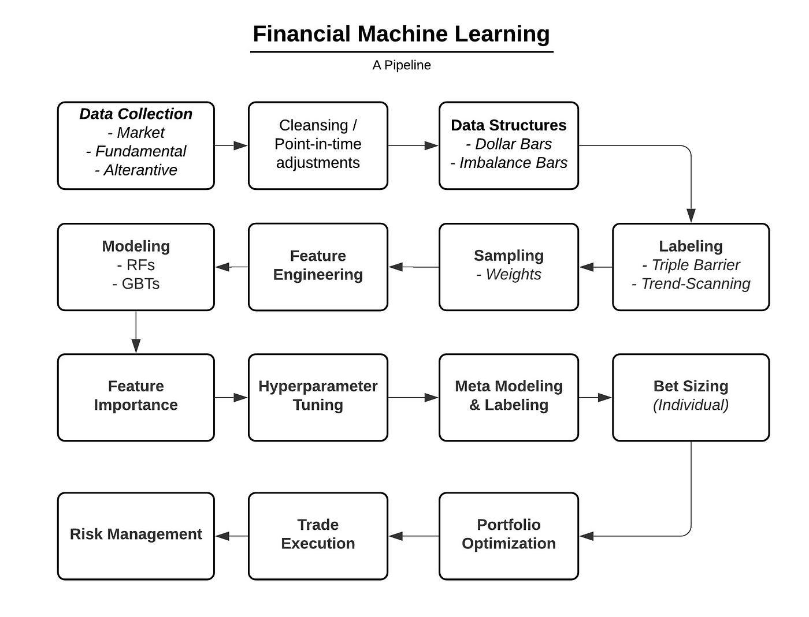

## Table of Contents

## What is feature importance in machine learning?

Feature importance in machine learning is a way to figure out which pieces of information, or "features," are most helpful when making predictions or decisions. Imagine you're trying to guess if it will rain based on the weather. You might look at the humidity, temperature, and cloud cover. Feature importance helps you understand if humidity is more important than temperature in predicting rain.

In machine learning models, like decision trees or random forests, feature importance can be calculated by seeing how much each feature affects the model's decisions. For example, if changing the humidity value often changes the model's prediction, then humidity is important. This helps data scientists focus on the most useful information and can make their models simpler and more accurate.

## How does parallelization work in computing?

Parallelization in computing is like having many workers doing different parts of a big job at the same time. Instead of one computer doing everything one after the other, parallelization splits the work into smaller pieces and lets multiple computers or parts of a computer work on them together. This can make things much faster, especially for big tasks like processing lots of data or running complex calculations.

There are different ways to do parallelization. One way is to use multiple cores in a single computer. Modern computers often have several cores, which are like mini-computers inside the main computer. Each core can work on a different part of the job. Another way is to use many computers connected together in a network. This is called distributed computing, and it's useful for really big jobs that one computer can't handle alone. By working together, these computers can finish the job much quicker than if they worked one at a time.

## Why is parallelizing feature importance calculation beneficial?

Parallelizing feature importance calculation is beneficial because it makes the process faster. When you have a lot of data and many features to analyze, calculating how important each feature is can take a long time. By using parallelization, you can split the work across multiple computers or cores. This means that instead of waiting for one computer to finish all the calculations, many computers can work on different parts at the same time, speeding up the overall process.

This speed-up is especially helpful when you need to try different models or settings to see which ones work best. In [machine learning](/wiki/machine-learning), you often need to test many different ways of doing things to find the best approach. If calculating feature importance is quick, you can try more options and make better decisions faster. This can lead to more accurate models and better predictions, which is the ultimate goal in machine learning.

## What are the common methods for calculating feature importance?

One common way to calculate feature importance is by using decision trees or random forests. In these models, you can see how much each feature helps in making decisions. For example, if a feature like "temperature" often splits the data in a way that helps the model make better predictions, then "temperature" is important. The model keeps track of how much each feature reduces uncertainty, and this is used to figure out the importance of each feature.

Another method is called permutation importance. This method works by mixing up the values of one feature at a time and seeing how it affects the model's accuracy. If mixing up the values of a feature like "humidity" makes the model's predictions worse, then "humidity" is important. This method can be used with any type of model, not just decision trees, which makes it very useful.

A third way is by using SHAP (SHapley Additive exPlanations) values. SHAP values come from game theory and help explain the output of any machine learning model. They show how much each feature contributes to the final prediction. For example, if a model predicts a high chance of rain, SHAP values can tell you how much each feature, like "cloud cover" or "wind speed," helped make that prediction. This method gives a detailed and fair way to understand feature importance.

## How can feature importance be parallelized in practice?

To parallelize feature importance calculation, you can split the data into smaller parts and have different computers or cores work on each part at the same time. For example, if you're using a decision tree, you could have one computer calculate how important a feature is for one part of the data, while another computer does the same for a different part. Once all the parts are done, you can combine the results to get the overall importance of each feature. This way, the work gets done much faster because many computers are working together.

If you're using permutation importance, you can mix up the values of a feature for different parts of the data on different computers. Each computer can see how mixing up the feature affects the model's accuracy for its part of the data. After all the computers finish, you can put the results together to see how important the feature is overall. This method works well because you can try many different permutations quickly when using multiple computers at the same time.

## What tools or libraries support parallelized feature importance?

Some popular tools and libraries that support parallelized feature importance are scikit-learn and joblib in Python. Scikit-learn is a machine learning library that has built-in support for calculating feature importance using decision trees and random forests. It can use joblib, another Python library, to split the work across multiple cores on a single computer. This makes it easy to speed up the calculation of feature importance without needing to change much of your code.

Another tool is Dask, which is great for working with big data. Dask can split your data into smaller pieces and let different computers work on them at the same time. This is useful if you have a lot of data and need to calculate feature importance quickly. Dask works well with scikit-learn, so you can use both together to make your feature importance calculations faster and handle more data.

## What are the challenges in parallelizing feature importance calculations?

One challenge in parallelizing feature importance calculations is managing how the work is split up. When you divide the data into smaller parts for different computers to work on, you need to make sure each part is balanced. If one computer gets a lot more work than the others, it can slow everything down. Also, combining the results from all the computers at the end can be tricky. You need to do it in a way that gives you the right overall importance for each feature.

Another challenge is dealing with communication between the computers. When they are working together, they need to share information. If the network is slow or if there are too many computers trying to talk at once, it can cause delays. This can make parallelizing the calculations less helpful than you might expect. It's important to set up the system in a way that keeps communication smooth and efficient.

## How does parallelized feature importance affect model performance?

Parallelized feature importance helps make models work better by making the process of finding important features faster. When you can quickly figure out which pieces of information matter most, you can spend more time trying different ways to build your model. This means you can test many different settings and choose the best ones, which leads to more accurate predictions. For example, if you find out that "temperature" is really important for predicting if it will rain, you can focus on getting the best temperature data and using it well in your model.

However, there can be some challenges with parallelizing feature importance that might affect model performance. If the work is not split evenly between computers, some might finish their part much faster than others. This can slow down the whole process. Also, if the computers need to talk to each other a lot while working, slow communication can cause delays. These issues can make parallelizing less helpful and might affect how well your model performs in the end. It's important to set things up right to get the most out of parallelizing feature importance.

## Can you explain the difference between sequential and parallel feature importance calculations?

Sequential feature importance calculations are done one step at a time, like doing chores around the house. You finish one chore before starting the next. In machine learning, this means one computer works through all the data to figure out how important each feature is. It goes through the data, makes calculations, and then moves on to the next part until it's all done. This can take a long time if you have a lot of data or many features to check.

Parallel feature importance calculations, on the other hand, are like having many helpers doing the chores at the same time. Instead of one computer doing all the work, you can split the data into smaller pieces and have different computers or parts of a computer work on them at the same time. This makes the whole process much faster because many computers are working together. However, you need to make sure the work is split evenly and that the computers can talk to each other well, or it might not be as helpful as you hope.

## What are some advanced techniques for optimizing parallelized feature importance?

One advanced technique for optimizing parallelized feature importance is using adaptive load balancing. This means the system keeps an eye on how fast each computer is working and can give more work to the ones that are done quickly. This helps make sure all the computers finish their jobs at about the same time, so the whole process doesn't get slowed down by one computer taking too long. Another way to optimize is by using efficient data distribution methods. Instead of just splitting the data evenly, you can think about how the data is used in the calculations and split it in a way that makes the most sense for the specific task. This can help reduce the amount of data that needs to be moved around between computers, which can speed things up.

Another technique is to use specialized algorithms that are designed to work well with parallel computing. For example, some algorithms can figure out feature importance by looking at smaller parts of the data and then putting the results together in smart ways. This can be faster than doing everything on the whole dataset at once. Also, using advanced data compression techniques can help. By making the data smaller before sending it to different computers, you can cut down on the time it takes to move data around. This is important because moving data can often be a big bottleneck in parallel computing.

## How does the scalability of parallelized feature importance impact large datasets?

The scalability of parallelized feature importance is really important when you have large datasets. When you have a lot of data, figuring out which pieces of information are most important can take a long time if you use just one computer. But if you use parallelization, you can split the data into smaller pieces and let many computers work on them at the same time. This makes the process much faster because instead of waiting for one computer to do all the work, many computers can help out. This means you can handle bigger datasets and still get your results quickly.

However, making parallelized feature importance work well with large datasets can be tricky. You need to make sure the work is split evenly so that no computer is left waiting for others to finish. Also, the computers need to be able to talk to each other without slowing things down. If you can set things up right, parallelized feature importance can help you work with very large datasets and find the most important features quickly. This can make your machine learning models better because you can try more options and find the best way to use your data.

## What future developments can we expect in the field of parallelized feature importance?

In the future, we might see even better ways to make parallelized feature importance calculations faster and easier to use. One thing that could happen is the creation of smarter algorithms that can figure out how to split up the work in the best way possible. These algorithms could look at the data and decide how to divide it so that all the computers finish at about the same time. This would make it easier to handle really big datasets and get results quickly. Also, new tools might be developed that can automatically set up the best way to do parallel computing for feature importance, so you don't have to figure it out yourself.

Another thing we might see is the use of more advanced technology, like quantum computing, to help with parallelized feature importance. Quantum computers can do many calculations at once in a different way than regular computers, which could make figuring out feature importance even faster. Also, as more people use cloud computing, we might see better ways to use the cloud to do these calculations. This would mean you could use a lot of computers without having to own them all yourself, making it easier and cheaper to work with big data.

## References & Further Reading

[1]: Bergstra, J., Bardenet, R., Bengio, Y., & Kégl, B. (2011). ["Algorithms for Hyper-Parameter Optimization."](https://papers.nips.cc/paper/4443-algorithms-for-hyper-parameter-optimization) Advances in Neural Information Processing Systems 24.

[2]: ["Advances in Financial Machine Learning"](https://www.amazon.com/Advances-Financial-Machine-Learning-Marcos/dp/1119482089) by Marcos Lopez de Prado

[3]: ["Evidence-Based Technical Analysis: Applying the Scientific Method and Statistical Inference to Trading Signals"](https://www.amazon.com/Evidence-Based-Technical-Analysis-Scientific-Statistical/dp/0470008741) by David Aronson

[4]: ["Machine Learning for Algorithmic Trading"](https://github.com/stefan-jansen/machine-learning-for-trading) by Stefan Jansen

[5]: ["Quantitative Trading: How to Build Your Own Algorithmic Trading Business"](https://books.google.com/books/about/Quantitative_Trading.html?id=j70yEAAAQBAJ) by Ernest P. Chan