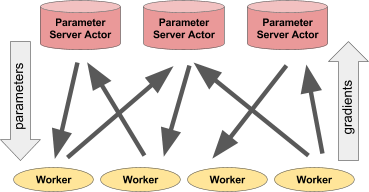

## Table of Contents

## What is a parameter server in the context of machine learning?

A parameter server in machine learning is a system used to manage and update the parameters, or weights, of a model during training. When training large models, especially in distributed environments, it can be challenging to keep all the parameters synchronized across different machines. The parameter server acts as a central hub where all the machines involved in training can send their updates and fetch the latest version of the parameters. This helps in maintaining consistency and speeding up the training process.

For example, imagine you are training a neural network on multiple computers. Each computer processes a part of the data and calculates updates for the model's parameters. Instead of each computer trying to communicate directly with every other computer, they all send their updates to the parameter server. The server then aggregates these updates, applies them to the model, and sends the updated parameters back to the computers. This way, everyone works with the same version of the model, making the training process more efficient and organized.

## How does a parameter server help in distributed machine learning?

In distributed machine learning, a parameter server acts like a central coordinator that helps keep everything in sync. When you're training a big model across many computers, each computer works on a piece of the data and figures out how to change the model's parameters. Instead of these computers trying to talk to each other directly, which can get messy and slow, they all send their updates to the parameter server. The server then combines these updates and sends the new parameters back to all the computers. This way, everyone is working with the same version of the model, making the training process smoother and faster.

For example, think of a [neural network](/wiki/neural-network) being trained on multiple machines. Each machine processes its part of the data and calculates updates for the model's weights. These updates are sent to the parameter server, which then averages them to get the new set of weights. The server then distributes these updated weights back to all the machines. This method helps avoid conflicts and ensures that all machines are using the latest version of the model, which is crucial for large-scale [machine learning](/wiki/machine-learning) tasks.

## What are the basic components of a parameter server architecture?

The basic components of a parameter server architecture are the parameter server itself and the worker nodes. The parameter server is like a central manager that keeps track of the model's parameters. It receives updates from the worker nodes, combines these updates, and sends the new parameters back to them. The worker nodes are the computers doing the actual training. They process parts of the data, calculate how to change the model's parameters, and send these changes to the parameter server.

In this setup, communication between the parameter server and the worker nodes is key. The parameter server needs to handle a lot of requests quickly to keep the training process smooth. The worker nodes need to be able to send their updates and receive new parameters without too much delay. This back-and-forth helps make sure everyone is working with the latest version of the model. By managing the parameters centrally, the parameter server helps keep everything organized and speeds up the training of large machine learning models.

## Can you explain the difference between synchronous and asynchronous parameter server updates?

In synchronous parameter server updates, all the worker nodes have to finish their calculations and send their updates to the parameter server before it can combine them and send back the new parameters. It's like waiting for everyone to finish a task before moving on to the next step. This method ensures that all the workers are always using the same version of the model, which can lead to more stable and predictable training. However, it can also slow things down because the whole process has to wait for the slowest worker to catch up.

On the other hand, asynchronous parameter server updates let the workers send their updates to the server whenever they're ready, without waiting for others. The parameter server then updates the model as soon as it gets an update, and sends the new parameters back to the worker that just updated. This can make the training process faster because workers don't have to wait for each other. But, it can also make the training less stable because different workers might be using slightly different versions of the model at the same time.

## What is Parallax and how does it improve upon traditional parameter server methods?

Parallax is a new way to handle the updates of a model's parameters during machine learning training, especially in large-scale setups. It improves on traditional parameter server methods by making the update process more efficient and less prone to delays. In traditional methods, all the worker nodes send their updates to a central parameter server, which can become a bottleneck if it gets too many requests at once. Parallax uses a different approach where it breaks down the updates into smaller pieces and spreads them across multiple servers, reducing the load on any single server and speeding up the whole process.

This method helps in two main ways. First, by spreading the updates across multiple servers, Parallax reduces the chance of any one server becoming overwhelmed and slowing down the training. Second, it allows for more flexibility in how the updates are handled, which can lead to faster convergence of the model. For example, instead of waiting for all updates to come in before processing them, Parallax can process updates as they arrive, making the training process more dynamic and responsive. This can be especially useful in large-scale distributed systems where traditional parameter server methods might struggle to keep up.

## How does Herring optimize communication in parameter server systems?

Herring is a way to make communication better in systems where a parameter server is used. It does this by grouping updates from different workers into what are called "cohorts." Instead of each worker sending updates one by one, Herring waits until it has a group of updates and then sends them all together. This makes the communication more efficient because it reduces the number of times the parameter server needs to handle updates. It's like sending a bunch of letters in one big package instead of sending each letter separately.

By using cohorts, Herring also helps to make the training process more stable. When updates are sent in groups, the parameter server can process them in a more organized way. This can lead to fewer delays and a smoother training process. Herring is especially useful in large systems where many workers are sending updates at the same time. It helps to keep everything running smoothly by making sure the parameter server isn't overwhelmed with too many individual updates.

## What are the key features of BytePS that make it suitable for large-scale deep learning?

BytePS is designed to handle the challenges of large-scale [deep learning](/wiki/deep-learning) by improving how data is moved around in a system. It does this by using a smart way to send and receive data between different computers, which makes the training process faster and more efficient. BytePS uses something called RDMA (Remote Direct Memory Access) to let computers talk to each other directly without needing to go through a central server. This cuts down on wait times and makes the system run smoother.

Another key feature of BytePS is its ability to handle different types of hardware. It can work well with both CPUs and GPUs, which means it can be used in many different setups. BytePS also has a way to keep the training process stable by managing how updates are sent and received. This helps to make sure that all the computers are working together without getting out of sync. Overall, BytePS makes large-scale deep learning easier and more efficient by focusing on better communication and flexibility with hardware.

## How does HetPipe address the challenges of heterogeneous environments in parameter server methods?

HetPipe helps with the challenges of working in environments where the computers are not all the same. It does this by figuring out the best way to split up the work so that each computer can do what it's good at. For example, if one computer is faster at processing data and another is better at sending and receiving updates, HetPipe will make sure the faster computer does more of the processing work. This way, the whole system can work together more smoothly, even if the computers are different.

By using a smart way to manage the workload, HetPipe makes sure that the training process doesn't get slowed down by the weakest computer. It also helps to keep the updates flowing smoothly between the computers. This is important because when computers are different, it can be hard to keep everything in sync. HetPipe solves this by making sure that each computer knows exactly what it needs to do and when, which helps the whole system run better.

## What are the common challenges faced when implementing parameter server methods in real-world scenarios?

One common challenge when using parameter servers in real-world scenarios is handling the communication between many computers. When lots of computers are sending updates to the parameter server at the same time, it can get overwhelmed. This can slow down the training process because the server needs to wait for all the updates before it can send back the new parameters. If one computer is slower than the others, it can make everyone else wait, which is not good for efficiency. Another issue is keeping all the computers in sync. If the updates are not handled properly, different computers might end up using different versions of the model, which can mess up the training.

Another challenge is dealing with different types of hardware. In many real-world setups, the computers might not all be the same. Some might be faster or have more memory than others. This can make it hard to split up the work evenly. If the work is not divided correctly, some computers might be doing too much while others are not doing enough. This can slow down the whole system. Also, making sure the system can handle failures is important. If one computer stops working, the system needs to keep going without losing too much progress. This requires careful planning and management to make sure the training can continue smoothly.

## How can parameter server methods be integrated with other distributed training techniques like data parallelism?

Parameter server methods can be integrated with data parallelism to make large-scale machine learning training more efficient. In data parallelism, each worker node processes a different part of the data, calculates the gradients, and then these gradients are used to update the model's parameters. The parameter server comes into play by acting as a central place where all these gradients are sent. The server then aggregates the gradients and updates the model's parameters, sending the updated parameters back to the worker nodes. This way, the parameter server helps keep the model consistent across all the nodes, even though they are processing different data.

Integrating these two techniques helps in managing the complexity of distributed training. For example, when using data parallelism, if each worker node were to directly communicate with every other node to share updates, it could lead to a lot of network traffic and potential delays. By using a parameter server, the communication is streamlined. The server handles the aggregation of gradients and the distribution of updated parameters, reducing the chance of conflicts and ensuring that all nodes are working with the latest version of the model. This combination allows for faster and more stable training of large models across many machines.

## What are the latest advancements in parameter server methods and their impact on model training efficiency?

Recent advancements in parameter server methods have focused on improving communication efficiency and scalability. One significant development is the use of techniques like Parallax, which breaks down parameter updates into smaller pieces and distributes them across multiple servers. This reduces the load on any single server, allowing for faster processing of updates. Another advancement is the integration of RDMA (Remote Direct Memory Access) technology, as seen in BytePS, which enables direct communication between nodes without going through a central server. This cuts down on communication delays, making the training process smoother and more efficient.

These advancements have a big impact on model training efficiency. By spreading the workload and reducing communication bottlenecks, models can be trained faster on larger datasets. For example, Parallax's method of handling updates in smaller chunks allows the training to continue without waiting for all updates to arrive, which can speed up convergence. Similarly, BytePS's use of RDMA helps in maintaining a high throughput of updates, ensuring that the training process remains stable even with many nodes involved. Overall, these new methods make it easier to train complex models on a large scale, leading to better performance and quicker results.

## How do you evaluate the performance of different parameter server methods in terms of scalability and convergence?

To evaluate the performance of different parameter server methods, you need to look at how well they scale and how quickly they help the model learn. Scalability means checking if the method can handle more computers without slowing down too much. You do this by adding more computers and watching how the training time changes. If the training time doesn't increase much, the method is good at scaling. Convergence is about how fast the model gets better at making predictions. You measure this by tracking the model's accuracy or loss over time. A good parameter server method will help the model reach a high accuracy or low loss quickly, even when using many computers.

To test scalability, you can start with a small number of computers and gradually add more. You'll then compare the training time and see if it stays about the same or grows slowly. For example, if adding more computers only increases the training time by a little bit, that's a sign of good scalability. To check convergence, you can plot the model's loss or accuracy over time using different parameter server methods. If one method helps the model reach a lower loss or higher accuracy faster, it's better at helping the model learn. Both scalability and convergence are important because they show how well a method can handle big data and complex models in real-world situations.

## References & Further Reading

[1]: Li, M., Andersen, D. G., Park, J. W., Smola, A. J., Ahmed, A., Josifovski, V., Long, J., Shekita, E. J., & Su, B. (2014). ["Scaling Distributed Machine Learning with the Parameter Server."](https://dl.acm.org/doi/10.5555/2685048.2685095) OSDI '14: Proceedings of the 11th USENIX Symposium on Operating Systems Design and Implementation.

[2]: Dean, J., & Ghemawat, S. (2008). ["MapReduce: Simplified Data Processing on Large Clusters."](https://dl.acm.org/doi/10.1145/1327452.1327492) Communications of the ACM, 51(1), 107-113.

[3]: Zhang, Q., Ong, S. H., & Lim, K. S. (2018). ["The Parameter Server Model - Concepts, Architectures and Applications."](https://pubmed.ncbi.nlm.nih.gov/29483548/) arXiv preprint arXiv:1809.02613.

[4]: Cui, H., Zhang, H., Ganger, G. R., Gibbons, P. B., & Xing, E. P. (2016). ["GeePS: Scalable Deep Learning on Distributed GPUs with a GPU-specialized Parameter Server."](https://dl.acm.org/doi/10.1145/2901318.2901323) ACM Transactions on Parallel Computing.

[5]: Peng, B., Yan, M., & Shi, W. (2019). ["AMP: Adaptive Model Parallelism for Deep Neural Networks."](https://www.sciencedirect.com/science/article/pii/S2095495624007514) Proceedings of the 24th Symposium on International Database Engineering & Applications.