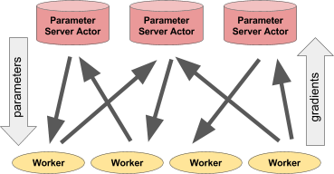

## Table of Contents

## What is a Parameter Server in the context of machine learning?

A Parameter Server in machine learning is a system used to manage and update the parameters (like weights and biases) of a model when training across multiple machines or devices. Imagine you're training a big model and you want to use several computers to speed up the process. The Parameter Server acts like a central hub where all these computers can send their updates to the model's parameters. It collects these updates, combines them, and sends back the new parameters to the computers so they can keep training with the latest information.

This setup is particularly useful in distributed machine learning, where the data or the model itself is too large to fit on a single machine. By using a Parameter Server, you can split the workload across many machines, each working on a part of the data or the model. This not only speeds up the training process but also allows for handling larger datasets and more complex models. The Parameter Server helps keep everything synchronized, ensuring that all the machines are working with the most current version of the model's parameters.

## How does a Parameter Server work in distributed machine learning?

In distributed machine learning, a Parameter Server acts like a central coordinator that helps multiple machines work together to train a model. Each machine, often called a worker, processes a part of the data and calculates updates for the model's parameters. These updates are then sent to the Parameter Server. The server collects all the updates from the workers, combines them using a method like averaging or a more complex algorithm, and then sends the updated parameters back to the workers. This way, all the workers can keep training with the latest version of the model's parameters.

This process continues in cycles, with the workers sending updates and receiving new parameters from the Parameter Server. The goal is to make sure that even though the data is split across many machines, the model is trained as if all the data were processed on a single machine. The Parameter Server ensures that the training remains synchronized and efficient, allowing for faster training times and the ability to handle larger datasets and more complex models than would be possible on a single machine.

## What are the main components of a Parameter Server architecture?

A Parameter Server architecture has two main components: the Parameter Server itself and the worker nodes. The Parameter Server is like a central hub that keeps track of all the model's parameters. It receives updates from the worker nodes, combines these updates, and then sends the new parameters back to the workers. The workers are the machines or devices that process parts of the training data. Each worker calculates how to change the model's parameters based on its part of the data and sends these changes to the Parameter Server.

The communication between the Parameter Server and the workers happens in cycles. In each cycle, the workers send their updates to the Parameter Server. The Parameter Server then uses a method to combine these updates. A common method is to simply average the updates, which can be expressed as $$ \theta_{new} = \theta_{old} + \frac{1}{N} \sum_{i=1}^{N} \Delta \theta_i $$ where $$ \theta $$ represents the model's parameters, $$ N $$ is the number of workers, and $$ \Delta \theta_i $$ is the update from worker $$ i $$. After calculating the new parameters, the Parameter Server sends them back to the workers, who then use these updated parameters to continue training on their part of the data.

This setup allows for efficient distributed training because it splits the workload across multiple machines while keeping the training process synchronized. The Parameter Server ensures that all workers are using the most current version of the model's parameters, which is crucial for the model to learn effectively from the entire dataset. This architecture is particularly useful for large-scale machine learning tasks where the data or the model is too big to handle on a single machine.

## Why is a Parameter Server useful for scaling machine learning models?

A Parameter Server is really helpful for scaling machine learning models because it lets you use many computers at the same time to train a big model. Imagine you have a huge amount of data or a very complex model that one computer can't handle alone. With a Parameter Server, you can split the work among many computers, called workers. Each worker looks at a part of the data and figures out how to change the model's parameters. Then, they send these changes to the Parameter Server, which puts all the changes together and sends the updated parameters back to the workers. This way, the model can be trained much faster and can handle more data than if you used just one computer.

The Parameter Server keeps everything organized by making sure all the workers are using the same, most recent version of the model's parameters. It does this by collecting the changes from each worker and combining them. A common way to combine these changes is by averaging them, which can be shown as $$ \theta_{new} = \theta_{old} + \frac{1}{N} \sum_{i=1}^{N} \Delta \theta_i $$. Here, $$ \theta $$ is the model's parameters, $$ N $$ is the number of workers, and $$ \Delta \theta_i $$ is the change from worker $$ i $$. By doing this, the Parameter Server helps make sure the model learns from all the data correctly, even though the data is split across many computers. This setup is great for big projects where you need to train models quickly and handle lots of data.

## Can you explain the difference between synchronous and asynchronous updates in Parameter Servers?

In a Parameter Server setup, synchronous updates mean that all the workers wait for each other before sending their updates to the Parameter Server. Once all the workers have finished their calculations, they send their updates to the server. The Parameter Server then combines all these updates, like by averaging them with the formula $$ \theta_{new} = \theta_{old} + \frac{1}{N} \sum_{i=1}^{N} \Delta \theta_i $$, and sends the new parameters back to all the workers. This way, everyone moves forward together, making sure that all workers use the same, most recent version of the model's parameters. The downside is that if one worker is slow, it can hold up the whole process.

On the other hand, asynchronous updates let workers send their updates to the Parameter Server as soon as they are ready, without waiting for others. The Parameter Server updates the model's parameters immediately after receiving an update from a worker and sends the new parameters back to that worker. This means that different workers might be working with slightly different versions of the model's parameters at the same time. Asynchronous updates can be faster because workers don't have to wait, but it can be harder to keep everything in sync, and it might take longer for the model to converge to the best solution.

## What are some common challenges faced when implementing a Parameter Server?

Implementing a Parameter Server can be tricky because it involves managing how different computers, or workers, share information with each other. One big challenge is keeping everything in sync. When workers send their updates to the Parameter Server, it has to combine them correctly, like by using the formula $$ \theta_{new} = \theta_{old} + \frac{1}{N} \sum_{i=1}^{N} \Delta \theta_i $$, and send the new parameters back to the workers. If this doesn't happen smoothly, the workers might end up using different versions of the model's parameters, which can mess up the training process.

Another challenge is dealing with slow workers. In a system where all workers need to finish their work before moving forward, a slow worker can hold up everyone else. This is called the straggler problem. To solve this, you might use asynchronous updates where workers don't have to wait for each other, but this can make it harder to keep the model's training on track. Balancing speed and accuracy is a key issue when setting up a Parameter Server.

## How does a Parameter Server handle fault tolerance and recovery?

A Parameter Server helps with fault tolerance and recovery by keeping multiple copies of the model's parameters. If one of the workers or the Parameter Server itself crashes, the system can use these copies to keep going. This is like having a backup plan. If a worker fails, the Parameter Server can just skip its updates and use the updates from the other workers to keep training the model. If the Parameter Server fails, another server can take over using the backup copies of the parameters.

Recovery in a Parameter Server system involves restarting the failed parts and getting them back in sync with the rest of the system. When a worker comes back online after a crash, it can ask the Parameter Server for the latest version of the model's parameters. The Parameter Server sends these parameters to the worker, and it can start working again. This way, even if something goes wrong, the training can continue without losing much progress. The key is to make sure the system can handle failures without stopping the whole training process.

## What are the best practices for optimizing the performance of a Parameter Server?

To optimize the performance of a Parameter Server, it's important to balance the workload among all the workers. This means making sure each worker has about the same amount of data to process. If one worker has too much work, it can slow down the whole system. Another key practice is to use efficient communication methods between the workers and the Parameter Server. This can mean using asynchronous updates where workers don't have to wait for each other, which can speed things up. But you have to be careful because asynchronous updates can make it harder to keep the model's training on track.

Another way to improve performance is by using smart ways to combine the updates from the workers. A common method is to average the updates, which can be shown as $$ \theta_{new} = \theta_{old} + \frac{1}{N} \sum_{i=1}^{N} \Delta \theta_i $$. Here, $$ \theta $$ represents the model's parameters, $$ N $$ is the number of workers, and $$ \Delta \theta_i $$ is the update from worker $$ i $$. This formula helps make sure the model learns from all the data correctly. Also, keeping multiple copies of the model's parameters can help with fault tolerance. If a worker or the Parameter Server crashes, the system can use these copies to keep going without losing much progress.

## How do Parameter Servers integrate with popular machine learning frameworks like TensorFlow or PyTorch?

Parameter Servers can be integrated with popular machine learning frameworks like TensorFlow and PyTorch to handle distributed training. In TensorFlow, you can use the `tf.distribute` API to set up a Parameter Server. This API helps manage the distribution of your model's parameters across multiple machines. You can define your model, split the data among workers, and let the Parameter Server collect and combine the updates. TensorFlow takes care of the communication between the workers and the Parameter Server, making it easier to scale your training process.

In PyTorch, you can use the `torch.distributed` package to implement a Parameter Server. PyTorch's distributed training allows you to set up a Parameter Server to manage the model's parameters. You can use methods like `torch.distributed.all_reduce` to combine the updates from the workers, similar to the formula $$ \theta_{new} = \theta_{old} + \frac{1}{N} \sum_{i=1}^{N} \Delta \theta_i $$. This helps keep the training synchronized and efficient. Both frameworks provide tools to handle the complexities of distributed training, making it easier to scale your machine learning models.

## What are some advanced techniques for managing model parameters in a Parameter Server?

Advanced techniques for managing model parameters in a Parameter Server include using adaptive learning rates for each worker. This means that the Parameter Server can adjust how much each worker's update affects the model's parameters based on how well the worker is doing. For example, if a worker's updates are leading to better model performance, the Parameter Server might increase its influence. This can be done using methods like the formula $$ \theta_{new} = \theta_{old} + \eta_i \Delta \theta_i $$ where $$ \eta_i $$ is the adaptive learning rate for worker $$ i $$. This helps the model learn faster and more effectively by giving more weight to the updates from workers that are doing well.

Another advanced technique is using compression to reduce the amount of data that needs to be sent between the workers and the Parameter Server. This can make the training process faster, especially when dealing with large models and datasets. Compression can be done by sending only the differences in the parameters instead of the full values, or by using techniques like quantization to reduce the precision of the numbers being sent. This way, the system can handle more data and train larger models without slowing down too much.

## Can you discuss a case study where a Parameter Server significantly improved machine learning model training?

In a case study from Google, researchers used a Parameter Server to train a large-scale deep learning model for speech recognition. They had a huge amount of data and a complex model that was too big for one computer to handle. By using a Parameter Server, they split the work across many machines. Each machine, or worker, processed a part of the data and sent updates to the Parameter Server. The Parameter Server combined these updates using the formula $$ \theta_{new} = \theta_{old} + \frac{1}{N} \sum_{i=1}^{N} \Delta \theta_i $$, where $$ \theta $$ is the model's parameters, $$ N $$ is the number of workers, and $$ \Delta \theta_i $$ is the update from worker $$ i $$. This allowed the model to be trained much faster and more efficiently than if they had used just one machine.

The use of the Parameter Server not only sped up the training process but also improved the model's performance. The researchers found that the model's accuracy increased because it could learn from a larger and more diverse dataset. The Parameter Server handled the synchronization of the model's parameters across all the workers, ensuring that each worker was using the most up-to-date version. This setup was crucial for handling the scale of the project, demonstrating how a Parameter Server can significantly enhance the training of machine learning models in real-world applications.

## What future developments or trends can we expect in Parameter Server technology?

In the future, we can expect Parameter Server technology to become even more efficient and scalable. One trend is the use of more advanced compression techniques to reduce the amount of data that needs to be sent between workers and the Parameter Server. This can make the training process faster, especially for very large models. Another trend is the integration of Parameter Servers with new hardware, like GPUs and TPUs, to speed up the calculations. By using these powerful processors, the Parameter Server can handle more data and make updates more quickly, which can lead to better and faster training of machine learning models.

Another development we might see is the use of more sophisticated methods for combining updates from workers. Instead of just averaging the updates with the formula $$ \theta_{new} = \theta_{old} + \frac{1}{N} \sum_{i=1}^{N} \Delta \theta_i $$, where $$ \theta $$ is the model's parameters, $$ N $$ is the number of workers, and $$ \Delta \theta_i $$ is the update from worker $$ i $$, the Parameter Server might use machine learning algorithms to decide how to best combine the updates. This could help the model learn more effectively from the data. Overall, these future developments will make Parameter Servers even more useful for training large-scale machine learning models.