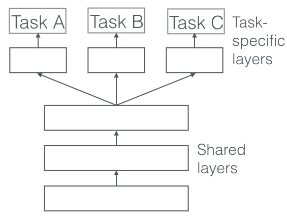

## Table of Contents

## What is parameter sharing in machine learning?

Parameter sharing in machine learning is a technique where the same set of parameters or weights are used across different parts of a model. This approach is particularly common in neural networks, such as convolutional neural networks (CNNs), where the same filter is applied across different parts of an input image. By sharing parameters, the model can learn features that are useful in multiple contexts, which can help reduce the total number of parameters needed and improve the model's ability to generalize to new data.

In practice, parameter sharing helps in reducing the complexity of the model. For example, in a CNN, instead of learning a separate set of weights for each position in the input, the same weights are used everywhere. This not only reduces the number of parameters but also allows the model to detect the same feature regardless of its position in the input. This makes the model more efficient and can lead to better performance, especially when the amount of training data is limited.

To illustrate, consider a simple CNN layer where the same filter is applied across an image. If $$W$$ represents the weights of the filter, the same $$W$$ is used at every position in the input image to produce the output feature map. This can be expressed as $$y_{i,j} = f(W \ast x_{i,j} + b)$$, where $$f$$ is the activation function, $$x_{i,j}$$ is a portion of the input image, and $$b$$ is the bias term. This shared use of $$W$$ across the image exemplifies parameter sharing in action.

## Why is parameter sharing important in neural networks?

Parameter sharing is important in neural networks because it helps make them more efficient and easier to train. When the same set of weights is used across different parts of the network, like in convolutional neural networks (CNNs), it means the network doesn't need as many parameters. This is good because fewer parameters make the network simpler and faster to train. It also means the network can work well even if there isn't a lot of training data.

Another reason parameter sharing is important is that it helps the network learn features that can be used in different places. For example, in a CNN, the same filter can find edges or patterns no matter where they are in the image. This makes the network better at recognizing things in new images it hasn't seen before. By using the same weights in different parts of the network, it can learn general ideas that work everywhere, which makes it smarter and more useful.

## How does parameter sharing help in reducing the model's complexity?

Parameter sharing helps reduce a model's complexity by using the same set of weights in different parts of the network. This means the model doesn't need as many different weights to learn from the data. For example, in a [convolutional [neural network](/wiki/neural-network)](/wiki/convolutional-neural-network) (CNN), the same filter is used across an entire image. Instead of learning a new set of weights for each part of the image, the network uses the same weights everywhere. This cuts down the total number of parameters the model needs, making it simpler and easier to train.

This reduction in parameters also makes the model more efficient. With fewer parameters, the model requires less memory and computational power to train and run. This is especially helpful when working with limited data or on devices with limited resources. By sharing parameters, the model can still learn important features without becoming too complex. For instance, in a CNN, if $$W$$ represents the weights of a filter, the same $$W$$ is applied at every position in the input image to produce the output feature map, which can be expressed as $$y_{i,j} = f(W \ast x_{i,j} + b)$$. This shared use of $$W$$ keeps the model simple while still allowing it to learn effectively.

## Can you explain the concept of weight tying in the context of parameter sharing?

Weight tying is a type of parameter sharing where the same weights are used in different parts of a neural network. Imagine you have two layers in your network that do similar jobs. Instead of learning separate weights for each layer, you can use the same weights for both. This is like sharing a tool between two people who need to do the same task. By doing this, the network needs fewer weights overall, making it simpler and easier to train.

In language models, weight tying is often used between the input embedding layer and the output layer. The idea is that the words used to understand the input can also help predict the output. So, instead of having two sets of weights, one for input and one for output, you use the same set. This can be shown with the formula $$W_{input} = W_{output}^T$$, where $$W_{input}$$ is the weight matrix for the input embeddings and $$W_{output}$$ is the weight matrix for the output layer. This technique not only reduces the number of parameters but also helps the model learn more effectively by linking the input and output processes.

## What are the benefits of using parameter sharing in convolutional neural networks?

Parameter sharing in convolutional neural networks (CNNs) helps make them more efficient and easier to train. When the same set of weights is used across different parts of an image, the network doesn't need as many different weights. This means the network can learn with fewer parameters, making it simpler and faster to train. For example, if $$W$$ represents the weights of a filter, the same $$W$$ is used at every position in the input image to produce the output feature map, which can be expressed as $$y_{i,j} = f(W \ast x_{i,j} + b)$$. This shared use of weights helps the network be more efficient, especially when there isn't a lot of training data.

Another benefit of parameter sharing in CNNs is that it helps the network learn features that can be used in different places in an image. For example, the same filter can find edges or patterns no matter where they are in the image. This makes the network better at recognizing things in new images it hasn't seen before. By using the same weights in different parts of the network, it can learn general ideas that work everywhere, which makes it smarter and more useful.

## How does parameter sharing affect the training process of a neural network?

Parameter sharing makes training a neural network easier and faster. When the same weights are used in different parts of the network, like in a [convolutional neural network](/wiki/convolutional-neural-network) (CNN), the network doesn't need as many different weights. This means it can learn with fewer parameters, which makes the training process simpler. For example, if $$W$$ represents the weights of a filter, the same $$W$$ is used at every position in the input image to produce the output feature map. This can be shown with the formula $$y_{i,j} = f(W \ast x_{i,j} + b)$$. By sharing parameters, the network needs less memory and computational power, which speeds up training.

Parameter sharing also helps the network learn features that can be used in different places. In a CNN, the same filter can find edges or patterns no matter where they are in the image. This means the network can learn general ideas that work everywhere, making it better at recognizing things in new images it hasn't seen before. This ability to generalize can make the training process more effective, especially when there isn't a lot of training data available. By using the same weights in different parts of the network, it learns more efficiently and can perform better on new tasks.

## What are some common applications of parameter sharing in deep learning?

Parameter sharing is often used in convolutional neural networks (CNNs), which are popular for tasks like image recognition. In a CNN, the same set of weights, or filters, is used across the entire image. This means that instead of learning a new set of weights for each part of the image, the network can use the same weights everywhere. For example, if $$W$$ represents the weights of a filter, the same $$W$$ is applied at every position in the input image to produce the output feature map, which can be expressed as $$y_{i,j} = f(W \ast x_{i,j} + b)$$. This helps the network learn important features like edges or patterns no matter where they appear in the image, making it easier to recognize objects in new images.

Another common application of parameter sharing is in recurrent neural networks (RNNs), which are used for tasks like language processing. In an RNN, the same weights are used for each time step in a sequence. This means the network can learn to recognize patterns in sequences of data, like words in a sentence, without needing a new set of weights for each step. This makes the network more efficient and able to handle sequences of different lengths. By sharing parameters, the network can learn general ideas that apply to all parts of the sequence, which helps it perform better on tasks like text generation or speech recognition.

## How can parameter sharing be implemented in recurrent neural networks?

In recurrent neural networks (RNNs), parameter sharing means using the same weights for each step in a sequence. Imagine you're reading a sentence word by word. Instead of learning new weights for each word, the RNN uses the same weights for all words. This helps the network learn patterns that appear throughout the sequence, like grammar rules or common phrases. By sharing parameters, the RNN can handle sentences of different lengths without needing more weights, making it more efficient and easier to train.

To show how this works, let's say $$W$$ represents the weights used at each step in the RNN. At each time step $$t$$, the network uses these weights to process the current input $$x_t$$ and the previous hidden state $$h_{t-1}$$ to produce the next hidden state $$h_t$$. This can be expressed as $$h_t = f(W \cdot [h_{t-1}, x_t] + b)$$, where $$f$$ is the activation function and $$b$$ is the bias term. By using the same $$W$$ at every step, the RNN learns to recognize patterns that are useful across the entire sequence, making it better at tasks like language translation or speech recognition.

## What are the potential drawbacks or limitations of using parameter sharing?

While parameter sharing can make neural networks simpler and easier to train, it can also limit what the network can learn. By using the same weights in different parts of the network, the model might miss out on learning unique features that are important in specific places. For example, in a convolutional neural network (CNN), using the same filter everywhere might not be as good as using different filters for different parts of an image, where some details might be more important than others. This can make the network less flexible and less able to capture all the details it needs to perform at its best.

Another potential drawback of parameter sharing is that it can make the network more sensitive to overfitting in certain situations. If the shared weights are too focused on one part of the data, they might not work well for other parts. This can happen if the training data isn't varied enough, and the network learns patterns that don't apply to new data. For instance, in a recurrent neural network (RNN), using the same weights for each step in a sequence might cause the network to learn patterns that are too specific to the training data, making it less effective on new sequences. This means that while parameter sharing can help with efficiency, it's important to balance it with the need for the network to learn a wide range of features.

## How does parameter sharing contribute to transfer learning?

Parameter sharing helps in transfer learning by allowing models to use the same weights across different tasks. When you train a model on one task and then want to use it for another task, parameter sharing means you can start with the weights you already learned. This saves time because the model doesn't need to learn everything from scratch. For example, if you trained a model to recognize cats and dogs, you can use those same weights to help the model learn to recognize other animals. This makes transfer learning faster and more efficient.

In practice, parameter sharing in transfer learning often involves using pre-trained models like those from convolutional neural networks (CNNs). These models have learned useful features from a large dataset, and by sharing the weights, you can apply these features to new tasks. For instance, if $$W$$ represents the weights of a filter in a CNN, the same $$W$$ can be used to detect edges or patterns in different types of images. This shared knowledge helps the model adapt quickly to new tasks, even if the new data is different from the original training data.

## Can you discuss advanced techniques that build upon parameter sharing, such as multi-task learning?

Multi-task learning is an advanced technique that builds upon parameter sharing by training a model to perform multiple tasks at the same time. Instead of learning separate models for each task, multi-task learning uses the same set of weights to help the model learn from all tasks together. This can make the model smarter and better at each task because it learns useful features from all of them. For example, if you're training a model to recognize both cats and dogs, and also to classify different types of cars, the model can use the same weights to learn about edges and shapes that are important for all these tasks. By sharing parameters, the model can learn more efficiently and perform better on new tasks.

In multi-task learning, parameter sharing helps the model find common patterns across different tasks. If $$W$$ represents the weights used in the model, the same $$W$$ can be used to process different types of data for different tasks. This shared use of weights means the model can learn general ideas that work for all tasks, making it more flexible and able to handle new challenges. For example, if you're training a model to translate languages and also to answer questions, the model can use the same weights to understand the structure of sentences, which helps it perform both tasks better. By using parameter sharing in multi-task learning, the model can become more versatile and effective.

## What are the latest research trends and developments related to parameter sharing in machine learning?

Recent trends in parameter sharing within [machine learning](/wiki/machine-learning) have focused on enhancing the efficiency and adaptability of models. One significant development is the rise of transformer-based architectures, like BERT and its variants, which extensively use parameter sharing across different layers and attention heads. These models share weights to learn contextual relationships in text, allowing them to perform well on a wide range of natural language processing tasks. Researchers are exploring ways to further optimize these models by fine-tuning shared parameters for specific tasks, which can lead to better performance without significantly increasing the model's complexity. For example, techniques like adapter modules allow for task-specific fine-tuning while keeping the majority of the model's parameters shared.

Another trend is the application of parameter sharing in federated learning, where models are trained across multiple decentralized devices or servers holding local data samples. In this setting, parameter sharing helps in reducing communication overhead and improving privacy. By sharing parameters, models can learn from diverse data sources without needing to exchange raw data, which is crucial for privacy-sensitive applications. Recent research has also looked into dynamic parameter sharing, where the extent of sharing can change during training based on the model's performance or the nature of the task. This approach can help models adapt more effectively to new data or tasks, enhancing their generalization capabilities.

## References & Further Reading

[1]: LeCun, Y., Bottou, L., Bengio, Y., & Haffner, P. (1998). ["Gradient-based learning applied to document recognition."](https://ieeexplore.ieee.org/document/726791) Proceedings of the IEEE, 86(11), 2278-2324.

[2]: Goodfellow, I., Bengio, Y., & Courville, A. (2016). ["Deep Learning."](https://www.deeplearningbook.org/) MIT Press.

[3]: Vaswani, A., Shazeer, N., Parmar, N., Uszkoreit, J., Jones, L., Gomez, A. N., Kaiser, Ł., & Polosukhin, I. (2017). ["Attention Is All You Need."](https://arxiv.org/abs/1706.03762) arXiv preprint arXiv:1706.03762.

[4]: Devlin, J., Chang, M. W., Lee, K., & Toutanova, K. (2019). ["BERT: Pre-training of Deep Bidirectional Transformers for Language Understanding."](https://aclanthology.org/N19-1423/) arXiv preprint arXiv:1810.04805.

[5]: Brown, T. B., Mann, B., Ryder, N., Subbiah, M., Kaplan, J., Dhariwal, P., Neelakantan, A., Shyam, P., Sastry, G., Askell, A., Agarwal, S., Herbert-Voss, A., Krueger, G., Henighan, T., Child, R., Ramesh, A., Ziegler, D. M., Wu, J., Winter, C., Hesse, C., Chen, M., Sigler, E., Litwin, M., Gray, S., Chess, B., Clark, J., Berner, C., McCandlish, S., Radford, A., Sutskever, I., & Amodei, D. (2020). ["Language Models are Few-Shot Learners."](https://arxiv.org/abs/2005.14165) arXiv preprint arXiv:2005.14165.