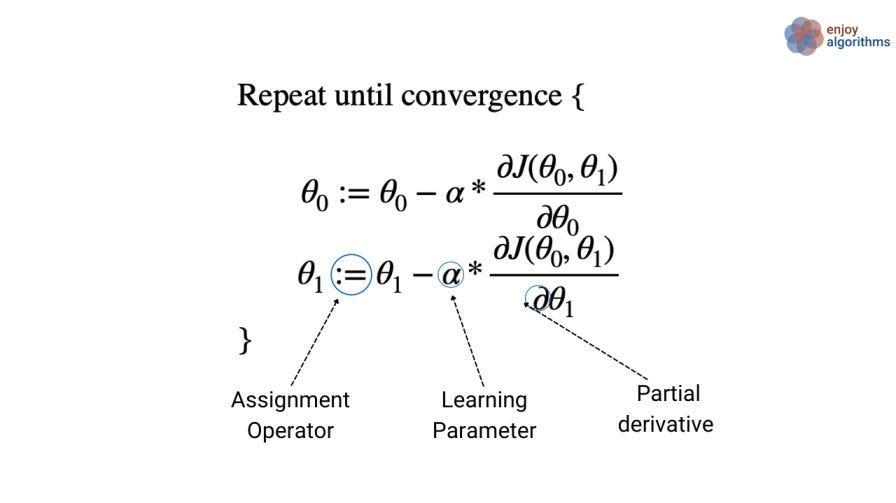

## Table of Contents

## What is a parameter in the context of machine learning?

In machine learning, a parameter is a value that a model learns from the data during training. Think of it as a setting that the model adjusts to improve its performance. For example, in a simple linear regression model, the parameters are the slope and the intercept of the line that best fits the data. The model tweaks these values to minimize the difference between its predictions and the actual outcomes.

Parameters are crucial because they allow the model to capture patterns and relationships in the data. The process of finding the best parameters is called training or learning. During training, the model uses an algorithm to iteratively adjust its parameters, trying to get as close as possible to the true underlying function that generated the data. This is often done by minimizing a loss function, which measures how wrong the model's predictions are. Once trained, the model uses these learned parameters to make predictions on new, unseen data.

## Why is updating parameters important in machine learning models?

Updating parameters is important in machine learning models because it helps the model learn from the data. When a model starts, its parameters are usually set randomly or with some initial guess. As the model sees more data, it adjusts these parameters to better fit the patterns in that data. This process of updating parameters is what allows the model to improve its predictions over time. If the parameters were not updated, the model would not be able to learn and would keep making the same mistakes.

Think of it like tuning a musical instrument. When you first start, the instrument might be out of tune, and the music sounds off. But as you adjust the strings or keys, the sound gets better and better. In machine learning, updating the parameters is like tuning the instrument. Each adjustment brings the model closer to playing the right notes, or in this case, making accurate predictions. Without these updates, the model would be like an untuned instrument, unable to produce good music or good predictions.

## What is the difference between a parameter and a hyperparameter?

In [machine learning](/wiki/machine-learning), a parameter is something that the model learns from the data. It's like a setting that the model adjusts by itself to make better predictions. For example, in a simple linear regression model, the parameters are the slope and the intercept of the line. The model changes these values to fit the data better. These parameters are learned during the training process, and they help the model capture the patterns in the data.

A hyperparameter, on the other hand, is a setting that you, the person making the model, choose before the training starts. It's like a dial that you set to control how the model learns. For example, the learning rate is a hyperparameter that decides how big the steps are when the model is adjusting its parameters. Unlike parameters, hyperparameters are not learned from the data; you have to pick them yourself. Choosing the right hyperparameters can make a big difference in how well the model performs.

To sum up, parameters are what the model learns to fit the data, while hyperparameters are what you set to control how the model learns. Both are important, but they serve different purposes in the machine learning process.

## How does gradient descent work to update parameters?

Gradient descent is a way to help a machine learning model find the best parameters. Imagine you're at the top of a hill and you want to get to the bottom. You start walking downhill, and with each step, you try to go in the direction that will get you down the fastest. In gradient descent, the "hill" is a function called the loss function, which measures how wrong the model's predictions are. The goal is to find the parameters that make the loss function as small as possible, which means the model's predictions are as accurate as possible. To do this, the model looks at the gradient of the loss function, which tells it which way to go to make the loss smaller. It then takes a step in that direction, updating its parameters a little bit.

The size of the step the model takes is controlled by something called the learning rate. If the learning rate is too big, the model might take big steps and miss the bottom of the hill. If it's too small, the model will take tiny steps and take a long time to get to the bottom. The model keeps taking steps and updating its parameters until it gets close enough to the bottom of the hill, or until it stops making much progress. This process of updating the parameters using gradient descent helps the model learn from the data and make better predictions.

## What are some common optimization algorithms used for parameter updates?

Gradient descent is a popular method for updating parameters in machine learning models. It works by taking steps in the direction that reduces the loss function the most. The size of the step is controlled by the learning rate. If the learning rate is too big, the model might jump over the best solution. If it's too small, it will take a long time to find the best solution. There are different versions of gradient descent, like batch gradient descent, which uses all the data to calculate the gradient, and stochastic gradient descent, which uses just one data point at a time. This makes stochastic gradient descent faster but also a bit noisier.

Another common method is Adam, which stands for Adaptive Moment Estimation. Adam combines ideas from other optimization algorithms to make it good at handling different types of data. It adjusts the learning rate for each parameter, which can help the model learn faster and more accurately. Adam is often used in [deep learning](/wiki/deep-learning) because it works well with large datasets and complex models. It's like a smart version of gradient descent that can adapt to the data it's working with.

There are also other methods like RMSprop and Adagrad. RMSprop helps the model learn by adjusting the learning rate based on the average of recent gradients. This can help the model learn more smoothly. Adagrad, on the other hand, adapts the learning rate for each parameter based on how much it has changed in the past. This can be helpful for data where some features are more important than others. Each of these algorithms has its own strengths and is chosen based on the specific needs of the model and the data.

## How does the learning rate affect parameter updates?

The learning rate is like a dial that controls how fast a machine learning model learns. When you update the model's parameters using gradient descent, the learning rate decides how big each step is. If the learning rate is too big, the model might take huge steps and jump over the best solution, like missing the bottom of a hill when you're trying to walk down it. This can make the model's performance unstable because it might keep overshooting the right answer. On the other hand, if the learning rate is too small, the model will take tiny steps, which means it will take a long time to find the best solution. It's like trying to get to the bottom of a hill by taking baby steps; you'll eventually get there, but it will take forever.

Finding the right learning rate is important because it helps the model learn quickly and accurately. If you set the learning rate just right, the model will take steps that are big enough to make good progress but small enough to avoid overshooting the best solution. This balance helps the model smoothly adjust its parameters to fit the data better. In practice, people often try different learning rates to see which one works best for their specific problem. This process of tuning the learning rate can make a big difference in how well the model performs.

## What is the role of loss functions in parameter updates?

The loss function is like a scorecard that tells a machine learning model how well it's doing. When the model makes predictions, the loss function measures the difference between those predictions and the actual outcomes. The goal is to make this difference as small as possible. To do this, the model uses the loss function to figure out how to change its parameters. If the loss is high, it means the model's predictions are off, and it needs to adjust its parameters to get closer to the right answers. The loss function guides these adjustments by showing the model which direction to move to reduce the error.

During training, the model uses an optimization algorithm like gradient descent to update its parameters. The gradient of the loss function tells the model which way to go to make the loss smaller. For example, if the loss function is $$L(\theta)$$, where $$\theta$$ represents the model's parameters, the gradient $$\nabla L(\theta)$$ points in the direction of the steepest increase in the loss. By taking steps in the opposite direction of the gradient, the model can reduce the loss. The size of these steps is controlled by the learning rate. Over time, as the model keeps updating its parameters to minimize the loss, it learns to make better predictions.

## Can you explain the concept of backpropagation in relation to parameter updates?

Backpropagation is a way to help a [neural network](/wiki/neural-network) learn by figuring out how to change its parameters to make better predictions. Imagine you're trying to solve a puzzle, and you make a guess. If your guess is wrong, you need to know how to adjust your guess to get closer to the right answer. Backpropagation does this for a neural network. It calculates how much each parameter contributed to the error in the network's predictions, then uses this information to update the parameters in a way that reduces the error. This process happens layer by layer, starting from the output layer and moving backwards to the input layer, which is why it's called "backpropagation."

The key to backpropagation is the chain rule from calculus. If the loss function is $$L$$ and the network's parameters are $$\theta$$, backpropagation uses the gradient $$\nabla L(\theta)$$ to figure out how to adjust $$\theta$$ to make $$L$$ smaller. The gradient tells the network which way to move to reduce the loss. By applying the chain rule, the network can calculate the gradient for each layer, starting from the output and working backwards. This allows the network to update its parameters in a way that minimizes the loss, helping it learn from its mistakes and make better predictions over time.

## How do batch size and mini-batch gradient descent impact parameter updates?

Batch size is an important setting in training machine learning models, especially when using gradient descent. It decides how many examples the model looks at before it updates its parameters. In batch gradient descent, the model uses all the data at once to calculate the gradient and update the parameters. This can be slow because it has to go through all the data every time, but it gives a very accurate estimate of the gradient. On the other hand, in stochastic gradient descent, the model looks at just one example at a time. This is much faster, but the updates can be a bit jumpy because the gradient is based on just one example.

Mini-batch gradient descent is a middle ground between batch and stochastic gradient descent. It uses a small group of examples, called a mini-batch, to calculate the gradient and update the parameters. The size of the mini-batch is the batch size, and it can be adjusted to balance speed and accuracy. A larger batch size can give a more stable estimate of the gradient, but it might take longer to process. A smaller batch size can make the training faster, but the updates might be less accurate. Choosing the right batch size can help the model learn more efficiently and find the best parameters to make good predictions.

## What are the challenges of parameter updates in deep learning models?

Updating parameters in deep learning models can be tricky because these models have a lot of layers and parameters. One big challenge is the vanishing gradient problem. This happens when the gradients get smaller and smaller as they move back through the layers of the network. When the gradients are too small, the model can't update its parameters effectively, and it struggles to learn. Another challenge is the exploding gradient problem, where the gradients get too big, causing the updates to be too large and making the model's performance unstable. Both of these problems can make it hard for the model to learn the right parameters to make good predictions.

Another challenge is choosing the right learning rate. If the learning rate is too high, the model might overshoot the best solution, making its performance unstable. If it's too low, the model will take a long time to learn, and it might get stuck in a bad spot. Finding the right balance can be difficult and often requires trying different values. Also, deep learning models need a lot of data to train well. If the data is limited or not representative of the real world, the model might not learn the right parameters, leading to poor performance on new data. These challenges make it important to carefully tune the model and the training process to get the best results.

## How can techniques like momentum and adaptive learning rates improve parameter updates?

Momentum is like giving the model a push to help it keep moving in the right direction. When updating parameters, the model looks at the gradient to decide which way to go. But sometimes, the gradient can be noisy, making the updates jump around. Momentum helps by adding a bit of the previous update to the current one. This smooths out the updates and helps the model move more steadily towards the best solution. It's like rolling a ball down a hill; the ball keeps going even if the slope changes a bit, helping it get to the bottom faster.

Adaptive learning rates, like those used in algorithms such as Adam, help the model learn at the right speed. Instead of using the same learning rate for all parameters, these methods adjust the learning rate for each parameter based on how it's doing. For example, if a parameter is changing a lot, the learning rate might be lowered to make the updates smaller and more careful. If a parameter isn't changing much, the learning rate might be increased to help it learn faster. This can make the training process more efficient and help the model find the best parameters more quickly.

## What advanced methods exist for parameter updates in state-of-the-art machine learning models?

One advanced method for parameter updates is the use of second-order optimization techniques, like Newton's method or the L-BFGS algorithm. These methods look at the curvature of the loss function, not just the direction of the steepest descent. By considering how the loss function changes as the parameters change, these methods can take more direct steps towards the best solution. This can make the training process faster and more efficient, especially for complex models with many parameters. However, these methods can be more computationally expensive than first-order methods like gradient descent, so they're not always used in practice.

Another advanced technique is the use of meta-learning, or learning to learn. This approach trains a model to figure out how to update its own parameters. For example, a model might learn to adjust its learning rate or choose the best optimization algorithm for a given task. This can help the model adapt quickly to new data or tasks, making it more flexible and efficient. Meta-learning is often used in few-shot learning, where the model needs to learn from just a few examples. By learning how to learn, the model can improve its parameter updates and perform better on a wide range of problems.