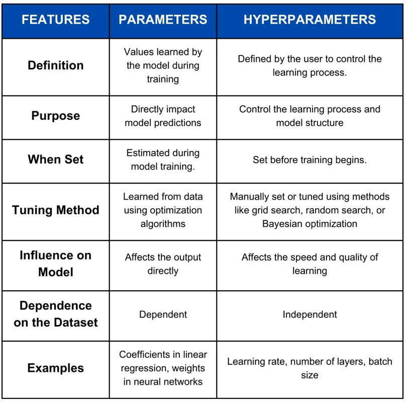

## Table of Contents

## What is a parameter in the context of machine learning?

In machine learning, a parameter is a value that a model learns from the data during training. Think of it as a setting or a dial that the model adjusts to make better predictions. For example, in a simple linear regression model, the parameters are the slope and the intercept of the line that best fits the data. These parameters are tweaked automatically by the model to minimize the error between the predicted and actual values.

Parameters are crucial because they define the model's behavior. The better the parameters are set, the more accurate the model's predictions will be. During training, the model uses algorithms like gradient descent to find the best values for these parameters. This process involves feeding the data through the model, calculating the error, and then adjusting the parameters to reduce that error. Over time, the model learns the optimal parameters that allow it to make the best possible predictions on new, unseen data.

## How do parameters differ from hyperparameters in machine learning models?

In machine learning, parameters are the values that a model learns from the data during training. They are the internal settings that the model adjusts to make better predictions. For example, in a simple linear regression model, the parameters are the slope and the intercept of the line that best fits the data. These parameters are automatically tuned by the model using algorithms like gradient descent, which tries to minimize the error between the predicted and actual values. The better the parameters are set, the more accurate the model's predictions will be.

Hyperparameters, on the other hand, are settings that are set before training begins and are not learned from the data. They control the overall behavior of the model and the training process. Examples of hyperparameters include the learning rate in gradient descent, the number of layers in a neural network, or the number of clusters in a clustering algorithm. Hyperparameters are usually set by the user or tuned through techniques like cross-validation or grid search. While parameters are learned and adjusted during training, hyperparameters need to be chosen carefully because they can significantly affect how well the model learns and performs.

To illustrate the difference, consider a simple linear regression model. The parameters of this model are the slope $$m$$ and the intercept $$b$$ in the equation $$y = mx + b$$. These are learned from the data. In contrast, a hyperparameter might be the regularization strength, which is set before training and affects how the model generalizes to new data. While the model automatically adjusts the parameters to fit the data, the hyperparameters must be chosen by the user to guide the learning process effectively.

## Can you explain the role of parameters in neural networks?

In neural networks, parameters are the values that the network learns during training. These parameters include the weights and biases of the network. Think of weights as the strength of connections between neurons, and biases as a way to adjust the output of a neuron. During training, the [neural network](/wiki/neural-network) adjusts these weights and biases to make better predictions. For example, if you're trying to recognize handwritten digits, the network will tweak its parameters to correctly identify whether an image is a '1' or a '9'. The goal is to find the best set of parameters that minimize the error between the network's predictions and the actual values.

The process of adjusting these parameters is done through algorithms like gradient descent. Imagine you're trying to find the lowest point in a valley. You take steps downhill, and with each step, you adjust your direction to keep going down. In neural networks, gradient descent does something similar. It calculates how changing each parameter affects the overall error and then adjusts the parameters to reduce that error. Over many iterations, the network learns the optimal parameters that allow it to make accurate predictions on new data. This learning process is what makes neural networks powerful tools for tasks like image recognition, language translation, and many others.

## What is the process of parameter estimation in machine learning?

Parameter estimation in [machine learning](/wiki/machine-learning) is the process of finding the best values for the parameters of a model. These parameters are the internal settings that the model adjusts to make better predictions. For example, in a simple linear regression model, the parameters are the slope and the intercept of the line that best fits the data. The goal is to find the values of these parameters that minimize the difference between the model's predictions and the actual values. This difference is often measured by a loss function, like the mean squared error, which calculates the average of the squared differences between predicted and actual values.

The process of parameter estimation usually involves an optimization algorithm, like gradient descent. Imagine you're trying to find the lowest point in a valley. You take steps downhill, and with each step, you adjust your direction to keep going down. In machine learning, gradient descent does something similar. It calculates how changing each parameter affects the overall error and then adjusts the parameters to reduce that error. Over many iterations, the model learns the optimal parameters that allow it to make accurate predictions on new data. This learning process is what makes machine learning models powerful tools for tasks like image recognition, language translation, and many others.

## How does the choice of model affect the number of parameters?

The choice of model directly affects the number of parameters because different models have different structures. For example, a simple linear regression model has only two parameters: the slope and the intercept, represented as $$y = mx + b$$. In contrast, a polynomial regression model can have many more parameters because it includes higher-order terms. If you fit a polynomial of degree 2, you'll have three parameters: $$y = ax^2 + bx + c$$. As the degree of the polynomial increases, so does the number of parameters, making the model more complex.

In more advanced models like neural networks, the number of parameters can grow even larger. A neural network's parameters include the weights and biases of each neuron. The number of parameters depends on the number of layers, the number of neurons in each layer, and the connections between them. For instance, a neural network with many layers and neurons will have thousands or even millions of parameters. This complexity allows the model to learn and represent more intricate patterns in the data, but it also makes the model harder to train and more prone to overfitting.

## What are the common techniques used for parameter tuning?

Parameter tuning is the process of finding the best values for a model's parameters to make better predictions. One common technique for parameter tuning is called grid search. In grid search, you try out different combinations of parameter values. For example, if you're tuning a model with two parameters, you might test all combinations of values like 0.1, 0.5, and 1.0 for each parameter. You then pick the combination that gives the best results. This method is simple but can be time-consuming because it tries every possible combination.

Another technique is random search, which is similar to grid search but faster. Instead of trying every combination, random search picks random values for the parameters. This can be quicker because it doesn't test every possible combination, but it can still find good parameter values. For example, if you're tuning a model, random search might try values like 0.34 and 0.87 for one parameter and 0.12 and 0.98 for another. If you find a good combination, you can use it to improve your model.

A more advanced technique is called Bayesian optimization. This method uses probability to guide the search for the best parameter values. It starts with some guesses and then uses the results to make better guesses. For example, if you're tuning a model, Bayesian optimization might start with values like 0.5 for one parameter and 0.7 for another. It then uses the results to decide which values to try next, getting closer to the best values each time. This method can be very effective, especially for complex models with many parameters.

## How do parameters impact the model's performance and generalization?

Parameters are the values that a model learns during training, like the slope and intercept in a simple linear regression model, represented as $$y = mx + b$$. These parameters are crucial because they directly affect how well the model can predict new data. If the parameters are well-tuned, the model can make accurate predictions. But if they're not, the model might make bad predictions. For example, if the slope and intercept in a linear regression model are far from the best values, the line won't fit the data well, and the model's predictions will be off.

The choice of parameters also affects how well a model generalizes to new, unseen data. Generalization means the model can make good predictions on data it hasn't seen before. If a model has too many parameters, it might learn the training data too well, including the noise or random fluctuations. This is called overfitting. For example, a polynomial regression model with a high degree, like $$y = ax^4 + bx^3 + cx^2 + dx + e$$, might fit the training data perfectly but fail to predict new data accurately. On the other hand, if a model has too few parameters, it might not capture the important patterns in the data, leading to underfitting. Finding the right balance in the number of parameters helps the model generalize better and make reliable predictions on new data.

## What is the significance of parameter initialization in training machine learning models?

Parameter initialization is really important when you start training a machine learning model. It's like setting the starting point for a journey. If you start in a good place, it's easier to reach your destination. In machine learning, good parameter initialization can help the model learn faster and find better solutions. For example, in a neural network, if you start with weights that are too big or too small, the model might take a long time to learn or might not learn at all. By starting with good initial values, you give the model a better chance to find the best parameters quickly.

One common way to initialize parameters is to use random values. For example, you might set the weights in a neural network to small random numbers. This helps the model start from different places each time you train it, which can be good for finding the best solution. Another method is to use specific initialization techniques, like Xavier or He initialization, which are designed to help the model learn better. These methods set the initial values in a way that helps the model's learning process. Good parameter initialization can make a big difference in how well and how quickly your model learns to make good predictions.

## Can you discuss the concept of parameter sharing in deep learning?

Parameter sharing in [deep learning](/wiki/deep-learning) is a technique where the same set of parameters, like weights and biases, are used across different parts of a model. This is really helpful in models like convolutional neural networks (CNNs), where the same filters are applied to different parts of an image. For example, if a model is trying to recognize edges in a picture, it can use the same set of parameters to look for edges in different areas of the image. This not only reduces the number of parameters the model needs to learn, which makes training easier and faster, but also helps the model generalize better because it learns features that are useful across the entire input.

In another example, consider recurrent neural networks (RNNs) used for processing sequences like text or time series data. Here, parameter sharing means using the same weights to process each step of the sequence. So, if you're trying to predict the next word in a sentence, the model uses the same set of parameters to look at each word in the sentence. This way, the model can learn patterns that apply across the whole sequence, like grammar rules or common phrases. By sharing parameters, the model can learn more efficiently and perform better on tasks that involve sequences.

## How do regularization techniques affect model parameters?

Regularization techniques help prevent a model from overfitting by adding a penalty to the loss function. Overfitting happens when a model learns the training data too well, including the noise or random fluctuations, and then does poorly on new data. Regularization adds a term to the loss function that discourages the model from having very large parameter values. For example, in L2 regularization, also known as ridge regression, the penalty term is the sum of the squares of the parameters, represented as $$\lambda \sum_{i=1}^{n} \theta_i^2$$, where $$\lambda$$ is a hyperparameter that controls the strength of the penalty, and $$\theta_i$$ are the model's parameters. By adding this penalty, the model is encouraged to keep its parameters small, which helps it generalize better to new data.

In L1 regularization, also known as Lasso regression, the penalty term is the sum of the absolute values of the parameters, represented as $$\lambda \sum_{i=1}^{n} |\theta_i|$$. This type of regularization can drive some parameters to exactly zero, effectively performing feature selection by removing less important features from the model. Both L1 and L2 regularization affect the model's parameters by pushing them towards smaller values, but they do so in different ways. L2 regularization tends to shrink all parameters equally, while L1 regularization can set some parameters to zero, making it useful for models where you want to identify the most important features. By using regularization, you can train models that perform better on new, unseen data by controlling the complexity of the model through its parameters.

## What are the challenges associated with high-dimensional parameter spaces?

High-dimensional parameter spaces can make training a machine learning model really hard. When a model has a lot of parameters, like in a big neural network, it can take a long time to find the best values for all of them. This is because the model has to search through a huge space of possible parameter values. Imagine trying to find the lowest point in a very big and bumpy valley. It's hard to know which way to go, and you might get stuck in a spot that's not the best. This problem is called the curse of dimensionality, and it can make training slow and tricky.

Another challenge is that models with high-dimensional parameter spaces can easily overfit. Overfitting happens when a model learns the training data too well, including the random noise, and then does poorly on new data. With so many parameters, the model can fit the training data perfectly but won't be good at making predictions on new data. To deal with this, you can use techniques like regularization, which adds a penalty to the loss function to keep the parameters from getting too big. For example, L2 regularization adds a term like $$\lambda \sum_{i=1}^{n} \theta_i^2$$ to the loss function, where $$\lambda$$ is a hyperparameter and $$\theta_i$$ are the model's parameters. This helps the model generalize better to new data by keeping the parameters in check.

## How can one interpret the importance of different parameters in a trained model?

Understanding how important different parameters are in a trained model can help you see which parts of the model are most useful for making predictions. One way to do this is by looking at the size of the parameters. In models like linear regression, where the equation is $$y = mx + b$$, the parameter $$m$$ (the slope) tells you how much the output changes when the input changes. If $$m$$ is a big number, it means that input is really important for the prediction. Another way is to use techniques like feature importance, which can tell you which inputs the model relies on the most. For example, in a decision tree, you can see which features are used at the top of the tree, meaning they're more important for splitting the data.

Another method to interpret parameter importance is through techniques like permutation importance. This involves randomly shuffling one feature at a time and seeing how much it affects the model's performance. If shuffling a feature makes the model's predictions worse, that feature (and its associated parameters) is important. For example, if you shuffle the 'age' feature in a dataset and the model's accuracy drops a lot, it means the parameters related to 'age' are crucial for the model's predictions. By using these methods, you can get a clearer picture of which parameters are driving the model's decisions, helping you understand and improve the model.