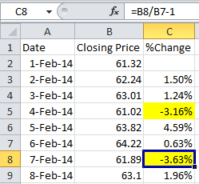

Algorithmic trading, often referred to as algo trading, has fundamentally transformed financial markets by leveraging high-speed capabilities and data-driven strategies. This approach enables traders to execute vast numbers of trades with precision and efficiency, harnessing the power of modern computing technology. A significant development in this field is the advent of parameterless trading models, which have attracted attention due to their simplicity and robustness.

Traditional algorithmic strategies often depend on fixed parameters that need constant optimization and adjustment in response to volatile market conditions. In contrast, parameterless trading models operate without such predefined parameters, allowing them to adjust dynamically to varying market environments. This flexibility potentially reduces the risk of overfitting—a common issue where models perform well on historical data but fail in real-time trading.



This article will explore parameterless trading models in algo trading. These models, rooted in fundamental market principles, promise to simplify strategy development while maintaining adaptability across diverse market scenarios. By focusing on the core tenets of these models and their applications, traders can uncover new opportunities and insights within the rapidly evolving landscape of algorithmic trading.

Understanding these models is essential for traders aiming to enhance their strategic arsenal. As markets continue to evolve, parameterless models offer the potential for creating more resilient and adaptable trading strategies, opening avenues for improved performance and reduced maintenance efforts. This exploration aims to equip traders with a deeper comprehension of these innovative models and their practical applications in professional trading environments.

## Table of Contents

## Understanding Parameterless Trading Models

Parameterless trading models represent a unique approach within [algorithmic trading](/wiki/algorithmic-trading) by eschewing fixed parameters and extensive data fitting for their decision-making processes. These models are designed to leverage intuitive market principles that remain flexible across varying market conditions, reducing the need for frequent adjustments.

Traditional trading strategies often hinge on precise parameters—such as specific buy and sell thresholds or optimized moving averages—which necessitate ongoing recalibration to adapt to new data or shifting market dynamics. This dependency on parameter specification poses the risk of overfitting, whereby a strategy performs well only on historical data but fails to generalize to future market movements. Overfitting occurs when a model becomes excessively complex, adapting closely to the noise rather than the signal, leading to suboptimal performance in live markets.

In contrast, parameterless models aim to establish universal principles that intrinsically possess the capability to operate effectively across a wide array of market environments. This adaptability is achieved by focusing on broader, less rigid indicators and rules that capture fundamental market behaviors rather than transient patterns.

A quintessential component of parameterless models is their robustness. By minimizing reliance on localized and potentially spurious data patterns, these models maintain stability and predictability, enhancing their applicability across diverse scenarios. For example, strategies like moving average crossovers can be adjusted to be parameterless by forgoing specific period lengths in favor of general rules regarding asset movement and crossover trends, thus maintaining effectiveness without excessive optimization.

By simplifying the strategy development process, parameterless models allow traders to focus on core market dynamics rather than the minutiae of specific parameter settings. This not only streamlines the initial development process but also reduces the ongoing maintenance required to keep the strategies aligned with evolving market conditions.

In implementation, parameterless models tend to emphasize the use of real-time, on-the-fly calculations based on broad data streams rather than retrospective fits. This forward-looking approach helps avoid the pitfalls associated with fitting models too closely to past data. By embracing simplicity and adaptability, parameterless trading models present a compelling alternative to more conventional, parameterized strategies, aligning closely with the principles of robustness, universality, and reduction of overfitting in the pursuit of effective and reliable trading performance.

## Benefits of Parameterless Models in Algo Trading

Parameterless trading models offer notable benefits in algorithmic trading, primarily by mitigating the risk of overfitting. Overfitting occurs when a trading model becomes too tailored to historical data, thereby losing its predictive accuracy under new market conditions. Parameterless models circumvent this by not depending on specific parameter calibrations, which makes them inherently more robust.

One of the primary advantages is their adaptability to various market situations. Traditional models often require continuous recalibration to maintain efficacy as market dynamics shift. In contrast, parameterless models are designed to leverage general market principles that remain effective across different scenarios, leading to fewer adjustments and less downtime.

Another significant benefit is the reduced complexity in development and maintenance. The absence of parameters simplifies the process of crafting and updating trading strategies. This leads to a more streamlined workflow where model developers can focus on refining strategies without frequently tuning individual parameters. As a result, the resources required for model maintenance are reduced, allowing for a more efficient allocation of time and capital.

An intriguing aspect of parameterless models is their reliability and predictability. Since these models do not rely on specific market variables, they remain stable over time. This stability is crucial in professional trading environments, where consistent performance is necessary. Traders can rely on these models to preserve functionality without being unduly influenced by particular market changes, thus providing a steady foundation for decision-making.

In terms of efficiency, parameterless models shine by offering potential growth opportunities. As they require minimal recalibration and maintenance, traders can more rapidly iterate and innovate on their strategies. By focusing on the core aspects of model behavior rather than individual parameter adjustments, trading operations can remain agile, capitalizing on market conditions with swift deployments.

In summary, parameterless models simplify the implementation of algorithmic trading strategies while enhancing adaptability, reliability, and resource efficiency. This positions them as attractive options for traders seeking effective and maintainable strategies in a professional trading setting.

## Examples of Parameterless Trading Models

Parameterless trading models, despite their lack of fixed parameters, demonstrate powerful strategies in algorithmic trading. One fundamental strategy widely recognized within this category is the simple moving-average crossover. This method leverages two moving averages—a short-term and a long-term average—to generate buy and sell signals without the need for explicit parameter optimization. For instance, a common application might involve a 50-day moving average crossing a 200-day moving average, signaling potential upward [momentum](/wiki/momentum) when the short-term average crosses above the long-term average, and a potential downturn when it does the opposite.

Another archetype of parameterless strategies is the standardized momentum strategy. This approach capitalizes on the inherent price momentum within markets by ranking securities based on their historical performance, typically over a defined period such as six or twelve months. The strategy entails buying the top-ranked securities exhibiting the strongest momentum while selling those displaying the weakest momentum. With this model, parameter tuning is not crucial because the strategy inherently adapts to the prevailing market dynamics based on observed price changes.

Market microstructure models also exemplify parameterless trading strategies by utilizing [order book](/wiki/order-book-trading-strategies) dynamics to identify trading opportunities. These models focus on aspects such as order flow, [liquidity](/wiki/liquidity-risk-premium) provision, and price impact rather than relying on static thresholds. By analyzing the depth of the order book and prevailing bid-ask spreads, these models can discern patterns and potential shifts in market pressure, thereby exploiting transient inefficiencies without relying on precise parameterizations.

Historically, parameterless models have shown practical success. One such example is the application of the moving-average crossover in numerous studies that have illustrated its robustness across diverse market conditions. Despite its simplicity, it has effectively captured and benefited from major market trends, serving as a testament to the efficacy of parameterless approaches in financial trading.

The adaptability and intuitive nature of parameterless models make them appealing to traders looking for reliable and maintainable trading solutions. By relying on fundamental market principles rather than specific conditions or tuning efforts, these models provide an edge in navigating complex trading environments, underscoring their enduring relevance in the landscape of algorithmic trading.

## Implementing Parameterless Models in Your Trading Strategy

To effectively implement parameterless models within an existing algorithmic trading infrastructure, traders can follow a series of methodical steps designed to optimize model performance while mitigating potential risks. A keen understanding of market dynamics and a disciplined approach are vital to success.

**Starting with Basic Strategies:** 
Beginners can begin by integrating straightforward strategies such as book skew analysis, which assesses market pressure by analyzing the imbalance between buy and sell orders in the order book. By identifying the skewness, traders can infer potential price movements without relying on predefined parameters. The absence of fixed inputs allows the model to be inherently adaptive, reacting to real-time market conditions.

**Practical Implementation Steps:**
1. **Testing Phase:** Initiate with a backtesting framework to evaluate the model's performance across historical data under different market conditions. This process helps in understanding the model's strengths and weaknesses and building confidence before live deployment.

   ```python
   # Example of a simple moving average crossover model
   def moving_average_crossover(data, short_window=40, long_window=100):
       signals = pd.DataFrame(index=data.index)
       signals['price'] = data['close']
       signals['short_mavg'] = data['close'].rolling(window=short_window, min_periods=1).mean()
       signals['long_mavg'] = data['close'].rolling(window=long_window, min_periods=1).mean()
       signals['signal'] = 0.0
       signals['signal'][short_window:] = np.where(signals['short_mavg'][short_window:] > signals['long_mavg'][short_window:], 1.0, 0.0)   
       return signals
   ```

2. **Incremental Transition to Live Markets:** Gradually transition from paper trading to live markets. Start with small positions to limit exposure while monitoring the model's behavior in real-time. This step ensures that the model responds as expected when interacting with actual market data.

**Essential Mindset and Risk Management:**
Traders must adopt a mindset focused on data-driven insights and continuous learning. Embrace flexibility and be prepared to refine strategies as new information emerges. A critical component of implementing parameterless models is robust risk management. Maintain diversified portfolios to spread risk and employ stop-loss mechanisms to cushion against unexpected market downturns.

**Operational Agility and Market Responsiveness:**
Successful implementation of parameterless models is heavily reliant on maintaining operational agility. Traders should ensure their infrastructure is capable of responding quickly to shifts in market conditions. Employing a responsive trading platform that supports real-time data analysis and execution can enhance decision-making speed and accuracy.

In conclusion, implementing parameterless models requires a structured approach that combines basic strategy integration, methodical testing, and real-time adaptability. By focusing on the nuances of market pressure and maintaining a responsive trading operation, traders can leverage parameterless models to generate consistent results in diverse market environments.

## Challenges and Considerations

Parameterless trading models, while advantageous for their simplicity and adaptability, present a unique set of challenges and considerations that must be addressed to ensure effective application in financial markets. One of the foremost challenges is the necessity for a thorough understanding of market mechanics. Unlike parameterized models, which rely heavily on past data to fine-tune their performance, parameterless models require traders to inherently comprehend the intricacies of market behavior to effectively anticipate and mitigate potential risks.

A common pitfall associated with parameterless models is their inherent assumption that market conditions are universally consistent. This may lead traders to overlook unforeseeable market events that can drastically affect performance. For instance, sudden geopolitical shifts or macroeconomic changes can introduce variables not accounted for by these models. A strategic balance can be maintained by incorporating a degree of flexibility within the trading framework, allowing for conditional adjustments without undermining the model's core parameterless nature.

Continuous monitoring and real-time adjustments are critical for enhancing the performance of parameterless models. Unlike parameterized strategies, which can be modified based on historical performance data, parameterless models demand real-time analysis and decision-making. This requires robust infrastructure capable of processing and reacting to live market data, enforcing that traders remain vigilant and agile in their operations.

Moreover, parameterless models might underperform when compared to parameterized strategies, especially in highly volatile or unusual market conditions. Parameterized models, with their ability to recalibrate based on historical data, may better accommodate abnormal market events. In contrast, a parameterless approach, which operates on static principles, might lack the necessary agility without adequate contingency measures.

Overall, while parameterless models offer potential efficiency and simplicity, they also come with challenges that require careful consideration and action. Understanding market mechanics, proactive risk management, and dynamic strategy implementation are vital for harnessing the full potential of these models. Traders must remain equipped to address these challenges, ensuring their models remain adaptable and resilient in a complex and evolving trading environment.

## Conclusion and Future Prospects

Parameterless trading models represent a promising frontier in algorithmic trading, combining simplicity with strategic depth. In an era marked by rapid technological advancement, particularly in [artificial intelligence](/wiki/ai-artificial-intelligence) (AI) and [machine learning](/wiki/machine-learning) (ML), these models have the potential to transform their operational capabilities significantly. By leveraging the computational power and pattern recognition abilities inherent in AI and ML, parameterless trading models can evolve to enhance their auto-responsive features, allowing them to swiftly adapt to diverse market conditions without the need for constant parameter recalibration.

As financial markets experience increasing complexity and unpredictability, the value proposition of parameterless models grows. Unlike traditional models, which may become obsolete or require recalibration amid new market conditions, parameterless models offer robust and adaptable solutions. Their inherent flexibility allows them to operate efficiently across different market scenarios, minimizing the risk of overfitting and optimizing long-term performance.

Looking ahead, the evolution of parameterless models in algorithmic trading appears promising. The continued integration of advanced technologies is likely to yield more sophisticated model iterations, enhancing the efficacy and breadth of these strategies. For instance, future models may incorporate real-time data analytics, further refining their adaptability and responsiveness. The integration of blockchain technology could also provide more transparent and secure trade executions, thereby enhancing trust and reliability.

In conclusion, parameterless strategies are poised to become pivotal tools for traders seeking efficient, effective, and low-maintenance market solutions. As these models continue to develop, they are expected to offer significant competitive advantages by providing traders with robust mechanisms to navigate increasingly volatile and complex market environments.

## References & Further Reading

[1]: Bergstra, J., Bardenet, R., Bengio, Y., & Kégl, B. (2011). ["Algorithms for Hyper-Parameter Optimization."](https://papers.nips.cc/paper/4443-algorithms-for-hyper-parameter-optimization) Advances in Neural Information Processing Systems 24.

[2]: ["Advances in Financial Machine Learning"](https://www.amazon.com/Advances-Financial-Machine-Learning-Marcos/dp/1119482089) by Marcos Lopez de Prado

[3]: ["Evidence-Based Technical Analysis: Applying the Scientific Method and Statistical Inference to Trading Signals"](https://www.amazon.com/Evidence-Based-Technical-Analysis-Scientific-Statistical/dp/0470008741) by David Aronson

[4]: ["Machine Learning for Algorithmic Trading"](https://github.com/PacktPublishing/Machine-Learning-for-Algorithmic-Trading-Second-Edition) by Stefan Jansen

[5]: ["Quantitative Trading: How to Build Your Own Algorithmic Trading Business"](https://books.google.com/books/about/Quantitative_Trading.html?id=j70yEAAAQBAJ) by Ernest P. Chan