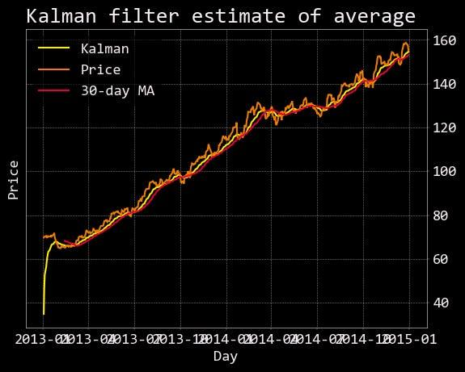

## Table of Contents

## What is a parameterless trading model?

A parameterless trading model is a type of trading strategy that doesn't need any numbers or settings to be set by the user before it starts working. Instead of having to decide on things like how long to hold a stock or how much risk to take, the model figures all of that out on its own. This makes it easier for people who don't want to spend a lot of time adjusting and fine-tuning their trading strategies.

These models use special math and computer tricks to learn from the market as it changes. They look at past data and current market conditions to make decisions without needing specific instructions from the user. This can be really helpful because markets are always changing, and a model that can adapt on its own might do better than one that needs constant adjustments.

## How does a parameterless trading model differ from traditional trading models?

A parameterless trading model and a traditional trading model are different in how they work and how much the user has to do. In a traditional trading model, users have to set specific numbers or settings, called parameters, before the model can start trading. These parameters might tell the model things like when to buy or sell, how much risk to take, or how long to hold onto a stock. Users need to spend time figuring out the best settings, and if the market changes, they might need to change these settings too.

On the other hand, a parameterless trading model doesn't need any of these settings from the user. It uses special math and computer techniques to learn from the market on its own. This means it can adapt to changes in the market without the user having to do anything. This can be easier for people who don't want to spend a lot of time adjusting their trading strategies, and it might even perform better because it can react to new market conditions more quickly.

## What are the basic principles behind parameterless trading?

Parameterless trading is all about making trading easier by not needing any special settings from the user. Instead of having to pick numbers or rules to tell the trading model what to do, a parameterless model figures everything out by itself. It uses smart math and computer tricks to look at past and current market data, and then decides when to buy or sell without needing any help from the user.

The main idea behind this is to make trading more flexible and able to change with the market. Because markets are always moving and changing, a model that can learn and adapt on its own might do better than one that needs the user to keep changing its settings. This can save time and might even make more money because the model can react quickly to new market conditions without waiting for the user to make changes.

## Can you explain the concept of adaptive learning in parameterless trading models?

Adaptive learning in parameterless trading models means the model can learn and change by itself without needing any special settings from the user. It looks at what's happening in the market right now and what has happened in the past to figure out the best way to trade. This is like how a person might learn from their experiences, but the model does it all with math and computers.

The cool thing about adaptive learning is that it makes the trading model really flexible. If the market changes, the model can change too, without the user having to do anything. This can be really helpful because markets can be unpredictable, and a model that can adapt on its own might make better trading decisions than one that needs to be told what to do.

## What are the advantages of using parameterless trading models for beginners?

Parameterless trading models are great for beginners because they don't need any special settings or numbers to be set up before they start working. This means that even if you're new to trading, you don't have to spend a lot of time figuring out how to adjust the model. You can just let it do its thing and learn from the market on its own. This makes trading a lot easier and less stressful for people who are just starting out.

Another big advantage is that these models can adapt to changes in the market without any help from the user. Markets can be tricky and change a lot, but a parameterless model uses smart math and computer tricks to keep up with these changes. This means that as a beginner, you don't have to worry about keeping up with the market yourself. The model will do that for you, which can help you make better trading decisions without having to be an expert.

## How do parameterless trading models handle market volatility?

Parameterless trading models are good at handling market volatility because they can change and learn on their own. When the market gets wild and prices go up and down a lot, these models use special math and computer tricks to look at what's happening. They don't need the user to tell them what to do; they figure it out by themselves. This means they can quickly adjust to the ups and downs of the market without waiting for someone to change their settings.

Because these models can adapt to the market's changes, they can make smart trading choices even when things are really volatile. They look at past data and what's happening right now to decide when to buy or sell. This can help them do well even when the market is hard to predict. For people using these models, it means they don't have to worry as much about sudden market changes because the model is always working to keep up with them.

## What are some common strategies employed by parameterless trading models?

Parameterless trading models often use a strategy called reinforcement learning. This means the model learns from its actions over time, kind of like how a person learns from making choices. It tries different things in the market and sees what works best. If a certain action makes money, the model will do it more often. If it loses money, the model will try something different. This way, the model keeps getting better at trading without needing any special instructions from the user.

Another strategy these models use is called trend following. They look at the market to see if prices are going up or down over time. If they see a trend, they'll try to make money by going along with it. For example, if prices are going up, the model might buy and then sell when the prices go even higher. If prices are going down, it might sell first and then buy back later at a lower price. This helps the model make smart choices based on what's happening in the market, without needing the user to tell it what to do.

## How can one evaluate the performance of a parameterless trading model?

Evaluating the performance of a parameterless trading model is important to see how well it's doing in the market. One way to do this is by looking at how much money the model makes over time. This is called the return on investment, or ROI. If the model is making more money than it's losing, that's a good sign. Another thing to check is how much risk the model is taking. You can do this by looking at something called the drawdown, which shows the biggest loss the model has had. A good model will have a high ROI with a low drawdown, meaning it makes good money without taking too much risk.

Another way to evaluate the model is by comparing it to other trading strategies or to the market itself. For example, you can see if the model is doing better than just buying and holding a stock or if it's beating the market average. This helps to see if the model is really adding value. It's also helpful to look at how the model performs over different time periods and in different market conditions. A good parameterless trading model should be able to adapt and do well even when the market is changing a lot. By looking at these things, you can get a good idea of how well the model is working.

## What are the potential risks and limitations of parameterless trading models?

Parameterless trading models can be really helpful, but they also come with some risks. One big risk is that because they make decisions on their own, they might make choices that don't match what the user wants. For example, the model might decide to take more risk than the user is comfortable with. Another risk is that these models might not work well in all market conditions. If the market changes in a way that the model hasn't seen before, it might make bad trading decisions.

Another limitation of parameterless trading models is that they depend a lot on the data they have. If the data is not good or if there's not enough of it, the model might not learn the right things. This can lead to poor trading decisions. Also, because these models are using complicated math and computer tricks, it can be hard for users to understand why the model is making certain choices. This lack of transparency can make it tough to trust the model completely.

## How do parameterless trading models integrate with existing trading platforms?

Parameterless trading models can work well with existing trading platforms because they don't need special settings from the user. These models can be added to a platform as a new tool that makes trading decisions on its own. Once it's set up, the model will look at the market and decide when to buy or sell without needing any help. This makes it easy for people who already use a trading platform to try out this new way of trading without having to change much about how they do things.

The integration usually happens through an API, which is like a special language that lets different computer programs talk to each other. The parameterless trading model uses the API to get information from the trading platform about what's happening in the market. Then, it sends back instructions to the platform about what trades to make. This way, the model can work smoothly with the platform, and users can keep using their favorite tools and features while also getting the benefits of a smart, self-learning trading model.

## What advanced techniques are used to optimize parameterless trading models?

To make parameterless trading models even better, people use something called deep learning. This is a type of smart computer math that lets the model learn really complicated things about the market. It looks at a lot of data and finds patterns that might be hard for a person to see. By using deep learning, the model can make smarter trading decisions and adapt to the market even better.

Another way to optimize these models is by using a technique called ensemble learning. This means the model doesn't just use one way to make decisions; it uses a bunch of different ways and then combines them. It's like getting advice from a whole team of experts instead of just one person. By doing this, the model can make better choices because it's looking at the market from different angles and figuring out the best thing to do based on all the information it has.

## Can you discuss case studies or real-world applications of successful parameterless trading models?

One successful case of a parameterless trading model is the use of reinforcement learning by a hedge fund called Man AHL. They created a model that learns from its actions in the market without needing any special settings from users. The model looks at what's happening in the market and decides when to buy or sell stocks. By doing this, it was able to make good money and handle the ups and downs of the market well. This shows that parameterless models can work in real-world trading and help make smart decisions without a lot of help from people.

Another example is the use of parameterless models by Renaissance Technologies, a famous investment firm. They use advanced math and computer tricks to create models that learn on their own. These models look at a lot of data and find patterns to make trading decisions. The firm's success shows that parameterless trading can be really effective, even in tough market conditions. It proves that these models can adapt and keep making good choices without needing constant adjustments from users.

## References & Further Reading

[1]: Bergstra, J., Bardenet, R., Bengio, Y., & Kégl, B. (2011). ["Algorithms for Hyper-Parameter Optimization."](https://papers.nips.cc/paper/4443-algorithms-for-hyper-parameter-optimization) Advances in Neural Information Processing Systems 24.

[2]: ["Advances in Financial Machine Learning"](https://www.amazon.com/Advances-Financial-Machine-Learning-Marcos/dp/1119482089) by Marcos Lopez de Prado

[3]: ["Evidence-Based Technical Analysis: Applying the Scientific Method and Statistical Inference to Trading Signals"](https://www.amazon.com/Evidence-Based-Technical-Analysis-Scientific-Statistical/dp/0470008741) by David Aronson

[4]: ["Machine Learning for Algorithmic Trading"](https://github.com/PacktPublishing/Machine-Learning-for-Algorithmic-Trading-Second-Edition) by Stefan Jansen

[5]: ["Quantitative Trading: How to Build Your Own Algorithmic Trading Business"](https://books.google.com/books/about/Quantitative_Trading.html?id=j70yEAAAQBAJ) by Ernest P. Chan