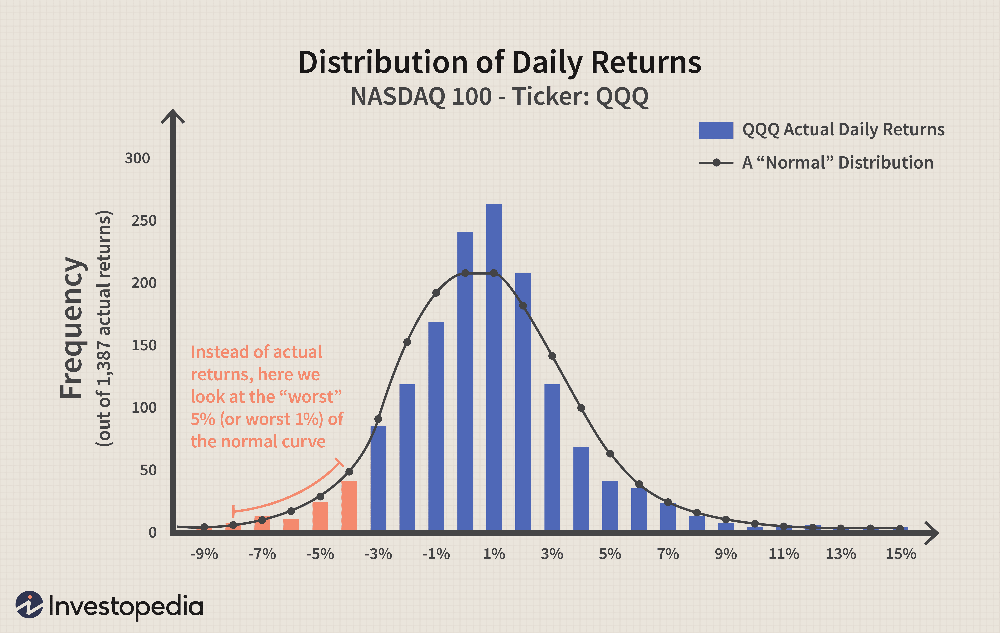

In today's dynamic financial markets, understanding and managing risk is paramount for both individual investors and financial organizations. With fluctuating economic conditions and market volatility, the importance of accurately assessing potential financial loss cannot be understated. Value at Risk (VaR) has emerged as a critical metric in financial risk management. It provides a probabilistic estimate of the potential loss in investment portfolios over a specified time frame at a given confidence level, offering insights into the worst-case financial loss that could occur.

Traditional risk assessment methods often fall short in quantifying the potential exposure to risk, especially in complex trading environments. VaR addresses this gap by offering a standardized approach that enhances risk communication among stakeholders. This metric answers the vital question for investors and portfolio managers: "What is my worst-case scenario loss over a specified holding period, with a certain level of confidence?" As such, VaR has become integral in financial practices, providing a consistent framework for understanding financial risks.



This article explores the parametric method of VaR, also known as the variance-covariance method, which assumes that financial returns are normally distributed. The parametric approach utilizes statistical measures such as mean and standard deviation to compute the maximum expected loss at a predefined confidence level. This process is facilitated by tools like the z-score from the standard normal distribution, making it computationally efficient and easy to communicate.

Additionally, we will examine how VaR can be calculated both manually and using tools like Excel, which provide a flexible platform for dynamic risk assessment. We will also discuss the application of VaR in algorithmic trading, where timely and precise risk management is crucial. Furthermore, the advantages and limitations of the parametric method will be highlighted, considering its role and relevance in today's trading environments. The exploration will not only lay out the mathematical foundations of VaR but also compare it with other risk assessment approaches, underscoring its significance in modern financial risk management.

## Table of Contents

## Understanding Value at Risk (VaR)

Value at Risk (VaR) is a widely utilized financial metric that quantifies the potential loss in value of an asset or portfolio over a given time period, for a specified confidence level. It is a crucial tool in financial risk management, answering the question: "What is my worst-case scenario loss over a specified holding period, with a certain level of confidence?" By estimating potential losses, VaR aids portfolio managers and investors in making informed decisions and strategizing risk mitigation approaches.

To calculate VaR, statistical techniques are employed, typically involving historical data on asset returns. These methods leverage the mean and standard deviation of portfolio returns to forecast potential adverse outcomes within a chosen confidence interval, often expressed as a percentage. For example, a 95% confidence level implies that one can be 95% certain that the loss will not exceed a specified amount over the defined period.

The VaR calculation process involves the distribution of portfolio returns, typically assuming normal distribution, to estimate the maximum expected loss. The formula for VaR under normal distribution can be expressed as:

$$
\text{VaR} = \mu + Z \cdot \sigma
$$

where:
- $\mu$ is the mean of the portfolio's returns,
- $Z$ is the z-score corresponding to the chosen confidence level,
- $\sigma$ is the standard deviation of the portfolio's returns.

VaR is essential for communicating risk among stakeholders in a uniform manner. By providing a single, consolidated measure of risk, it facilitates standardized risk interpretation across various financial practices, whether it involves investment portfolios, banking operations, or corporate finance. This universality makes VaR an invaluable tool for aligning risk views amongst various stakeholders, ensuring that all parties have a consistent understanding of underlying risks.

Despite its utility, VaR has certain limitations, such as its sensitivity to assumptions about the distribution of returns and its focus on a single worst-case scenario, potentially ignoring other risk factors. Nevertheless, VaR remains a cornerstone in risk management, continuously evolving to address these limitations and integrate advanced statistical methods for more accurate risk assessment.

## Parametric Method of VaR Calculation

The parametric method, often referred to as the variance-covariance method, is a prevalent approach for calculating Value at Risk (VaR) predicated on the assumption that asset returns are normally distributed. This methodology uses the mean and standard deviation of asset returns to estimate the largest potential loss at a specified confidence level. The z-score corresponding to standard normal distribution plays a crucial role in determining these confidence levels.

To compute VaR using the parametric method, consider a portfolio with a single asset as an example. Let $\mu$ denote the expected return and $\sigma$ the standard deviation of returns. The VaR at a confidence level of, say 95%, can be defined as:

$$
\text{VaR}_{95\%} = \mu + Z_{0.05} \times \sigma
$$

where $Z_{0.05}$ is the z-score associated with the 5% tail of the standard normal distribution, typically -1.645. For multiple assets, the portfolio variance needs to account for correlations between asset returns, requiring the calculation of a covariance matrix. The formula for VaR in a multi-asset portfolio becomes:

$$
\text{VaR}_{portfolio} = Z \times \sqrt{w^T \Sigma w}
$$

Here, $w$ is the vector of portfolio weights, and $\Sigma$ is the covariance matrix of asset returns. Due to its straightforwardness and computational efficiency, the parametric method is widely adopted in various financial settings. However, it may overlook non-linear characteristics and extreme market movements, thus potentially underestimating risk in such scenarios.

Let’s consider an example to demonstrate the calculation:

```python
import numpy as np
from scipy.stats import norm

# Assume these are the expected returns and standard deviation for assets
expected_returns = np.array([0.05, 0.02])
std_devs = np.array([0.1, 0.08])
correlation_matrix = np.array([[1.0, 0.5], [0.5, 1.0]])
covariance_matrix = np.outer(std_devs, std_devs) * correlation_matrix

# Portfolio weights
weights = np.array([0.6, 0.4])

# Confidence level
confidence_level = 0.95
z_score = norm.ppf(1 - confidence_level)

# Calculate portfolio mean and standard deviation
portfolio_mean = np.dot(weights, expected_returns)
portfolio_std = np.sqrt(np.dot(weights.T, np.dot(covariance_matrix, weights)))

# Calculate VaR
var = z_score * portfolio_std
print(f"Portfolio VaR at {confidence_level*100}% confidence level: {var:.2f}")
```

The computation illustrates the feasibility of the parametric method with real-time data adaptability and visualization for easy risk interpretation. Despite its specific constraints, it remains a significant tool in the risk assessment arsenal, especially when complemented with more sophisticated techniques for comprehensive risk management.

## Calculating VaR in Excel: A Step-by-Step Guide

To calculate Value at Risk (VaR) using Excel, an understanding of basic statistical techniques and Excel functions is essential. This process allows investors and financial analysts to quantify potential losses within their portfolios under various market conditions.

### Step-by-Step Guide to Calculate VaR in Excel

#### 1. **Data Preparation**
   - **Collect Historical Data**: Begin by gathering historical price data for the assets in your portfolio. This data should be sourced from reliable financial databases or trading platforms.
   - **Organize Data**: Arrange the data chronologically in Excel, with each row representing a specific date and each column representing the price of a particular asset.

#### 2. **Calculate Returns**
   - **Logarithmic Returns**: Use the formula for logarithmic returns, which provides a more stable metric for financial models:
$$
     R_t = \ln\left(\frac{P_t}{P_{t-1}}\right)

$$
     Where $R_t$ is the logarithmic return, $P_t$ is the price at time $t$, and $P_{t-1}$ is the price at the previous time period.
   - **Excel Implementation**: In Excel, this can be computed using a formula like `=LN(B2/B1)`, assuming column B contains the asset prices.

#### 3. **Derive Statistical Measures**
   - **Mean and Standard Deviation**: Calculate the mean and standard deviation of the returns. These metrics are fundamental for the parametric VaR calculation.
     - **Mean**: Use the `AVERAGE()` function to find the average return.
     - **Standard Deviation**: Use the `STDEV.P()` function for the standard deviation of the returns.

#### 4. **Determine VaR Using z-Score**
   - **Confidence Level**: Choose an appropriate confidence level (e.g., 95% or 99%) for the VaR calculation.
   - **Calculate z-Score**: For a given confidence level, compute the z-score using the `NORM.INV()` function. For instance, for a 95% confidence level, use:
$$
     \text{z-score} = \text{NORM.INV}(0.05, 0, 1)

$$
   - **VaR Calculation**: VaR at a certain confidence level is calculated by:
$$
     \text{VaR} = \text{Mean} - (\text{z-score} \times \text{Standard Deviation})

$$
   - **Excel Formula**: Enter a formula using Excel's computational capacity to arrive at VaR, e.g., `=AVERAGE(returns_range) - NORM.INV(0.05, 0, 1) * STDEV.P(returns_range)`.

#### 5. **Visualization of Risk Distributions**
   - **Generate Charts**: Utilize Excel’s charting tools to visualize potential risk distributions. Creating a histogram of return data can help stakeholders understand the probability of various loss scenarios.

### Benefits of Using Excel for VaR Calculation
- **Simplicity and Accessibility**: Excel is a widely accessible platform, familiar to many users, making it simple to adopt for basic financial modelling.
- **Real-Time Updates**: By linking Excel spreadsheets to live data feeds, VaR calculations can be updated in real-time, allowing for dynamic risk assessments.
- **Enhanced Understanding**: Excel’s visualization capabilities, such as charts and graphs, can significantly improve communication and understanding of risk metrics among stakeholders.

This practical approach using Excel empowers financial professionals to compute Value at Risk with ease and accuracy, adapting to the needs of a continually changing market environment.

## Implementing VaR in Algorithmic Trading

In [algorithmic trading](/wiki/algorithmic-trading), Value at Risk (VaR) provides a crucial framework for assessing and mitigating potential portfolio losses. By quantifying risk in probabilistic terms, VaR equips traders and financial systems with the ability to set risk thresholds and adapt trading strategies based on realtime data inputs. 

Implementing VaR within algorithmic strategies involves establishing risk limits that align with predefined confidence levels. This helps mitigate severe losses by adjusting exposure according to market dynamics. An algorithmic trading system might monitor VaR continuously and rebalance a portfolio to maintain a risk profile within accepted limits. 

For practical application, Python is frequently used due to its robust libraries and ease of integration. A simple Python implementation can be constructed using historical price data, importing libraries like pandas and numpy to calculate returns and establish the VaR threshold. Here’s a basic demonstration of how VaR might be calculated for a portfolio:

```python
import numpy as np
import pandas as pd
import scipy.stats as stats

# Sample returns data for a portfolio
returns = pd.Series([0.001, -0.002, 0.003, -0.004, 0.005, -0.006])

# Define the confidence level
confidence_level = 0.95

# Calculate mean and standard deviation of returns
mean_return = np.mean(returns)
std_dev_return = np.std(returns)

# Calculate VaR using the z-score
z_score = stats.norm.ppf(1 - confidence_level)
VaR = -(mean_return + z_score * std_dev_return)

print(f"VaR at {confidence_level*100}% confidence level is: {VaR}")
```

In this code, the Pandas library handles financial data, while Numpy and SciPy perform statistical calculations. The portfolio’s mean return and standard deviation are calculated to derive the VaR value at a specified confidence level. This metric allows traders to assess potential peak losses and adjust their strategies accordingly.

VaR is not just theoretical; it has practical consequences in algorithmic trading environments. By integrating VaR into decision-making processes, traders can implement automated strategies that prioritize risk management. This involves real-time adjustment of positions and proactive hedging to ensure the portfolio's health in volatile markets. Moreover, proper application of VaR in algorithmic systems necessitates regular [backtesting](/wiki/backtesting) to validate the model's predictive effectiveness.

The inclusion of VaR in algorithmic trading programs enhances risk transparency and supports systematic decision-making, which improves capital allocations. As the trading landscape evolves, further integrations with [machine learning](/wiki/machine-learning) and real-time data analytics promise even more sophisticated risk assessment models, allowing for superior capital protection and performance optimization.

## Advanced Techniques and Considerations

Advanced methodologies in Value at Risk (VaR) are instrumental in addressing the assumptions and limitations inherent in the parametric method, enhancing the robustness of risk assessments. Among these, semi-parametric approaches and Monte Carlo simulations are prominent.

### Semi-Parametric Approaches

Semi-parametric VaR models combine parametric elements with non-parametric procedures, harnessing the strengths of both methodologies. By relaxing the assumption of normality, these approaches can better capture the skewness and kurtosis observed in real-world financial return distributions. This is particularly beneficial for assets experiencing asymmetric risk profiles. One common semi-parametric technique involves using historical simulation to model non-linearities while applying kernel smoothing techniques to fine-tune VaR estimates, enhancing accuracy and flexibility.

### Monte Carlo Simulations

Monte Carlo simulations provide a powerful tool for VaR estimation by leveraging stochastic processes, allowing the modeling of a wide range of possible future states of a portfolio. Unlike the parametric method, Monte Carlo simulations make fewer assumptions about the return distributions and can model complex path dependencies and non-linear payoffs. This method entails generating a large number of random samples of potential future portfolio values, based on the known distributional characteristics of asset returns, and calculating the VaR based on these simulations. The Python `numpy` and `pandas` libraries, complemented by `matplotlib` for visualization, are commonly used for implementing such simulations due to their efficiency and versatility. Below is a simple example of a Monte Carlo VaR simulation in Python:

```python
import numpy as np

# Parameters
initial_portfolio_value = 1000000  # Initial value of the portfolio
mean_return = 0.0002               # Mean daily return
volatility = 0.01                 # Daily volatility
time_horizon = 1                  # 1 day
confidence_level = 0.95
num_simulations = 10000

# Generate random returns
random_returns = np.random.normal(mean_return, volatility, num_simulations)

# Simulate future portfolio values
portfolio_values = initial_portfolio_value * (1 + random_returns)

# Calculate the VaR at the specified confidence level
VaR = np.percentile(portfolio_values, (1-confidence_level) * 100)
print(f'The VaR at {confidence_level*100}% confidence level is: ${initial_portfolio_value - VaR:.2f}')
```

### Asset Correlation Considerations

In multi-asset portfolios, recognizing asset correlation is essential for accurate VaR estimation and capital allocation. Ignoring interdependencies can lead to underestimation or overestimation of risk. Using a covariance matrix to incorporate these correlations enhances the calculation of expected portfolio variance, thus refining VaR predictions.

### Backtesting with the Kupiec Test

Backtesting is crucial to validate the accuracy of VaR models. The Kupiec Test, a statistical method used for this purpose, assesses whether the number of violations (instances where actual losses exceed the VaR prediction) aligns with the expected number based on the confidence level. This test can be performed using binomial distributions to ensure that the model's predictions are consistent with observed market behaviors, thereby affirming the reliability and robustness of the VaR framework.

These advanced techniques and considerations are vital in developing sophisticated risk assessment tools capable of operating effectively in modern financial markets, characterized by their complexity and [volatility](/wiki/volatility-trading-strategies).

## Conclusion and Future Trends

Value at Risk (VaR) continues to be an essential tool in financial risk management, offering investors and institutions critical insights into potential losses under specified conditions. Its utility in quantifying, managing, and communicating risks across diverse market scenarios underscores its lasting significance in the finance industry. However, as financial markets evolve, so too must the methodologies used to assess and manage risk.

Recent advancements in machine learning and data analytics are beginning to transform traditional approaches to VaR. These technologies promise to enhance the precision of risk models by incorporating more sophisticated algorithms capable of learning from extensive datasets. Machine learning models, for instance, can identify complex non-linear patterns and interactions within financial data that traditional statistical models might overlook. Techniques such as neural networks and decision trees can improve the estimation of risk under conditions that deviate from normal distribution assumptions, often inherent in traditional parametric approaches.

Furthermore, real-time data analytics allows for continuous monitoring of market dynamics, providing more immediate and accurate risk assessments. This capability enables financial institutions to respond swiftly to market changes, thereby ensuring better management of portfolio risks.

Adapting traditional VaR approaches to incorporate these technological advancements is essential for maintaining their relevance. Implementing machine learning algorithms alongside traditional models can create a more robust risk management framework. For instance, by using ensemble methods—combining outputs from multiple models—financial institutions could achieve a more comprehensive risk profile, integrating both established parametric calculations and advanced machine learning predictions.

Additionally, the integration of big data analytics into the VaR framework is crucial for leveraging large volumes of market data efficiently. Handling power provided by modern computing technologies allows for the real-time processing and analysis of complex datasets, leading to more refined and proactive risk management strategies.

In conclusion, while VaR remains a fundamental component of financial risk assessments, embracing new technologies such as machine learning, data analytics, and real-time computing will be critical. These advancements offer the potential to refine risk models, improve decision-making processes, and ultimately enable institutions to navigate the complexities of modern financial markets with greater agility and accuracy.

## References & Further Reading

Jorion, Philippe. *Value at Risk: The New Benchmark for Managing Financial Risk*. McGraw-Hill, 2007.  
This book is a comprehensive guide focused on VaR as a tool for financial risk management, covering both theoretical and practical aspects, including its implementation and application in modern financial markets.

Hull, John C. *Options, Futures, and Other Derivatives*. Pearson, 2018.  
John C. Hull’s textbook is a classic in financial studies, providing in-depth understanding of derivatives, market risks, and valuation methods, with sections addressing the use and calculation of VaR, emphasizing its application in pricing and risk assessment of derivative instruments.

Crouhy, Michel, Dan Galai, and Robert Mark. *Risk Management*. McGraw-Hill, 2001.  
This work explores various aspects of risk management, including methodologies to measure market risk. It presents VaR alongside other risk metrics, focusing on its role in a holistic risk management framework.

Various online resources and academic journals offer additional insights into the application and evolution of VaR methodologies.  
Numerous academic journals and financial websites continually publish research on advancements in VaR methodologies, such as semi-parametric approaches, Monte Carlo simulations, and the integration of machine learning tools to refine VaR models. These resources can be valuable for staying updated on contemporary trends and innovations in financial risk assessment techniques.

