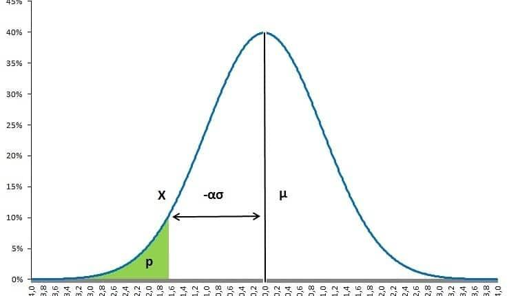

## Table of Contents

## What is Value at Risk (VaR)?

Value at Risk, or VaR, is a way to measure how much money an investment or portfolio might lose over a certain period of time. It helps investors understand the maximum potential loss they might face, given a certain level of confidence, usually 95% or 99%. For example, if the VaR of a portfolio is $1 million over a month with a 95% confidence level, it means that there is a 5% chance that the portfolio could lose more than $1 million in any given month.

VaR is useful for banks, investment firms, and individual investors to manage risk. It helps them make better decisions about how much risk to take on and how to protect their investments. However, VaR is not perfect because it doesn't predict losses beyond the VaR number and it assumes that past market behavior will continue into the future, which is not always the case. Despite these limitations, VaR remains a widely used tool in the world of finance.

## How does the parametric method for calculating VaR work?

The parametric method for calculating Value at Risk (VaR) is also known as the variance-covariance method. It uses statistics to estimate how much an investment might lose. This method assumes that the returns of the investment follow a normal distribution, which looks like a bell curve. To calculate VaR, you need to know the average return of the investment, how much the returns vary (this is called the standard deviation), and the confidence level you want to use, like 95% or 99%.

Once you have these numbers, you can use a formula to find the VaR. The formula takes the average return, subtracts it from the return at the chosen confidence level (which you can find using the standard deviation and a statistical table), and then multiplies this by the value of the investment. For example, if you have a $100,000 investment with an average return of 0% and a standard deviation of 10%, and you want a 95% confidence level, you would find the return at 95% confidence (which is about -1.65 standard deviations), subtract the average return, and then multiply by $100,000. This would give you a VaR of about $16,500, meaning there's a 5% chance of losing more than $16,500 in a given period.

## What are the assumptions of the parametric method in VaR?

The parametric method for calculating Value at Risk (VaR) makes some important guesses about how investments behave. It assumes that the returns of an investment follow a normal distribution, which means they look like a bell curve. This means that most of the time, the returns will be close to the average, and big changes, either up or down, are less common. The method also assumes that the average return and how much the returns vary (the standard deviation) stay the same over time. This helps to make predictions about future losses based on what has happened before.

However, these assumptions can be a problem. Not all investments follow a normal distribution. Sometimes, big changes happen more often than a normal distribution would predict. This is called having "fat tails." Also, the average return and standard deviation can change over time, especially during times of big market changes. Because of these issues, the parametric method might not always give the most accurate picture of the risk an investment faces. Despite these limitations, it's still a popular way to estimate VaR because it's easy to use and understand.

## What is the difference between parametric and non-parametric methods in VaR?

The parametric method for calculating Value at Risk (VaR) and the non-parametric method are two different ways to guess how much money you might lose on an investment. The parametric method assumes that the ups and downs of your investment follow a normal pattern, like a bell curve. It uses math to figure out the average return and how much the returns can vary. Then, it calculates the VaR by looking at how likely it is to lose a certain amount of money, based on these numbers. It's simple and quick to use, but it can be wrong if the investment doesn't follow the normal pattern or if the market changes a lot.

On the other hand, the non-parametric method doesn't make any guesses about the shape of the investment's returns. Instead, it looks at the actual history of the investment's returns. This method uses past data to see how often big losses happened and then uses that to guess how much you might lose in the future. It's more flexible because it doesn't assume anything about the shape of the returns, but it needs a lot of past data to work well. Both methods have their strengths and weaknesses, so people often use them together to get a better idea of the risk they face.

## How do you calculate VaR using the parametric method with a normal distribution?

To calculate Value at Risk (VaR) using the parametric method with a normal distribution, you first need to know three things: the average return of your investment, how much the returns can vary (this is called the standard deviation), and the confidence level you want to use, like 95% or 99%. The parametric method assumes that the returns of your investment follow a normal distribution, which looks like a bell curve. This means that most of the time, the returns will be close to the average, and big changes, either up or down, are less common. Once you have these numbers, you can use a formula to find the VaR. The formula takes the average return, subtracts it from the return at the chosen confidence level (which you can find using the standard deviation and a statistical table), and then multiplies this by the value of your investment.

For example, let's say you have an investment worth $100,000 with an average return of 0% and a standard deviation of 10%. If you want to use a 95% confidence level, you would find the return at 95% confidence (which is about -1.65 standard deviations away from the average). You subtract the average return (0%) from this number (-1.65 times the standard deviation of 10%, which is -16.5%), and then multiply by $100,000. This gives you a VaR of $16,500. This means there's a 5% chance that you could lose more than $16,500 in a given period. The parametric method is easy to use and understand, but it can be wrong if the investment doesn't follow a normal distribution or if the market changes a lot.

## What role does the confidence level play in parametric VaR calculations?

The confidence level in parametric VaR calculations is like a safety net that tells you how sure you want to be about your investment's risk. It's a number, usually 95% or 99%, that shows how confident you want to be that your losses won't be bigger than the VaR number. If you choose a 95% confidence level, it means you're okay with a 5% chance that your losses could be more than the VaR. If you pick 99%, you're only okay with a 1% chance of bigger losses.

The confidence level changes the VaR number because it affects how many standard deviations away from the average return you look. A higher confidence level means you're looking further out on the bell curve, where losses are bigger but less likely. For example, at a 95% confidence level, you look at losses that are 1.65 standard deviations away from the average. But at 99%, you look at losses that are 2.33 standard deviations away. So, a higher confidence level gives you a bigger VaR number because it accounts for less likely but bigger possible losses.

## How can the parametric method be adjusted for non-normal distributions?

The parametric method for calculating Value at Risk (VaR) assumes that the returns of an investment follow a normal distribution, like a bell curve. But in real life, investment returns often don't follow this pattern perfectly. They might have "fat tails," which means big changes happen more often than the bell curve would predict. To deal with this, you can adjust the parametric method by using a different distribution that better matches the actual behavior of the returns. For example, you could use a Student's t-distribution, which has fatter tails and can better capture the risk of big losses.

To use a different distribution like the Student's t-distribution, you first need to figure out its parameters, like the degrees of freedom, which show how fat the tails are. Once you have these numbers, you can use them in the VaR formula instead of the numbers for a normal distribution. This way, you get a VaR number that's more realistic for investments that don't follow a normal pattern. It's a bit more complicated than using the normal distribution, but it can give you a better idea of the risk you're facing, especially when big losses are more common than the bell curve would suggest.

## What are the limitations of using the parametric method for VaR?

The parametric method for calculating Value at Risk (VaR) has some problems because it assumes that the ups and downs of an investment follow a normal pattern, like a bell curve. But in real life, investments often don't behave this way. They can have "fat tails," which means big changes happen more often than the bell curve would predict. This can make the VaR number too small, so it doesn't show how much you might really lose. Also, the parametric method assumes that the average return and how much the returns can vary stay the same over time. But in the real world, these numbers can change, especially when the market is going through big changes.

Another issue with the parametric method is that it doesn't tell you anything about losses that are bigger than the VaR number. If you have a VaR of $10,000 at a 95% confidence level, it means there's a 5% chance of losing more than $10,000, but it doesn't say how much more. This can be a problem because those bigger losses can be very important. Despite these limitations, the parametric method is still popular because it's easy to use and understand. But it's important to know its weaknesses and maybe use other methods too, to get a better picture of the risk you're facing.

## How does the choice of time horizon affect parametric VaR estimates?

The time horizon you choose for calculating Value at Risk (VaR) using the parametric method can make a big difference in the number you get. A longer time horizon means you're looking at how much you might lose over a longer period, like a year instead of a day. Because the ups and downs of an investment can add up over time, a longer time horizon usually gives you a bigger VaR number. This is because there's more time for things to go wrong, so the risk of big losses goes up.

For example, if you're looking at a stock with a daily standard deviation of returns of 1%, a one-day VaR at a 95% confidence level might be small. But if you stretch that out to a year, the yearly standard deviation could be much bigger, like 16% (because the square root of 252 trading days is about 16). So, the yearly VaR would be much larger, showing that over a year, there's a bigger chance of losing more money. Choosing the right time horizon depends on what you're trying to do with your investment and how long you plan to hold it.

## Can you explain the impact of correlation on parametric VaR calculations?

When you're figuring out Value at Risk (VaR) for a bunch of investments together, like in a portfolio, how much the investments move together, or their correlation, is really important. If the investments tend to go up and down at the same time, they have a high correlation. This means that if one investment loses money, the others are likely to lose money too, which can make the overall risk of the portfolio bigger. On the other hand, if the investments don't move together much, they have a low correlation. This can help spread out the risk because if one investment loses money, the others might not, which can make the VaR number smaller.

To calculate VaR using the parametric method for a portfolio, you need to know not just the average return and how much each investment can vary, but also how they move together. The correlation between the investments is used in the math to figure out the overall risk of the portfolio. If the investments are highly correlated, the VaR number will be higher because the risk of big losses across the whole portfolio goes up. But if they have a low correlation, the VaR number can be lower because the risk is spread out more. So, understanding and using the right correlation numbers is key to getting a good VaR estimate for a portfolio.

## How do practitioners validate the accuracy of parametric VaR models?

Practitioners validate the accuracy of parametric Value at Risk (VaR) models by comparing the VaR numbers they get from the model with what actually happens in the real world. They do this by looking at past data and seeing if the model's predictions match up with the actual losses. If the model says there's a 5% chance of losing more than a certain amount, they check if that happens about 5% of the time in real life. This is called [backtesting](/wiki/backtesting). If the model's predictions are way off, it means the model might need to be changed or fixed.

Another way to check the accuracy is by using different methods to calculate VaR, like the non-parametric method, and seeing if they give similar results. If the numbers from different methods are close, it gives more confidence that the parametric model is working well. Practitioners also look at how sensitive the model is to small changes in the numbers they put in, like the average return or the standard deviation. If small changes make big differences in the VaR number, it might mean the model is too sensitive and not reliable. By doing these checks, practitioners can feel more sure that their parametric VaR model is giving them a good picture of the risk they face.

## What advanced techniques can enhance the parametric VaR model for expert applications?

To make the parametric VaR model better for expert use, you can use something called Monte Carlo simulations. This means you use a computer to guess many different ways the future might go, based on the past. You can then see how often big losses happen in these guesses. This can help you understand risks that the normal parametric model might miss, like big changes that don't fit the bell curve. By running lots of these simulations, you get a more detailed picture of what might happen, which can make your VaR number more accurate.

Another way to improve the parametric VaR model is by using something called copulas. Copulas help you understand how different investments in a portfolio move together, even if they don't follow a normal pattern. This can be really useful because it lets you see the risk of the whole portfolio more clearly, not just the risk of each investment by itself. By using copulas, you can get a better idea of how likely it is for big losses to happen across all your investments at the same time, which can make your VaR estimate more reliable and helpful for making decisions.

## What is Understanding Value at Risk (VaR)?

Value at Risk (VaR) is a widely utilized financial metric that quantifies the potential loss in value of an asset or portfolio over a given time period, for a specified confidence level. It is a crucial tool in financial risk management, answering the question: "What is my worst-case scenario loss over a specified holding period, with a certain level of confidence?" By estimating potential losses, VaR aids portfolio managers and investors in making informed decisions and strategizing risk mitigation approaches.

To calculate VaR, statistical techniques are employed, typically involving historical data on asset returns. These methods leverage the mean and standard deviation of portfolio returns to forecast potential adverse outcomes within a chosen confidence interval, often expressed as a percentage. For example, a 95% confidence level implies that one can be 95% certain that the loss will not exceed a specified amount over the defined period.

The VaR calculation process involves the distribution of portfolio returns, typically assuming normal distribution, to estimate the maximum expected loss. The formula for VaR under normal distribution can be expressed as:

$$
\text{VaR} = \mu + Z \cdot \sigma
$$

where:
- $\mu$ is the mean of the portfolio's returns,
- $Z$ is the z-score corresponding to the chosen confidence level,
- $\sigma$ is the standard deviation of the portfolio's returns.

VaR is essential for communicating risk among stakeholders in a uniform manner. By providing a single, consolidated measure of risk, it facilitates standardized risk interpretation across various financial practices, whether it involves investment portfolios, banking operations, or corporate finance. This universality makes VaR an invaluable tool for aligning risk views amongst various stakeholders, ensuring that all parties have a consistent understanding of underlying risks.

Despite its utility, VaR has certain limitations, such as its sensitivity to assumptions about the distribution of returns and its focus on a single worst-case scenario, potentially ignoring other risk factors. Nevertheless, VaR remains a cornerstone in risk management, continuously evolving to address these limitations and integrate advanced statistical methods for more accurate risk assessment.

## What is the Parametric Method of VaR Calculation?

The parametric method, often referred to as the variance-covariance method, is a prevalent approach for calculating Value at Risk (VaR) predicated on the assumption that asset returns are normally distributed. This methodology uses the mean and standard deviation of asset returns to estimate the largest potential loss at a specified confidence level. The z-score corresponding to standard normal distribution plays a crucial role in determining these confidence levels.

To compute VaR using the parametric method, consider a portfolio with a single asset as an example. Let $\mu$ denote the expected return and $\sigma$ the standard deviation of returns. The VaR at a confidence level of, say 95%, can be defined as:

$$
\text{VaR}_{95\%} = \mu + Z_{0.05} \times \sigma
$$

where $Z_{0.05}$ is the z-score associated with the 5% tail of the standard normal distribution, typically -1.645. For multiple assets, the portfolio variance needs to account for correlations between asset returns, requiring the calculation of a covariance matrix. The formula for VaR in a multi-asset portfolio becomes:

$$
\text{VaR}_{portfolio} = Z \times \sqrt{w^T \Sigma w}
$$

Here, $w$ is the vector of portfolio weights, and $\Sigma$ is the covariance matrix of asset returns. Due to its straightforwardness and computational efficiency, the parametric method is widely adopted in various financial settings. However, it may overlook non-linear characteristics and extreme market movements, thus potentially underestimating risk in such scenarios.

Let’s consider an example to demonstrate the calculation:

```python
import numpy as np
from scipy.stats import norm

# Assume these are the expected returns and standard deviation for assets
expected_returns = np.array([0.05, 0.02])
std_devs = np.array([0.1, 0.08])
correlation_matrix = np.array([[1.0, 0.5], [0.5, 1.0]])
covariance_matrix = np.outer(std_devs, std_devs) * correlation_matrix

# Portfolio weights
weights = np.array([0.6, 0.4])

# Confidence level
confidence_level = 0.95
z_score = norm.ppf(1 - confidence_level)

# Calculate portfolio mean and standard deviation
portfolio_mean = np.dot(weights, expected_returns)
portfolio_std = np.sqrt(np.dot(weights.T, np.dot(covariance_matrix, weights)))

# Calculate VaR
var = z_score * portfolio_std
print(f"Portfolio VaR at {confidence_level*100}% confidence level: {var:.2f}")
```

The computation illustrates the feasibility of the parametric method with real-time data adaptability and visualization for easy risk interpretation. Despite its specific constraints, it remains a significant tool in the risk assessment arsenal, especially when complemented with more sophisticated techniques for comprehensive risk management.

## How do you calculate VaR in Excel: A Step-by-Step Guide?

To calculate Value at Risk (VaR) using Excel, an understanding of basic statistical techniques and Excel functions is essential. This process allows investors and financial analysts to quantify potential losses within their portfolios under various market conditions.

### Step-by-Step Guide to Calculate VaR in Excel

#### 1. **Data Preparation**
   - **Collect Historical Data**: Begin by gathering historical price data for the assets in your portfolio. This data should be sourced from reliable financial databases or trading platforms.
   - **Organize Data**: Arrange the data chronologically in Excel, with each row representing a specific date and each column representing the price of a particular asset.

#### 2. **Calculate Returns**
   - **Logarithmic Returns**: Use the formula for logarithmic returns, which provides a more stable metric for financial models:
$$
     R_t = \ln\left(\frac{P_t}{P_{t-1}}\right)

$$
     Where $R_t$ is the logarithmic return, $P_t$ is the price at time $t$, and $P_{t-1}$ is the price at the previous time period.
   - **Excel Implementation**: In Excel, this can be computed using a formula like `=LN(B2/B1)`, assuming column B contains the asset prices.

#### 3. **Derive Statistical Measures**
   - **Mean and Standard Deviation**: Calculate the mean and standard deviation of the returns. These metrics are fundamental for the parametric VaR calculation.
     - **Mean**: Use the `AVERAGE()` function to find the average return.
     - **Standard Deviation**: Use the `STDEV.P()` function for the standard deviation of the returns.

#### 4. **Determine VaR Using z-Score**
   - **Confidence Level**: Choose an appropriate confidence level (e.g., 95% or 99%) for the VaR calculation.
   - **Calculate z-Score**: For a given confidence level, compute the z-score using the `NORM.INV()` function. For instance, for a 95% confidence level, use:
$$
     \text{z-score} = \text{NORM.INV}(0.05, 0, 1)

$$
   - **VaR Calculation**: VaR at a certain confidence level is calculated by:
$$
     \text{VaR} = \text{Mean} - (\text{z-score} \times \text{Standard Deviation})

$$
   - **Excel Formula**: Enter a formula using Excel's computational capacity to arrive at VaR, e.g., `=AVERAGE(returns_range) - NORM.INV(0.05, 0, 1) * STDEV.P(returns_range)`.

#### 5. **Visualization of Risk Distributions**
   - **Generate Charts**: Utilize Excel’s charting tools to visualize potential risk distributions. Creating a histogram of return data can help stakeholders understand the probability of various loss scenarios.

### Benefits of Using Excel for VaR Calculation
- **Simplicity and Accessibility**: Excel is a widely accessible platform, familiar to many users, making it simple to adopt for basic financial modelling.
- **Real-Time Updates**: By linking Excel spreadsheets to live data feeds, VaR calculations can be updated in real-time, allowing for dynamic risk assessments.
- **Enhanced Understanding**: Excel’s visualization capabilities, such as charts and graphs, can significantly improve communication and understanding of risk metrics among stakeholders.

This practical approach using Excel empowers financial professionals to compute Value at Risk with ease and accuracy, adapting to the needs of a continually changing market environment.

## References & Further Reading

Jorion, Philippe. *Value at Risk: The New Benchmark for Managing Financial Risk*. McGraw-Hill, 2007.  
This book is a comprehensive guide focused on VaR as a tool for financial risk management, covering both theoretical and practical aspects, including its implementation and application in modern financial markets.

Hull, John C. *Options, Futures, and Other Derivatives*. Pearson, 2018.  
John C. Hull’s textbook is a classic in financial studies, providing in-depth understanding of derivatives, market risks, and valuation methods, with sections addressing the use and calculation of VaR, emphasizing its application in pricing and risk assessment of derivative instruments.

Crouhy, Michel, Dan Galai, and Robert Mark. *Risk Management*. McGraw-Hill, 2001.  
This work explores various aspects of risk management, including methodologies to measure market risk. It presents VaR alongside other risk metrics, focusing on its role in a holistic risk management framework.

Various online resources and academic journals offer additional insights into the application and evolution of VaR methodologies.  
Numerous academic journals and financial websites continually publish research on advancements in VaR methodologies, such as semi-parametric approaches, Monte Carlo simulations, and the integration of [machine learning](/wiki/machine-learning) tools to refine VaR models. These resources can be valuable for staying updated on contemporary trends and innovations in financial risk assessment techniques.

