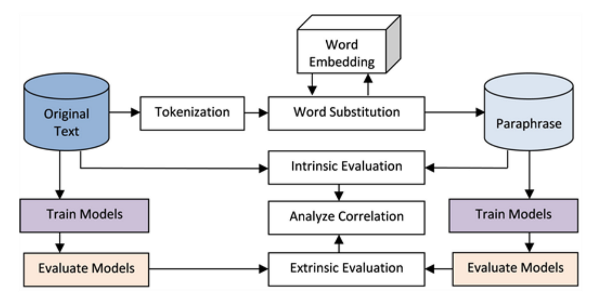

## Table of Contents

## What is paraphrase generation in the context of machine learning?

Paraphrase generation in machine learning is the process of using computers to rewrite a piece of text in a different way while keeping the same meaning. This is useful for many things, like making text easier to understand, avoiding plagiarism, or creating more data for training other machine learning models. The goal is to make the new text sound natural and different from the original, but still convey the same information.

To create paraphrases, machine learning models are trained on large amounts of text data. These models learn patterns and ways to express the same idea in different words. Techniques like sequence-to-sequence models, which use neural networks, are often used for this task. These models take the original text as input and generate a new version of it. The quality of the paraphrase depends on how well the model has been trained and the complexity of the original text.

## How do paraphrase generation models work?

Paraphrase generation models work by learning from a lot of text. They look at many examples of sentences and how they can be rewritten in different ways. These models use a special kind of computer program called a neural network. The neural network is trained to understand the meaning of words and how to change them while keeping the same idea. When you give the model a sentence, it tries to create a new sentence that means the same thing but uses different words.

These models often use something called a sequence-to-sequence model. This means they take a sequence of words as input and produce another sequence of words as output. The model looks at the whole sentence at once and figures out how to change it. It might swap some words with synonyms, change the order of the words, or even rewrite the whole sentence in a different way. The goal is to make the new sentence sound natural and be different from the original, but still have the same meaning.

## What are the main applications of paraphrase generation models?

Paraphrase generation models are used in many ways. One main use is to help make text easier to understand. For example, if someone writes a hard-to-read article, a model can change the words and sentences to make it simpler. This is helpful for people learning a new language or for kids in school. Another use is to avoid plagiarism. When students or writers need to use ideas from other sources, they can use a paraphrase model to rewrite those ideas in their own words, so it doesn't look like they copied.

Another important application is in [data augmentation](/wiki/data-augmentation) for [machine learning](/wiki/machine-learning). When training other models, having more data can make them better. Paraphrase models can create new versions of existing text, giving more examples for other models to learn from. This is especially useful in natural language processing tasks. Lastly, these models can improve search engines and chatbots. By understanding different ways to say the same thing, search engines can find more relevant results, and chatbots can respond more naturally to users.

## Can you explain the basic architecture of a typical paraphrase generation model?

A typical paraphrase generation model uses a [neural network](/wiki/neural-network), specifically a sequence-to-sequence model. This model has two main parts: an encoder and a decoder. The encoder takes in a sentence and turns it into a special code that captures its meaning. This code is like a summary of the sentence. The decoder then takes this code and turns it back into a new sentence. It tries to use different words and structures to say the same thing as the original sentence. The model is trained on a lot of example sentences, so it learns how to change words and keep the meaning the same.

To make the model work well, it uses something called attention. Attention helps the decoder focus on different parts of the original sentence when it's making the new one. This makes the new sentence more accurate and natural. The model also uses a way to measure how good its paraphrases are, like a score that tells it if the new sentence is close in meaning to the original one. By using this score, the model can get better over time as it keeps learning from more examples.

## What datasets are commonly used to train paraphrase generation models?

Common datasets used to train paraphrase generation models include the Microsoft Research Paraphrase Corpus (MRPC), which contains pairs of sentences labeled as paraphrases or not. Another widely used dataset is the Quora Question Pairs (QQP) dataset, which consists of question pairs from the Quora platform labeled as either duplicates or not. These datasets help the models learn to recognize and generate different ways to say the same thing.

In addition to MRPC and QQP, the Paraphrase Database (PPDB) is also popular. PPDB contains a large collection of paraphrase pairs in many languages, which makes it useful for training models to work across different languages. Another dataset is the Twitter URL Paraphrase Corpus, which focuses on paraphrases found in social media. These datasets provide a variety of examples that help the models understand how to create good paraphrases in different contexts.

## How is the performance of paraphrase generation models evaluated?

The performance of paraphrase generation models is evaluated using several methods to check how well they can create new sentences that keep the same meaning as the original ones. One common way is to use human evaluators who read the original sentence and the paraphrase, then rate how well the new sentence captures the meaning and sounds natural. Another way is to use automatic metrics like BLEU (Bilingual Evaluation Understudy) and METEOR (Metric for Evaluation of Translation with Explicit ORdering). These metrics compare the generated paraphrase to a set of reference paraphrases to see how similar they are. A high score means the paraphrase is good, but these metrics are not perfect and can miss some things that humans would notice.

Another important measure is semantic similarity, which looks at how close the meaning of the original sentence is to the paraphrase. This can be done using models like BERT (Bidirectional Encoder Representations from Transformers) to calculate a similarity score. The formula for semantic similarity using cosine similarity might look like this: $$ \text{similarity} = \cos(\theta) = \frac{A \cdot B}{\|A\| \|B\|} $$. If the score is high, it means the paraphrase keeps the meaning well. Finally, fluency is also checked, which means how natural and easy to read the new sentence is. This can be measured by looking at grammar, word choice, and how smooth the sentence sounds. Together, these methods help understand how good a paraphrase generation model is at creating new, meaningful sentences.

## What are some of the challenges faced in developing effective paraphrase generation models?

One big challenge in developing effective paraphrase generation models is keeping the meaning the same while changing the words. It's hard for a computer to understand all the little details and nuances in language. For example, words can have different meanings depending on the context. A model might change a word but accidentally change the meaning too. Another challenge is making the new sentence sound natural. Computers don't always know what sounds right to a human, so the paraphrase might sound awkward or weird.

Another challenge is having enough good data to train the model. Paraphrase generation models need a lot of examples to learn from, but finding high-quality datasets can be tough. Even with good data, the model might not work well for all types of sentences. It might be good at paraphrasing simple sentences but struggle with more complex ones. Also, evaluating how good the paraphrases are is tricky. Automatic metrics like BLEU or METEOR can help, but they don't always match what a human would think. Human evaluators can give better feedback, but it's slow and expensive. All these challenges make it hard to create a model that works well for everyone.

## What is the role of neural networks in paraphrase generation?

Neural networks play a big role in paraphrase generation. They help computers understand and change sentences while keeping the same meaning. A neural network is like a brain for the computer. It learns from lots of examples of sentences and how they can be rewritten. The neural network uses this learning to create new sentences that sound different but mean the same thing as the original ones. This is done using a special kind of model called a sequence-to-sequence model, which has two parts: an encoder and a decoder. The encoder turns the original sentence into a special code, and the decoder uses this code to make a new sentence.

One important part of neural networks in paraphrase generation is something called attention. Attention helps the decoder focus on the right parts of the original sentence when making the new one. This makes the new sentence more accurate and natural. The neural network also uses a way to measure how good its paraphrases are, like a score that tells it if the new sentence is close in meaning to the original one. By using this score, the neural network can get better over time as it keeps learning from more examples. This helps the model create better and better paraphrases.

## How do transformer models like BERT influence paraphrase generation?

Transformer models like BERT have made paraphrase generation a lot better. BERT is good at understanding the meaning of sentences because it looks at all the words at the same time. This helps it create paraphrases that keep the same meaning as the original sentence. BERT uses something called attention, which lets it focus on the important parts of the sentence. This makes the new sentences sound more natural and accurate. For example, if you give BERT a sentence like "The cat is on the table," it can create a new sentence like "The feline is atop the table," which means the same thing but uses different words.

Another way BERT helps with paraphrase generation is by making it easier to check if the new sentence has the same meaning as the original one. BERT can calculate a score that shows how similar two sentences are. This score is called semantic similarity, and it can be found using a formula like $$ \text{similarity} = \cos(\theta) = \frac{A \cdot B}{\|A\| \|B\|} $$. A high score means the paraphrase is good. This helps developers train and improve their models. So, transformer models like BERT not only generate better paraphrases but also help evaluate them more accurately.

## What advancements have been made in paraphrase generation with the introduction of models like BART and T5?

The introduction of models like BART and T5 has brought big improvements to paraphrase generation. BART, which stands for Bidirectional and Auto-Regressive Transformers, is good at understanding and changing sentences. It uses a special way of learning that looks at the sentence from both directions, which helps it keep the meaning the same while making the new sentence sound natural. T5, or Text-to-Text Transfer Transformer, treats every language task as a text-to-text problem. This means it can be trained to do many things, including making paraphrases, by just changing the input and output text. Both models are better at creating good paraphrases because they can learn from a lot of different kinds of text.

These models also help with evaluating how good the paraphrases are. They can calculate a score to see how similar the new sentence is to the original one. This score is called semantic similarity, and it can be found using a formula like $$ \text{similarity} = \cos(\theta) = \frac{A \cdot B}{\|A\| \|B\|} $$. A high score means the paraphrase is good. BART and T5 make it easier to train models that create better paraphrases and check their quality. This has made paraphrase generation more accurate and useful for things like making text easier to understand, avoiding plagiarism, and training other machine learning models.

## How can one fine-tune a pre-trained model for better paraphrase generation?

To fine-tune a pre-trained model for better paraphrase generation, you start by taking a model like BART or T5 that has already learned a lot about language. You then give it more specific examples of paraphrases. This helps the model learn exactly what you want it to do. You can use a dataset like the Microsoft Research Paraphrase Corpus (MRPC) or the Quora Question Pairs (QQP) to train the model. During fine-tuning, you adjust the model's settings a little bit at a time to make it better at creating good paraphrases. This process can take a while, but it makes the model much better at understanding and changing sentences the way you want.

One important part of fine-tuning is checking how well the model is doing. You can use metrics like BLEU or METEOR to see how close the new sentences are to the original ones. Another way is to use semantic similarity, which can be calculated using a formula like $$ \text{similarity} = \cos(\theta) = \frac{A \cdot B}{\|A\| \|B\|} $$. A high score means the paraphrase is good. You can also have people read the paraphrases and rate them. By looking at these scores, you can keep adjusting the model until it makes paraphrases that are both accurate and sound natural.

## What are the latest research trends and future directions in paraphrase generation models?

The latest research trends in paraphrase generation are focusing on making models better at understanding the meaning of sentences and creating more natural paraphrases. One big trend is using more advanced models like BART and T5, which can learn from a lot of different kinds of text. These models are good at keeping the meaning the same while changing the words. Researchers are also working on new ways to check how good the paraphrases are. They use things like semantic similarity, which can be calculated using a formula like $$ \text{similarity} = \cos(\theta) = \frac{A \cdot B}{\|A\| \|B\|} $$, to see how close the new sentence is to the original one. Another trend is using more and better data to train the models. This helps them learn from more examples and create better paraphrases.

In the future, paraphrase generation models might get even better at understanding and creating natural sentences. Researchers are looking into ways to make these models work well in different languages and for different kinds of text, like social media posts or scientific papers. They are also trying to make the models faster and easier to use. Another future direction is using paraphrase generation for more tasks, like helping people learn new languages or making text easier to understand for everyone. By keeping up with these trends and working on new ideas, researchers hope to make paraphrase generation a powerful tool that can be used in many ways.