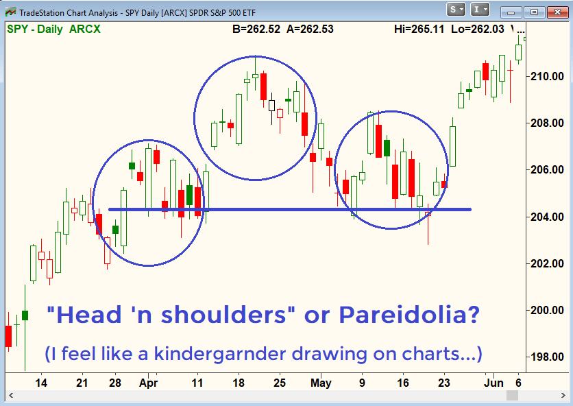

## Table of Contents

## What is pareidolia?

Pareidolia is when people see patterns or shapes, like faces or animals, in random things. For example, you might look at a cloud and think it looks like a rabbit or see a face on the moon. This happens because our brains are good at finding patterns, even when they're not really there.

It's a natural thing that everyone experiences. Scientists think it might have helped our ancestors survive by making them see potential threats or friends in their surroundings. Nowadays, pareidolia can be fun, like when people see images in food or on toast, and it's shared a lot on social media.

## How does pareidolia affect human perception?

Pareidolia makes us see things that aren't really there. Our brains are always looking for patterns, and sometimes they find them in random stuff like clouds, rocks, or even burnt toast. When we see a face in a piece of wood or an animal in the clouds, that's pareidolia at work. It's like our brain is playing a trick on us, making us think we see something familiar in things that are actually just random shapes.

This can affect how we see the world around us. For example, if you're walking in the woods and you see a rock that looks like a bear, you might feel a bit scared for a moment, even though it's just a rock. Pareidolia can make us feel emotions or react to things that aren't real. It's a reminder that our brains are always trying to make sense of what we see, sometimes seeing more than what's actually there.

## Can you provide examples of pareidolia in everyday life?

Pareidolia happens a lot in everyday life. You might be eating breakfast and see a face on your toast where the bread is burnt. Or maybe you're looking at the clouds and one of them looks just like a dog or a car. These are common examples of pareidolia because our brains are always looking for familiar shapes, like faces or animals, in random things.

Another example is when you see a face or a figure in a tree's bark or in the patterns on a wall. Sometimes, people even see faces in their food, like a pepper that looks like it's smiling or a potato that looks like it has eyes and a mouth. These moments can be fun and surprising, and they show how our brains are always trying to find patterns in the world around us.

## What is the stock market and how does trading work?

The stock market is like a big store where people can buy and sell pieces of companies. These pieces are called stocks or shares. When you buy a stock, you own a little bit of that company. People buy and sell stocks because they think the price will go up or down, and they want to make money. The stock market has a lot of different companies, so there are many stocks to choose from.

Trading in the stock market means buying and selling these stocks. When you want to buy a stock, you tell a broker, which is like a helper who does the buying and selling for you. You can buy stocks through a computer or a phone app. If you think a stock's price will go up, you buy it and then sell it later for more money. If you think the price will go down, you can sell a stock you own now and buy it back later for less money. Trading can be exciting, but it can also be risky because the prices can change a lot and you might lose money.

## How might pareidolia influence a trader's decision-making process?

Pareidolia can make a trader see patterns in stock market charts that aren't really there. When traders look at charts and graphs, they might think they see shapes or trends that look like something familiar, like a mountain or a valley. This can trick them into thinking the stock price will go up or down based on these imaginary patterns. For example, a trader might see a zigzag pattern and think it means the stock will keep going up, when really it's just random ups and downs.

This can lead to bad decisions because the trader is making choices based on what they think they see, not on what's actually happening. If a trader sees a pattern that looks like a face smiling, they might feel more positive about the stock and decide to buy more, even if there's no real reason to think the stock will do well. Pareidolia can make trading riskier because it adds another layer of uncertainty, making it harder for traders to make clear, logical choices.

## Are there documented cases where pareidolia has impacted stock market trading?

Yes, there are cases where pareidolia has affected stock market trading. One famous example is the "head and shoulders" pattern that traders look for in stock charts. This pattern looks like a person's head and shoulders, and traders believe it means the stock price will go down. But sometimes, traders see this pattern when it's not really there, just because their brains are looking for familiar shapes. This can lead them to sell stocks they think will drop in value, even if the pattern is just a trick of pareidolia.

Another example is when traders see other patterns like "double tops" or "cup and handle" in stock charts. These patterns can look like everyday objects or shapes, and traders might think they predict future price movements. But if these patterns are just pareidolia, traders might make decisions based on what they think they see, not on what's actually happening with the stock. This can lead to buying or selling at the wrong times, causing them to lose money.

## What psychological biases, including pareidolia, commonly affect traders?

Traders often fall into psychological traps that can mess up their decisions. One common trap is confirmation bias, where traders only look for information that supports what they already believe. For example, if a trader thinks a stock will go up, they might ignore news that says it might go down. Another big bias is loss aversion, where traders are so scared of losing money that they hold onto losing stocks too long, hoping they'll come back up. This can lead to even bigger losses.

Pareidolia is another tricky bias that can fool traders. When looking at stock charts, traders might see patterns that look like faces or shapes, like the "head and shoulders" pattern. They might think these patterns mean the stock will go up or down, but really, they're just seeing things that aren't there. Overconfidence is also a problem, where traders think they know more than they do and take big risks, which can lead to big losses. These biases can make trading really hard because they cloud a trader's judgment and make it tough to make smart choices.

## How can traders recognize when pareidolia is influencing their decisions?

Traders can recognize when pareidolia is influencing their decisions by paying attention to the patterns they see in stock charts. If they start seeing shapes like faces, animals, or other familiar objects in the charts, it might be pareidolia at work. For example, if a trader sees a "head and shoulders" pattern and feels sure it means the stock will go down, they should take a step back and ask if the pattern is really there or if their brain is just playing tricks.

To avoid being fooled by pareidolia, traders should use other tools and information to check their decisions. They can look at the company's news, financial reports, and what other experts are saying. If the pattern they see in the chart doesn't match up with this other information, it's a sign that pareidolia might be influencing their thinking. By being aware of this and double-checking their ideas, traders can make better choices and avoid the mistakes that come from seeing things that aren't really there.

## What strategies can traders use to mitigate the effects of pareidolia?

Traders can fight pareidolia by using other tools and information to check their ideas. Instead of just looking at charts, they should read news about the company, look at financial reports, and see what other experts think. If the pattern they see in the chart doesn't match up with this other information, it might be pareidolia tricking them. By using these extra checks, traders can make sure they're not making decisions based on imaginary patterns.

Another good strategy is to take breaks and clear their minds. When traders look at charts for too long, their brains might start seeing things that aren't there. Taking a break can help reset their thinking and make it easier to see the charts clearly. It's also helpful to talk to other traders or mentors about what they see. Another person might spot pareidolia and help the trader avoid making a bad decision based on it. By staying aware and using these strategies, traders can keep pareidolia from messing up their trading.

## How do advanced trading algorithms account for or exploit pareidolia?

Advanced trading algorithms don't see patterns like humans do, so they don't get tricked by pareidolia. Instead, these algorithms use math and data to make decisions. They look at numbers, trends, and other information to figure out what might happen next with a stock. By focusing on hard data, algorithms can avoid the mistakes that come from seeing faces or shapes in charts. This makes their decisions more reliable and less influenced by the kind of tricks our brains play on us.

Some smart traders use algorithms to their advantage by knowing that other people might see patterns that aren't really there. They can set up their algorithms to watch for times when lots of people might be making decisions based on pareidolia. For example, if many traders start selling a stock because they see a "head and shoulders" pattern, an algorithm might see this as a chance to buy the stock at a lower price. By understanding how pareidolia affects other traders, these algorithms can make smart moves and maybe even make money from the mistakes others make.

## What research has been conducted on the impact of pareidolia in financial markets?

Researchers have looked into how pareidolia affects the stock market. They found that traders sometimes see patterns in stock charts that aren't really there. These patterns, like the "head and shoulders" shape, can trick traders into thinking a stock will go up or down. Studies show that when many traders see the same pattern and act on it, it can cause big changes in stock prices. This can lead to buying or selling at the wrong times, which might make traders lose money.

To understand this better, researchers have used computers to study lots of stock charts and see if the patterns traders see are real or just pareidolia. They found that these patterns often don't predict what will happen next with a stock. This means traders should be careful and not rely too much on what they see in charts. By knowing about pareidolia, traders can make better choices and avoid the mistakes that come from seeing things that aren't really there.

## How can understanding pareidolia improve overall trading performance and risk management?

Understanding pareidolia can help traders make better decisions and manage their risks. When traders know that their brains might trick them into seeing patterns that aren't really there, they can be more careful. Instead of just looking at charts, they can check other information like news about the company or financial reports. This helps them make choices based on real data, not just what they think they see. By doing this, traders can avoid making big mistakes and losing money because of pareidolia.

Using this understanding also helps traders manage their risks better. If they see a pattern that makes them want to buy or sell a stock, they can take a step back and think about it. They might talk to other traders or use computer tools to see if the pattern is real or just their brain playing tricks. By being aware of pareidolia, traders can make smarter moves and protect their money. This can lead to better trading performance and fewer surprises from the stock market.

## References & Further Reading

[1]: Bergstra, J., Bardenet, R., Bengio, Y., & Kégl, B. (2011). ["Algorithms for Hyper-Parameter Optimization."](https://papers.nips.cc/paper/4443-algorithms-for-hyper-parameter-optimization) Advances in Neural Information Processing Systems 24.

[2]: ["Advances in Financial Machine Learning"](https://www.amazon.com/Advances-Financial-Machine-Learning-Marcos/dp/1119482089) by Marcos Lopez de Prado

[3]: ["Evidence-Based Technical Analysis: Applying the Scientific Method and Statistical Inference to Trading Signals"](https://www.amazon.com/Evidence-Based-Technical-Analysis-Scientific-Statistical/dp/0470008741) by David Aronson

[4]: ["Machine Learning for Algorithmic Trading"](https://github.com/stefan-jansen/machine-learning-for-trading) by Stefan Jansen

[5]: ["Quantitative Trading: How to Build Your Own Algorithmic Trading Business"](https://www.amazon.com/Quantitative-Trading-Build-Algorithmic-Business/dp/1119800064) by Ernest P. Chan