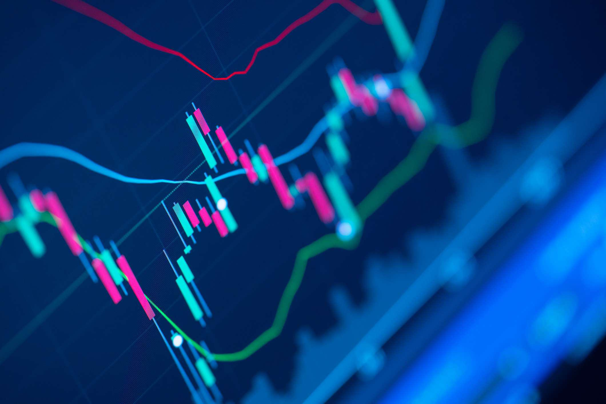

The stock market is a complex and unpredictable environment where traders are perpetually searching for patterns or indicators that might suggest impending moves. This quest for patterns is deeply rooted in human nature, often described by the term pareidolia—a psychological phenomenon where individuals perceive recognizable patterns, such as faces or objects, in random stimuli. Pareidolia's influence extends beyond simple visual experiences; it plays a significant role in various aspects of daily life, including financial decision-making.

In stock market trading, the tendency to discern patterns can lead traders to make decisions based on perceived signals that may or may not have predictive value. The psychological implications of this phenomenon are profound, often resulting in cognitive biases that impact trading outcomes. As technology advances, the introduction of algorithmic trading has further complicated the landscape. These algorithms are designed to identify trading opportunities by analyzing large sets of data, potentially minimizing the subjectivity and emotional influences typical of human decisions.



This article examines pareidolia as it pertains to stock market trading, exploring the psychological underpinnings of pattern recognition and its implications for both traditional and algorithmic trading strategies. By understanding the risks associated with subjective pattern recognition and the influence of psychology in trading, market participants can leverage technology more effectively to manage these biases. The subsequent sections investigate the delicate balance between human intuition and computational efficiency in trading, highlighting the evolving nature of financial markets.

## Table of Contents

## Understanding Pareidolia

Pareidolia is a psychological phenomenon that instigates the perception of familiar patterns, such as faces or objects, in otherwise random or ambiguous stimuli. This cognitive process is rooted in the human brain's tendency to seek and recognize patterns, which has evolutionary underpinnings linked to survival by identifying potential threats or allies in the environment. Although pareidolia often manifests in innocuous circumstances—like discerning animal shapes in cloud formations or seeing a smiling face on the surface of a toast—it can extend its influence into various professional fields, including finance and trading.

In finance, particularly in stock market trading, pareidolia can lead traders to identify and rely on illusory patterns within market data. This tendency can result in overestimating the reliability of certain technical indicators or chart patterns, such as "head and shoulders", "cup and handle", or countless others. These patterns, often revered within technical analysis, can sometimes be misinterpreted due to cognitive biases induced by pareidolia.

For example, a trader might observe a potential "double bottom" or "triple top" pattern on a price chart and interpret this as a definitive signal for an impending reversal. However, without robust statistical backing and integration with other relevant financial data, such interpretations based solely on visual pattern recognition can be misleading. The stock market is inherently stochastic in nature; it does not always conform to deterministic models. Thus, relying heavily on pattern recognition in trading, influenced by pareidolia, can lead to flawed predictions and costly investment decisions. 

To mitigate these risks, traders are encouraged to adopt a more holistic approach by combining technical analysis with [fundamental analysis](/wiki/fundamental-analysis) and quantitative techniques. By relying on data-driven strategies and maintaining an awareness of cognitive biases such as pareidolia, traders can improve their decision-making processes and enhance their understanding of market dynamics.

## Pareidolia in the Stock Market

Pareidolia in the stock market arises when traders mistakenly identify familiar patterns in stock price movements that are largely coincidental rather than indicative of future trends. This psychological tendency can heavily influence the application of technical analysis, a method employed by traders to forecast stock price movements based on historical price and [volume](/wiki/volume-trading-strategy) data.

Technical analysis revolves around the identification of patterns believed to signal future price movements. Among these, chart patterns such as the 'head and shoulders' or 'cup and handle' are particularly popular. The 'head and shoulders' pattern, for example, is believed to predict a reversal in the trend direction and is characterized by three peaks, with the middle peak being the highest. The 'cup and handle' pattern suggests a bullish continuation and takes the form of a U-shape followed by a smaller consolidation period resembling a handle. However, these patterns can be prone to misinterpretation due to the human brain's propensity to recognize patterns, a result of pareidolia.

The risks inherent in pattern misinterpretation are compounded by psychological biases. Traders might experience confirmation bias, where they selectively gather information that confirms their preconceptions, ignoring contradicting data. This bias can lead to overreliance on perceived patterns, reinforced by emotional factors such as fear and greed. When traders make decisions based solely on these patterns without corroborative evidence from other data sources, they inadvertently increase their exposure to potential losses.

To illustrate how reliance solely on perceived patterns can be problematic, consider a hypothetical scenario using Python for a simplistic simulation:

```python
import numpy as np
import matplotlib.pyplot as plt

# Simulate random stock price movements
np.random.seed(42)
days = 100
price_changes = np.random.normal(0, 1, days)  # daily price changes
price_levels = 100 + np.cumsum(price_changes)  # cumulative price levels

# Visualizing the stock price movements
plt.figure(figsize=(10, 5))
plt.plot(price_levels, label='Simulated Stock Price')
plt.title('Simulated Stock Price Movements')
plt.xlabel('Days')
plt.ylabel('Price')
plt.legend()
plt.show()
```

In the above simulation, the apparent trends or patterns are purely random and have no predictive power. This exercise demonstrates how susceptible price data can be to misinterpretation when viewed with a predisposed mindset, leading to erroneous trading decisions.

To mitigate the risks associated with pareidolia, traders are encouraged to incorporate technical analysis as part of a broader investment strategy that includes fundamental analysis and risk management techniques. Employing additional quantitative measures and tools such as statistical analysis or financial metrics can help verify the validity of identified patterns. Combined with an awareness of their psychological biases, traders can create a more balanced approach, enhancing decision-making processes.

## Trading Psychology and Cognitive Biases

Trading psychology is an essential component of decision-making in the stock market, as it deeply influences how traders perceive risk, reward, and patterns. At its core, trading psychology deals with the mental and emotional factors that impact trading decisions. Understanding and managing these psychological elements are crucial for developing effective trading strategies. 

Cognitive biases present significant challenges for traders. These are systematic deviations from rational judgment, influencing individuals to make decisions based on subjective elements rather than objective information. One common cognitive bias affecting traders is confirmation bias, where traders tend to favor information that confirms their pre-existing beliefs or hypotheses, while discounting or ignoring information that contradicts them. For example, if a trader believes a particular stock is poised to rise, they may disproportionately focus on positive news or chart patterns that support this belief, neglecting indicators that suggest otherwise. 

Another prevalent cognitive bias is overconfidence, which can lead traders to overestimate their knowledge, underestimate risks, and believe they have more control over outcomes than they actually do. Overconfident traders might take larger positions than warranted or may not adequately hedge their portfolios, increasing the potential for significant losses.

The effects of pareidolia, a psychological phenomenon where patterns are perceived in random stimuli, can be intensified by these biases. Traders might see non-existent patterns in stock price movements and make decisions based on these false insights. Recognizing and mitigating the impact of cognitive biases is paramount for traders to avoid such pitfalls.

Effective strategies to manage cognitive biases include maintaining a balanced perspective by seeking out disconfirming evidence and using systematic approaches, such as checklist routines and algorithmic aids, to support decision-making. Regular self-reflection and journaling of trading decisions can also help traders become aware of their biases, enabling them to make more informed and rational choices. 

Through cultivating awareness and actively addressing cognitive biases, traders can improve their decision-making processes, thereby enhancing their potential for success in dynamic and often unpredictable financial markets.

## Algorithmic Trading: Data-Driven Decisions

Algorithmic trading employs sophisticated algorithms that enable trading decisions to be made swiftly and accurately using vast amounts of data. This approach aims to minimize the pitfalls of human error and emotional influence on trading activities. Algorithms, or algos, are capable of processing data far more rapidly than human traders, with the ability to identify opportunities that may go unnoticed by the human eye. They analyze market trends, historical data, and real-time data inputs to execute trades at optimal times, rendering them particularly effective in high-frequency trading environments.

A significant advantage of [algorithmic trading](/wiki/algorithmic-trading) lies in its capacity for analyzing patterns and trends over extensive datasets without the cognitive biases and limitations inherent to human traders. This objective handling of data can result in more consistent trading performance and better risk management, as algos can be programmed to execute predefined strategies consistently. Given the complexity of today’s financial markets, where extensive variables influence price movements, an algorithmic approach can parse through seemingly unmanageable volumes of data to determine probable advantageous trading positions.

Nonetheless, the efficacy of these algorithms is heavily contingent upon the quality of the data they process and the robustness of their design. High-quality, clean, and timely data is imperative for correct trading decisions. Erroneous or outdated data can lead to flawed outputs and potential financial losses. Furthermore, the algorithms themselves must be meticulously programmed and continuously tested to ensure their strategies align with market conditions and investor goals.

Moreover, imperfect algorithm design can unintentionally reinforce human biases. For instance, if an algorithm is trained on biased datasets, it risks perpetuating those same biases in its trading decisions. Statistical biases, such as selection bias or survivorship bias, could skew the performance of trading algorithms, leading them to make suboptimal decisions based on incomplete or misleading information.

Emerging technologies, such as [machine learning](/wiki/machine-learning) and [artificial intelligence](/wiki/ai-artificial-intelligence), are enhancing algorithmic trading by enabling adaptive strategies that can evolve with changing market dynamics. These technologies can further refine the predictive power of algorithms by incorporating larger and more diverse sets of data than traditional models—ranging from price data to [alternative data](/wiki/best-alternative-data) sources, such as social media sentiment and geopolitical events. However, the application of these complex models demands a thorough understanding of both the markets and the technology to ensure their successful integration into a trading framework.

In conclusion, while algorithmic trading significantly enhances the efficiency and scope of trading decisions, the success of these algorithms is highly dependent on the quality and relevance of the data analyzed and the precision of their design. Continuous evaluation and adaptation are vital in ensuring these algorithms operate effectively within the ever-evolving landscape of financial markets.

## Balancing Emotions and Algorithms

Balancing emotions and algorithms in trading involves a nuanced interplay between automated systems and human judgment. Although algorithmic trading systems are designed to minimize human emotional interference, they cannot entirely eliminate psychological factors from trading decisions. Human emotions like fear and greed can still influence traders, even when algorithms are in place. To mitigate these influences, traders can use a balanced approach that melds the precision of algorithms with the intuition and oversight of human judgment. This hybrid approach can enhance decision-making by allowing algorithms to handle rote calculations and data analysis, while human oversight provides context and adaptability to dynamic market conditions.

Algorithms play a significant role in optimizing trading strategies. They can automate repetitive tasks such as setting stop-loss limits or executing trades at pre-defined levels, reducing the emotional reactions that can lead to impulsive decisions. For example, a trader can program an algorithm to execute a stop-loss order when a stock drops by a certain percentage, protecting investments from volatile market swings.

```python
def execute_stop_loss(current_price, stop_loss_price):
    if current_price <= stop_loss_price:
        return "Execute Order: Sell"
    else:
        return "Hold Position"

# Example usage:
current_price = 95
stop_loss_price = 100
print(execute_stop_loss(current_price, stop_loss_price))
```

This code snippet highlights how a simple Python function can automate a stop-loss decision, thereby removing immediate emotional responses from the process.

Yet, the efficacy of algorithmic trading is heavily reliant on the quality and relevance of the data used, and the robustness of the algorithms. Poor data quality or ill-designed algorithms can lead to misinterpretations, undermining the benefits of automation. Thus, traders need to apply human judgment to continuously monitor and refine algorithmic strategies, ensuring they align with current market conditions and investment goals.

Moreover, human intuition can still be pivotal in situations where qualitative factors influence market dynamics, factors that algorithms might not fully comprehend. By maintaining a strategic balance, traders can effectively harness the strengths of both algorithms and human insights, making informed decisions that optimize performance while managing risk effectively. This balanced approach also allows for strategic adjustments in response to unexpected market events, fostering resilience against market [volatility](/wiki/volatility-trading-strategies) and unforeseen shifts.

## Conclusion: Navigating the Markets

Traders must be aware of how pareidolia and cognitive biases can affect their perception and decision-making in financial markets. Pareidolia may lead them to believe they see meaningful patterns in random data, influencing erroneous decisions. Cognitive biases like overconfidence and confirmation bias further compound these challenges, as traders might selectively interpret information to support preconceived notions or overestimate their ability to predict market movements.

Balancing algorithmic trading with human insights is one effective strategy to mitigate risks associated with false pattern recognition. Algorithmic trading, by relying on vast datasets and sophisticated algorithms, minimizes the emotional and psychological influences that might lead to hasty decisions. These algorithms can continuously analyze real-time market data, enabling traders to quickly adapt to changing conditions without being swayed by temporary patterns that human cognition might incorrectly interpret as significant. However, the success of algorithmic trading depends heavily on the quality of data and the design of the trading algorithms. It is critical for traders to constantly monitor and evaluate the algorithms for performance improvements and ensure they are not inadvertently reinforcing biases.

Moreover, cultivating a disciplined trading mindset is essential. Traders can enhance this discipline through practices such as setting predefined trading goals, adherence to risk management principles, and regular performance reviews against specific benchmarks. This discipline helps in maintaining a cool head during market volatility and minimizes the influence of psychological biases. Continuous evaluation of trading strategies is also vital. By regularly assessing the effectiveness of their strategies, traders can identify areas of improvement and adjust their approach to align with current market conditions.

In conclusion, navigating the complex landscape of stock trading requires a harmonious blend of algorithmic proficiency and human judgment. By understanding and addressing the cognitive biases that affect decision-making, traders can improve their ability to distinguish between genuine market trends and illusory patterns. Through a disciplined mindset and ongoing strategy evaluation, traders can fortify themselves against the inherent unpredictability of the market, paving the way for sustained success.

## References & Further Reading

[1]: Bergstra, J., Bardenet, R., Bengio, Y., & Kégl, B. (2011). ["Algorithms for Hyper-Parameter Optimization."](https://papers.nips.cc/paper/4443-algorithms-for-hyper-parameter-optimization) Advances in Neural Information Processing Systems 24.

[2]: ["Advances in Financial Machine Learning"](https://www.amazon.com/Advances-Financial-Machine-Learning-Marcos/dp/1119482089) by Marcos Lopez de Prado

[3]: ["Evidence-Based Technical Analysis: Applying the Scientific Method and Statistical Inference to Trading Signals"](https://www.amazon.com/Evidence-Based-Technical-Analysis-Scientific-Statistical/dp/0470008741) by David Aronson

[4]: ["Machine Learning for Algorithmic Trading"](https://github.com/stefan-jansen/machine-learning-for-trading) by Stefan Jansen

[5]: ["Quantitative Trading: How to Build Your Own Algorithmic Trading Business"](https://www.amazon.com/Quantitative-Trading-Build-Algorithmic-Business/dp/1119800064) by Ernest P. Chan