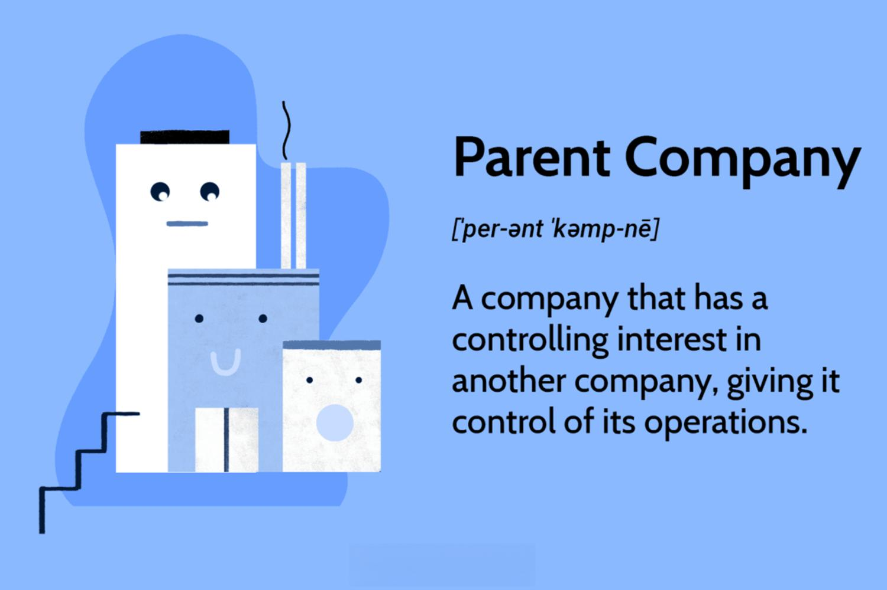

This article explores the intricate dynamics of corporate ownership, specifically analyzing the relationship between parent companies and their subsidiaries. Such relationships are fundamental to understanding the hierarchical nature of corporate entities and the strategic roles they fulfill. Often, parent companies exercise control over their subsidiaries, influencing their operational strategies and, crucially, their approach to algorithmic trading.

Algorithmic trading, characterized by the use of automated and pre-programmed trading instructions to execute orders, has become increasingly significant in modern financial markets. Within corporate structures, particularly those involving large-scale parent-subsidiary relationships, algorithmic trading is harnessed to enhance operational efficiency and profitability. The integration of these strategies within corporate-owned financial entities often involves a sophisticated interplay between technology, market analysis, and corporate governance.

Understanding how parent-subsidiary dynamics influence algorithmic trading strategies is critical for appreciating the broader impact these entities have on financial markets. This involves examining how ownership structures can be leveraged to optimize both the execution and the strategic orientation of these trading practices. The relationship between parent companies and subsidiaries not only determines the allocation of resources and capital but also shapes the developmental trajectory of algorithmic trading algorithms.

Through this exploration, readers will gain insights into the mechanisms by which corporate ownership structures are utilized to maximize trading efficiency and economic gains. The nuanced understanding of these dynamics is pivotal for grasping how corporations navigate the complexities of contemporary market environments and leverage technological advancement to maintain competitive edges.

## Table of Contents

## Understanding Corporate Ownership Structures

Corporate ownership structures are fundamental to the organization and operation of businesses worldwide. At the core of these structures are parent companies and subsidiaries, which interact in ways that influence corporate strategy, governance, and financial performance.

Parent companies are entities that hold a controlling interest in one or more subsidiary companies. This control is often exerted through ownership of more than 50% of the subsidiary's voting stock, granting the parent company significant influence over the subsidiary's operations. A direct parent company is one that owns a majority shareholding in the subsidiary, exercising direct control over its business activities. For example, Alphabet Inc., the parent company of Google, controls its subsidiary by owning a majority of its shares, thereby steering its business strategies and operations.

In contrast, holding companies differ slightly in their function. While they also own a controlling stake in subsidiaries, their primary role is to manage a portfolio of investments rather than engage in producing goods or services. Holding companies like Berkshire Hathaway Inc. hold significant investments in multiple industries, allowing them to influence a diverse range of markets without engaging directly in day-to-day operations. This structure allows them to spread risk and focus on investment strategy rather than operational concerns.

The distinction between direct parent companies and holding companies plays a critical role in shaping their operational influence. Direct parent companies tend to be more involved in the strategic and operational aspects of their subsidiaries, ensuring alignment with broader corporate objectives. Conversely, holding companies adopt a more hands-off approach, focusing on finance and strategic investment.

The importance of governance in maintaining the relationship and operations between parent companies and subsidiaries cannot be overstated. Effective governance ensures that corporate objectives are met while maintaining regulatory compliance and ethical standards. This involves establishing clear lines of communication and accountability between the parent and its subsidiaries. Strong governance frameworks help mitigate risks, enhance decision-making processes, and sustain shareholder confidence.

Examples of well-known parent companies include Meta Platforms, Inc., which owns Facebook. This structure enables Meta to diversify its technological offerings by integrating different platforms, such as Instagram and WhatsApp, under one corporate umbrella. Through robust governance practices, Meta ensures cohesive strategic direction while allowing each subsidiary the flexibility to innovate and cater to its specific user base.

In summary, the relationship between parent companies and subsidiaries is central to corporate ownership structures. Whether functioning as direct parents or holding companies, these entities exert varying degrees of influence over their subsidiaries, dictating operational strategies and ensuring alignment with corporate goals. Governance remains a pivotal aspect in facilitating these relationships, balancing control with subsidiary autonomy to optimize organizational performance.

## Role of Subsidiaries in Corporate Strategy

Subsidiaries play a crucial role in the strategic advancement of parent companies, primarily through diversification and market expansion. By establishing subsidiaries, a parent company can effectively diversify its portfolio, reducing its reliance on a single market or product line. This strategic diversification allows companies to mitigate market-specific risks and capitalize on emerging opportunities. For instance, subsidiaries can focus on different geographies, tapping into new customer demographics that the parent company might not directly reach. This expansion can drive overall growth and increase revenue streams, as the subsidiaries may operate in markets with distinct economic cycles, thus stabilizing the parent company's earnings.

In terms of risk management, subsidiaries contribute positively to the corporate ecosystem by acting as buffers against market [volatility](/wiki/volatility-trading-strategies). Since subsidiaries often operate semi-independently, they can independently assess and respond to risks specific to their domains. This decentralization of risk management fosters an environment where localized risks do not necessarily translate into significant threats to the parent company. Moreover, subsidiaries can serve as testing grounds for innovative practices and products. Within these smaller, more agile entities, experimentation can be conducted with fewer constraints than in their larger parent company. Successful innovations can then be scaled to benefit the broader corporate structure.

Financial and operational autonomy is another strategic advantage subsidiaries offer. This autonomy allows subsidiaries to adapt swiftly to changes in their immediate competitive environments. They can make decisions regarding product development, marketing strategies, and financial management that align with their specific operational contexts. This flexibility enhances the overall agility of the corporate group, enabling quicker responses to market shifts or technological advancements. Despite this autonomy, significant strategic decisions are typically aligned with the overarching goals of the parent company to ensure coherence in the overall corporate strategy.

In conclusion, subsidiaries are instrumental in propelling the strategic interests of parent companies. Through diversification and market expansion, they mitigate risks, foster innovation, and contribute to the agility and responsiveness of the corporate structure as a whole.

## Algorithmic Trading within Corporate Structures

Algorithmic trading refers to the use of computer programs and algorithms to execute trades in financial markets. These algorithms are designed to follow defined sets of instructions to place trades at optimal prices, speeds, and quantities. The significance of [algorithmic trading](/wiki/algorithmic-trading) in modern financial markets is underscored by its ability to handle large volumes of transactions at speeds beyond human capability, reduce trading costs, and exploit market inefficiencies.

Within corporate structures, algorithmic trading strategies are often integrated into corporate-owned financial entities such as investment banks, hedge funds, and proprietary trading firms. These entities utilize algorithms to automate decision-making processes and execute trades with precision. This integration enables corporations to capitalize on market opportunities more efficiently than traditional trading methods.

Corporate ownership can significantly influence the development and implementation of trading algorithms. Firstly, the resources and expertise available within a parent company can facilitate the creation of sophisticated, data-driven algorithms. Corporations with a robust IT infrastructure and access to financial talent are often better positioned to innovate and refine their trading strategies.

Secondly, corporate governance plays a critical role in shaping algorithmic trading practices. Governance structures determine how much autonomy is granted to subsidiaries and trading desks in designing and executing trades. A parent company with a centralized governance model may impose strict controls and guidelines on trading strategies, ensuring consistency and compliance across its subsidiaries. On the other hand, a more decentralized model might allow subsidiaries greater autonomy, fostering innovation and tailored strategies suited to specific market segments or asset classes.

Furthermore, corporate ownership affects risk management and regulatory compliance in algorithmic trading. Parent companies oversee risk assessment frameworks and ensure their subsidiaries' trading activities align with overall corporate risk tolerance. They also help navigate complex regulatory environments by developing compliance programs to meet legal requirements, mitigate operational risks, and address potential trading anomalies.

The strategic alignment between parent companies and their subsidiaries is vital for optimizing algorithmic trading. Corporations can leverage centralized resources to support subsidiaries while allowing them the flexibility to adapt algorithms to local conditions. This balance enables optimized trading strategies that contribute to the organization's overarching strategic and financial objectives.

## Strategic Benefits of Algo Trading for Parent Companies

Algorithmic trading, characterized by the use of complex algorithms to make rapid financial transactions, presents several strategic benefits for parent companies. One of the most significant advantages is the enhancement of financial performance and operational efficiency. By automating trading processes, algorithmic trading reduces human error and leverages sophisticated data analysis to identify optimal trading opportunities. This results in more informed decision-making and the potential for higher returns on investment.

Algorithmic trading also allows parent companies to capitalize on market opportunities by executing trades at speeds and frequencies that would be impossible for human traders. The use of pre-programmed trading strategies ensures that trades can be executed almost instantaneously, taking advantage of even the smallest market fluctuations. For instance, high-frequency trading ([HFT](/wiki/high-frequency-trading-strategies)), a subset of algorithmic trading, is designed to profit from minimal price changes across various markets, generating significant revenue streams for corporate entities.

Risk management is another area where algorithmic trading offers strategic advantages. By employing algorithms that continuously analyze market data, parent companies can identify and mitigate potential risks more effectively. Automated trading systems can be programmed to follow specific risk management protocols, such as stop-loss orders and portfolio diversification strategies, to minimize potential losses in volatile markets.

Parent companies often use algorithmic trading to improve the profitability of their subsidiaries by integrating these advanced trading strategies within subsidiary operations. For example, a financial services company with multiple subsidiaries might use a centralized algorithmic trading system to optimize the trading activities across all its entities. This centralized approach not only maximizes the overall profitability but also ensures consistency in trading strategies and risk management across the entire corporate structure.

A practical illustration of this can be seen in the operations of multinational banking institutions that deploy proprietary trading algorithms across their global subsidiaries. By tailoring algorithms to regional market conditions, these institutions can exploit local market inefficiencies while maintaining a cohesive global trading strategy.

In conclusion, the integration of algorithmic trading within a corporate ownership structure offers numerous strategic benefits, enhancing both financial performance and operational efficiency. By leveraging advanced trading algorithms, parent companies can effectively optimize market opportunities and strengthen risk management practices, ultimately boosting the profitability of their subsidiaries.

## Challenges and Risks in Corporate Algo Trading

Algorithmic trading within a corporate ownership structure presents distinct challenges and risks that must be effectively managed to safeguard financial stability and operational efficiency. The inherent complexities of algorithmic systems, coupled with the hierarchical nature of corporate entities, necessitate careful consideration of several risk factors.

### Potential Risks Associated with Algorithmic Trading

Algorithmic trading systems are renowned for their speed and efficiency, yet they are not without risks. One major concern is the potential for **systematic risk**, where the failure of a trading algorithm could have cascading effects on the market and the corporation's financial standing. Additionally, there is a risk of **overfitting**, where an algorithm performs well on historical data but fails in real-time trading due to unanticipated market conditions.

Another significant risk is **[liquidity](/wiki/liquidity-risk-premium) risk**. Algorithms might operate under the assumption of abundant market liquidity; however, during periods of stress, liquidity can evaporate, leading to substantial financial losses. Moreover, **execution risk** arises when the algorithm fails to execute trades at the intended price, which could be exacerbated by market volatility.

### Regulatory Challenges

Regulation is a critical concern for parent companies and subsidiaries engaging in algorithmic trading. Regulatory bodies such as the Securities and Exchange Commission (SEC) in the United States impose rigorous compliance demands to ensure market stability and protect investors. Corporations must ensure that their high-frequency trading activities adhere to regulations such as the MiFID II in Europe and the Dodd-Frank Wall Street Reform Act in the US, which require transparency and accountability in trading practices.

Regulatory frameworks also mandate the implementation of robust **risk management systems**. This requires regular audits and stress testing of algorithms to prevent market abuse, such as spoofing or layering, where traders create false market signals.

### Operational Challenges

Operational challenges include the integration and synchronization of complex algorithmic systems within the corporate structure. This is compounded by the need to coordinate between the parent company and its subsidiaries, often operating under distinct management structures. **Data integrity and security** also pose significant challenges, requiring sophisticated IT infrastructure to prevent unauthorized access and potential cyber threats.

### Risk Management Strategies

To mitigate these challenges, corporations can adopt several risk management strategies:

1. **Robust Backtesting and Simulation**: Before deploying an algorithm, it is crucial to conduct thorough backtesting using historical data and stress testing under hypothetical market conditions. This can help identify potential weaknesses and enhance the algorithm's resilience.

2. **Continuous Monitoring and Adjustment**: Algorithms must be subject to continuous monitoring and real-time analysis to detect anomalies or unexpected behavior. Automated alert systems can facilitate prompt responses to such issues.

3. **Diverse Algorithm Portfolios**: Employing a portfolio of varied algorithms can reduce reliance on a single strategy, thus minimizing the impact of a potential algorithmic failure.

4. **Compliance and Audit Trails**: Establishing comprehensive compliance frameworks with detailed audit trails ensures that trading activities are transparent and meet regulatory standards. This can involve maintaining logs of all trading decisions and their rationale.

5. **Training and Development**: Investing in the ongoing training and development of teams responsible for the creation and supervision of algorithms helps maintain a workforce capable of understanding and navigating the complexities of algorithmic trading.

In conclusion, while algorithmic trading within corporate structures poses significant challenges, these can be managed through strategic risk assessment and adherence to regulatory standards. By implementing effective risk management solutions, corporations can harness the benefits of algorithmic trading while minimizing potential drawbacks.

## Case Studies of Successful Corporate Algo Trading

Successful integration of algorithmic trading into corporate strategy has been demonstrated by several companies, showcasing varied approaches and outcomes. This section highlights a few notable case studies.

### Case Study 1: Goldman Sachs

**Background and Strategy:** Goldman Sachs, one of the largest investment banks globally, has developed and utilized algorithmic trading to enhance its trading capabilities and improve profitability. The corporation employs sophisticated algorithms that execute trades based on complex market data analysis.

**Outcomes and Lessons Learned:** The incorporation of algorithmic trading at Goldman Sachs led to significant increases in trading volume and improved market-making efficiency. This development necessitated a shift in workforce skills, emphasizing the importance of quantitative analysis and programming. The lesson learned here is the critical nature of adapting human resources to accommodate new technological capabilities.

**Impact on the Corporate Structure:** For Goldman Sachs, algorithmic trading bolstered its subsidiary operations by providing efficient and scalable trading solutions, thereby enhancing overall market presence and competitiveness. The integration streamlined operations across different business units.

### Case Study 2: Renaissance Technologies

**Background and Strategy:** Renaissance Technologies, a hedge fund known for its Medallion Fund, epitomizes the success of algorithmic trading through its use of proprietary algorithms developed by experts in mathematics and science.

**Outcomes and Lessons Learned:** The Medallion Fund's consistent high returns have been attributed to Renaissance Technologies' focus on algorithmic strategies. The fund has outperformed indices by significant margins, illustrating that deep scientific expertise combined with financial acumen can yield substantial benefits.

**Impact on the Corporate Structure:** At Renaissance, the corporate structure is heavily driven by its research-based approach, where subsidiaries dealing with specific asset classes leverage the fund’s tech-rich algorithmic trading systems. The firm's ability to maintain confidentiality and a focused research environment has been critical to its sustained success.

### Case Study 3: JPMorgan Chase

**Background and Strategy:** JPMorgan Chase employed algorithmic trading within its investment wings to optimize trading operations and capitalize on arbitrage opportunities across markets.

**Outcomes and Lessons Learned:** By integrating algorithmic trading, JPMorgan Chase achieved better transaction processing speeds and enhanced trade accuracy, leading to well-executed strategies that align with the bank's risk management protocols. The key lesson was recognizing the importance of aligning trade execution with overarching risk frameworks.

**Impact on the Corporate Structure:** Algorithmic trading facilitated by JPMorgan's technology-focused subsidiaries allowed the bank to reinforce its market position and streamline operations, ensuring a harmonious blend between the bank's risk management and trading units.

### Key Factors Contributing to Success

1. **Technological Infrastructure:** Advanced computing resources and a robust IT framework are essential for developing and executing trading algorithms effectively.

2. **Skilled Workforce:** Success in algorithmic trading requires personnel adept in mathematics, statistics, and computer programming.

3. **Risk Management:** Rigorous testing and a sound understanding of risk management protocols are imperative to safeguard against market volatility and other risks associated with high-frequency trading.

4. **Strategic Alignment:** Alignment of trading strategies with corporate goals and risk appetite ensures that algorithmic trading complements broader business objectives.

These case studies underscore the transformative power of algorithmic trading within corporate structures, illustrating both the strategic advantages and the challenges involved in its implementation.

## Conclusion and Future Outlook

The exploration of corporate ownership and algorithmic trading underscores the intricate dynamics between parent companies and their subsidiaries, and how this relationship influences the strategic deployment of algorithmic trading strategies. Corporate structures, characterized by the hierarchy between parent companies and subsidiaries, enable diversified approaches to market penetration, risk management, and innovation. The autonomy of subsidiaries within these corporate structures often allows for agile decision-making and operational efficiency. 

Algorithmic trading, a crucial component in modern financial markets, serves as a tool for corporations to enhance financial performance, optimize risk management, and capitalize on market opportunities. The effective integration of algorithmic trading strategies within a corporate environment can lead to significant competitive advantages. Parent companies, through their subsidiaries, can leverage algorithmic trading to achieve improved profitability, demonstrating the potential success of strategically aligned technological investments.

Looking to the future, several trends indicate a promising evolution in corporate algorithmic trading. As technology continues to advance, [artificial intelligence](/wiki/ai-artificial-intelligence) (AI) and [machine learning](/wiki/machine-learning) (ML) algorithms are likely to become more prevalent, offering opportunities for even more sophisticated trading strategies. Moreover, the increasing importance of real-time data analytics will enhance decision-making processes, allowing for timely and informed trading actions that align with a corporation’s strategic goals.

From a regulatory perspective, corporations are expected to navigate an evolving landscape that emphasizes transparency and risk management. As algorithmic trading continues to grow, regulatory bodies may introduce stringent guidelines to ensure market stability and protect against systemic risks. Consequently, corporations must remain proactive in compliance and risk management to safeguard their operations and reputation.

For corporations aiming to optimize their algorithmic trading strategies, several strategic recommendations are pertinent. Firstly, investing in cutting-edge technology and data infrastructure is critical to support sophisticated trading algorithms. Secondly, fostering a robust risk management framework will mitigate potential trading risks and regulatory complications. Finally, fostering a culture of innovation within subsidiaries can drive the continuous development and refinement of algorithmic strategies, ensuring that corporations remain resilient and competitive in an ever-changing financial landscape.

## References & Further Reading

[1]: Bergstra, J., Bardenet, R., Bengio, Y., & Kégl, B. (2011). ["Algorithms for Hyper-Parameter Optimization."](https://papers.nips.cc/paper/4443-algorithms-for-hyper-parameter-optimization) Advances in Neural Information Processing Systems 24.

[2]: ["Advances in Financial Machine Learning"](https://www.amazon.com/Advances-Financial-Machine-Learning-Marcos/dp/1119482089) by Marcos Lopez de Prado

[3]: ["Evidence-Based Technical Analysis: Applying the Scientific Method and Statistical Inference to Trading Signals"](https://www.amazon.com/Evidence-Based-Technical-Analysis-Scientific-Statistical/dp/0470008741) by David Aronson

[4]: ["Machine Learning for Algorithmic Trading"](https://github.com/stefan-jansen/machine-learning-for-trading) by Stefan Jansen

[5]: ["Quantitative Trading: How to Build Your Own Algorithmic Trading Business"](https://books.google.com/books/about/Quantitative_Trading.html?id=j70yEAAAQBAJ) by Ernest P. Chan