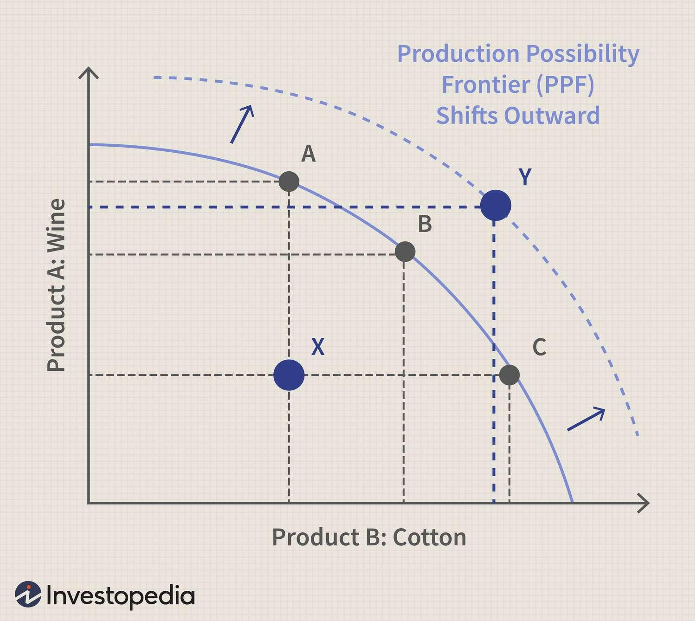

The interplay between economics and technology continues to redefine the landscapes of finance and resource management. Among the core concepts at the heart of these transformations are the Production Possibility Frontier (PPF), Pareto Efficiency, and algorithmic trading. Each of these principles provides a unique lens through which we can examine the allocation of scarce resources and optimize economic outcomes.

The Production Possibility Frontier (PPF) is a fundamental economic model that illustrates the trade-offs faced by an economy in the production of two goods. By representing various production choices, the PPF demonstrates the efficient allocation of resources, where any movement along the curve signifies a change in the distribution of these resources from one good to another. Understanding the implications of the PPF helps economists and policymakers visualize the opportunity costs and trade-offs involved in resource allocation. For instance, if an economy can produce either guns or butter, the PPF illustrates the maximum feasible quantities of these two goods, given available resources and technology.

Pareto Efficiency, another crucial concept, is achieved when resources are allocated in such a way that it is impossible to make any individual better off without making someone else worse off. It is a state of optimal distribution where any deviation would lead to a decrease in overall welfare. Visualized on the PPF, Pareto Efficiency occurs at any point on the frontier, where production is efficient and any reallocation of resources would necessitate a trade-off. This concept remains pivotal in economic policies and decision-making, aiming to balance equity and efficiency in welfare economics.

Algorithmic trading represents the intersection of economic theory and technological innovation, where trading orders are executed using automated and complex algorithms based on a set of criteria. Its emergence in financial markets underscores the importance of efficiency and optimization principles. By leveraging vast datasets and sophisticated models, algorithmic trading seeks to optimize trade execution, minimize trading costs, and capitalize on market inefficiencies. The algorithms can be designed to incorporate economic principles, potentially aligning trading strategies with Pareto Efficient outcomes and efficiently navigating the constraints represented by the PPF.

Understanding these concepts is critical for economists, financial professionals, and policymakers. Their significance extends beyond academic interest, impacting real-world economic strategies and policies aimed at achieving optimal outcomes. This article aims to explore the interrelationships and practical implications of the PPF, Pareto Efficiency, and algorithmic trading, highlighting their importance in optimizing economic systems. The subsequent sections will delve deeper into each concept, illustrating how they together shape decision-making processes and policy development in modern economics.

## Table of Contents

## Understanding the Production Possibility Frontier

The Production Possibility Frontier (PPF) is a fundamental economic model that illustrates the trade-offs and opportunity costs an economy faces when allocating its finite resources to produce different combinations of two goods or services. Essentially, the PPF represents the maximum potential output of an economy, given a certain amount of resources and technology. It is graphically represented by a curve on a two-dimensional graph where each axis corresponds to the quantity of a different good. Points along this curve signify efficient production levels, meaning that the resources are optimally utilized without any wastage.

The shape of the PPF curve is typically convex due to the law of increasing opportunity costs. This economic principle states that as production of one good increases, the opportunity cost of producing additional units rises. Hence, reallocating resources from one product to another requires sacrificing increasingly larger amounts of the former. This curvature reflects the trade-offs inherent in economic decision-making.

In practical terms, consider an economy that produces only two goods: computers and textiles. If all resources are dedicated to computer production, less of them will be available for textiles, and vice versa. The PPF will help in understanding the feasibility and efficiency of different production combinations. If technological advancements occur or if there is an increase in available resources, the PPF will shift outward, indicating that more of both goods can potentially be produced.

Moreover, the PPF highlights the concept of opportunity cost. If the economy chooses to produce more computers, the opportunity cost is the quantity of textiles forgone. This decision-making process is crucial for determining the best allocation of resources to optimize overall welfare.

An economy operates inefficiently if it produces inside the PPF, indicating underutilization of resources. Conversely, a point outside the curve is unattainable given current resources and technology. Economic growth, fueled by increases in resources or technological innovations, can make such points attainable by shifting the PPF outward.

This model is crucial for assessing economic strategy, providing insights into how a nation's resources can be distributed most effectively to meet its production goals. The PPF also plays a significant role in understanding trade policies and their impact on economic efficiency by illustrating how different allocation choices can lead to various levels of economic welfare.

## Exploring Pareto Efficiency

Pareto Efficiency is a fundamental concept in economics named after the Italian economist Vilfredo Pareto. It describes a situation where resources are allocated in such a way that no individual's situation can be improved without worsening someone else's. In other words, an allocation is Pareto Efficient if there is no alternative allocation that makes at least one person better off without making anyone else worse off.

Visualizing Pareto Efficiency on the Production Possibility Frontier (PPF) involves understanding the efficient use of resources within an economy. The PPF is a curve depicting all possible combinations of two goods or services that can be produced within a given resource constraint. Points on the curve represent efficient production levels, where shifting resources from the production of one good to another leads to a trade-off. Thus, points on the PPF illustrate Pareto Efficient allocations of resources, while points inside the curve suggest inefficiencies, and those outside are unattainable given current resources and technology.

Examples of Pareto Efficiency can be observed in market and resource allocation scenarios. In a perfectly competitive market, the equilibrium point is typically Pareto Efficient, as it reflects a balance where supply meets demand without excess surplus or shortage. In resource allocation, consider a classroom scenario where a teacher distributes a limited number of [books](/wiki/algo-trading-books) such that no student can receive more books without taking them from another student. This distribution represents a Pareto Efficient allocation.

However, Pareto Efficiency has limitations and potential misconceptions. Firstly, it does not consider the equity of distribution. A Pareto Efficient outcome could still be inequitable, where one party holds excessive resources while others have barely enough to meet their needs. Secondly, it assumes perfect information and rational behavior, which often do not hold true in real-world markets. Additionally, achieving Pareto Efficiency does not necessarily maximize social welfare, as it does not account for individual utilities or preferences.

Despite these limitations, Pareto Efficiency plays a critical role in improving economic policy and decision-making. Policymakers aim to reach Pareto improvements, which are changes that make at least one individual better off without making anyone worse. An understanding of Pareto Efficiency also aids in evaluating the effectiveness of different economic strategies, such as market regulations, public goods provision, and welfare programs. It offers a benchmark for assessing whether a particular policy or economic decision could potentially make some individuals better off without harming others, thus contributing to more informed and effective economic management.

## Algorithmic Trading: An Economic Perspective

Algorithmic trading refers to the use of computer algorithms to execute trading strategies in financial markets automatically and with minimal human intervention. This technological advancement in trading emerged in the late 20th century and has revolutionized how markets operate, providing enhanced efficiency and precision.

One of the primary ways [algorithmic trading](/wiki/algorithmic-trading) leverages economic principles is through its focus on efficiency and optimization. Algorithms are designed to optimize trades by analyzing vast amounts of data at high speeds, executing orders that best meet specific criteria, such as minimizing market impact, achieving the best price, or optimizing transaction costs. This efficiency is rooted in the algorithms' ability to process information and execute trades faster than any human trader, thereby capturing opportunities in rapidly changing market conditions.

The relationship between algorithmic trading and Pareto Efficiency is nuanced. Pareto Efficiency, in economics, refers to a situation where resources are allocated in the most efficient manner, such that no individual's situation can be improved without worsening another's. Algorithmic trading contributes to Pareto Efficiency by seeking optimal pricing and allocation of market resources, potentially leading to more efficient market outcomes. For instance, high-frequency trading, a subset of algorithmic trading, often helps in narrowing bid-ask spreads, thus enhancing market [liquidity](/wiki/liquidity-risk-premium) and facilitating better price discovery, edging closer to Pareto optimal outcomes.

However, the impact of algorithmic trading on market dynamics and resource allocation is complex. On one hand, it enhances liquidity, reduces transaction costs, and improves the speed and accuracy of trading. These elements contribute significantly to resource allocation by ensuring capital flows efficiently where it’s most productive, aligning with the principles of economic efficiency. On the other hand, algorithmic trading can introduce market [volatility](/wiki/volatility-trading-strategies), especially during periods of instability, as swift trading decisions made by algorithms might lead to abrupt market swings.

The potential risks associated with algorithmic trading include the possibility of exacerbating market volatility and systemic risk. The Flash Crash of 2010 is a prominent example where algorithmic trading was a key [factor](/wiki/factor-investing) in a rapid and significant market downturn. Additionally, the reliance on algorithms and technology can lead to errors or malfunctions, potentially resulting in significant losses.

Conversely, the benefits of algorithmic trading in achieving economic efficiency are considerable. By automating the trading process, it reduces human error, increases the consistency of trades, and can operate continuously without fatigue, providing a level of precision that manual trading cannot match. Moreover, the competitive nature of algorithmic trading pushes firms to continually enhance their algorithms, contributing to innovations that further optimize trade executions and market operations.

In conclusion, while algorithmic trading incorporates fundamental economic principles such as efficiency and optimization, its relationship with concepts like Pareto Efficiency is intricate, impacting market dynamics in multifaceted ways. Its implementation offers both substantial benefits and notable risks, underscoring the need for continued analysis and integration of economic strategies to effectively harness its potential.

## Interconnections between PPF, Pareto Efficiency, and Algorithmic Trading

The Production Possibility Frontier (PPF), Pareto Efficiency, and algorithmic trading are interconnected concepts that together offer a comprehensive framework for understanding economic trade-offs and efficiencies in financial markets. The PPF sets a foundational basis for comprehending Pareto Efficiency by illustrating how resources can be optimally allocated to maximize production and utility. The PPF curve demonstrates the various combinations of two goods that can be produced given a fixed set of resources, where any point on the PPF represents an efficient allocation of resources. When an economy operates on the frontier, it operates at maximum efficiency, meaning that any reallocation of resources would result in a trade-off.

Pareto Efficiency is achieved when resources are allocated in such a way that no individual can be made better off without making someone else worse off. On the PPF, this point of efficiency is any point on the curve itself, rather than within the interior, which would indicate underutilization. The optimal allocation of resources denoted by Pareto Efficiency is a crucial consideration in policy-making and organizational strategies.

Algorithmic trading, a product of technological advancements, builds upon these economic principles by employing computational algorithms to optimize trading strategies and decisions. These algorithms evaluate massive quantities of data to identify market inefficiencies and execute trades at high speeds and frequencies that are impossible for human traders. By using sophisticated statistical and mathematical models, algorithmic trading seeks to reach near Pareto Efficient equilibria by maximizing the utility of trades without compromising on the resources involved, akin to operating directly on the PPF curve.

The role of algorithmic trading in amplifying these economic efficiencies can be observed in scenarios such as high-frequency trading ([HFT](/wiki/high-frequency-trading-strategies)), which leverages small pricing discrepancies in various markets globally, thereby enhancing liquidity and narrowing bid-ask spreads. For instance, [arbitrage](/wiki/arbitrage) algorithms exploit price differentials for the same asset in different markets, ensuring that prices converge sharply towards a state of efficiency indicative of Pareto Optimal conditions.

Real-world cases, such as the 2010 "Flash Crash", highlight both the potential and pitfalls of these connections. Algorithmic trading at its best corrects inefficiencies, but as the Flash Crash demonstrated, the interrelations of these economic principles can also unravel under stress, leading to market anomalies. The incident revealed how the over-optimization of algorithms can lead to systemic risk, a form of operational and regulatory inefficiency.

As these concepts continue to evolve, the interconnectedness of PPF, Pareto Efficiency, and algorithmic trading offers valuable insights into future economic strategies. For example, central banks and financial institutions can harness algorithmic trading to monitor financial markets in real-time, ensuring that the allocation of resources remains efficient and that market dynamics comply with regulatory standards. By understanding these relationships, economic and financial professionals can better navigate the complexities of modern markets, leading to more robust and resilient economic systems. The ongoing integration of these principles will likely shape future developments in economic theories and practices.

## Conclusion

The exploration of key economic concepts such as the Production Possibility Frontier (PPF), Pareto Efficiency, and algorithmic trading offers significant insights into optimizing economic outcomes. These fundamental principles are not just theoretical constructs; they are instrumental in shaping practical economic strategies and policies. 

Understanding the PPF equips economic and financial professionals with the ability to visualize and evaluate trade-offs and opportunity costs. It provides a framework for assessing the efficient allocation of resources, which is crucial for decision-making in scenarios of scarcity and competing needs. Furthermore, the concept of Pareto Efficiency enhances our ability to identify optimal states of resource allocation where no individual can be made better off without making someone else worse off. Recognizing these efficient allocations can guide the development of more balanced and equitable economic policies.

Algorithmic trading, which leverages economic principles such as efficiency and optimization, highlights the practical application of these concepts within financial markets. It utilizes sophisticated computational algorithms to enhance market efficiency, improve liquidity, and optimize trading strategies. The interplay between algorithmic trading, PPF, and Pareto Efficiency underscores the interconnectedness of these concepts, offering a comprehensive understanding of how market dynamics can be optimized.

By weaving together these economic principles, new insights emerge, emphasizing the importance of their interconnections for both economic theory and practice. Professionals in the economic and financial arenas are thus encouraged to deepen their understanding and explore these concepts further to improve their strategic acumen. 

Ultimately, the assimilation of these principles into global economic policies and trading strategies holds the promise of fostering an environment conducive to sustainable economic growth and improved societal welfare. Understanding how these concepts interrelate paves the way for innovative approaches to tackling complex economic challenges, ensuring a resilient foundation for future economic advancements.

## References & Further Reading

[1]: Samuelson, P. A., & Nordhaus, W. D. (2010). ["Economics."](https://books.google.com/books/about/EBOOK_Economics.html?id=rMovEAAAQBAJ) McGraw-Hill Education.

[2]: Kreps, D. M. (1990). ["A Course in Microeconomic Theory."](https://www.jstor.org/stable/j.ctv12fw7z7) Princeton University Press.

[3]: Lopez de Prado, M. (2018). ["Advances in Financial Machine Learning."](https://www.amazon.com/Advances-Financial-Machine-Learning-Marcos/dp/1119482089) Wiley.

[4]: Aronson, D. R. (2006). ["Evidence-Based Technical Analysis: Applying the Scientific Method and Statistical Inference to Trading Signals."](https://www.amazon.com/Evidence-Based-Technical-Analysis-Scientific-Statistical/dp/0470008741) Wiley.

[5]: Jansen, S. (2020). ["Machine Learning for Algorithmic Trading."](https://github.com/stefan-jansen/machine-learning-for-trading) Packt Publishing.

[6]: Chan, E. P. (2008). ["Quantitative Trading: How to Build Your Own Algorithmic Trading Business."](https://github.com/ftvision/quant_trading_echan_book) Wiley.