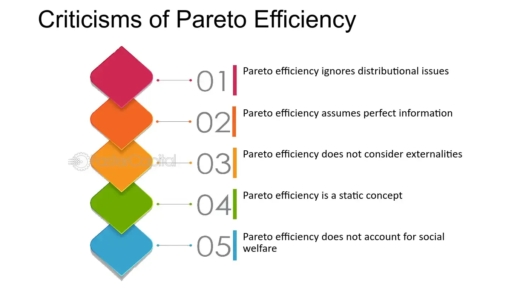

## Table of Contents

## What is a Pareto Improvement?

A Pareto Improvement is a change that makes at least one person better off without making anyone else worse off. Imagine you and your friend have some apples and oranges. If you trade some of your apples for your friend's oranges, and both of you are happier with the new arrangement, that's a Pareto Improvement. It's named after an Italian economist named Vilfredo Pareto, who came up with the idea.

This concept is important in economics because it helps us understand how to make changes that improve overall well-being without harming anyone. For example, if a company can reorganize its workers in a way that increases productivity and pays everyone the same or more, that's a Pareto Improvement. However, in real life, it can be hard to find changes that make everyone better off, so we often have to settle for less perfect solutions.

## Who was Vilfredo Pareto and how did he contribute to economics?

Vilfredo Pareto was an Italian economist and sociologist born in 1848. He is famous for coming up with the idea of the Pareto Principle, also known as the 80/20 rule. This principle says that in many situations, 80% of the results come from just 20% of the causes. For example, Pareto noticed that 80% of the land in Italy was owned by 20% of the people. This idea has been used in many fields, like business and health care, to help people focus on what's most important.

Pareto also contributed to economics by developing the concept of Pareto Efficiency, or Pareto Optimality. This idea is about making changes that make at least one person better off without making anyone else worse off. These changes are called Pareto Improvements. Pareto's work helped economists understand how to think about making the world a better place without hurting anyone. His ideas are still important in economics today, helping people make decisions that can improve overall well-being.

## Can you provide a simple example of a Pareto Improvement?

Imagine you and your friend are at a park. You have two sandwiches, but you only like one of them. Your friend has two drinks, but they only like one of them. You trade the sandwich you don't like for the drink your friend doesn't like. Now, you both have food and drinks that you enjoy more. This is a Pareto Improvement because both of you are better off, and neither of you is worse off.

In another example, think about a classroom where two students are working on a project. One student is good at writing, and the other is good at drawing. They decide to split the tasks so the writer writes the report and the artist creates the visuals. Both students end up doing what they're good at and enjoy, making the project better and their experience more enjoyable. This is another Pareto Improvement because both students are happier and the project improves, without anyone being worse off.

## What are the key conditions necessary for a Pareto Improvement?

For a Pareto Improvement to happen, at least one person needs to be better off after the change. This means that after the change, someone feels happier or gets something they want more. It's like if you trade your apple for your friend's orange, and you like oranges more than apples. As long as you're happier with the orange, that's part of what makes it a Pareto Improvement.

The other key condition is that no one can be worse off after the change. This means that everyone else involved should be at least as happy as they were before, if not happier. Going back to the apple and orange example, your friend should be just as happy or happier with the apple they got from you. If they liked oranges more than apples, the trade wouldn't be a Pareto Improvement because they'd be worse off. So, a Pareto Improvement makes at least one person better off and leaves everyone else the same or better off.

## How does Pareto Improvement relate to economic efficiency?

Pareto Improvement is closely tied to the idea of economic efficiency, especially what economists call Pareto Efficiency. Economic efficiency means using resources in the best way possible so that we get the most out of them. When we talk about Pareto Efficiency, we're looking for a situation where you can't make anyone better off without making someone else worse off. A Pareto Improvement helps us move toward this kind of efficiency because it makes at least one person better off without hurting anyone else. So, every time we make a Pareto Improvement, we're getting closer to using our resources in the most efficient way.

Think of it like a puzzle where you're trying to fit all the pieces together perfectly. Each time you find a better spot for a piece without messing up the others, you're making a Pareto Improvement. Over time, these improvements can lead to a more efficient overall picture. In real life, this could mean things like trading goods or services in a way that makes everyone happier, or reorganizing a business so that it works better without anyone losing their job. By focusing on Pareto Improvements, we can work toward a more efficient economy where resources are used in the best way possible for everyone.

## What are the limitations of using Pareto Improvement as a criterion for policy evaluation?

Using Pareto Improvement as a way to judge if a policy is good has some problems. One big issue is that it's really hard to find changes that make at least one person better off without making anyone else worse off. In real life, most changes affect people in different ways, and it's tough to make everyone happy. For example, if a city wants to build a new park, some people might love it, but others might lose their homes or businesses to make room for it. So, even if the park makes some people better off, it might make others worse off, and it wouldn't be a Pareto Improvement.

Another problem is that Pareto Improvement doesn't tell us anything about how much better off someone is or how many people are affected. Imagine a policy that makes one person a little bit happier but leaves everyone else the same. That's a Pareto Improvement, but it might not be the best use of resources if there's another policy that could make a lot of people much happier. So, while Pareto Improvement is a good idea, it's not always the best way to decide if a policy is good because it doesn't look at the bigger picture or how fair the changes are.

## How is Pareto Improvement different from a Pareto Optimum?

Pareto Improvement and Pareto Optimum are two ideas that help us understand how to make things better for people without making things worse for others. A Pareto Improvement happens when we make a change that makes at least one person better off and no one worse off. Imagine you and your friend are sharing cookies and juice. If you trade your cookie for your friend's juice and both of you are happier with what you get, that's a Pareto Improvement. It's about finding ways to make small changes that improve someone's situation without hurting anyone else.

On the other hand, a Pareto Optimum, or Pareto Efficiency, is a situation where you can't make any more Pareto Improvements. It's like reaching the best possible arrangement where no one can be made better off without making someone else worse off. Going back to the cookies and juice example, if you and your friend have already traded until you're both as happy as you can be with what you have, you've reached a Pareto Optimum. In this state, any further change would make at least one of you worse off, so you can't improve things any more without someone losing out.

## Can you discuss a real-world application where Pareto Improvement was used in policy-making?

One real-world example of using Pareto Improvement in policy-making is in the field of environmental policy, specifically with emissions trading systems. Imagine a group of factories that produce different amounts of pollution. Some factories find it easy to reduce pollution, while others find it hard. The government sets up a system where factories that can easily reduce pollution get credits for doing so. These factories can then sell their credits to factories that find it harder to reduce pollution. This way, the total amount of pollution goes down, and both types of factories are better off. The factories that reduced pollution easily make money from selling credits, and the factories that bought credits can keep operating without having to make expensive changes. This is a Pareto Improvement because both groups of factories are better off, and the environment benefits too.

Another example is in the area of international trade agreements. When countries agree to lower trade barriers like tariffs, it can lead to a Pareto Improvement. Imagine two countries, one good at making cars and the other good at growing oranges. If they agree to trade more freely, the car-making country can sell more cars to the orange-growing country, and the orange-growing country can sell more oranges to the car-making country. Both countries benefit from having more of what they want, and no one is worse off. This kind of trade agreement can make both countries better off by allowing them to specialize in what they do best and trade for what they need, leading to a Pareto Improvement.

## What are the ethical considerations or critiques of relying on Pareto Improvements?

Relying on Pareto Improvements can be tricky when we think about fairness and equality. Imagine a rich person gets a little richer and a poor person stays the same. That's a Pareto Improvement because no one is worse off, but it doesn't make things more fair. Some people think we should care more about making sure everyone has enough, not just making sure no one loses anything. So, using Pareto Improvements might not help if we want to make things more equal for everyone.

Another problem is that Pareto Improvements can be hard to find in real life. Most changes affect people in different ways, and it's tough to make everyone happy. If a policy makes some people much better off but leaves others the same, it might be a Pareto Improvement, but it might not be the best choice if there's another policy that could help more people. So, while Pareto Improvements sound good, they don't always tell us the whole story about what's fair or what's best for everyone.

## How do concepts like Kaldor-Hicks efficiency compare to Pareto Improvement?

Kaldor-Hicks efficiency is another way to think about making things better, but it's different from Pareto Improvement. With Kaldor-Hicks, a change is good if the people who gain from it could, in theory, pay off the people who lose out, and everyone would still be better off. Imagine you and your friend are sharing cookies. If you get an extra cookie and your friend loses one, but you could give your friend some money to make up for it, that's Kaldor-Hicks efficient. It's about the idea that the winners could make the losers whole, even if they don't actually do it.

Pareto Improvement is stricter because it says that no one can be worse off after the change. Going back to the cookie example, a Pareto Improvement would mean you get an extra cookie and your friend gets one too, so both of you are happier. Kaldor-Hicks efficiency is more flexible because it allows for some people to lose out, as long as the total gain is big enough to cover those losses. This makes Kaldor-Hicks more useful in real life because it's easier to find changes that make some people better off and some worse off, but still improve things overall.

## What are some advanced critiques of the Pareto Improvement concept from economic theorists?

Some economists think that the Pareto Improvement idea has big problems because it doesn't look at fairness. Imagine a world where rich people keep getting richer and poor people stay the same. That could be a Pareto Improvement because no one is worse off, but it doesn't make things more equal. These economists say we should care more about making sure everyone has enough, not just making sure no one loses anything. They think using Pareto Improvements might not help if we want to make things fairer for everyone.

Another big critique is that Pareto Improvements are hard to find in real life. Most changes affect people in different ways, and it's tough to make everyone happy. If a policy makes some people much better off but leaves others the same, it might be a Pareto Improvement, but it might not be the best choice if there's another policy that could help more people. So, while Pareto Improvements sound good, they don't always tell us the whole story about what's best for everyone. Some economists think we should use other ways to decide if a policy is good, like looking at how much better off people are or how many people are affected.

## How might future economic models evolve beyond the concept of Pareto Improvement?

Future economic models might move away from just using Pareto Improvement because it doesn't look at fairness or how many people are helped. Instead, these new models could focus on making sure everyone has enough, not just making sure no one loses anything. They might use ideas like "sufficientarianism," which says we should make sure everyone has enough to live a good life. Or they might use "prioritarianism," which says we should help the people who need it the most first. These ideas could help make things more equal and fair for everyone, not just a few people.

Another way future economic models might change is by looking at how much better off people are and how many people are affected by a change. Instead of just saying a change is good if no one is worse off, these models might use ideas like "social welfare functions" to see if a change makes things better overall. This could mean looking at how happy or well-off people are after a change, not just if they're better off than before. By using these new ways of thinking, future economic models could help us make better choices that help more people and make the world a fairer place.

## References & Further Reading

[1]: Fama, E. F. (1970). ["Efficient Capital Markets: A Review of Theory and Empirical Work."](https://www.jstor.org/stable/2325486) Journal of Finance, 25(2), 383-417.

[2]: Lopez de Prado, M. (2018). ["Advances in Financial Machine Learning."](https://www.amazon.com/Advances-Financial-Machine-Learning-Marcos/dp/1119482089) Wiley.

[3]: Jansen, S. (2020). ["Machine Learning for Algorithmic Trading."](https://github.com/stefan-jansen/machine-learning-for-trading) Packt Publishing.

[4]: Chan, E. P. (2009). ["Quantitative Trading: How to Build Your Own Algorithmic Trading Business."](https://github.com/ftvision/quant_trading_echan_book) Wiley.

[5]: Aronson, D. (2007). ["Evidence-Based Technical Analysis: Applying the Scientific Method and Statistical Inference to Trading Signals."](https://www.amazon.com/Evidence-Based-Technical-Analysis-Scientific-Statistical/dp/0470008741) Wiley.