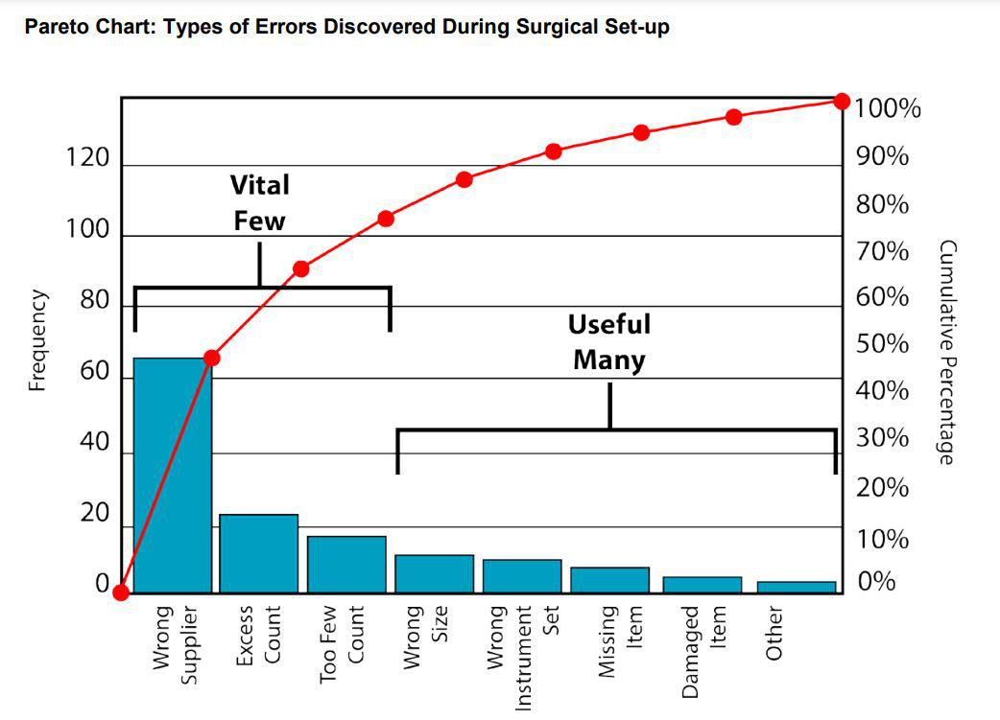

In the rapidly evolving financial markets, the concepts of efficiency, Pareto improvement, and algorithmic trading are becoming increasingly interconnected. Understanding these connections is essential for traders, economists, and financial professionals aiming for optimal market performance. This article provides an in-depth exploration of these economic theories and their implications in the context of modern trading practices.

Economic efficiency in financial markets refers to the optimal allocation of resources, maximizing productivity without waste, and ensuring that markets operate at their most effective capacity. This concept is crucial as it underpins the development of trading strategies that optimize resource utilization and minimize transaction costs, thus maximizing returns.



Pareto improvement, meanwhile, offers a different perspective by focusing on resource reallocations that benefit at least one party without causing harm to others. As a foundational concept in economic theory, Pareto improvement finds application across various economic sectors, including financial markets. It provides a framework for achieving a Pareto optimum—a state in which no further improvements can be made without adversely affecting someone else.

Algorithmic trading, a technological advancement in financial markets, leverages principles of economic efficiency and market theories like the Efficient Market Hypothesis (EMH) to exploit possible inefficiencies. By utilizing sophisticated algorithms, often enhanced through artificial intelligence (AI) and machine learning (ML), traders can swiftly identify market discrepancies and capitalize on them.

Critical to this analysis is the role of algorithmic trading strategies in incorporating concepts of Pareto improvement to enhance outcomes. By integrating these economic theories, algorithmic trading can support not only the quest for increased profit but also the efficient allocation of resources within the market structure. 

As we explore these mechanisms, the interplay between economic theories and advancements in trading technologies is highlighted, offering insights into their practical applications. This understanding is vital as financial markets continue to adapt and evolve, driven by these intersecting dynamics. Join us as we examine how these forces shape modern trading and the broader economic landscape.

## Table of Contents

## Understanding Economic Efficiency in the Financial Markets

Economic efficiency in financial markets is a cornerstone of maximizing productivity through optimal resource allocation, ensuring minimal waste. This principle is pivotal to creating markets that reflect true asset values, facilitating better decision-making and investment strategies. In essence, economic efficiency occurs when every resource is utilized in a way that maximizes output, contributing to stable and reliable market conditions.

The Efficient Market Hypothesis (EMH) is a key concept tied to economic efficiency. Proposed by Eugene Fama in the 1970s, EMH suggests that asset prices in a financial market reflect all available information at any given time. This implies that it is impossible to consistently achieve higher returns than the overall market through expert stock selection or market timing because existing securities already trade at their fair value. EMH comes in three forms - weak, semi-strong, and strong - each varying by the breadth of information considered in market prices.

Algorithmic trading, which employs computer programs to execute trading decisions, is deeply intertwined with economic efficiency. Algorithms can quickly process and analyze vast quantities of data to discover inefficiencies in the markets—discrepancies between an asset's current market price and its estimated fair value. Through such detection, [algorithmic trading](/wiki/algorithmic-trading) can capitalize on transient [arbitrage](/wiki/arbitrage) opportunities before the market corrects itself in response to the new information, thereby aligning market prices closer to their efficient values.

Moreover, algorithmic trading optimizes transaction costs and enhances the [liquidity](/wiki/liquidity-risk-premium) of markets by swiftly executing large volumes of trades that would typically shift market prices unfavorably if executed manually over a longer period. Algorithms, equipped with advanced techniques such as [machine learning](/wiki/machine-learning), further refine strategies by learning from historical data and adapting to new data trends almost in real-time. This capability allows algorithms to tune supply-demand imbalances instantaneously, contributing to greater market efficiency.

For a practical example involving algorithmic trading and economic efficiency, consider a Python script that detects inefficiencies in asset pairs for [statistical arbitrage](/wiki/statistical-arbitrage) — a strategy aimed at trading assets that historically show a strong correlation in price movements. A simplified version of such an implementation could be:

```python
import numpy as np
import pandas as pd
from statsmodels.tsa.stattools import coint

# Load historical price data for asset pairs
data = pd.read_csv("market_data.csv")
asset1_prices = data['Asset1']
asset2_prices = data['Asset2']

# Check for cointegration, indicating a correlation between asset price movements
score, p_value, _ = coint(asset1_prices, asset2_prices)

# Strategy logic
if p_value < 0.05:
    print("Assets are cointegrated; potential for arbitrage.")
    # Implement trading logic based on price deviations
else:
    print("No significant cointegration detected.")
```

This simple script exemplifies an algorithm finding statistically significant correlations, suggesting inefficiencies ripe for exploitation. This is a streamlined demonstration of how algorithmic trading systems use data analysis to achieve economic efficiency, aligning prices more closely to their fair market value.

## The Role of Pareto Improvement in Economic Theory

Pareto improvement is a key concept in economic theory that refers to the reallocation of resources in a manner that benefits at least one individual without making anyone else worse off. The concept is named after the Italian economist Vilfredo Pareto, who introduced the notion of efficiency in allocation in the late 19th and early 20th centuries. Pareto improvements serve as a fundamental criterion for efficiency in welfare economics and are utilized in assessing the distribution of resources in various economic sectors.

The principle of Pareto improvement can be illustrated through simple economic models. In a market with multiple [agents](/wiki/agents), a Pareto improvement occurs when a change in allocation results in at least one individual being better off while no one is adversely affected. Considered in many policy analyses, this concept aids in the identification of potential beneficial changes to resource allocation or production processes that optimize outcomes.

Achieving a Pareto optimum, a situation where no further Pareto improvements are possible, represents an economically efficient allocation of resources. At this point, it's impossible to reallocate resources to make any one individual better off without making at least one other individual worse off. Mathematically, an allocation point $(x_1, x_2, \ldots, x_n)$ in the n-dimensional potential resource space is Pareto optimal if and only if there does not exist another feasible allocation $(y_1, y_2, \ldots, y_n)$ such that $y_i \geq x_i$ for all $i$, with strict inequality for at least one $i$.

Despite the analytical clarity and utility of Pareto improvements in economic analysis, the concept has its criticisms and limitations. A notable critique is its emphasis on efficiency rather than equity. Pareto improvements do not inherently consider the fairness or equality of resource distributions. An allocation can be Pareto optimal without being equitable, potentially reinforcing existing inequalities in wealth and power. Furthermore, the focus on Pareto efficiency might overlook broader socioeconomic goals, such as poverty reduction and social justice, which require equitable redistribution.

In terms of practical applications, Pareto improvements are used to guide policy decisions in various economic sectors, including public finance, health economics, and environmental economics. These applications often involve identifying and implementing solutions that enhance welfare while maintaining or improving resource distribution among stakeholders.

In summary, while Pareto improvement is a valuable tool for assessing and achieving economic efficiency, it is not without limitations. Its application requires careful consideration of broader societal goals and the inherent trade-offs between efficiency and equity. Understanding these nuances is essential for economists and policymakers seeking to balance optimal resource allocation with the pursuit of equitable outcomes.

## Algorithmic Trading and Economic Efficiency

Algorithmic trading, an essential component of modern financial markets, leverages economic and market efficiencies to devise optimal trading strategies. By automating trading decisions, these systems can process vast amounts of market data and execute trades at speeds and frequencies that are impossible for human traders. A core aspect of algorithmic trading involves the use of Artificial Intelligence (AI) and Machine Learning (ML) to enhance the capability of trading algorithms in identifying market inefficiencies swiftly.

Machine learning models, for instance, employ historical data to predict future price movements, allowing algorithms to pinpoint and exploit inefficiencies. These models are trained on patterns found in market data that could indicate buying or selling opportunities. AI-driven algorithms continuously update themselves based on new data, improving their accuracy over time. This adaptability is vital in fluid market environments where conditions change rapidly.

Minimizing transaction costs is another crucial element of maximizing economic efficiency in algorithmic trading. High-frequency trading algorithms, in particular, aim to reduce costs associated with market impact and slippage by executing trades in smaller packet sizes at optimal timings. Transaction costs can be significant in markets with low liquidity or high [volatility](/wiki/volatility-trading-strategies), making effective cost management a priority for algorithmic strategies. By minimizing these costs, traders can maximize their net returns, thereby achieving higher overall efficiency.

Risk management is paramount in algorithmic trading, as it ensures that resources are allocated efficiently while managing the exposure to market volatility. Various techniques, such as stop-loss orders, portfolio diversification, and real-time risk assessment, are implemented within trading algorithms to mitigate potential losses. Furthermore, algorithms can rebalance portfolios automatically to maintain a desired risk level, accounting for changes in asset prices or market conditions.

Incorporating efficient resource allocation within risk management strategies allows algorithmic traders to align their portfolios to pre-determined risk appetites and market conditions, thus optimizing their performance. Algorithms can simulate multiple scenarios and outcomes before executing trades, leveraging statistical models to manage and distribute risk systematically across diverse assets.

Algorithmic trading represents a synthesis of advanced computing technologies and traditional economic theories, pushing the boundaries of financial market analysis and execution. By continuously refining these algorithms to improve their efficiency in both trading and risk management, market participants can better capitalize on opportunities while maintaining a sustainable competitive edge.

## Integrating Pareto Improvement with Algorithmic Strategies

Algorithmic trading strategies can effectively incorporate Pareto improvement concepts to enhance market outcomes by optimizing resource allocation and improving trading processes. Pareto improvement, which focuses on making at least one individual better off without making anyone else worse off, can be achieved in algorithmic trading by ensuring that trading decisions are efficient, benefiting traders and the market.

### Real-World Applications and Scenarios

1. **Optimization of Trade Execution**:
   Algorithmic trading systems often utilize advanced mathematical models to optimize trade execution, ensuring that trades are executed at the best possible prices with minimal market impact. By reducing transaction costs and improving execution quality, these systems can achieve Pareto improvements by enhancing the trader’s performance without negatively affecting other market participants. An example is the use of Volume Weighted Average Price (VWAP) strategies, which aim to execute large orders in line with market [volume](/wiki/volume-trading-strategy) patterns, reducing the price impact and benefiting all market participants.

2. **Liquidity Provision**:
   Algorithmic market makers provide liquidity by continuously quoting buy and sell prices, facilitating smoother market operations. By doing so, they can earn profits from the bid-ask spread while also improving liquidity and reducing volatility for other traders. This process can represent a Pareto improvement, where the market maker benefits without detrimental effects on other traders, who enjoy more stable markets.

### Case Studies of Successful Applications

- **High-Frequency Trading (HFT)**:
  [HFT](/wiki/high-frequency-trading-strategies) firms often employ strategies that seek to capitalize on small price discrepancies across different markets or securities. By executing trades rapidly and efficiently, these firms enhance price discovery and market efficiency. A well-documented case is that of Virtu Financial, which demonstrated consistent profitability on most trading days by leveraging real-time market data and executing trades that benefit from minute price differences, contributing to overall market efficiency.

- **Arbitrage Strategies**:
  Algorithmic trading strategies often exploit arbitrage opportunities by identifying price differences between related securities or markets. When exploited successfully, these strategies balance pricing anomalies, leading to more efficient market pricing. For instance, statistical arbitrage strategies analyze historical price data to predict and exploit temporary discrepancies, creating a win-win scenario for both arbitrageurs and the broader market.

### Practical Benefits and Outcomes

By incorporating Pareto improvements in algorithmic trading strategies, markets can experience:

- **Improved Efficiency**: Trading algorithms that employ Pareto-efficient strategies reduce wastage of resources, such as time and computational power, enabling more efficient market operations.

- **Enhanced Market Stability**: By optimizing trades and providing continuous liquidity, algorithmic strategies contribute to reduced volatility and increased market resilience.

- **Innovation in Trading Techniques**: The integration of Pareto improvements fosters the development of innovative algorithms that continually adapt to evolving market conditions, leading to more robust trading systems and strategies.

In conclusion, the integration of Pareto improvement principles in algorithmic trading not only enhances individual trading outcomes but also contributes positively to overall market efficiency and stability. These strategies reflect the dynamic adaptation of economic theories to practical financial market applications, illustrating the continuous evolution toward optimal trading environments.

## Challenges and Future Trends

Achieving true Pareto improvements in trading is a challenging endeavor because such situations, where reallocations can occur without making anyone worse off, are indeed rare. In financial markets, participants often have conflicting objectives, making it difficult to find scenarios where all parties can benefit simultaneously. The competitive nature of these markets implies that gains for one entity often come at the expense of another, which inherently limits the occurrence of Pareto improvements.

One of the primary challenges in achieving Pareto efficiency in trading is the inherent complexity and dynamics of the financial markets. Markets are influenced by a wide range of factors, including investor behavior, economic indicators, geopolitical events, and technological advancements. These elements create a highly volatile environment where identifying mutually beneficial changes is complex.

Looking forward, several trends are poised to impact algorithmic trading and its relationship with economic theories. The integration of [artificial intelligence](/wiki/ai-artificial-intelligence) (AI) and machine learning (ML) in trading systems is one such trend. These technologies enhance the ability to analyze vast datasets, uncover hidden patterns, and adapt to changing market conditions. As AI and ML technologies evolve, they hold the potential to redefine market efficiency by improving the precision and speed of trading decisions.

Furthermore, advancements in data analytics are likely to play a pivotal role in the future of algorithmic trading. The ability to process and interpret large volumes of financial data in real-time can lead to the development of novel trading strategies. These strategies could better address market inefficiencies, although the quest for Pareto improvements may still remain elusive due to the zero-sum nature of most trading activities.

Regulatory changes and shifting market conditions will also significantly impact the application of Pareto improvements and economic efficiency. As regulators worldwide grapple with issues related to market fairness, transparency, and stability, their interventions could reshape how trading systems operate. Future regulatory frameworks might promote more equitable trading environments, potentially creating new opportunities for efficiency gains.

However, these regulations can also impose constraints on trading strategies, affecting their ability to achieve Pareto optimality. Market participants must remain agile, adapting their strategies not only to technological and analytical advancements but also to the evolving regulatory landscape.

In summary, while true Pareto improvements in trading are challenging to achieve and rare, ongoing advancements in AI, ML, and data analytics, coupled with regulatory developments, will continue to influence economic efficiency and trading strategies. The interplay of these elements will shape the future landscape of algorithmic trading, presenting both opportunities and obstacles in the quest for optimizing market outcomes.

## Conclusion

In the context of algorithmic trading, integrating concepts of economic efficiency and Pareto improvements provides a framework for optimizing resource allocation, minimizing transaction costs, and ultimately enhancing market performance. Economic efficiency ensures that resources within financial markets are used optimally, maximizing productivity and reducing waste. This is crucial as algorithmic trading relies on sophisticated algorithms and data analysis to execute trades at speeds and volumes beyond human capability.

Pareto improvements, which occur when a change can make at least one participant better off without making others worse off, play a pivotal role in refining trading strategies. While achieving a Pareto optimum where no further improvements are possible without detriment is challenging, algorithmic trading systems can approach this state by continuously adjusting and learning from market data. This is particularly viable with the advancement of artificial intelligence and machine learning technologies that can quickly identify and exploit market inefficiencies.

The combined application of these economic theories within algorithmic trading not only aims for increased profitability but also contributes to the broader goal of sustainable financial markets. By striving for efficiency and mutually beneficial outcomes, traders and financial professionals can foster a market environment that adapts to evolving conditions and innovations.

As market technologies and dynamics continue to evolve, ongoing learning and adaptation are crucial. New data analytics tools, regulatory shifts, and emerging market structures will continue to redefine what it means to be efficient in trading. Therefore, financial professionals are encouraged to stay abreast of these developments, leveraging the integration of economic theories and cutting-edge technologies to maintain a competitive edge and advance the sustainability of financial markets.

## References & Further Reading

[1]: Fama, E. F. (1970). ["Efficient Capital Markets: A Review of Theory and Empirical Work."](https://www.jstor.org/stable/2325486) Journal of Finance, 25(2), 383-417.

[2]: Lopez de Prado, M. (2018). ["Advances in Financial Machine Learning."](https://www.amazon.com/Advances-Financial-Machine-Learning-Marcos/dp/1119482089) Wiley.

[3]: Jansen, S. (2020). ["Machine Learning for Algorithmic Trading."](https://github.com/stefan-jansen/machine-learning-for-trading) Packt Publishing.

[4]: Chan, E. P. (2009). ["Quantitative Trading: How to Build Your Own Algorithmic Trading Business."](https://github.com/ftvision/quant_trading_echan_book) Wiley.

[5]: Aronson, D. (2007). ["Evidence-Based Technical Analysis: Applying the Scientific Method and Statistical Inference to Trading Signals."](https://www.amazon.com/Evidence-Based-Technical-Analysis-Scientific-Statistical/dp/0470008741) Wiley.