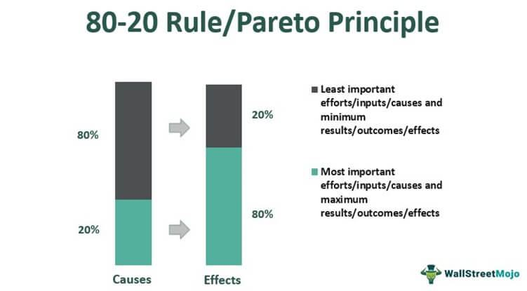

The Pareto Principle, commonly known as the 80/20 Rule, is a concept stemming from the observation that a small percentage of causes often lead to a large percentage of results. Named after the Italian economist Vilfredo Pareto, who observed that 80% of Italy's wealth was owned by 20% of the population, this principle has become a foundational concept in various fields. It suggests that in many situations, approximately 80% of consequences are the result of 20% of the causes. This imbalance implies that focusing efforts on the most significant factors can yield substantial improvements, making the Pareto Principle applicable in diverse domains such as business efficiency, quality control, and personal productivity.

In business, for example, it is not uncommon to find that 80% of a company's revenue is generated by 20% of its products or services. Similarly, in software development, a majority of software bugs can often be traced back to a small fraction of the code. This principle aids in prioritizing efforts and resources towards areas that promise the highest returns.



In the context of algorithmic trading, the relevance of the Pareto Principle becomes particularly intriguing. Algorithmic trading involves the use of computer programs to execute trading strategies at speeds and frequencies that human traders cannot achieve. Within this framework, the Pareto Principle suggests that a small percentage of trading strategies or market conditions could deliver the majority of profits. By identifying and optimizing these high-impact strategies, traders can potentially enhance their trading performance significantly.

The aim is to explore how traders can apply the 80/20 Rule to refine their trading algorithms, focusing on the most effective strategies and conditions that contribute disproportionately to trading success. This approach not only promises improved performance but also encourages a strategic allocation of resources and analytical efforts towards the most profitable aspects of trading.

## Table of Contents

## Understanding the Pareto Principle

The Pareto Principle, also known as the 80/20 Rule, is a pivotal concept encompassing the idea that a small number of causes are often responsible for a large percentage of effects. This principle emerged from the work of Vilfredo Pareto, an Italian economist who, in the early 20th century, observed that 80% of Italy's wealth was owned by 20% of the population. Although his initial findings focused on wealth distribution, the principle has found applications across various domains, illustrating the disproportionate relationship between inputs and outputs.

In a historical context, Vilfredo Pareto was analyzing wealth and income distribution when he noted a recurring pattern in the allocation of resources. This observation led to the generalization that a minority of causes or efforts often lead to the majority of results. Today, the Pareto Principle manifests itself in numerous fields, emphasizing efficiency and prioritization.

In the business sector, companies often find that 20% of their customers account for 80% of their sales. By identifying these key customers, businesses can allocate resources more strategically, enhancing customer satisfaction and profitability. Similarly, in quality control, it is commonly observed that 80% of defects arise from only 20% of the causes, enabling businesses to focus on critical areas for improvement.

Beyond economics and business, the principle appears in everyday life. For instance, individuals might wear 20% of their clothes 80% of the time or use 20% of their apps for 80% of their device activity. This natural imbalance suggests that attention and resources should be directed towards the most impactful areas, whether in personal time management or organizational productivity.

The strength of the Pareto Principle lies in its ability to shift focus towards the "critical few" while disregarding the "trivial many." By concentrating on these vital factors, individuals and organizations can improve efficiency and effectiveness. For example, in project management, identifying the vital tasks that yield the most significant outcomes can streamline operations and enhance results.

In conclusion, the Pareto Principle offers a powerful framework for prioritization and optimization. Understanding which elements generate the most significant impact allows for strategic planning and resource allocation, maximizing outcomes while minimizing effort. This principle underscores the importance of focusing on high-impact areas to drive progress and success.

## The Intersection of the Pareto Principle and Algo Trading

Algorithmic trading refers to the use of computer algorithms to execute trades in financial markets. These algorithms use pre-defined criteria and mathematical models to make trading decisions with speed and accuracy, often much faster than human traders. Key characteristics of [algorithmic trading](/wiki/algorithmic-trading) include the systematic and automated execution of trades, reliance on quantitative models, and the ability to analyze vast datasets to identify trading opportunities.

The Pareto Principle, commonly known as the 80/20 Rule, holds relevance in trading strategies by emphasizing that a small percentage of efforts, trades, or strategies yield the majority of results, profits, or successes. This principle suggests that in a typical trading environment, a minority of trading strategies could potentially generate the majority of profits.

Applying the Pareto Principle to algorithmic trading involves concentrating on identifying and executing those high-impact trading strategies that yield significant returns. By analyzing historical trading data, traders can determine which strategies contribute most to their bottom line. For example, a trader might discover that 20% of their strategies are responsible for 80% of their profits. Recognizing this disparity allows traders to optimize their focus and resources on refining and implementing these effective strategies.

Moreover, the Pareto Principle can help in pinpointing high-impact trading conditions. By understanding which market conditions or signals correspond with successful trades, algorithmic systems can optimize execution to capitalize on these insights. This means focusing on key market indicators and patterns that have historically led to profitable trades, allowing traders to adapt and execute strategies that are statistically proven to be effective.

This focused approach reduces the complexity of trading algorithms by eliminating less effective strategies and enhances overall performance by maximizing efforts on the most profitable ones. Thus, the Pareto Principle not only aids in reducing inefficiencies but also streamlines algorithmic decision-making to prioritize profitable trading conditions.

## Implementing the Pareto Principle in Trading Algorithms

To effectively implement the Pareto Principle in trading algorithms, traders need to focus on identifying and optimizing the small subset of trades and strategies that contribute the most to their overall performance. Here's a detailed approach to achieving this:

### Analyzing Trading Data

The first practical step involves thoroughly analyzing historical trading data to pinpoint the 20% of trades responsible for generating 80% of profits. This can be achieved through various methods:

1. **Data Collection and Preparation**: Collect relevant historical trading data, including trade entries, exits, prices, volumes, and profits or losses. Ensure this data is clean and consistent for accurate analysis.

2. **Profit Contribution Analysis**: Calculate the profit contribution of each trade using the formula:
$$
   \text{Profit Contribution} = \frac{\text{Profit from a Trade}}{\text{Total Profit from All Trades}} \times 100

$$

   By ranking trades based on their profit contributions, traders can identify the trades that have historically accounted for the largest share of profits.

3. **Cumulative Profit Analysis**: Create a cumulative profit curve to visualize the contribution of each trade. This visual representation helps to quickly identify the threshold where 20% of the trades start contributing to 80% of the profits.

### Curating and Focusing on Key Indicators

Once the 20% of high-performing trades are identified, the next step is to analyze these trades to discern any common characteristics or signals. This involves:

1. **Indicator Analysis**: Examine key indicators such as moving averages, momentum oscillators, volatility indices, and volume data that were present during these profitable trades.

2. **Signal Refinement**: Focus on refining signals associated with these indicators. For instance, if a specific moving average crossover consistently appears in profitable trades, further fine-tune the parameters like the length of the moving averages.

3. **Correlation Analysis**: Identify correlations between different indicators and the successful trades to ascertain which indicators provided the most reliable signals.

### Optimizing Trading Algorithms

With a focus on critical indicators and signals derived from the profitable trades, trading algorithms can be optimized to prioritize these elements:

1. **Algorithm Design**: Integrate the refined indicators and signals into the trading algorithm, ensuring they are weighted more heavily than lesser-performing indicators.

2. **Backtesting**: Conduct rigorous backtesting of the algorithm using historical data to validate its effectiveness. Assess whether the algorithm consistently identifies and executes the 20% of trades that yield the best returns.

3. **Parameter Optimization**: Use optimization techniques, such as genetic algorithms or grid search, to fine-tune the parameters of the trading strategy. This process seeks to maximize the algorithm’s performance based on historical data.

4. **Continuous Monitoring and Adjustment**: Post-implementation, continuously monitor the performance of the algorithm and adjust the parameters and signals as necessary to adapt to changing market conditions.

Python, being a popular tool for algorithmic trading, can automate many of these processes. Here’s a simple snippet for calculating profit contributions:

```python
import pandas as pd

# Assume df is a DataFrame with 'Trade' and 'Profit' columns
df = pd.DataFrame({
    'Trade': ['Trade1', 'Trade2', 'Trade3', 'Trade4', 'Trade5'],
    'Profit': [200, 1500, 300, 4000, 2000]
})

total_profit = df['Profit'].sum()
df['Profit_Contribution'] = df['Profit'] / total_profit * 100
df.sort_values(by='Profit_Contribution', ascending=False, inplace=True)

cumulative_contribution = df['Profit_Contribution'].cumsum()
df['Cumulative_Contribution'] = cumulative_contribution

# Display trades that fall into the top 20%
top_20_percent_trades = df[df['Cumulative_Contribution'] <= 80]
print(top_20_percent_trades)
```

By utilizing these steps, traders can effectively apply the Pareto Principle to identify and enhance the most impactful elements of their trading strategies, ultimately leading to improved performance and profitability.

## Case Studies and Real-World Applications

One notable case study that highlights the application of the Pareto Principle in algorithmic trading is that of Renaissance Technologies, an esteemed quantitative [hedge fund](/wiki/hedge-fund-trading-strategies). The firm's Medallion Fund, renowned for its exceptional returns, is reputed to leverage the 80/20 Rule by focusing on a select number of strategies that yield the bulk of its profits. Renaissance Technologies employs complex mathematical models and extensive data analysis to identify these high-impact trading strategies.

The primary lesson from Renaissance Technologies is the importance of rigorous data analysis and the continuation of refining trading models. By focusing on a smaller subset of data or strategies that promise the highest returns, firms can optimize their trading systems for maximum efficiency. The fund's success underscores the potential for algorithmic traders to concentrate their efforts on the minority of strategies that offer the greatest returns, thereby aligning with the Pareto Principle.

Another example is provided by the proprietary trading desks of investment banks such as Goldman Sachs. These desks often discover that a small percentage of their trading positions account for the majority of their profits. By applying the Pareto Principle, these desks prioritize the optimization of their most successful trading strategies and market conditions, allocating more resources to enhance these high-performing trades.

Applying the 80/20 Rule can also lead to improvements in risk management. Consider a scenario where a trading algorithm identifies that 80% of losses stem from 20% of the trading positions. By focusing on the minority of problematic trades, traders can develop strategies to mitigate these risks, enhancing overall profitability.

In both examples, the Pareto Principle serves as a guiding framework to concentrate on high-impact trades while minimizing less profitable efforts. This approach not only streamlines operations but also fosters a disciplined trading environment where resources are allocated to areas with the highest expected impact.

In conclusion, these cases demonstrate the practical application of the Pareto Principle in algorithmic trading. By honing in on the most effective trading strategies and conditions, traders can significantly improve their performance and achieve sustained success in the competitive trading landscape. The key takeaway is the effectiveness of prioritizing efforts and resources toward the minority of strategies that yield the greatest outcomes, confirming the timeless relevance of the 80/20 Rule in trading and beyond.

## Challenges and Considerations

Applying the Pareto Principle to algorithmic trading presents several challenges and considerations that traders must address. One of the key challenges is the risk of over-optimization. When traders focus on identifying the 20% of strategies or trades that generate 80% of profits, they may inadvertently tailor their algorithms too precisely to historical data. This phenomenon, known as curve fitting, can lead to strategies that perform well under [backtesting](/wiki/backtesting) conditions but fail to adapt to new, unforeseen market conditions. Over-optimized algorithms may rely heavily on past data peculiarities, rendering them less effective in the dynamic landscape of financial markets.

To mitigate the risks of over-optimization, traders must avoid fitting their models too closely to past data. This involves setting aside a portion of historical data for out-of-sample testing, which provides a more reliable evaluation of a strategy's performance in new scenarios. Additionally, incorporating robust validation techniques, such as walk-forward analysis, can help ensure that algorithms maintain profitability across different market conditions.

Ignoring important data is another significant risk when applying the Pareto Principle to trading. By concentrating only on a subset of data perceived as the most profitable, traders might overlook essential information that could affect future performance. Market dynamics, geopolitical events, and macroeconomic indicators can shift profitability patterns, rendering previously successful trades less effective. Ignoring these elements can lead to missed opportunities and increased exposure to unforeseen risks.

Continuous analysis and adaptation are crucial for maintaining the effectiveness of trading algorithms that leverage the Pareto Principle. Markets are continuously evolving, driven by technological advancements, regulatory changes, and shifts in investor behavior. As a result, strategies that once conformed to the 80/20 Rule may become obsolete or less impactful. Traders must therefore design systems that include feedback loops for ongoing monitoring and adjustment.

For example, a Python script could be implemented to regularly assess the performance of different trading strategies and highlight those that maintain or improve their effectiveness:

```python
import pandas as pd
import numpy as np

def assess_strategy_performance(trades, threshold=0.2):
    # trades is a DataFrame containing strategy names and corresponding profit
    total_profit = trades['profit'].sum()
    trades['profit_share'] = trades['profit'] / total_profit
    trades = trades.sort_values('profit_share', ascending=False)

    # Identify top 20% strategies contributing to profits
    cum_sum = trades['profit_share'].cumsum()
    top_strategies = trades[cum_sum <= threshold]

    return top_strategies

# Example usage with sample data
trades_data = pd.DataFrame({
    'strategy': ['strat1', 'strat2', 'strat3', 'strat4'],
    'profit': [10000, 1500, 500, 2000]
})

top_strategies = assess_strategy_performance(trades_data)
print(top_strategies)
```

This script evaluates the share of total profit contributed by each strategy and identifies the most impactful ones, ensuring a dynamic approach to maintaining optimal performance. Traders should also incorporate mechanisms for regularly updating algorithms based on new data and emerging trends.

Ultimately, successfully applying the Pareto Principle in algorithmic trading requires a balance of targeting high-impact trades while remaining adaptable to the ever-changing nature of markets. Continuous research, validation, and refinement of strategies are essential components of a robust approach to leveraging the 80/20 Rule.

## Conclusion

The Pareto Principle, or the 80/20 Rule, provides a compelling framework for optimizing algorithmic trading strategies. By focusing on the critical 20% of elements that potentially generate 80% of results, traders can enhance their efficiency and profitability. Throughout the article, we explored how this principle, originally observed by Vilfredo Pareto, is applicable in various domains, including finance and trading.

Algorithmic trading, characterized by the use of automated and strategic rules for executing trades, benefits significantly from the application of the Pareto Principle. Identifying and prioritizing high-impact trading strategies can lead to substantial gains, allowing traders to allocate resources more effectively.

The implementation of this rule involves analyzing trading data to uncover which aspects yield the most significant returns. By concentrating efforts on these key indicators and signals, traders can optimize their algorithms to prioritize performance-enhancing strategies. Case studies have demonstrated how successful application of the Pareto Principle can improve trading results, supporting the notion that a focused strategy can outperform a broad, generalized approach.

Despite the clear benefits, challenges such as over-optimization and the risk of overlooking crucial data necessitate a cautious approach. Continuous analysis and adaptation remain essential to maintaining the balance between precision and comprehensive data evaluation.

In conclusion, applying the Pareto Principle in algorithmic trading offers a strategic advantage, emphasizing a focus on quality over quantity. Encouraging ongoing research and development in this area could lead to more robust trading systems, enhancing decision-making processes and driving financial success.

## References & Further Reading

[1]: Bergstra, J., Bardenet, R., Bengio, Y., & Kégl, B. (2011). ["Algorithms for Hyper-Parameter Optimization."](https://papers.nips.cc/paper/4443-algorithms-for-hyper-parameter-optimization) Advances in Neural Information Processing Systems 24.

[2]: ["Advances in Financial Machine Learning"](https://www.amazon.com/Advances-Financial-Machine-Learning-Marcos/dp/1119482089) by Marcos Lopez de Prado

[3]: ["Evidence-Based Technical Analysis: Applying the Scientific Method and Statistical Inference to Trading Signals"](https://www.amazon.com/Evidence-Based-Technical-Analysis-Scientific-Statistical/dp/0470008741) by David Aronson

[4]: ["Machine Learning for Algorithmic Trading"](https://github.com/stefan-jansen/machine-learning-for-trading) by Stefan Jansen

[5]: ["Quantitative Trading: How to Build Your Own Algorithmic Trading Business"](https://www.amazon.com/Quantitative-Trading-Build-Algorithmic-Business/dp/1119800064) by Ernest P. Chan