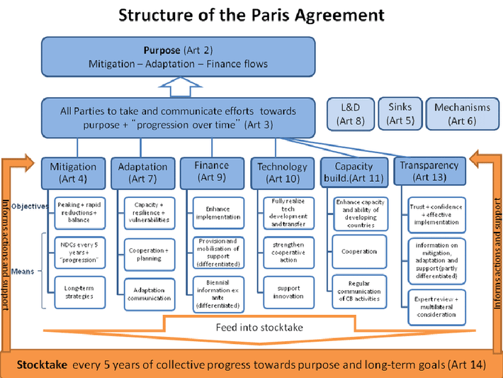

## Table of Contents

## What is the Paris Agreement?

The Paris Agreement is a global deal about climate change. It was made in Paris in 2015. Many countries agreed to work together to stop the Earth from getting too hot. The main goal is to keep the rise in global temperature below 2 degrees Celsius above what it was before factories and cars. They also want to try to keep it below 1.5 degrees if they can.

Countries that joined the agreement promised to make plans to lower their greenhouse gas emissions. These are gases that make the Earth warmer. Each country decides its own plan, but they all report their progress. The agreement also helps countries that need money and technology to make their plans work. It's important because it shows that countries can work together on a big problem like climate change.

## What was the purpose of COP21?

COP21 was a big meeting in Paris in 2015 where leaders from many countries came together to talk about climate change. The main purpose of COP21 was to create a new agreement to help stop the Earth from getting too hot. This meeting was important because it brought together almost every country in the world to work on this problem.

At COP21, countries agreed on the Paris Agreement. This agreement set goals to keep the global temperature from rising more than 2 degrees Celsius above what it was before factories and cars. They also wanted to try to keep it below 1.5 degrees if possible. The agreement was a big step because it showed that countries could work together to fight climate change.

## When and where was the Paris Agreement adopted?

The Paris Agreement was adopted on December 12, 2015. It happened in Paris, France, at a big meeting called COP21. This meeting brought together leaders from almost every country in the world to talk about climate change.

The purpose of the Paris Agreement is to help stop the Earth from getting too hot. Countries agreed to work together to keep the global temperature from rising more than 2 degrees Celsius above what it was before factories and cars. They also want to try to keep it below 1.5 degrees if they can.

## How many countries have signed the Paris Agreement?

The Paris Agreement has been signed by 196 countries. This happened after the agreement was adopted in Paris in 2015. Signing the agreement means that these countries agree with the goals to stop the Earth from getting too hot. They want to keep the global temperature from rising more than 2 degrees Celsius above what it was before factories and cars, and try to keep it below 1.5 degrees if they can.

Each country that signed the agreement has promised to make plans to lower their greenhouse gas emissions. These are gases that make the Earth warmer. The agreement is important because it shows that almost every country in the world can work together on a big problem like climate change.

## What are the main goals of the Paris Agreement?

The main goal of the Paris Agreement is to keep the Earth from getting too hot. Countries want to stop the global temperature from rising more than 2 degrees Celsius above what it was before factories and cars. They also want to try to keep it below 1.5 degrees if they can. This is important because a hotter Earth can cause problems like more storms, droughts, and rising sea levels.

To reach this goal, countries agreed to make plans to lower their greenhouse gas emissions. These are gases that make the Earth warmer. Each country decides its own plan, but they all report their progress to make sure everyone is doing their part. The agreement also helps countries that need money and technology to make their plans work. It's a big deal because it shows that almost every country in the world can work together to fight climate change.

## What is the structure of the Paris Agreement?

The Paris Agreement is made up of different parts that help countries work together to stop the Earth from getting too hot. The first part is the agreement itself, which was adopted in Paris in 2015. It sets the main goals, like keeping the global temperature from rising more than 2 degrees Celsius above what it was before factories and cars, and trying to keep it below 1.5 degrees if possible. Countries also agreed to make plans to lower their greenhouse gas emissions, which are gases that make the Earth warmer.

The second part of the Paris Agreement includes the rules and ways to make sure countries are doing what they promised. This part is called the Paris Rulebook. It was finished in 2018 and helps countries report their progress and check on each other. The agreement also has a part about helping countries that need money and technology to make their plans work. This is important because it makes sure that all countries, even those with less money, can join in the fight against climate change.

## How does the Paris Agreement address climate change?

The Paris Agreement helps fight climate change by getting countries to work together. The main goal is to keep the Earth from getting too hot. Countries want to stop the global temperature from rising more than 2 degrees Celsius above what it was before factories and cars. They also want to try to keep it below 1.5 degrees if they can. This is important because a hotter Earth can cause problems like more storms, droughts, and rising sea levels. To reach this goal, countries agreed to make plans to lower their greenhouse gas emissions. These are gases that make the Earth warmer. Each country decides its own plan, but they all report their progress to make sure everyone is doing their part.

The Paris Agreement also has rules to make sure countries are doing what they promised. This part is called the Paris Rulebook. It helps countries report their progress and check on each other. The agreement also helps countries that need money and technology to make their plans work. This is important because it makes sure that all countries, even those with less money, can join in the fight against climate change. By working together and helping each other, the Paris Agreement shows that almost every country in the world can take action to stop the Earth from getting too hot.

## What are Nationally Determined Contributions (NDCs) and how do they work?

Nationally Determined Contributions, or NDCs, are plans that each country makes to fight climate change. These plans are part of the Paris Agreement, where countries promised to work together to stop the Earth from getting too hot. Each country decides what it will do to lower its greenhouse gas emissions, which are gases that make the Earth warmer. The plans are called "nationally determined" because each country decides its own goals based on what it can do.

Countries submit their NDCs to the United Nations, where they are checked and recorded. Every few years, countries update their NDCs to make them better and more ambitious. This means they try to lower their emissions even more. By sharing these plans and working together, countries can help each other and make sure everyone is doing their part to fight climate change.

## How is the implementation of the Paris Agreement monitored and reported?

The Paris Agreement has a system to make sure countries are doing what they promised. This system is called the Paris Rulebook. Countries have to report their progress on their Nationally Determined Contributions, or NDCs, every few years. These reports show how much they have lowered their greenhouse gas emissions, which are gases that make the Earth warmer. The reports are checked by other countries and experts to make sure the information is correct. This helps everyone see if countries are doing their part to stop the Earth from getting too hot.

Countries also meet regularly at big meetings called Conferences of the Parties, or COPs, to talk about how they are doing. At these meetings, they can share ideas and help each other. If a country is not doing well, others can offer support or advice. These meetings are important because they help keep everyone working together to fight climate change. By reporting and checking each other's progress, countries can make sure the Paris Agreement is working and that the Earth stays cooler.

## What mechanisms does the Paris Agreement have for transparency and accountability?

The Paris Agreement uses a system called the Paris Rulebook to make sure countries are honest and responsible. Countries have to report their progress on their plans to lower greenhouse gas emissions every few years. These reports are checked by other countries and experts to make sure the information is correct. This helps everyone see if countries are doing their part to stop the Earth from getting too hot. If a country's report is not clear or complete, they might be asked to explain more or fix it.

Countries also meet at big meetings called Conferences of the Parties, or COPs, to talk about how they are doing. At these meetings, they can share ideas and help each other. If a country is not doing well, others can offer support or advice. These meetings are important because they help keep everyone working together to fight climate change. By reporting and checking each other's progress, countries can make sure the Paris Agreement is working and that the Earth stays cooler.

## How has the Paris Agreement evolved since its adoption?

Since the Paris Agreement was adopted in 2015, it has grown and changed in many ways. One big change was the creation of the Paris Rulebook in 2018. This set of rules helps countries report their progress on lowering greenhouse gas emissions and makes sure everyone is doing their part. Countries have to update their plans, called Nationally Determined Contributions (NDCs), every few years to make them better and more ambitious. This means they try to lower their emissions even more over time.

Another way the Paris Agreement has evolved is through the regular meetings called Conferences of the Parties (COPs). At these meetings, countries talk about how they are doing and share ideas to help each other. For example, at COP26 in 2021, countries made new promises to cut emissions faster and help countries that need money and technology. These meetings keep the agreement strong and make sure everyone keeps working together to stop the Earth from getting too hot.

## What are the challenges and criticisms faced by the Paris Agreement?

The Paris Agreement has faced many challenges and criticisms. One big challenge is that some countries have not been able to lower their greenhouse gas emissions as much as they promised. This makes it hard to reach the goal of keeping the Earth from getting too hot. Another challenge is that some countries need money and technology to make their plans work, but it can be hard to get enough help. This is especially true for poorer countries that are already dealing with problems caused by climate change, like more storms and droughts.

There are also criticisms about the Paris Agreement. Some people think it is not strong enough to stop the Earth from getting too hot. They say the goals are too easy and that countries should be doing more. Others worry that the agreement does not make countries do what they promised. There is no punishment if a country does not meet its goals, which some people think is a problem. They believe there should be stricter rules to make sure everyone is doing their part to fight climate change.

## References & Further Reading

[1]: United Nations Framework Convention on Climate Change (UNFCCC). ["The Paris Agreement."](https://unfccc.int/process-and-meetings/the-paris-agreement) 

[2]: Rogelj, J., den Elzen, M., Höhne, N., Fransen, T., Fekete, H., Winkler, H., … & Meinshausen, M. (2016). ["Paris Agreement climate proposals need a boost to keep warming well below 2 °C"](https://www.nature.com/articles/nature18307). Nature, 534(7609), 631-639.

[3]: ["The Financial System We Need: Aligning the Financial System with Sustainable Development"](https://www.unep.org/resources/report/financial-system-we-need-aligning-financial-system-sustainable-development) by the United Nations Environment Programme (UNEP) Inquiry

[4]: Carney, M. (2015). ["Breaking the Tragedy of the Horizon – climate change and financial stability"](https://www.bankofengland.co.uk/speech/2015/breaking-the-tragedy-of-the-horizon-climate-change-and-financial-stability) (Speech delivered at Lloyd’s of London)

[5]: Gogel, D., & Armstrong, C. (2018). ["Carbon Markets and Carbon Pricing in Paris Agreement Implementation: Synthesizing Input from a CPLC Working Session."](https://pmc.ncbi.nlm.nih.gov/articles/PMC7805112/) World Bank Group.