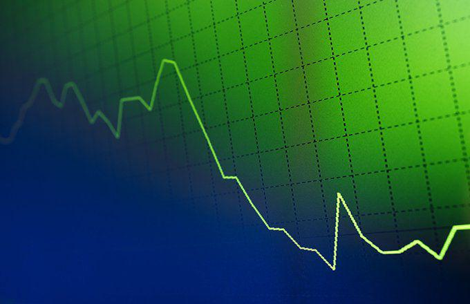

The Paris Agreement, established in 2015 during the 21st Conference of the Parties (COP21), marks a significant global initiative aimed at combating climate change. This landmark accord is a testament to international unity, as it aspires to limit the increase in global temperatures to well below 2 degrees Celsius above pre-industrial levels. By doing so, the agreement underscores the necessity of reducing greenhouse gas emissions and fostering a sustainable future.

Understanding the objectives and mechanisms of the Paris Agreement is essential for assessing its influence on global environmental policies. It provides a comprehensive framework for nations to devise and implement strategies to mitigate the effects of climate change. The agreement emphasizes the importance of transparency, accountability, and financial support, especially for developing countries, thereby ensuring a collective and equitable approach to global climate action.

Simultaneously, the evolution of algorithmic trading in financial markets presents unique opportunities and challenges regarding climate change. Algorithmic trading, often referred to as algo trading, involves the use of computer algorithms to execute trades at remarkable speeds and volumes. This advanced trading method has the potential to facilitate sustainable finance by enhancing the efficiency of carbon trading and directing investments toward green technologies. 

This article will explore the intersection between climate change policies under the Paris Agreement and the role of algo trading in promoting sustainable finance. It will consider how these two elements can work together to support the transition to a low-carbon economy, as well as the potential risks and rewards involved in this paradigm shift in global finance and environmental policy.

## Table of Contents

## The Paris Agreement: Objectives and Structure

The Paris Agreement, adopted in 2015, is a comprehensive framework established to coordinate global efforts towards mitigating the adverse effects of climate change by focusing on reducing greenhouse gas emissions. This landmark accord primarily aims to limit global temperature increases to well below 2 degrees Celsius above pre-industrial levels, with further aspirations to cap the rise at 1.5 degrees Celsius. To achieve these objectives, the Agreement integrates several key mechanisms and principles designed to foster widespread and equitable participation among nations.

Central to the Paris Agreement's strategy are nationally determined contributions (NDCs), which constitute the commitments made by individual countries to reduce their greenhouse gas emissions. Each participating nation is responsible for setting its specific targets, considering its unique circumstances and capabilities. This approach encourages a tailored response that acknowledges different national contexts while promoting collective action. Nations are expected to update and enhance their NDCs every five years, reflecting increased ambition and promoting accountability and progress over time.

The structure of the Paris Agreement emphasizes transparency and accountability through the implementation of an enhanced transparency framework. This framework requires countries to regularly report on their emissions and progress toward achieving their NDCs, thereby facilitating the monitoring of global progress and the identification of areas needing improvement. The transparency measures are designed to build trust among nations and ensure that all parties are meeting their commitments, which is crucial for maintaining the integrity of the Agreement.

Financial support is another critical component of the Paris Agreement, particularly for developing countries that may face significant challenges in implementing climate-related measures. Developed countries are encouraged to contribute financial resources to assist these nations in building resilience, adapting to the impacts of climate change, and transitioning to low-carbon economies. This financial support is seen as essential for enabling all countries, irrespective of their economic status, to participate meaningfully in global climate action.

The Paris Agreement also emphasizes the importance of capacity building, technology transfer, and climate adaptation strategies, ensuring that all nations possess the necessary tools and knowledge to address climate challenges effectively. By fostering collaboration and knowledge-sharing, the Agreement aims to accelerate the global transition to sustainable development practices.

In conclusion, the objectives and structure of the Paris Agreement represent a concerted effort to forge a unified response to climate change by establishing a robust framework that supports national flexibility, promotes transparency, and ensures equitable participation. Understanding these elements is crucial for evaluating the Agreement's impact on global climate policies and its potential to drive significant environmental progress.

## COP21: The Birth of a Global Climate Accord

COP21, formally known as the 21st Conference of the Parties, was integral in establishing the Paris Agreement in 2015. The conference took place in Paris from November 30 to December 12, drawing representatives from 195 countries. This monumental event marked a significant milestone in global climate diplomacy, culminating in a historic consensus to collectively tackle climate change.

The primary objective of COP21 was to negotiate a universal agreement to mitigate climate change by limiting global warming to well below 2 degrees Celsius above pre-industrial levels, with an aspirational target of 1.5 degrees Celsius. The negotiations during COP21 were intense and complex, reflecting the diverse interests and priorities of participating nations. The challenge lay in reconciling the differing responsibilities and capabilities of developed and developing countries, which necessitated a flexible, yet binding, framework.

The concept of "common but differentiated responsibilities and respective capabilities" (CBDR-RC) emerged as a guiding principle during the discussions. This doctrine acknowledges that while all countries are responsible for addressing climate change, they have varying capacities and historical contributions to the problem. Therefore, developed nations were expected to take the lead in reducing emissions and providing financial and technological support to developing countries.

The process leading to the Paris Agreement involved numerous formal and informal negotiations over two weeks. Deliberations were characterized by technical working groups, ministerial meetings, and plenary sessions, which often extended into late hours as delegates worked to resolve contentious issues. Key sticking points included the financial mechanisms for supporting climate adaptation and mitigation, the legal bindingness of emission reduction commitments, and transparency measures for tracking progress.

The resulting Paris Agreement reflects the consensus reached at COP21. Unlike its predecessor, the Kyoto Protocol, which imposed mandatory emission reduction targets on developed countries, the Paris Agreement introduced a system of nationally determined contributions (NDCs). This framework allowed each country to set its own climate action plans, considering national circumstances and capabilities. The universal nature and flexibility of NDCs were critical in ensuring broad participation and increasing ambition over time.

The significance of COP21 and the resulting Paris Agreement lies in their unprecedented global scope and inclusivity. For the first time, nearly every nation agreed to tailor their climate actions and collaborate towards a common objective. This collective commitment sent a strong signal to governments, businesses, and civil society worldwide, fostering [momentum](/wiki/momentum) for international climate action.

COP21's legacy extends beyond the text of the Paris Agreement. It exemplifies diplomatic success in multilateral negotiations, demonstrating the power of collaboration in addressing complex global challenges. By achieving consensus among 195 parties, COP21 laid the groundwork for ongoing international efforts to combat climate change and transition to a sustainable, low-carbon future.

## The Role of the United States in the Paris Agreement

The United States' involvement in the Paris Agreement underscores its significant role in shaping international climate policy. Initially a signatory to the Agreement under President Barack Obama, the U.S. committed to reducing its greenhouse gas emissions by 26-28% below 2005 levels by 2025. This pledge was part of its Nationally Determined Contribution (NDC), a cornerstone of the Paris Agreement, where each country sets its targets for reducing emissions.

However, in June 2017, the Trump administration announced its intention to withdraw from the Paris Agreement, citing economic concerns and perceived drawbacks to American industries. This move, completed in November 2020, marked the U.S. as the only country to [exit](/wiki/exit-strategy) the accord, which sparked significant global and domestic debate about the nation's commitment to addressing climate change.

The election of President Joe Biden signaled a major policy shift. Upon taking office in January 2021, President Biden signed an executive order to rejoin the Paris Agreement, which took effect on February 19, 2021. This reentry emphasized the administration's commitment to international collaboration on climate issues and the revitalization of U.S. leadership in environmental policies.

The United States' fluctuating stance reflects broader political dynamics and the challenges of aligning domestic policies with international commitments. The temporary withdrawal highlighted tensions between economic interests, regulatory measures, and the urgency of climate action. Conversely, rejoining the Agreement under President Biden represents a recommitment to global climate goals and strengthens diplomatic ties, fostering cooperation with other nations on tackling shared environmental challenges.

Understanding the United States' engagement with the Paris Agreement offers insights into how domestic political changes can influence international commitments and the broader impacts of these decisions on global climate policy efforts. The ongoing participation of the U.S. is crucial for the success of the Agreement, given its significant contribution to global greenhouse gas emissions and its potential for leadership in climate innovation and finance.

## Algorithmic Trading and Sustainable Finance

Algorithmic trading, commonly known as algo trading, employs sophisticated computer algorithms to execute trades in financial markets at unprecedented speeds and volumes. This method leverages the power of data analytics and [machine learning](/wiki/machine-learning) to optimize trading strategies and decisions, revolutionizing the way markets operate. In the context of the Paris Agreement, algo trading holds significant potential to promote sustainable finance, particularly through carbon trading and investment in green technologies.

Carbon trading, a market-based approach to controlling pollution, allows countries or entities to buy and sell carbon emission allowances or credits. Algo trading can enhance the efficiency of carbon trading markets by providing greater [liquidity](/wiki/liquidity-risk-premium) and reducing transaction costs. For instance, algorithms can rapidly analyze vast datasets on emissions, pricing, and regulatory changes, enabling traders to make more informed decisions. This efficiency is crucial for adjusting carbon prices in real-time, reflecting actual market conditions and encouraging businesses to invest in cleaner technologies. 

Moreover, algo trading can play a pivotal role in directing capital towards green technologies and sustainable projects. By integrating Environmental, Social, and Governance ([ESG](/wiki/esg-investing)) criteria into trading algorithms, investors can prioritize assets that align with sustainable objectives. Machine learning models can be trained to identify trends and forecast the performance of green stocks or bonds, thereby allocating resources towards companies and projects contributing positively to environmental goals. This aligns with the objectives of the Paris Agreement, fostering a financial ecosystem that supports global efforts to combat climate change.

Despite its advantages, algo trading presents specific challenges and potential risks. High-frequency trading strategies, often used in algo trading, could lead to market instability or manipulation, especially in the context of emerging carbon markets where liquidity might be limited. Ensuring the security and ethical implementation of trading algorithms is paramount to prevent market abuse and maintain investor confidence.

Furthermore, developing transparent and robust regulatory frameworks is essential to govern the use of algo trading in sustainable finance. Regulatory bodies must work collaboratively with financial institutions and tech companies to ensure that algorithms promote fair trading practices and support the broader goals of reducing carbon emissions and fostering sustainability.

In conclusion, [algorithmic trading](/wiki/algorithmic-trading) offers valuable tools for advancing sustainable finance through enhanced efficiency in carbon trading and strategic investments in green technologies. By mitigating potential risks and establishing supportive regulations, algo trading can significantly contribute to the transition to a low-carbon economy, supporting the overarching aims of the Paris Agreement.

## Challenges and Criticisms of the Paris Agreement

The Paris Agreement, while celebrated as a significant advancement in international climate policy, faces several notable challenges and criticisms. One of the primary concerns is the inadequacy of carbon reduction pledges. As of recent assessments, commitments made by countries under the nationally determined contributions (NDCs) framework are insufficient to achieve the goal of limiting global temperature rise to well below 2 degrees Celsius above pre-industrial levels. According to the United Nations Environment Programme (UNEP) Emissions Gap Report, there exists a substantial gap between current pledges and the necessary reductions to meet the Agreement's targets. This shortfall brings into question the ambition and effectiveness of the current commitments.

Moreover, the financial commitments to support developing countries are another area where the Paris Agreement has faced criticism. Developed nations pledged to mobilize $100 billion per year by 2020 to assist developing countries in mitigating and adapting to climate change impacts. However, reports suggest that actual financial flows have consistently fallen short of these commitments, undermining trust and cooperation between developed and developing nations.

Critics argue that the Paris Agreement lacks enforceability mechanisms to ensure compliance with emission reduction targets and financial pledges. The absence of legally binding commitments and sanctions for countries failing to meet their NDCs raises concerns about the Agreement's ability to drive meaningful climate action. The Agreement's reliance on voluntary commitments and self-reporting metrics poses challenges in creating accountability and transparency.

Furthermore, there is an inadequate provision for supporting vulnerable nations experiencing severe climate impacts. Many of these countries require substantial financial and technical assistance to cope with rising sea levels, extreme weather events, and other adverse effects of climate change. The current framework does not sufficiently address these needs, leading to calls for more robust support mechanisms.

In summary, the Paris Agreement, while a milestone in global climate policy, faces critical hurdles related to emission reduction ambitions, financial commitments, enforceability, and support for vulnerable countries. Addressing these issues is essential for enhancing the Agreement's effectiveness and ensuring a comprehensive global response to climate change.

## Conclusion: The Path Forward

The Paris Agreement and the evolution of algorithmic trading together constitute significant advancements in addressing climate change, each offering unique contributions toward global sustainability objectives. The Paris Agreement establishes a framework for international cooperation, urging nations to commit to reducing greenhouse gas emissions and to adopt measures that curb global temperature rise. It emphasizes the necessity of setting transparent, actionable goals and providing financial and technical support, especially for developing nations that bear the brunt of climate change impacts. These foundational elements are designed to ensure a robust and equitable response to the global climate crisis.

Simultaneously, the proliferation of algorithmic trading presents opportunities for profoundly transforming financial markets to support sustainable development. Algo trading uses sophisticated computer algorithms to execute trades at high speed, potentially enhancing efficiency in carbon markets. By facilitating the trading of carbon credits and optimizing investments in environmentally-friendly technologies, algo trading can significantly contribute to a low-carbon economy. Such innovations in financial markets are essential for channeling capital toward projects that align with environmental, social, and governance (ESG) criteria, thus promoting green finance.

However, the realization of these potential benefits hinges on effective implementation and ongoing adaptation of climate policies. For international cooperation to be successful, it is crucial to maintain an open dialogue among nations, periodically reassessing commitments and strategies in response to new scientific insights and technological advancements. Financial market innovations must be carefully regulated to ensure that the acceleration of and investment in green practices does not inadvertently create new risks or exacerbate existing inequalities.

The future success of these initiatives will largely depend on their ability to adapt to emerging challenges and leverage new opportunities. This dynamic approach requires a responsive governance framework that is both flexible and resilient. By fostering a synergistic relationship between global climate policies and innovations in financial systems, the international community can better navigate the complex landscape of climate change mitigation and sustainability. Through sustained effort and collaboration, the Paris Agreement and algorithmic trading can serve as instrumental mechanisms in significantly reducing environmental impacts and achieving long-term sustainability goals.

## References & Further Reading

[1]: United Nations Framework Convention on Climate Change (UNFCCC). ["The Paris Agreement."](https://unfccc.int/process-and-meetings/the-paris-agreement) 

[2]: Rogelj, J., den Elzen, M., Höhne, N., Fransen, T., Fekete, H., Winkler, H., … & Meinshausen, M. (2016). ["Paris Agreement climate proposals need a boost to keep warming well below 2 °C"](https://www.nature.com/articles/nature18307). Nature, 534(7609), 631-639.

[3]: ["The Financial System We Need: Aligning the Financial System with Sustainable Development"](https://www.unep.org/resources/report/financial-system-we-need-aligning-financial-system-sustainable-development) by the United Nations Environment Programme (UNEP) Inquiry

[4]: Carney, M. (2015). ["Breaking the Tragedy of the Horizon – climate change and financial stability"](https://www.bankofengland.co.uk/speech/2015/breaking-the-tragedy-of-the-horizon-climate-change-and-financial-stability) (Speech delivered at Lloyd’s of London)

[5]: Gogel, D., & Armstrong, C. (2018). ["Carbon Markets and Carbon Pricing in Paris Agreement Implementation: Synthesizing Input from a CPLC Working Session."](https://pmc.ncbi.nlm.nih.gov/articles/PMC7805112/) World Bank Group.