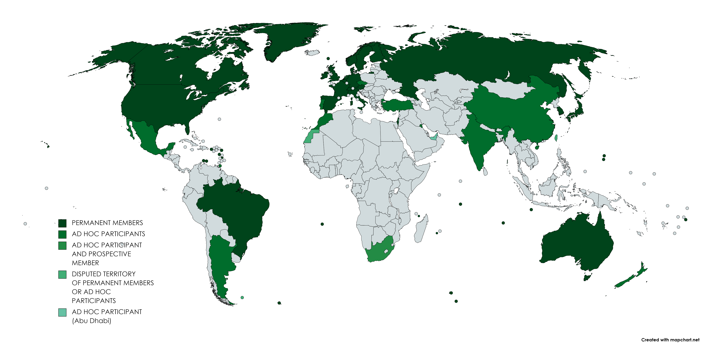

This article explores the interconnected topics of debt restructuring, creditor nations, the Paris Club, and algorithmic trading, highlighting their roles and implications in the global economy. Debt restructuring serves as a vital financial strategy for nations and corporations grappling with financial distress. It involves reorganizing existing debt obligations to achieve a more manageable financial state, thereby preventing default and restoring economic stability.

Central to debt restructuring's effectiveness is the Paris Club, an informal group of official creditor nations that provides a structured framework for negotiation and resolution. The Paris Club's influence in facilitating meaningful discussions between debtor and creditor countries underscores its critical role in managing international debt crises.



In contrast, algorithmic trading, while not directly involved with debt, has transformed financial markets by automating transactions and increasing market efficiency. It enables rapid trading of debt instruments, impacting their pricing and liquidity. Algorithmic trading's ability to process vast data quickly allows for advanced risk management and optimization of debt portfolios.

Understanding the convergence of debt restructuring, the role of creditor nations, the Paris Club's influence, and the innovations brought by algorithmic trading is key to navigating the complexities of the modern financial landscape. These components, though distinct, collectively shape the dynamics of international finance and the strategies employed to maintain economic equilibrium.

## Table of Contents

## Understanding Debt Restructuring

Debt restructuring is a financial strategy that fundamentally focuses on modifying the terms of a debtor's outstanding obligations to make the debt more manageable and to facilitate the return to financial stability. This approach is essential for nations facing the risk of default, as it allows them to reorganize their debt structure to prevent economic instability. When a country encounters financial distress, debt restructuring becomes an avenue to alleviate the financial burden and is achieved through various methods.

One common approach in debt restructuring is the extension of maturity dates. By prolonging the timeline over which the debt is repaid, the immediate financial pressure on the debtor is alleviated, granting them more time to improve their fiscal situation. This method can be crucial for countries experiencing temporary financial downturns, enabling them to manage repayments without exacerbating economic strain.

In addition to extending maturity dates, reducing interest rates is another tactic employed in debt restructuring. Lowering the [interest rate](/wiki/interest-rate-trading-strategies) decreases the cost of borrowing, thereby reducing the overall debt burden on the debtor nation. This reduction can make the debt payments more sustainable, aiding the country in maintaining solvency and avoiding default.

Debt restructuring may also involve writing off a portion of the debt, especially when it becomes evident that the nation cannot feasibly repay the full amount. This approach often requires significant negotiation among stakeholders, as it involves a direct financial loss for creditors. However, in situations where the debtor's financial situation is dire, a partial debt write-off can be the most effective solution to restore the country's economic stability.

The restructuring process is complex and requires careful negotiation involving multiple stakeholders, including government agencies and international financial institutions. These negotiations are essential to balance the needs of the debtor with the expectations of the creditors. The involvement of international financial institutions often provides additional support and oversight, helping to ensure that the restructuring plan is feasible and equitable for all parties.

Overall, debt restructuring is a critical tool for nations facing financial distress, providing a pathway to renegotiate terms, manage economic challenges, and reestablish financial stability. It encompasses a range of strategies, each tailored to address specific financial situations, thereby enabling debtor nations to avert potential defaults and secure their economic futures.

## The Role of Creditor Nations

Creditor nations are central figures in the debt restructuring landscape, wielding significant influence throughout the process. These countries typically hold substantial amounts of the debt issued by financially distressed nations, positioning them as key stakeholders in any debt restructuring negotiations. Their influence is often exercised within the Paris Club, an informal group of official creditors that provides a structured forum for discussions and agreements regarding debt repayments.

The primary aim of creditor nations in these negotiations is to minimize their financial losses while ensuring that the debtor nation can achieve financial solvency and stability. Effective debt restructuring requires a delicate balance between recovering as much of the owed amount as possible and offering terms that do not overwhelm the debtor. This might involve extending the timeline for repayments, reducing the interest rates, or even forgiving a portion of the debt.

Creditor nations must also consider the geopolitical consequences of their actions during debt restructuring. Decisions made in these negotiations can have broader implications, impacting international relations and economic policies. For instance, a favorable restructuring deal could strengthen diplomatic ties and foster mutual economic growth, while overly stringent terms could strain relations and potentially destabilize a region economically and politically.

The involvement of creditor nations in debt restructuring often reflects their long-term economic strategies and foreign policy objectives. By participating actively in these processes, they can influence the economic trajectory of debtor countries, aligning it with their strategic interests. This nuanced role they play underscores their importance not just in individual debt restructurings but also in maintaining global financial stability.

## The Paris Club: A Platform for Debt Restructuring

The Paris Club is a prominent international collective of official creditors that aids debtor nations in restructuring their external debt. Established initially in 1956 during a negotiation in Paris between Argentina and its creditors, the club has expanded its reach to assist numerous countries in managing unsustainable debt burdens. The Paris Club functions on a set of core principles designed to create equitable and efficient debt treatment solutions.

Foremost among these principles is the concept of consensus. Decisions regarding debt restructurings are made collectively by member countries, ensuring that no single nation can unilaterally dictate terms. Another guiding principle is comparability of treatment, which mandates that a debtor seeking relief from Paris Club members must not offer more favorable terms to non-member creditors. This approach maintains fairness and encourages broader participation in restructuring efforts.

Additionally, the Paris Club addresses each restructuring case individually. This flexibility allows for tailor-made solutions that account for the unique economic circumstances and needs of debtor nations. Over the decades, the club's interventions have proved critical in staving off financial turmoil and fostering stability, particularly in developing economies.

By providing a structured forum for negotiation, the Paris Club aims to prevent debt crises from worsening into full-blown economic catastrophes. Through coordinated action, member countries work to protect both the interests of creditors and the broader global financial system. The Paris Club's methodology demonstrates a collaborative effort to balance these sometimes conflicting goals, illustrating the importance of multilateral frameworks in debt resolution processes.

## Algorithmic Trading and Debt Instruments

Algorithmic trading, often referred to as algo trading, involves the use of computer algorithms to execute transactions at a speed and [volume](/wiki/volume-trading-strategy) that surpass human capabilities. This technique automates trading by exploiting pre-defined rules and complex mathematical models to identify trading opportunities, calculate optimal transaction timings, and execute orders without human intervention. While algo trading is predominantly recognized in the context of stocks and foreign exchange, its influence is increasingly permeating debt markets, affecting the pricing and [liquidity](/wiki/liquidity-risk-premium) of debt instruments.

In the context of debt instruments, [algorithmic trading](/wiki/algorithmic-trading) brings enhanced efficiency, altering how these financial products are priced and traded. The speed offered by algo trading allows for real-time market analysis, enabling instantaneous reaction to market fluctuations. This rapid execution capability can lead to tighter spreads and improved liquidity for debt securities, making them more attractive to investors.

Traders and financial institutions employ algorithms to manage risk and optimize their debt portfolios. By simulating complex financial scenarios, algorithms assist traders in predicting market trends and making data-driven decisions. For instance, a simple trading algorithm might be structured as follows in Python:

```python
def simple_moving_average(prices, window_size):
    """Calculate the moving average for a given window size."""
    moving_averages = []
    for i in range(len(prices) - window_size + 1):
        this_window = prices[i: i + window_size]
        window_average = sum(this_window) / window_size
        moving_averages.append(window_average)
    return moving_averages

# Example usage with debt instrument prices
prices = [100, 102, 104, 99, 101, 98, 97]
window_size = 3
print(simple_moving_average(prices, window_size))
```

This code calculates the simple moving average of a set of prices, which can be a foundational component of more complex trading algorithms used in practice.

The incorporation of algorithmic trading in debt markets is not without challenges. The same mechanisms that allow for efficient market operations through rapid transaction execution also have the potential to introduce [volatility](/wiki/volatility-trading-strategies). High-frequency trading, a subset of algorithmic trading, may contribute to sudden market swings that can disrupt pricing equilibrium and affect the perceived stability of debt instruments.

Despite these challenges, the benefits of algorithmic trading cannot be underestimated. Its capacity to analyze large volumes of data quickly enables financial institutions to hedge against market risks effectively. This is particularly pertinent in dynamic market environments, where managing exposure to fluctuating interest rates and credit risks is critical. Algorithms can also identify [arbitrage](/wiki/arbitrage) opportunities across different markets or financial products, potentially leading to gains that would be difficult to achieve through traditional trading methods.

Overall, the advent of algorithmic trading continues to transform debt markets by introducing a new dimension of speed and precision to trading activities. Financial entities leveraging these technologies can manage their portfolios with heightened accuracy, potentially enhancing returns while mitigating risks. As these technologies evolve, their role within financial markets, including debt trading, is likely to expand, necessitating ongoing adaptation and regulation to harness their benefits while curbing excesses.

## The Intersection of Debt Restructuring and Algo Trading

Algorithmic trading (algo trading) significantly impacts the secondary market's perception and behavior regarding debt restructuring deals, crucially influencing investor sentiment. Algo trading employs sophisticated algorithms to evaluate and execute trades at speeds and volumes that far exceed human capabilities. The swift execution and vast data processing enhance the efficiency of trading environments but also present challenges. 

This high-speed trading offers improved liquidity and tighter spreads, allowing investors to react swiftly to new debt restructuring announcements. When a debt restructuring is announced, algo trading systems can rapidly adjust portfolios by analyzing vast datasets to predict potential impacts on bond prices. For example, if an algorithm predicts that a restructuring deal will enhance a debtor's repayment capacity, it may signal to buy the debt instruments related to that sovereign or corporation, thus influencing the market price positively.

Nonetheless, the speed and automation of algo trading present a double-edged sword. While they provide opportunities for risk management through diversification and hedging strategies, they can also exacerbate market volatility. In volatile conditions, algo trading systems might trigger rapid buy-sell orders leading to spirals, known as "flash crashes," further destabilizing markets, consequently affecting secondary market behavior toward restructuring deals.

Creditor nations and financial institutions can leverage these systems to mitigate risks associated with debt restructurings. By using complex models, they can hedge against potential losses arising from sovereign defaults or currency devaluations. For instance, an algorithm might identify correlations between various economic indicators that signal increased default risk, thereby initiating protective hedges in derivative markets.

However, the integration of complex algorithms and automated trading into debt restructuring processes poses significant regulatory challenges. Key questions arise about how these technologies should be governed to prevent systemic risks that could impact global financial stability. Regulators must ensure that algo trading does not lead to market manipulation or undue risk concentration. Striking a balance between fostering innovation in financial technologies and ensuring robust market oversight is imperative.

In conclusion, the intersection of debt restructuring and algorithmic trading illustrates a complex landscape. While algo trading presents innovative risk management tools, it also necessitates enhanced regulatory frameworks to safeguard stability, facilitating more informed and rational debt market operations.

## Challenges and Future Directions

Balancing the competing demands of creditor nations and debtor countries during debt restructuring presents significant challenges. Creditor nations often seek to recover their investments and minimize losses, while debtor countries aim for terms that ensure their economic survival and growth. This delicate balance is critical to achieving successful restructuring outcomes, as misalignment can lead to protracted negotiations and potential defaults, which can have broader economic repercussions.

The integration of technology into financial systems introduces another layer of complexity, necessitating robust regulatory frameworks. These frameworks are essential to prevent exploitation and maintain market stability. Algorithmic trading, while providing enhanced efficiency and liquidity, also poses challenges in terms of market volatility and manipulation risks. Regulatory bodies must design policies to oversee algorithmic trading systems, ensuring they do not compromising the integrity of debt markets.

Looking ahead, leveraging data analytics from algorithmic trading can play a pivotal role in shaping effective debt policy decisions. By analyzing trading patterns and market behaviors, policymakers can gain valuable insights into investor sentiment and potential market disruptions, allowing for more informed and adaptive strategies. Such data-driven approaches can help in anticipating and mitigating risks associated with debt restructurings.

The future of global debt markets is likely to rely on a synergy between traditional financial mechanisms, such as the Paris Club, and innovative technological solutions, including algorithmic trading. This cooperation could lead to more resilient and adaptable financial systems. By embracing data analytics, enhancing regulatory frameworks, and fostering collaboration between creditor and debtor nations, the challenges of debt restructuring can be managed more effectively, ensuring global financial stability.

## Conclusion

Effective debt restructuring necessitates a synergy between creditor nations and debtor countries to uphold global financial stability. This collaboration is crucial for creating an environment where distressed nations can renegotiate their financial commitments without exacerbating economic instability. Creditor nations play a pivotal role in this process, weighing the economic and geopolitical implications of restructured debt agreements to ensure that terms are fair yet conducive to the debtor nation's recovery.

The Paris Club stands as a central institution in these efforts, providing a structured, informal forum for negotiating complex international debt issues. Since its establishment in 1956, the Paris Club has been instrumental in mediating debt relief efforts that prevent economic turmoil from spreading. Its guiding principles, particularly consensus and comparability of treatment, ensure that all involved parties reach equitable and sustainable solutions.

Meanwhile, algorithmic trading is significantly transforming the financial markets, influencing the management and trade of debt instruments. This technological advancement offers unprecedented speed and precision in financial transactions, affecting both the liquidity and pricing of debt instruments. As algorithmic trading becomes more prevalent, its ability to optimize and manage risks associated with debt portfolios positions it as a potential tool in debt restructuring efforts. However, its rapid pace also introduces the possibility of increased market volatility, necessitating careful regulation to mitigate systemic risks.

Understanding the intricate relationships and synergies between debt restructuring mechanisms, institutions like the Paris Club, and algorithmic trading strategies is essential for navigating the complexities of modern finance. Each component—intergovernmental negotiation platforms, creditor-debtor collaborations, and advanced trading technologies—contributes uniquely to the wider objective of maintaining economic equilibrium. Their combined roles highlight the necessity for adaptive and collaborative approaches in addressing global financial challenges.

## References & Further Reading

[1]: Rieffel, Lex. (2003). "[Restructuring Sovereign Debt: The Case for Ad Hoc Machinery](https://archive.org/details/restructuringsov0000rief)." Brookings Institution Press.

[2]: Aggarwal, Munish R., and Agarwal, Präpreet. (2020). "[Debt Restructuring: Concepts and Policy Implications](https://www.aeaweb.org/articles?id=10.1257/aeri.20190457)." Journal of Emerging Market Finance, 19(2).

[3]: Lipson, Charles. (1985). "[The Paris Club: An International Institution](https://www.jstor.org/stable/pdf/3078615.pdf)." International Organization, 39(3).

[4]: Aldasoro, Iñaki, Caccavaio, Matteo, and Kearns, Jonathan. (2020). "[Debt Banks, international funding, and structural debt arrangements](https://papers.ssrn.com/sol3/papers.cfm?abstract_id=3368973)." Bank for International Settlements Quarterly Review.

[5]: De Prado, Marcos Lopez. (2018). "[Advances in Financial Machine Learning](https://www.amazon.com/Advances-Financial-Machine-Learning-Marcos/dp/1119482089)." Wiley.

[6]: Chan, Ernest P. (2009). "[Quantitative Trading: How to Build Your Own Algorithmic Trading Business](https://github.com/ftvision/quant_trading_echan_book)." Wiley.