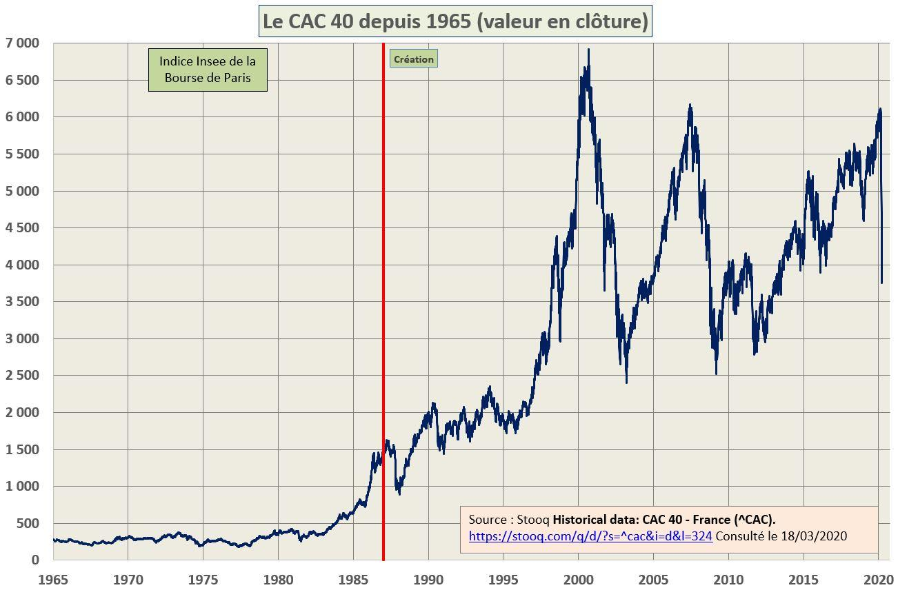

## Table of Contents

## What is the Paris Stock Exchange?

The Paris Stock Exchange, also known as Euronext Paris, is a stock market where people and companies can buy and sell shares of French companies. It is one of the oldest stock exchanges in the world, starting in the early 1700s. Today, it is part of a bigger group called Euronext, which also includes stock exchanges in other European countries like Belgium, the Netherlands, and Portugal.

The main index of the Paris Stock Exchange is called the CAC 40. This index tracks the performance of the 40 largest and most actively traded companies listed on the exchange. These companies come from different industries, like banking, energy, and consumer goods. The CAC 40 is important because it gives investors an idea of how well the French economy is doing. People all over the world can trade on the Paris Stock Exchange, making it a key part of the global financial market.

## How does the Paris Stock Exchange operate?

The Paris Stock Exchange operates like a big marketplace where people buy and sell shares of companies. It opens at 9:00 AM and closes at 5:30 PM, Monday through Friday, except on holidays. During these hours, traders use computers to place orders to buy or sell stocks. These orders are matched by a system that finds the best price for both the buyer and the seller. If you want to buy a share, you can put in an order saying how many shares you want and the highest price you're willing to pay. If someone else wants to sell at that price or lower, the trade happens.

There are different ways to trade on the Paris Stock Exchange. You can trade directly through a broker, who helps you buy and sell shares. Or you can use online trading platforms that let you manage your investments yourself. The exchange also has rules to make sure trading is fair and transparent. For example, companies have to share important information that might affect their stock prices. This helps everyone make better decisions. The Paris Stock Exchange is part of Euronext, so it's connected to other European markets, making it easier for people to trade across borders.

## What is the history of the Paris Stock Exchange?

The Paris Stock Exchange started a long time ago, in 1724. It was first called the Paris Bourse. Back then, people would meet in a big room to trade stocks by shouting and waving their hands. Over time, the way they traded changed a lot. By the 1980s, they started using computers to trade, which made things faster and easier. In 2000, the Paris Bourse joined with other European exchanges to create Euronext, which made it a bigger and more important market.

Today, the Paris Stock Exchange is part of Euronext and is called Euronext Paris. It's one of the biggest stock exchanges in Europe. It helps people and companies buy and sell shares of French companies. The main index, the CAC 40, shows how well the biggest companies are doing. The exchange has rules to make sure everyone trades fairly and honestly. It's open from 9:00 AM to 5:30 PM, Monday to Friday, except on holidays.

## What is the CAC 40 Index?

The CAC 40 Index is a special list that shows how well the 40 biggest and most traded companies on the Paris Stock Exchange are doing. These companies come from different industries, like banks, energy companies, and stores. The index is important because it helps people see if the French economy is doing well or not. If the CAC 40 goes up, it usually means these big companies are making more money and the economy is strong. If it goes down, it might mean the opposite.

The CAC 40 is calculated by taking the prices of the stocks of these 40 companies and putting them together in a special way. It's updated all the time during the trading day, so people can see the changes as they happen. The index started in 1987, and since then, it has become a big part of how people understand the French stock market. People all over the world watch the CAC 40 to help them decide when to buy or sell stocks.

## How is the CAC 40 Index calculated?

The CAC 40 Index is calculated by taking the prices of the stocks of the 40 biggest companies on the Paris Stock Exchange and putting them together in a special way. Each company's stock price is multiplied by the number of shares they have, which is called the market capitalization. Then, all these values are added up to get a total market value for the index. To make sure the index shows changes in stock prices and not just changes in the number of shares, the total market value is divided by a special number called the divisor. This divisor changes over time to keep the index fair and accurate.

The CAC 40 Index is updated all the time during the trading day, so people can see how it changes as stocks go up and down. The index is set to a base value of 1,000 points from the end of 1987, and all changes are measured from there. When the stocks in the index go up, the CAC 40 goes up too, and when the stocks go down, the index goes down. This helps people understand how the French economy is doing by looking at how these big companies are doing.

## What are the criteria for a company to be included in the CAC 40?

To be included in the CAC 40, a company needs to be one of the biggest and most traded on the Paris Stock Exchange. The main thing they look at is how much the company is worth, which is called its market capitalization. They also check how many shares of the company are bought and sold every day, because they want companies that a lot of people are interested in. The companies need to be listed on Euronext Paris, which is the official name for the Paris Stock Exchange now.

The CAC 40 is updated every three months, in March, June, September, and December. During these times, they look at all the companies on the Paris Stock Exchange and pick the 40 that are doing the best according to their rules. If a company is doing better than one already in the index, it might take its place. This makes sure the CAC 40 always shows the biggest and most important companies in France.

## How does the performance of the CAC 40 reflect the French economy?

The CAC 40 is a big list that shows how well the 40 biggest companies in France are doing. When these companies do well, it usually means that the French economy is strong. The index goes up when the stock prices of these companies go up, which can mean that people are happy with how the companies are doing and think they will keep doing well. If the CAC 40 goes down, it might mean that people are worried about the economy and think that the companies might not do as well in the future.

Because the CAC 40 includes companies from different industries like banks, energy, and stores, it gives a good picture of how the whole economy is doing. If lots of people are buying and selling the stocks of these companies, it shows that there is a lot of activity in the economy. So, watching the CAC 40 can help people understand if the French economy is growing or if it might be facing some problems.

## What are the major sectors represented in the CAC 40?

The CAC 40 includes companies from many different industries, which helps show how the whole French economy is doing. Some of the big sectors in the CAC 40 are banks, like BNP Paribas and Société Générale. These banks help people and businesses with their money, so how well they do can tell us a lot about the economy. Another important sector is energy, with companies like TotalEnergies. Energy companies are key because they provide the power that keeps everything running.

Other important sectors in the CAC 40 are luxury goods, with companies like LVMH and Hermès, and car makers like Renault and Stellantis. Luxury goods companies show how people around the world are spending their money on fancy things, while car companies tell us about how people are buying cars and how the car industry is doing. There are also companies in the CAC 40 from sectors like food and drinks, like Danone, and technology, like STMicroelectronics. All these different sectors together give a good picture of the French economy.

## How can investors trade on the Paris Stock Exchange?

Investors can trade on the Paris Stock Exchange by using a broker or an online trading platform. A broker is someone who helps you buy and sell shares. You can talk to them and tell them what you want to do, and they will do the trading for you. If you want to do it yourself, you can use an online trading platform. These are websites or apps where you can see the prices of stocks and make trades right from your computer or phone. You need to open an account with the platform and put money in it before you can start trading.

The Paris Stock Exchange is open from 9:00 AM to 5:30 PM, Monday to Friday, except on holidays. During these hours, you can buy and sell shares of French companies. When you want to buy a share, you put in an order saying how many shares you want and the most you're willing to pay. If someone wants to sell at that price or lower, the trade happens. The same goes for selling: you say how many shares you want to sell and the least you're willing to take, and if someone wants to buy at that price or higher, the trade is made. This way, investors from all over the world can trade on the Paris Stock Exchange and be part of the French economy.

## What are the trading hours of the Paris Stock Exchange?

The Paris Stock Exchange is open from 9:00 AM to 5:30 PM, Monday through Friday. It is closed on weekends and public holidays. These hours are when people can buy and sell shares of French companies.

During these hours, traders use computers to place orders. If someone wants to buy a share, they can say how many they want and the most they're willing to pay. If someone else wants to sell at that price or lower, the trade happens. This way, people from all over the world can trade on the Paris Stock Exchange during its open hours.

## How does the Paris Stock Exchange compare to other major stock exchanges?

The Paris Stock Exchange, also known as Euronext Paris, is one of the oldest stock exchanges in the world, starting in 1724. It is part of the Euronext group, which also includes stock exchanges in Belgium, the Netherlands, and Portugal. This makes it different from other major stock exchanges like the New York Stock Exchange (NYSE) or the London Stock Exchange (LSE), which are standalone exchanges. The Paris Stock Exchange is open from 9:00 AM to 5:30 PM, which is similar to the trading hours of many other major exchanges, but it is closed on weekends and public holidays, just like most others.

Compared to other major stock exchanges, the Paris Stock Exchange has its own main index, the CAC 40, which tracks the performance of the 40 largest and most traded companies in France. This is similar to the Dow Jones Industrial Average in the US or the FTSE 100 in the UK, which also track the performance of their biggest companies. However, the Paris Stock Exchange is smaller in terms of market capitalization and trading [volume](/wiki/volume-trading-strategy) than the NYSE or the NASDAQ, but it plays a crucial role in the European financial market and is important for investors interested in French and European companies.

## What are the recent trends and future outlook for the CAC 40 and the Paris Stock Exchange?

Recently, the CAC 40 has been doing pretty well. It has been going up because many of the big companies in France are making more money and doing better. The economy in France has been growing, and people all over the world are buying more French products, especially luxury goods. Also, the energy sector has been doing well because of higher oil and gas prices. But, there are some worries too. Things like inflation and what's happening in other parts of the world can affect the CAC 40. For example, if there's a big problem in another country, it might make people nervous and cause the index to go down.

Looking ahead, the future of the CAC 40 and the Paris Stock Exchange looks good, but there are some things to watch out for. More and more people are investing in French companies, and the economy is expected to keep growing. The Paris Stock Exchange is part of Euronext, which is getting bigger and stronger, so that's a good sign. But, things like changes in government rules, big events around the world, and new technology can change how the market does. So, while the future looks bright, it's important for investors to keep an eye on these things and be ready for changes.

## What is the understanding of the Paris Stock Exchange and CAC 40?

The Paris Stock Exchange, known as the Bourse de Paris, stands as a prominent European trading venue, now seamlessly integrated into Euronext, a pan-European stock exchange. This integration marks a significant evolution from its historical roots, reflecting the dynamic nature of financial markets and the continuous push towards wider European integration in trading activities.

Originally established in the 18th century, the Paris Stock Exchange was a pivotal platform for capital acquisition in France, gradually evolving into a hub for economic and financial activities. In 2000, it officially joined forces with exchanges from Amsterdam and Brussels to form Euronext, a move aimed at consolidating market efficiencies and enhancing liquidity. This integration was further solidified when Euronext became a part of the Intercontinental Exchange (ICE) in 2013 before being spun off as an independent entity once more in 2014.

Central to the identity of the Paris Stock Exchange is the CAC 40 Index. The CAC 40 (Cotation Assistée en Continu) was launched in 1987 and serves as a benchmark for the French stock market, encapsulating the performance of the 40 largest public companies in France by market capitalization. This index provides a broad reflection of the economic health of France, spanning critical sectors including luxury goods, energy, and finance. The calculation of the CAC 40 is based on a capitalization-weighted measure, meaning that companies with larger market capitalizations have a more significant impact on the index's overall performance. The weight of each company is determined by the formula:

$$
\text{Weight of company} = \frac{\text{Market Capitalization of company}}{\text{Total Market Capitalization of index}}
$$

The inclusion criteria for the CAC 40 ensure that it remains representative of the broader market, with adjustments performed quarterly. An independent committee oversees these reviews, assessing companies based on market capitalization and share turnover. Key players frequently found in the CAC 40 include renowned industry leaders like LVMH, TotalEnergies, and Airbus, each representing a cornerstone of the French economy.

The Paris Stock Exchange’s storied history and its role in the formation of Euronext underscore its importance as a financial hub in Europe. As part of Euronext, it contributes to a significant pool of [liquidity](/wiki/liquidity-risk-premium) and plays a vital role in the global financial ecosystem, continuing to adapt and grow amidst the challenges and opportunities presented by modern finance.

## What are the Mechanics of the CAC 40 Index?

The CAC 40 Index, a benchmark for the Euronext Paris, represents the 40 most significant publicly listed companies in France by market capitalization. The index is calculated using a capitalization-weighted measure. This means that the weight of each company in the index corresponds to its market capitalization relative to the total market capitalization of all the companies in the index. 

Mathematically, the weight $w_i$ of a company $i$ in the index at time $t$ can be expressed as:

$$
w_i(t) = \frac{MC_i(t)}{\sum_{j=1}^{40} MC_j(t)}
$$

where $MC_i(t)$ is the market capitalization of company $i$ at time $t$, and the denominator is the sum of the market capitalizations of all 40 companies in the index.

The index undergoes quarterly reviews to ensure it accurately reflects the French stock market. An independent committee oversees these reviews, using criteria such as market capitalization and share turnover to decide which companies remain in the index and which ones are replaced. This committee's goal is to maintain the index's representativeness and liquidity.

Notable companies in the CAC 40, reflecting diverse sectors of the French economy, include luxury goods titan LVMH, energy leader TotalEnergies, and aerospace company Airbus. These corporations not only have substantial market capitalizations but also significant trading volumes, marking them as influential players in the CAC 40 Index.

By adjusting the index's composition through a transparent and systematic approach, the CAC 40 ensures that it remains a relevant and accurate representation of the performance of the largest French companies. This calculation and selection process is pivotal for both passive investors, tracking the index, and active managers, who might use it as a benchmark for their investment strategies.

## References & Further Reading

[1]: Euronext. ["Euronext Paris Overview."](https://www.euronext.com/en/markets/paris) Euronext Official Website.

[2]: Biais, B., Foucault, T., & Moinas, S. (2012). ["Equilibrium High-Frequency Trading."](https://www.sciencedirect.com/science/article/abs/pii/S0304405X15000288) The Journal of Finance, 68(1), 1941-1994.

[3]: Lopez de Prado, M. (2018). ["Advances in Financial Machine Learning."](https://www.amazon.com/Advances-Financial-Machine-Learning-Marcos/dp/1119482089) Wiley.

[4]: Jansen, S. (2020). ["Machine Learning for Algorithmic Trading."](https://github.com/stefan-jansen/machine-learning-for-trading) Packt Publishing.

[5]: Chan, E. P. (2008). ["Quantitative Trading: How to Build Your Own Algorithmic Trading Business."](https://github.com/ftvision/quant_trading_echan_book) Wiley.

[6]: Autorité des marchés financiers (AMF). ["Algorithmic Trading & Direct Market Access."](https://www.amf-france.org/en) AMF Official Website. 

[7]: Fama, E. F., & French, K. R. (1993). ["Common Risk Factors in the Returns on Stocks and Bonds."](https://www.sciencedirect.com/science/article/pii/0304405X93900235) Journal of Financial Economics, 33(1), 3-56. 