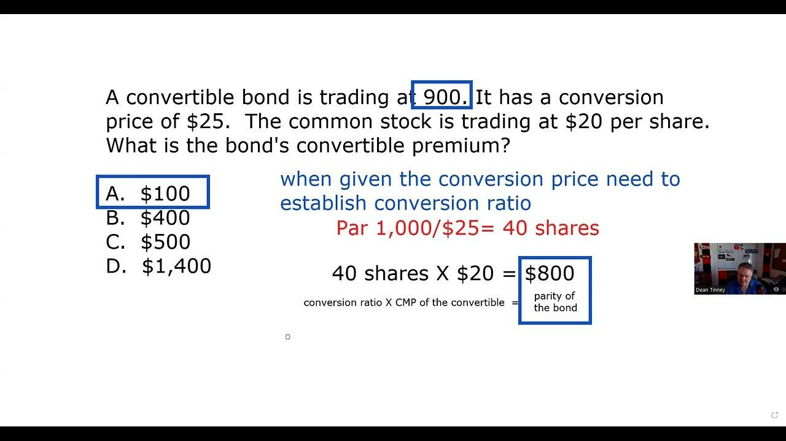

## Table of Contents

## What is a parity bond?

A parity bond is a type of bond that a company or government issues. It is called a parity bond because it has the same level of risk and priority as other bonds that the issuer already has. This means that if the issuer has trouble paying back its debts, the holders of parity bonds will be paid back at the same time as the holders of the other bonds.

Parity bonds are often used by governments and public agencies to finance big projects like building roads or schools. When they issue these bonds, they promise to use the money they earn from taxes or other sources to pay back the bondholders. Because parity bonds are considered equal to other existing bonds, they can be a good way for issuers to borrow more money without increasing their risk too much.

## How does a parity bond differ from other types of bonds?

A parity bond is different from other bonds because it has the same level of risk and priority as other bonds that the issuer already has. This means that if the issuer can't pay back its debts, the people who own parity bonds will get paid back at the same time as the people who own the other bonds. This is different from other types of bonds, like senior bonds, which get paid back first, or junior bonds, which get paid back last.

Parity bonds are often used by governments and public agencies to borrow money for big projects. When they issue these bonds, they promise to use money from taxes or other sources to pay back the bondholders. Because parity bonds are equal to other existing bonds, they help the issuer borrow more money without making their financial situation riskier. This is different from other bonds that might increase the issuer's risk or change the order in which debts are paid back.

## What is the purpose of issuing parity bonds?

The main reason for issuing parity bonds is to raise money for big projects without making the issuer's financial situation riskier. Governments and public agencies often use parity bonds to borrow money for things like building roads, schools, or other important projects. By issuing parity bonds, they can get the money they need while promising to pay back the bondholders using money from taxes or other sources.

Parity bonds are special because they are equal to other bonds the issuer already has. This means that if the issuer has trouble paying back its debts, the people who own parity bonds will get paid back at the same time as the people who own the other bonds. This helps the issuer borrow more money without changing the order in which debts are paid back or increasing their risk too much.

## Who typically issues parity bonds?

Parity bonds are usually issued by governments and public agencies. These organizations need money to pay for big projects like building roads, schools, or other important things. They use parity bonds to borrow the money they need without making their financial situation riskier.

When governments or public agencies issue parity bonds, they promise to pay back the people who buy the bonds using money from taxes or other sources. Parity bonds are special because they are equal to other bonds the issuer already has. This means that if the issuer has trouble paying back its debts, the people who own parity bonds will get paid back at the same time as the people who own the other bonds.

## How are parity bonds rated by credit rating agencies?

Credit rating agencies look at parity bonds the same way they look at other bonds from the same issuer. They check the issuer's ability to pay back the money they borrowed. If the issuer is a government or a public agency, the agencies will look at things like how much money they get from taxes and how well they manage their money. If the issuer is doing well, the parity bonds will get a good rating. If the issuer is having money problems, the parity bonds might get a lower rating.

Parity bonds are equal to other bonds the issuer already has. This means that if the issuer can't pay back all its debts, the people who own parity bonds will get paid back at the same time as the people who own the other bonds. Because of this, credit rating agencies will give parity bonds the same rating as the other bonds from the same issuer. So, if the issuer's other bonds have a good rating, the parity bonds will too. If the other bonds have a bad rating, the parity bonds will also have a bad rating.

## What are the risks associated with investing in parity bonds?

Investing in parity bonds comes with some risks. One big risk is that the issuer might have trouble paying back its debts. If the issuer is a government or public agency, this could happen if they don't get enough money from taxes or if they spend too much money on other things. If the issuer can't pay back its debts, people who own parity bonds might not get their money back on time or at all.

Another risk is that the value of parity bonds can go down if the issuer's financial situation gets worse. Credit rating agencies might lower the rating of the issuer's bonds, including the parity bonds, if they think the issuer is more likely to have money problems. This can make the bonds less valuable and harder to sell. So, people who invest in parity bonds need to think carefully about the issuer's ability to pay back its debts and how changes in the issuer's financial situation could affect the value of their investment.

## How does the interest rate on parity bonds compare to other bonds?

The [interest rate](/wiki/interest-rate-trading-strategies) on parity bonds is usually similar to the interest rate on other bonds from the same issuer. This is because parity bonds are equal to the other bonds the issuer has. If the issuer's other bonds have a high interest rate, the parity bonds will probably have a high interest rate too. If the other bonds have a low interest rate, the parity bonds will likely have a low interest rate as well.

The interest rate on parity bonds can also depend on the overall risk of the issuer. If the issuer is a government or public agency that is doing well financially, the interest rate on parity bonds might be lower because people think it's safer to lend them money. But if the issuer is having money problems, the interest rate on parity bonds might be higher because people want more money to take on the risk of lending to them.

## What are the legal and regulatory considerations for parity bonds?

When governments or public agencies issue parity bonds, they have to follow certain rules and laws. These rules make sure that the issuer is being fair to everyone who buys the bonds. One important rule is that the issuer has to tell people about the risks of buying parity bonds. They have to be clear about how they will use the money and how they will pay it back. This helps people make smart choices about whether to buy the bonds.

Another thing to think about is that parity bonds have to be treated the same as other bonds from the same issuer. This means that if the issuer has trouble paying back its debts, the people who own parity bonds should get paid back at the same time as the people who own the other bonds. There are laws that make sure this happens fairly. These laws also say that the issuer has to keep good records and follow certain steps when they issue parity bonds. This helps keep everything honest and clear.

## How do parity bonds fit into a diversified investment portfolio?

Parity bonds can be a good addition to a diversified investment portfolio because they offer a balance of risk and reward. Since they are equal to other bonds from the same issuer, they can provide a steady income through interest payments. This can help investors who want to earn money without taking on too much risk. By including parity bonds, investors can spread their money across different types of investments, which can help protect them if one type of investment does not do well.

However, it's important for investors to understand the risks that come with parity bonds. If the issuer, like a government or public agency, has money problems, it might not be able to pay back the bonds on time. This means investors could lose money. But, because parity bonds are treated the same as other bonds from the issuer, they can be less risky than some other types of bonds. By carefully choosing which parity bonds to buy and keeping an eye on the issuer's financial health, investors can use parity bonds to help make their investment portfolio more stable and balanced.

## What are the tax implications of investing in parity bonds?

When you invest in parity bonds, you need to think about taxes. The interest you earn from parity bonds is usually taxed as regular income. This means you have to pay taxes on the interest every year, just like you would with money you earn from a job. The tax rate depends on how much money you make in total, so it can be different for everyone. Some parity bonds, like those issued by state or local governments, might be tax-free at the federal level, but you still might have to pay state or local taxes on the interest.

If you sell your parity bonds for more money than you paid for them, you might have to pay capital gains tax. This tax is on the profit you make from selling the bonds. The tax rate for capital gains can be different depending on how long you held the bonds before selling them. If you held them for less than a year, it's called a short-term capital gain, and it's taxed at the same rate as your regular income. If you held them for more than a year, it's a long-term capital gain, and the tax rate is usually lower. Always talk to a tax advisor to understand exactly how your investments in parity bonds will affect your taxes.

## How do parity bonds perform during economic downturns?

During economic downturns, parity bonds can be affected in different ways. If the issuer, like a government or public agency, is still doing okay financially, the parity bonds might not change much. People might still trust the issuer to pay back the money they borrowed, so the value of the bonds stays steady. But if the issuer is having money problems because of the downturn, the value of the parity bonds could go down. This happens because people start to worry that the issuer won't be able to pay back the bonds on time.

In tough economic times, investors often look for safe places to put their money. Parity bonds can seem safer than some other investments because they are equal to other bonds from the same issuer. If the issuer is seen as reliable, investors might buy more parity bonds to protect their money. But, if the issuer's financial situation gets worse, the interest rates on new parity bonds might go up. This is because the issuer has to offer more money to convince people to lend to them when times are tough.

## What advanced strategies can be used to optimize returns from parity bonds?

One advanced strategy to optimize returns from parity bonds is to use a laddering approach. This means buying parity bonds that mature at different times. By doing this, you can spread out when you get your money back. If interest rates go up, you can reinvest the money from the bonds that mature sooner at the higher rates. If rates go down, you still have bonds that are [earning](/wiki/earning-announcement) the higher rates from when you bought them. This can help you make more money over time and keep your investment safer.

Another strategy is to pay close attention to the credit ratings of the issuers. If you think a government or public agency will do better financially in the future, you might buy their parity bonds now while the interest rates are high. As the issuer's financial situation improves, the value of the bonds could go up, and you might be able to sell them for more money later. On the other hand, if you think an issuer might have money problems, you could sell their parity bonds before their value goes down. By keeping an eye on credit ratings and making smart choices about when to buy and sell, you can try to get better returns from your parity bonds.

## How are technological innovations transforming bond trading?

Technological advancements have revolutionized bond trading, offering significant improvements in efficiency and accuracy. Among these innovations, [artificial intelligence](/wiki/ai-artificial-intelligence) (AI) and cloud computing are at the forefront, driving major shifts in how trading operations are conducted.

AI has empowered traders with advanced predictive analytics capabilities, enabling them to identify patterns and trends in bond pricing with unprecedented accuracy. Through [machine learning](/wiki/machine-learning) algorithms, historical data is analyzed to forecast future price movements, thereby refining trading strategies. For instance, a common approach involves using AI to analyze macroeconomic indicators and sentiment analysis from news sources, which are then correlated with bond price fluctuations. The formula for a simple linear regression model that predicts bond prices ($Y$) based on economic indicators ($X_1, X_2, \ldots, X_n$) can be represented as:

$$

Y = \beta_0 + \beta_1X_1 + \beta_2X_2 + \cdots + \beta_nX_n + \epsilon 
$$

where $\beta_0$ is the intercept, $\beta_i$ are the coefficients for each predictor, and $\epsilon$ is the error term.

Cloud computing is another transformative technology that provides scalable and efficient trading operations. By leveraging cloud infrastructure, institutions can process large volumes of data in real-time, facilitating rapid responses to market changes. This scalability ensures that firms, regardless of size, have equal access to powerful computing resources, thereby democratizing the trading landscape. Cloud platforms enable seamless integration of development environments and trading platforms, significantly reducing the time and cost associated with building and maintaining IT infrastructure.

These technological advancements are not just enhancing operational efficiencies but also democratizing access to sophisticated trading tools across firms of varying sizes. By integrating AI and cloud solutions, bond trading processes are becoming more agile, data-driven, and adaptable to the ever-changing market dynamics.

## References & Further Reading

Lopez de Prado, M. (2018). Advances in Financial Machine Learning. Wiley. This book serves as a comprehensive guide to integrating machine learning techniques within financial markets, providing insights into practical applications and advanced methodologies. It is instrumental for enhancing the efficiency and sophistication of [algorithmic trading](/wiki/algorithmic-trading) strategies.

Aronson, D. R. (2006). Evidence-Based Technical Analysis. Wiley. Aronson emphasizes the significance of empirical validation in technical analysis, advocating for a disciplined approach grounded in rigorous data evaluation. This book is valuable for understanding the importance of evidence-based strategies in decision-making processes within financial markets.

Jansen, S. (2020). Machine Learning for Algorithmic Trading. Packt Publishing. Jansen explores machine learning tools and models specifically tailored for algorithmic trading applications. The book includes practical coding examples and case studies, aiding readers in applying machine learning techniques to develop automated trading systems.

Chan, E. P. (2008). Quantitative Trading: How to Build Your Own Algorithmic Trading Business. Wiley. Chan provides insights into developing and managing algorithmic trading operations, discussing the technical, operational, and strategic aspects necessary for building a successful trading business. This resource is crucial for understanding the comprehensive landscape of [quantitative trading](/wiki/quantitative-trading) strategies.

