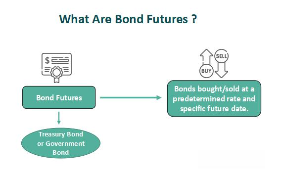

In the dynamic landscape of financial markets, understanding the nuances of financial instruments like bonds, parity bonds, and the role of algorithmic trading is essential. Bonds are fundamental components of the investment world, primarily valued for their stability and predictable returns. They provide a continuous income stream and serve as effective tools for diversification. However, the financial markets are not static, and innovations such as algorithmic trading have brought about notable shifts.

This article aims to explore various bond examples, specifically emphasizing parity bonds, and to discuss how algorithmic trading is impacting the fixed income market. Parity bonds, also known as 'pari passu' bonds, are unique as they stand on equal footing concerning claims, a feature critical in scenarios like bankruptcy proceedings. This equality in claim rights addresses risk mitigation, which is central for investors hedging against potential losses in cases of default.

While bonds have traditionally been a stable investment choice, offering predictable returns, algorithmic trading introduces a new dimension of innovation and efficiency. Algorithmic trading employs sophisticated computer programs to execute trades at speeds unachievable by human traders. This technology has gained traction beyond equities and forex, extending to the fixed income market. Algorithmic strategies can identify trading opportunities rapidly, providing a competitive edge in the bond market, known for its complexity and data fragmentation.

Understanding how these elements interact is crucial for investors aiming to optimize their investment strategies. By grasping the mechanics of various bond types and evaluating the role of algorithmic trading, investors can develop strategies that leverage these innovations while managing associated risks. This article will guide you through the different types of bonds, illustrate examples of parity bonds, and uncover the implications of algorithmic trading in this sector, equipping you with the insights necessary to navigate future challenges effectively.

## Table of Contents

## Understanding Bonds

Bonds are financial instruments representing a loan made by an investor to a borrower, typically corporate or governmental. They are integral to raising capital and involve the borrower issuing bonds to the lender with the promise of repayment on pre-specified terms.

The primary components of a bond are the principal, interest rate (coupon), and maturity date. The principal is the original sum of money borrowed. The coupon represents the periodic interest payment made to the bondholder, typically expressed as a percentage of the principal. The maturity date is when the principal is due to be repaid.

Bonds categorically include corporate bonds, government bonds, and municipal bonds. Corporate bonds are issued by companies to fund expansions, research, or other corporate purposes. Government bonds are procured by national treasuries to finance governmental activities and are often deemed low-risk due to the backing by national governments. Municipal bonds are issued by states, cities, or other local governmental entities to finance public projects such as infrastructure developments.

Interest rates exert an inverse effect on bond prices. When interest rates rise, existing bond prices generally fall due to the lower relative yield they offer. Conversely, when interest rates fall, existing bonds with higher coupon rates become more valuable, rising in price. This inverse relationship provides hedging opportunities for investors. Python can be used to demonstrate the inverse relationship between bond prices and interest rates using basic formulas and data visualization.

In times of low interest rates, bonds become attractive for generating stable income and diversifying risk. Investors seeking to maintain steady cash flows often turn to bonds for this purpose, as they can provide a predictable income stream even when equity markets are volatile. This stability and predictability help in constructing balanced investment portfolios, enabling diversification across different asset classes.

## The Concept of Parity Bonds

A parity bond, often referred to as a 'pari passu' bond, denotes a category of bonds that hold equivalent rights of payment or equal seniority within a particular issuer's hierarchy of debt obligations. The concept of parity bonds is crucial in the financial industry, particularly during events of bankruptcy or default, as it ensures that creditors possess equal claims on the issuer's assets or cash flows, thus maintaining a fair and orderly financial environment. 

In practice, parity bonds are frequently encountered as unsecured bonds issued by the same entity, where no single bond possesses precedence over another. Instead, all parity bonds are serviced equally, meaning that if an issuer faces financial difficulties, all parity bondholders are entitled to an equivalent proportion of the available payments. This characteristic distinguishes parity bonds from other types of debt instruments that may be subordinated or may have different seniority levels.

The term 'pari passu' is derived from Latin, translating to "equal footing." This designation implies that the bonds are ranked equally and will be paid simultaneously and proportionally if the issuer's financial situation dictates a partial fulfillment of debt obligations. Amid bankruptcy, this parity principle becomes pronounced, as it dictates the distribution of recoveries to creditors, ensuring that no particular creditor receives preferential treatment over others holding parity bonds.

The equal standing of parity bonds emphasizes their utility in a diversified investment portfolio. By holding parity bonds, investors can expect proportionate treatment compared to other creditors, which mitigates the risk associated with potential prioritization of debt repayments by the issuer.

In summary, parity bonds represent a strategic instrument by stipulating equal rights among creditors. This structure not only promotes fairness during financial distress but also provides a transparent framework for the allocation of payments in circumstances where financial obligations exceed available resources.

## Algorithmic Trading in Bond Markets

Algorithmic trading, characterized by the use of computer algorithms to automate trading activities, has traditionally been associated with equity and [forex](/wiki/forex-system) markets. However, it is increasingly making its mark in the fixed income market, including bonds. This integration offers substantial efficiencies, mainly due to the automation's ability to process vast amounts of data rapidly. As the algorithms can quickly analyze and act upon available data, trading execution becomes swifter, often reducing transaction costs significantly compared to manual trading processes.

One of the primary advantages of [algorithmic trading](/wiki/algorithmic-trading) in bonds is its capability to minimize human errors. The precision and consistency of algorithms mean that trades are executed based on predefined parameters without the influence of human emotions or biases. This precision helps in identifying and capitalizing on trading opportunities that might be missed in manual trading. For instance, algorithms can track market movements and execute trades instantaneously when specific conditions align, which is challenging for human traders to achieve at the same pace.

Despite these advantages, several challenges hinder the comprehensive adoption of algorithmic strategies in bond markets. One major challenge is the complexity inherent in the bond market itself. Unlike equity markets, where the securities are relatively homogeneous, bonds come with diverse terms and conditions regarding maturity, credit ratings, and coupon rates. This diversity necessitates the development of bespoke trading models tailored to individual bond features, making the implementation of uniform algorithmic strategies more demanding.

Data fragmentation is another significant hurdle in automating bond trading. Bond markets are primarily traded over-the-counter (OTC), leading to inconsistent and fragmented data availability. Unlike centralized exchanges, OTC trading does not have a single point of data collection, resulting in gaps and inconsistencies in historical and real-time data. These data challenges require sophisticated methods for data aggregation and processing to enable efficient algorithmic trading.

In summary, while the incorporation of algorithmic trading into bond markets offers notable efficiencies in execution speed and accuracy, the complexities of the market and data issues continue to present considerable challenges. Nonetheless, as technology advances, continued innovation in data science and computing can potentially overcome these barriers, making algorithmic trading a more integral part of the bond market ecosystem.

## Challenges in Fixed Income Algorithmic Trading

Data fragmentation and market complexity present significant challenges to automating fixed income trading. Bonds, typically traded over-the-counter (OTC), suffer from inconsistent data availability. Unlike equities, which are traded on centralized exchanges with standardized formats and transparent data, the OTC nature of bond markets results in a fragmented data landscape. This fragmentation can hinder the development of streamlined, efficient trading algorithms due to varying and often incomplete information.

The wide variability in bond features, including differences in maturity, credit rating, coupon structure, and other characteristics, necessitates bespoke trading models. Bonds are diverse financial instruments, each with its distinct set of risk factors and sensitivities influenced by issuer-specific factors, macroeconomic conditions, and [interest rate](/wiki/interest-rate-trading-strategies) environments. This diversity means that a one-size-fits-all approach to modeling and trading bonds is impractical. Instead, algorithmic solutions must account for specific bond features, adapting dynamically to the unique needs of each bond type while managing the computational complexities that arise from this customization.

To address these challenges, innovation in data aggregation and advanced analytics is essential. Data aggregation tools that can reconcile the disparate sources of bond market data, such as issuer reports, trading platforms, and market data services, are vital in constructing a coherent dataset conducive to algorithmic processing. Advanced analytics, particularly those utilizing [machine learning](/wiki/machine-learning) techniques, can uncover latent patterns in colossal datasets, enhancing decision-making in trading strategies. For example, machine learning models can predict bond price movements by training on historical data, identifying subtle correlations and trends that may not be obvious through traditional analysis.

Efforts to improve data standardization and transparency in the bond markets are also crucial. Initiatives focusing on the unification of data formats and improvement of reporting standards can facilitate better data quality and consistency, laying the groundwork for more sophisticated algorithmic trading strategies. Moreover, developing robust application programming interfaces (APIs) that streamline data exchange between various market participants and platforms can enhance the automation of trading processes.

Incorporating real-time data processing capabilities is another avenue to overcome these challenges. The integration of cloud-based solutions can offer scalable processing power and storage, enabling algorithmic systems to handle large volumes of data and execute trades at higher speeds, thus reducing latency and improving performance metrics. By embracing such technological innovations, firms can better navigate the complexities of the fixed income market, optimizing their algorithmic trading approaches to capture opportunities more effectively.

## Technological Innovations Transforming Bond Trading

Technological advancements have revolutionized bond trading, offering significant improvements in efficiency and accuracy. Among these innovations, [artificial intelligence](/wiki/ai-artificial-intelligence) (AI) and cloud computing are at the forefront, driving major shifts in how trading operations are conducted.

AI has empowered traders with advanced predictive analytics capabilities, enabling them to identify patterns and trends in bond pricing with unprecedented accuracy. Through machine learning algorithms, historical data is analyzed to forecast future price movements, thereby refining trading strategies. For instance, a common approach involves using AI to analyze macroeconomic indicators and sentiment analysis from news sources, which are then correlated with bond price fluctuations. The formula for a simple linear regression model that predicts bond prices ($Y$) based on economic indicators ($X_1, X_2, \ldots, X_n$) can be represented as:

$$

Y = \beta_0 + \beta_1X_1 + \beta_2X_2 + \cdots + \beta_nX_n + \epsilon 
$$

where $\beta_0$ is the intercept, $\beta_i$ are the coefficients for each predictor, and $\epsilon$ is the error term.

Cloud computing is another transformative technology that provides scalable and efficient trading operations. By leveraging cloud infrastructure, institutions can process large volumes of data in real-time, facilitating rapid responses to market changes. This scalability ensures that firms, regardless of size, have equal access to powerful computing resources, thereby democratizing the trading landscape. Cloud platforms enable seamless integration of development environments and trading platforms, significantly reducing the time and cost associated with building and maintaining IT infrastructure.

These technological advancements are not just enhancing operational efficiencies but also democratizing access to sophisticated trading tools across firms of varying sizes. By integrating AI and cloud solutions, bond trading processes are becoming more agile, data-driven, and adaptable to the ever-changing market dynamics.

## Future of Bonds and Algorithmic Trading

The future of bonds and algorithmic trading is heavily influenced by ongoing technological advancements, which are poised to transform fixed income markets into more efficient and transparent entities. As technology becomes more deeply embedded in financial systems, institutions must prioritize modern infrastructure investments to remain competitive. This includes implementing cutting-edge trading platforms that can handle the complexities of bond markets, often characterized by a wide variety of maturities, credit qualities, and structures. 

To handle these intricate environments, institutions are increasingly relying on technology-savvy talent. This shift necessitates hiring professionals proficient in data science, machine learning, and quantitative analysis to operate sophisticated algorithmic models that can efficiently process and analyze large datasets. Furthermore, fostering a culture that embraces continuous learning and innovation is crucial to adapting to rapid technological changes.

Concurrently, regulatory frameworks are expected to evolve alongside technological advancements. Regulators will likely focus on ensuring that these technologies promote transparency, accountability, and integrity within the market. This may include setting standards for data privacy, algorithmic fairness, and reporting requirements to prevent market abuse and maintain investor confidence. 

A central challenge for firms employing algorithmic trading strategies is balancing innovation with risk management. Algorithms, while powerful, introduce new risks such as model errors and systemic vulnerabilities that must be meticulously managed. Robust risk management protocols and stress testing become crucial as algorithmic trading strategies grow sophisticated. Firms must develop practices that can adjust or halt trading activities in response to unforeseen disruptions, ensuring market stability.

As algorithmic trading becomes integral to fixed income strategies, institutions will have to balance the pursuit of technological innovation with comprehensive risk mitigation measures. This balancing act will be vital to sustainably harnessing the potential of technology in driving the future of fixed income markets.

## Conclusion

Bonds, parity bonds, and algorithmic trading represent critical components in today's financial markets. These elements collectively shape the landscape of investing, providing avenues for secure returns, risk diversification, and technologically-driven efficiencies. Algorithmic trading, in particular, has introduced unprecedented speed and automation into the bond market, significantly reshaping how fixed income securities are traded. This technology not only enhances efficiency but also offers investors the ability to respond swiftly to market changes, thereby opening up new avenues for achieving investment objectives.

To capitalize on these innovations, investors and firms must remain proactive and informed. Staying abreast of the latest technological developments in algorithmic trading is imperative, as is the need to understand the ever-evolving regulatory landscape that governs these markets. Practitioners must be equipped not only with financial acumen but also with technological expertise to fully leverage the power of algorithms in trading strategies.

By understanding these dynamics, market participants can enhance their strategies and navigate future challenges effectively. The integration of algorithmic trading in bond markets promises to continue altering investment strategies, making it crucial for investors to adapt. This adaptability involves not only the adoption of new technologies but also an understanding of how such innovations influence market behavior and investment risk. As investors and firms become more adept in utilizing these tools, the potential for optimized portfolio performance and strategic advantage significantly increases, heralding a new era of trading in fixed income markets.

## References & Further Reading

Lopez de Prado, M. (2018). Advances in Financial Machine Learning. Wiley. This book serves as a comprehensive guide to integrating machine learning techniques within financial markets, providing insights into practical applications and advanced methodologies. It is instrumental for enhancing the efficiency and sophistication of algorithmic trading strategies.

Aronson, D. R. (2006). Evidence-Based Technical Analysis. Wiley. Aronson emphasizes the significance of empirical validation in technical analysis, advocating for a disciplined approach grounded in rigorous data evaluation. This book is valuable for understanding the importance of evidence-based strategies in decision-making processes within financial markets.

Jansen, S. (2020). Machine Learning for Algorithmic Trading. Packt Publishing. Jansen explores machine learning tools and models specifically tailored for algorithmic trading applications. The book includes practical coding examples and case studies, aiding readers in applying machine learning techniques to develop automated trading systems.

Chan, E. P. (2008). Quantitative Trading: How to Build Your Own Algorithmic Trading Business. Wiley. Chan provides insights into developing and managing algorithmic trading operations, discussing the technical, operational, and strategic aspects necessary for building a successful trading business. This resource is crucial for understanding the comprehensive landscape of [quantitative trading](/wiki/quantitative-trading) strategies.