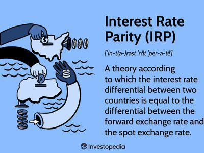

## Table of Contents

## What is parity price in the context of investing?

Parity price in investing refers to the price at which two different financial instruments or assets have the same value. This concept is often used in options trading, where the parity price is the point at which a call option and a put option on the same underlying asset have equal value. For example, if you have a call option and a put option with the same strike price and expiration date, the parity price is reached when the price of the underlying asset makes these two options worth the same amount.

Understanding parity price is important because it helps investors make decisions about buying or selling options. When the market price of an asset reaches the parity price, it can signal that the options are fairly priced relative to each other. This can help investors determine if an option is overpriced or underpriced, which can guide their investment strategy. In essence, the parity price acts as a benchmark for comparing the value of different financial instruments.

## How is parity price calculated for stocks?

Parity price for stocks is often talked about in the context of options trading. When you have a call option and a put option on the same stock with the same expiration date and strike price, the parity price is the stock price that makes these two options equal in value. To find this, you look at the strike price of the options. If the stock price is exactly at the strike price, then the call option and put option will be at parity. This is because, at the strike price, the call option gives you the right to buy the stock at that price, and the put option gives you the right to sell it at that price, making them equally valuable.

In real trading, other factors like interest rates and dividends can affect the exact parity price. For example, if a stock pays a dividend, the put option might be worth a bit more because you could buy the stock, get the dividend, and then sell it at the strike price. Also, the time until the options expire can change the parity price because the more time there is, the more chance the stock price has to move, affecting the value of the options. So, while the basic idea is simple, in practice, calculating the exact parity price can get a bit more complicated due to these extra factors.

## Can you explain the concept of parity price with an example?

Let's say you have two options on a stock called ABC. One is a call option, which gives you the right to buy ABC stock at $50 per share, and the other is a put option, which gives you the right to sell ABC stock at $50 per share. Both options expire on the same day. The parity price for these options is $50 because if the stock price of ABC is exactly $50, the call option and the put option are worth the same amount.

Here's how it works: if the stock price is $50, the call option lets you buy the stock at $50, which is the same as the current market price, so it has no extra value. The put option lets you sell the stock at $50, which is also the same as the current market price, so it too has no extra value. At this point, both options are at parity because they have the same value. If the stock price goes above $50, the call option becomes more valuable, and if it goes below $50, the put option becomes more valuable.

## What role does parity price play in options trading?

Parity price is important in options trading because it helps traders understand when a call option and a put option are worth the same amount. This happens when the stock price is the same as the strike price of the options. Knowing the parity price can help traders decide if an option is a good buy or sell. If the stock price is far from the parity price, it can tell traders that one option might be a better deal than the other.

For example, if a trader sees that a stock is trading right at the parity price of $50 for both a call and a put option, they know that the options are fairly valued relative to each other. If the stock price moves away from $50, the trader can use this information to make smarter trades. If the stock goes above $50, the call option becomes more valuable, and if it goes below $50, the put option becomes more valuable. This helps traders make decisions based on where they think the stock price will go next.

## How does parity price affect investment decisions?

Parity price is important for people who invest in options because it helps them understand when a call option and a put option are worth the same. This happens when the price of the stock is the same as the strike price of the options. Knowing the parity price helps investors decide if an option is a good buy or sell. If the stock price is far from the parity price, it can tell investors that one option might be a better deal than the other.

For example, if an investor sees that a stock is trading right at the parity price of $50 for both a call and a put option, they know that the options are fairly valued compared to each other. If the stock price moves away from $50, the investor can use this information to make smarter trades. If the stock goes above $50, the call option becomes more valuable, and if it goes below $50, the put option becomes more valuable. This helps investors make decisions based on where they think the stock price will go next.

## What are the differences between parity price and market price?

Parity price and market price are two different ideas in investing. Parity price is a special price where a call option and a put option on the same stock have the same value. This happens when the stock price is the same as the strike price of the options. It's like a balance point where the two options are worth the same amount. On the other hand, the market price is just the current price at which a stock or any other asset is trading in the market. It changes all the time based on what buyers and sellers are willing to pay.

Understanding the difference between these two prices can help investors make better choices. If the market price of a stock is the same as the parity price, it means the call and put options are balanced in value. But if the market price is different from the parity price, it can show investors which option might be a better buy. For example, if the market price is higher than the parity price, the call option becomes more valuable. Knowing this can guide investors in deciding whether to buy, sell, or hold their options.

## How do economic factors influence parity price?

Economic factors can change the parity price of options by affecting the stock price. Things like interest rates, inflation, and big news about the economy can make stock prices go up or down. When the stock price changes, it moves closer to or further away from the parity price. For example, if the economy is doing well and interest rates are low, more people might want to buy stocks, pushing the stock price up. This can make the call option more valuable and the put option less valuable, moving the stock price away from the parity price.

Other economic factors like dividends also play a role. If a company pays a dividend, it can make the put option a bit more valuable because you could buy the stock, get the dividend, and then sell it at the strike price. This means the parity price might need to be adjusted to account for the dividend. Overall, economic factors create a lot of movement in stock prices, which in turn affects where the parity price sits in relation to the market price of the stock.

## What are the common misconceptions about parity price in investing?

One common misconception about parity price is that it's the same as the market price. People sometimes think that if a stock is trading at the parity price, it means the stock is fairly valued. But parity price is really about when a call option and a put option on the same stock are worth the same amount. It's a special point where the two options balance out, not a judgment on whether the stock itself is a good buy or sell.

Another misconception is that parity price stays the same no matter what. In reality, economic factors like interest rates, inflation, and dividends can change the parity price. For example, if a company starts paying a bigger dividend, it can make the put option more valuable, which means the parity price might need to be adjusted. So, parity price isn't a fixed number; it can move around based on what's happening in the economy and with the company.

## How can investors use parity price to assess the value of a security?

Investors can use parity price to understand when a call option and a put option on the same stock are worth the same amount. This happens when the stock price is the same as the strike price of the options. By knowing the parity price, investors can see if an option is a good buy or sell. If the stock price is far from the parity price, it can show investors that one option might be a better deal than the other. For example, if a stock is trading right at the parity price of $50, the call and put options are balanced in value. If the stock price moves away from $50, investors can use this information to make smarter trades.

Economic factors like interest rates, inflation, and dividends can change the parity price. When these factors affect the stock price, it can move closer to or further away from the parity price. For instance, if the economy is doing well and interest rates are low, more people might want to buy stocks, pushing the stock price up. This can make the call option more valuable and the put option less valuable, moving the stock price away from the parity price. By keeping an eye on these economic factors, investors can better understand how the parity price might change and make more informed decisions about their options trading.

## What advanced strategies involve using parity price in portfolio management?

Advanced investors can use parity price to create strategies that help manage their portfolios better. One strategy is called a conversion or reversal. In a conversion, an investor buys the stock, buys a put option, and sells a call option all at the same strike price. This locks in a profit if the stock price stays near the parity price. In a reversal, the investor does the opposite: they sell the stock short, sell a put option, and buy a call option. Both strategies can help investors make money when the stock price is close to the parity price, which can be useful for managing risk in their portfolios.

Another strategy involves using parity price to spot mispriced options. If an investor sees that the market price of a stock is far from the parity price, they can buy the option that's undervalued and sell the one that's overvalued. This can help them make a profit from the difference in prices. By doing this, investors can take advantage of short-term price movements and improve their overall returns. Keeping an eye on parity price helps them make these smart trades and manage their portfolios more effectively.

## How does parity price relate to arbitrage opportunities in financial markets?

Parity price can help investors find arbitrage opportunities in financial markets. Arbitrage is when you buy something in one place and sell it in another place to make a profit from the price difference. If the market price of a stock is different from the parity price, it can show investors where they might find these opportunities. For example, if the stock price is lower than the parity price, an investor could buy the stock and the put option, and sell the call option to make a profit from the difference.

This strategy is called a conversion or reversal. In a conversion, an investor buys the stock, buys a put option, and sells a call option all at the same strike price. This can lock in a profit if the stock price stays near the parity price. In a reversal, the investor does the opposite: they sell the stock short, sell a put option, and buy a call option. Both strategies can help investors make money when the stock price is close to the parity price, which can be useful for finding arbitrage opportunities in the market.

## What are the latest research findings on the impact of parity price on long-term investment returns?

Recent research has shown that understanding parity price can help investors make better long-term investment decisions. Parity price is the point where a call option and a put option on the same stock are worth the same amount. When investors know the parity price, they can see if options are a good buy or sell. This can help them make smarter trades over time, which can lead to better returns. For example, if an investor sees that a stock is often trading close to its parity price, they might use strategies like conversions or reversals to lock in profits, which can improve their long-term investment performance.

However, the impact of parity price on long-term returns isn't always straightforward. Economic factors like interest rates, inflation, and dividends can change the parity price, which means investors need to keep an eye on these factors to make the best decisions. Some studies have found that using parity price to spot arbitrage opportunities can be profitable in the short term, but it's harder to predict how these strategies will work over many years. Overall, while parity price can be a useful tool for managing a portfolio, it's just one part of a bigger picture when it comes to long-term investment returns.

## What is Understanding Parity Price?

Parity price is a critical concept in financial markets that indicates the price level at which two assets or securities are of equivalent value. It serves as an essential tool for investors involved in various markets, including convertible bonds, commodities, and foreign exchange. Understanding parity price enables market participants to make informed decisions about potential arbitrage opportunities and determine the most advantageous financial actions.

In the context of convertible bonds, parity price helps investors decide when it is financially beneficial to convert bonds into shares. Convertible bonds are hybrid securities that combine features of both debt and equity, providing the holder the option to convert the bond into a predetermined number of shares. The parity price in this scenario is calculated using the formula:

$$
\text{Parity Price} = \left(\frac{\text{Conversion Value}}{\text{Number of shares}}\right)
$$

where the conversion value represents the value of the shares if the bond were converted at the current stock price. Investors monitor this price level to identify optimal conversion moments, balancing potential gains from conversion against interest income from holding the bond.

In commodities trading, parity price assists in evaluating the equilibrium between production costs and market prices. Setting parity prices in commodities markets can reveal opportunities for [arbitrage](/wiki/arbitrage), where investors can exploit price disparities between different markets or timeframes to realize profits.

In the foreign exchange market, parity price is fundamental to understanding exchange rate relationships. It is particularly useful in determining currency values relative to one another, and it is often involved in strategies such as [interest rate](/wiki/interest-rate-trading-strategies) parity and purchasing power parity. These strategies help investors to assess whether currencies are overvalued or undervalued. For example, interest rate parity involves comparing the potential returns on investments in different currencies, taking into account exchange rate fluctuations.

To summarize, the parity price serves as a benchmark for investors across various markets, guiding conversions of convertible bonds, comparing currency values, and identifying arbitrage opportunities in commodities. Recognizing and calculating parity prices is instrumental for optimizing investment strategies and capitalizing on market inefficiencies.

## What is the Role of Financial Formulas in Investing?

Financial formulas are a cornerstone for evaluating and understanding investment opportunities and associated risks. These mathematical constructs provide a structured way to interpret complex market data, transforming raw figures into actionable insights. By employing financial formulas, investors can evaluate expected returns, assess growth potential, and determine the viability of various investment avenues.

One of the crucial applications of financial formulas is in calculating expected returns, which essentially predicts the profit an investor can anticipate from an investment. The expected return $E(R)$ can be mathematically expressed as:

$$
E(R) = \sum (p_i \times r_i)
$$

where $p_i$ is the probability of each potential return $r_i$. This formula allows investors to weigh potential outcomes by their likelihood, thus offering a more nuanced understanding of future gains.

Growth rate formulas also play a pivotal role in investment analysis. For example, the Compound Annual Growth Rate (CAGR) enables investors to quantify the average annual growth of an investment over a period, and is defined as:

$$
CAGR = \left( \frac{V_f}{V_i} \right)^{\frac{1}{n}} - 1
$$

where $V_f$ is the final value, $V_i$ is the initial value, and $n$ is the number of years. This is particularly valuable for assessing the potential expansion of revenues, earnings, or investments over time.

In evaluating the worth of bonds, bond valuation formulas are indispensable. The fundamental formula for the present value of a bond is:

$$
P = \sum \left( \frac{C}{(1 + r)^t} \right) + \frac{F}{(1 + r)^n}
$$

where $P$ is the price of the bond, $C$ is the coupon payment, $r$ is the discount rate, $t$ is the time period, $F$ is the face value, and $n$ is the bond’s maturity. This calculation provides critical insights into whether a bond is underpriced or overpriced relative to its market price.

Interest rate parity (IRP) is another vital concept, particularly in the foreign exchange market, as it helps explain the relationship between interest rates and currency exchange rates. The basic formula of IRP is:

$$
\frac{F}{S} = \frac{1 + i_d}{1 + i_f}
$$

where $F$ is the forward exchange rate, $S$ is the spot exchange rate, $i_d$ is the domestic interest rate, and $i_f$ is the foreign interest rate. This ensures no arbitrage situations exist between the spot and forward markets, thereby maintaining equilibrium.

Stock options pricing, epitomized by the Black-Scholes model, provides a way to determine the theoretical price of options. The formula takes into account the stock price, the option's strike price, time until expiration, risk-free rate, and [volatility](/wiki/volatility-trading-strategies).

Equipped with these formulas, investors can transform raw data into informed, strategic decisions. By mastering these calculations, they can scientifically evaluate potential investments, creating opportunities to optimize returns while managing risk effectively.

## How is Parity Price Applied in Different Markets?

Parity price plays a critical role in various financial markets by acting as a reference point at which two securities or assets share equivalent value. This concept is particularly significant in markets such as convertible bonds, foreign exchange, and commodities, each providing unique insights and applications.

In the securities market, parity price is notably applicable in the context of convertible bonds. These are hybrid securities that allow investors to convert bonds into a predetermined number of the issuing company's shares. Determining the parity price involves evaluating when the bond's market value aligns with the conversion value. The formula to calculate the parity price for a convertible bond is:

$$

\text{Parity Price} = \frac{\text{Conversion Ratio} \times \text{Current Stock Price}}{\text{Face Value of the Bond}} 
$$

By calculating parity price, investors can identify the optimal time for conversion, ensuring they maximize returns and minimize potential losses.

In [forex](/wiki/forex-system) markets, parity price helps analyze the exchange rate relationships between two currencies. Exchange rate parity typically involves the concept of purchasing power parity (PPP), which asserts that in a perfect market, exchange rates should adjust to equalize the purchasing power of different currencies. This parity provides insights into whether a currency is undervalued or overvalued, enabling investors to make informed decisions on forex trading strategies.

For commodities, parity price assessments focus on the equilibrium between production costs and market prices. Understanding this relationship can help investors determine fair value and predict potential price adjustments. Factors such as supply chain logistics, production efficiency, and geopolitical influences all affect parity price, which can then inform trading and hedging strategies within commodity markets.

Overall, understanding how parity price is applied across different markets can empower investors to formulate robust strategies that optimize their investment portfolios. Whether it’s determining conversion opportunities in convertible bonds, analyzing currency values in forex markets, or evaluating cost dynamics in commodity trading, parity price is an invaluable tool for strategic financial decision-making.

## References & Further Reading

[1]: ["Advances in Financial Machine Learning"](https://www.amazon.com/Advances-Financial-Machine-Learning-Marcos/dp/1119482089) by Marcos Lopez de Prado

[2]: ["Evidence-Based Technical Analysis: Applying the Scientific Method and Statistical Inference to Trading Signals"](https://www.amazon.com/Evidence-Based-Technical-Analysis-Scientific-Statistical/dp/0470008741) by David Aronson

[3]: ["Machine Learning for Algorithmic Trading"](https://github.com/stefan-jansen/machine-learning-for-trading) by Stefan Jansen

[4]: ["Quantitative Trading: How to Build Your Own Algorithmic Trading Business"](https://www.amazon.com/Quantitative-Trading-Build-Algorithmic-Business/dp/1119800064) by Ernest P. Chan

[5]: Jorion, P. (2007). ["Value at Risk: The New Benchmark for Managing Financial Risk."](https://link.springer.com/article/10.1007/s11408-007-0057-3) McGraw-Hill.

[6]: Black, F., & Scholes, M. (1973). ["The Pricing of Options and Corporate Liabilities."](https://www.cs.princeton.edu/courses/archive/fall09/cos323/papers/black_scholes73.pdf) Journal of Political Economy, 81(3), 637-654. 

[7]: Hull, J. C. (2012). ["Options, Futures, and Other Derivatives."](https://www.semanticscholar.org/paper/Options%2C-Futures%2C-and-Other-Derivatives-Hull/89bdee500c8623864fc9eb7a471546aa713acc44) Pearson.