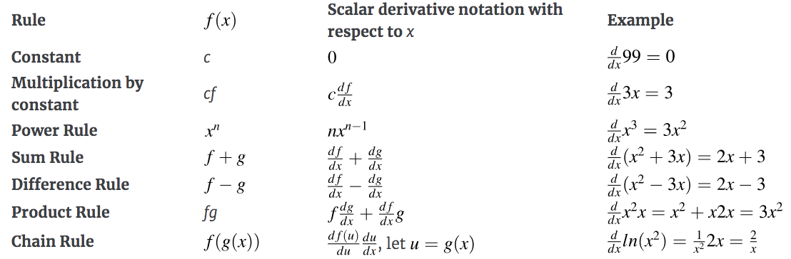

## Table of Contents

## What is a partial derivative in the context of machine learning?

In machine learning, a partial derivative is a way to understand how a function changes when you change just one of its inputs, while keeping the others the same. Imagine you have a function that depends on several variables, like a machine learning model that predicts house prices based on size, location, and age. A partial derivative helps you see how the price changes if you change the size, without changing the location or age.

For example, if you have a function $$ f(x, y) $$, the partial derivative of $$ f $$ with respect to $$ x $$ (written as $$ \frac{\partial f}{\partial x} $$) tells you how $$ f $$ changes when you change $$ x $$ but keep $$ y $$ constant. In machine learning, this is useful for optimizing models. When training a model, you often need to adjust the parameters to minimize a cost function. By calculating the partial derivatives of the cost function with respect to each parameter, you can figure out which direction to adjust each parameter to reduce the cost, which is the core idea behind gradient descent algorithms.

## How do partial derivatives differ from ordinary derivatives?

Ordinary derivatives and partial derivatives both measure how a function changes, but they are used in different situations. An ordinary derivative is used when you have a function of just one variable. For example, if you have a function $$ f(x) $$ that depends only on $$ x $$, the ordinary derivative $$ f'(x) $$ tells you how $$ f $$ changes as you change $$ x $$. It's like looking at how the height of a hill changes as you walk along a single path.

Partial derivatives, on the other hand, are used when you have a function of multiple variables. If you have a function $$ f(x, y) $$ that depends on both $$ x $$ and $$ y $$, the partial derivative with respect to $$ x $$, written as $$ \frac{\partial f}{\partial x} $$, tells you how $$ f $$ changes when you change $$ x $$ but keep $$ y $$ the same. It's like looking at how the height of a hill changes if you move only in the $$ x $$ direction, without moving in the $$ y $$ direction. This is useful in fields like machine learning where you often work with functions that depend on many variables.

## Why are partial derivatives important in machine learning algorithms?

Partial derivatives are important in [machine learning](/wiki/machine-learning) because they help us understand how changing one part of our model affects the whole thing. Imagine you're trying to teach a computer to guess house prices based on size, age, and location. If you want to know how changing the size affects the price, without changing age or location, you use a partial derivative. This helps you see how sensitive your model is to each input, which is crucial for making your model work well.

In machine learning, we often use an algorithm called gradient descent to train our models. This algorithm works by trying to make the model's predictions as accurate as possible. To do this, it needs to know which way to adjust the model's settings to get better results. Partial derivatives tell us the direction and size of these adjustments. For example, if you have a cost function $$ J(\theta) $$ that measures how wrong your model is, the partial derivatives $$ \frac{\partial J}{\partial \theta_i} $$ tell you how to change each setting $$ \theta_i $$ to make the model less wrong. This makes partial derivatives a key tool in making machine learning models smart and accurate.

## Can you explain how partial derivatives are used in gradient descent?

Gradient descent is a way to make a machine learning model better by adjusting its settings, called parameters. Imagine you're trying to find the lowest point in a valley. You look around to see which way the ground slopes down the most, and then you take a step in that direction. In machine learning, the "valley" is a cost function $$ J(\theta) $$ that tells you how wrong your model is. The partial derivatives $$ \frac{\partial J}{\partial \theta_i} $$ tell you which way the cost function slopes down the most for each parameter $$ \theta_i $$. By following these slopes, you can adjust the parameters to make your model's predictions more accurate.

To use gradient descent, you start with some initial guesses for your parameters. Then, you calculate the partial derivatives of the cost function with respect to each parameter. These derivatives tell you how to change each parameter to reduce the cost. You update each parameter by taking a small step in the direction of the negative gradient. This process is repeated many times until the cost function stops getting smaller, meaning you've reached the bottom of the "valley" and your model is as good as it can get with the current setup.

## What is the role of partial derivatives in backpropagation?

Backpropagation is a way to train neural networks, which are a type of machine learning model. It's like a detective trying to figure out how to make the model better by looking at its mistakes. Partial derivatives are super important in this process because they help us understand how changing one part of the model affects the final result. Imagine the [neural network](/wiki/neural-network) as a big machine with lots of knobs to turn. Each knob is a parameter, and we want to turn these knobs to make the machine work better. The partial derivatives tell us which way to turn each knob to get closer to the right answer.

In backpropagation, we start by calculating the error at the end of the network, which is how wrong our predictions are. Then, we use partial derivatives to figure out how each part of the network contributed to that error. For example, if we have a cost function $$ J(\theta) $$, the partial derivatives $$ \frac{\partial J}{\partial \theta_i} $$ show us how each parameter $$ \theta_i $$ affects the error. By following these derivatives, we can adjust the parameters to make the error smaller. This process is repeated over and over, with the network getting better at its job each time.

## How do you calculate partial derivatives for a multivariable function?

To calculate partial derivatives for a multivariable function, imagine you have a function that depends on several variables, like $$ f(x, y, z) $$. To find the partial derivative of this function with respect to one variable, say $$ x $$, you treat all the other variables ($$ y $$ and $$ z $$) as if they were constants. Then, you find the ordinary derivative of the function with respect to $$ x $$. For example, if $$ f(x, y, z) = x^2y + z $$, the partial derivative of $$ f $$ with respect to $$ x $$, written as $$ \frac{\partial f}{\partial x} $$, is found by treating $$ y $$ and $$ z $$ as constants. So, you get $$ \frac{\partial f}{\partial x} = 2xy $$.

The same idea applies to finding partial derivatives with respect to other variables. If you want to find the partial derivative of $$ f $$ with respect to $$ y $$, you treat $$ x $$ and $$ z $$ as constants. So, for the same function $$ f(x, y, z) = x^2y + z $$, the partial derivative of $$ f $$ with respect to $$ y $$, written as $$ \frac{\partial f}{\partial y} $$, is $$ x^2 $$. This process of treating all variables except one as constants and then finding the ordinary derivative is how you calculate partial derivatives for any multivariable function.

## What are some common challenges when working with partial derivatives in machine learning?

One common challenge when working with partial derivatives in machine learning is dealing with complex functions. In machine learning, models often have lots of parameters, which means you have to calculate many partial derivatives. For example, in a neural network, you might have thousands of parameters, and calculating the partial derivative of the cost function $$ J(\theta) $$ with respect to each one can be tricky. Sometimes, the functions are so complicated that it's hard to find a simple way to write down the partial derivatives by hand.

Another challenge is keeping track of all the variables and making sure you don't make mistakes. When you're calculating partial derivatives, you have to remember which variables you're treating as constants and which one you're changing. If you mix them up, you can get the wrong answer. This can be especially hard when you're working with big models that have many layers and lots of connections between them. It's like trying to solve a big puzzle where every piece affects every other piece.

To make things easier, many machine learning libraries, like TensorFlow or PyTorch, use automatic differentiation. This means the computer does the hard work of calculating the partial derivatives for you. It's like having a smart calculator that knows how to find the slopes of all the hills in your model. This helps a lot, but it's still important to understand what's going on behind the scenes, so you can fix problems if they come up.

## How can partial derivatives help in optimizing neural network performance?

Partial derivatives help in optimizing neural network performance by showing us how to adjust the network's parameters to make it better. Imagine you're trying to make a cake taste better by tweaking the recipe. The partial derivatives tell you how changing the amount of each ingredient, like sugar or flour, affects the taste. In a neural network, the "ingredients" are the parameters, and the "taste" is how well the network does its job. By calculating the partial derivatives of the cost function $$ J(\theta) $$ with respect to each parameter $$ \theta_i $$, you can figure out which way to adjust each parameter to make the network's predictions more accurate.

This process is called gradient descent, where you take small steps in the direction that the partial derivatives suggest. It's like walking down a hill to find the lowest point, where the network performs the best. The partial derivatives guide you down the hill by showing you which way the slope is the steepest. By repeatedly adjusting the parameters based on these derivatives, the neural network learns from its mistakes and gets better over time. This is how partial derivatives help in making neural networks smarter and more efficient.

## What advanced techniques involve partial derivatives in deep learning?

In [deep learning](/wiki/deep-learning), a technique called "automatic differentiation" uses partial derivatives to help train complex models. Imagine you're trying to solve a huge puzzle, but instead of doing it by hand, you have a smart computer that can figure out all the pieces for you. Automatic differentiation does this by calculating the partial derivatives of the cost function $$ J(\theta) $$ with respect to each parameter $$ \theta_i $$. This makes it easier to train deep neural networks because the computer can handle all the math, even when the models are very complicated. Libraries like TensorFlow and PyTorch use automatic differentiation to make training deep learning models faster and more accurate.

Another advanced technique is "second-order optimization methods," which use not just the first partial derivatives but also the second partial derivatives. Think of it like trying to find the best path down a hill. First-order methods, like gradient descent, look at the slope of the hill to decide which way to go. But second-order methods, like Newton's method, also look at how the slope changes, which can help you get to the bottom faster. These methods use the Hessian matrix, which is made up of second partial derivatives, to figure out the best way to adjust the parameters. While second-order methods can be more powerful, they are also more complicated and need more computing power, so they're not always used in practice.

## How do partial derivatives relate to the concept of Jacobian matrices in machine learning?

Partial derivatives are like little helpers that show how a function changes when you change one of its inputs. In machine learning, if you have a function with many inputs, like a neural network, you need to know how each input affects the output. This is where the Jacobian matrix comes in. The Jacobian matrix is a way to organize all these partial derivatives into a neat table. If you have a function $$ f(x_1, x_2, ..., x_n) $$ that gives you several outputs, the Jacobian matrix $$ J $$ has the partial derivatives of each output with respect to each input. For example, if your function has two inputs $$ x_1 $$ and $$ x_2 $$ and two outputs $$ y_1 $$ and $$ y_2 $$, the Jacobian matrix looks like this:

$$
J = \begin{bmatrix}
\frac{\partial y_1}{\partial x_1} & \frac{\partial y_1}{\partial x_2} \\
\frac{\partial y_2}{\partial x_1} & \frac{\partial y_2}{\partial x_2}
\end{bmatrix}
$$

In machine learning, the Jacobian matrix is super useful because it helps you understand how changes in the inputs affect all the outputs at once. This is important when you're training a model and want to make it better. By looking at the Jacobian matrix, you can see which inputs have the biggest impact on the outputs and adjust them to make the model's predictions more accurate. It's like having a map that shows you all the paths down a hill, so you can choose the best way to go.

## Can you discuss the impact of partial derivatives on the convergence rate of optimization algorithms?

Partial derivatives play a big role in how fast optimization algorithms, like gradient descent, find the best solution. Imagine you're trying to find the lowest point in a valley. The partial derivatives tell you which way the ground slopes down the most for each step you take. If you use these slopes correctly, you can get to the bottom of the valley faster. In machine learning, this means your model can learn and get better quicker. The more accurate your partial derivatives are, the better you can adjust your model's parameters to reduce the cost function $$ J(\theta) $$, which measures how wrong your model's predictions are.

However, using partial derivatives to speed up optimization isn't always easy. Sometimes, the functions you're working with are very complicated, and calculating the partial derivatives can be hard. If you make mistakes in these calculations, you might end up going the wrong way and slowing down the optimization process. Also, the size of the steps you take, called the learning rate, matters a lot. If the steps are too big, you might jump over the best solution. If they're too small, it will take forever to get there. So, understanding and using partial derivatives well is key to making your optimization algorithms work faster and better.

## What are the latest research developments involving partial derivatives in machine learning?

Recent research in machine learning has focused on improving the efficiency and accuracy of calculating partial derivatives, which are crucial for training models. One exciting development is the advancement in automatic differentiation techniques. These methods allow computers to calculate partial derivatives automatically, making it easier to train complex models like deep neural networks. Researchers are working on making these techniques faster and more memory-efficient, which helps in training larger models quicker. For example, new algorithms have been developed to reduce the computational cost of calculating the Jacobian matrix $$ J $$, which contains all the partial derivatives of a function's outputs with respect to its inputs.

Another area of research involves using second-order partial derivatives to optimize machine learning models. While first-order methods like gradient descent use the slope of the cost function $$ J(\theta) $$ to adjust parameters, second-order methods also consider how the slope changes, which can lead to faster convergence. Techniques like Newton's method and its variants use the Hessian matrix, which is made up of second partial derivatives, to find the best direction for parameter updates. Researchers are exploring ways to make these second-order methods more practical for large-scale problems, which could significantly speed up the training of deep learning models.

## References & Further Reading

[1]: Goodfellow, I., Bengio, Y., & Courville, A. (2016). ["Deep Learning."](https://link.springer.com/article/10.1007/s10710-017-9314-z) MIT Press.

[2]: Bishop, C. M. (2006). ["Pattern Recognition and Machine Learning."](https://www.cs.uoi.gr/~arly/courses/ml/tmp/Bishop_book.pdf) Springer.

[3]: Rumelhart, D. E., Hinton, G. E., & Williams, R. J. (1986). ["Learning Representations by Back-Propagating Errors."](https://www.nature.com/articles/323533a0) Nature.

[4]: Nocedal, J., & Wright, S. J. (2006). ["Numerical Optimization,"](https://link.springer.com/book/10.1007/978-0-387-40065-5) Springer.

[5]: Baydin, A. G., Pearlmutter, B. A., Radul, A. A., & Siskind, J. M. (2018). ["Automatic Differentiation in Machine Learning: a Survey."](https://arxiv.org/abs/1502.05767) Journal of Machine Learning Research, 18(153).

[6]: LeCun, Y., Bengio, Y., & Hinton, G. (2015). ["Deep Learning."](https://www.nature.com/articles/nature14539) Nature, 521(7553), 436-444.

[7]: Ruder, S. (2016). ["An Overview of Gradient Descent Optimization Algorithms."](https://arxiv.org/abs/1609.04747) arXiv preprint arXiv:1609.04747.