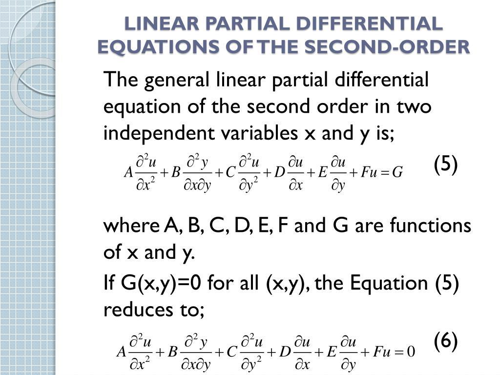

Partial differential equations (PDEs) are integral to modern financial markets, serving as the mathematical backbone in algorithmic trading. They allow traders to develop and evaluate robust mathematical models essential for crafting effective trading strategies and assessing risks associated with market activities. By applying PDEs, traders can analyze how various financial elements interact within the trading environment, leading to informed decision-making processes.

This article aims to examine the application of PDEs in algorithmic trading, providing insights into their utility and influence on the financial landscape. Through the lens of PDEs, we witness a convergence between theoretical finance and practical trading tactics, where complex market phenomena are captured and quantified. PDEs offer a framework for translating market dynamics into a mathematical language, which supports the automation of trading strategies and aids in risk assessment.



As financial markets evolve and increase in complexity, the significance of PDEs becomes apparent. They enable traders to simulate market behaviors, derive key parameters in pricing derivatives, and navigate the intricacies of financial instruments with precision. Our discussion will highlight the pivotal nature of PDEs in bridging the gap between abstract financial theories and actionable trading methodologies, underscoring their role in the continuous advancement of algorithmic trading techniques.

## Table of Contents

## Understanding Partial Differential Equations

Partial Differential Equations (PDEs) are mathematical equations that describe the relationships between multiple variables and their partial derivatives. Unlike ordinary differential equations, which involve functions of a single variable, PDEs handle functions of several variables. This class of equations is essential for modeling phenomena characterized by continuous change across various dimensions, such as heat, sound, fluid dynamics, and financial markets.

A general form of a PDE can be expressed as:

$$
F(x_1, x_2, \ldots, x_n, u, \frac{\partial u}{\partial x_1}, \frac{\partial u}{\partial x_2}, \ldots, \frac{\partial^2 u}{\partial x_1 \partial x_2}, \ldots) = 0
$$

where $u$ is the unknown function of the variables $x_1, x_2, \ldots, x_n$; and $F$ is a given function of $x_1, x_2, \ldots, x_n$, $u$, and its partial derivatives.

In finance, PDEs are crucial for pricing derivatives, which are financial securities whose value is dependent on underlying variables, such as the Black-Scholes equation used for option pricing. The Black-Scholes equation, a well-known PDE in finance, is given by:

$$
\frac{\partial V}{\partial t} + \frac{1}{2} \sigma^2 S^2 \frac{\partial^2 V}{\partial S^2} + r S \frac{\partial V}{\partial S} - rV = 0
$$

Here, $V$ represents the option price as a function of time $t$ and asset price $S$; $\sigma$ is the [volatility](/wiki/volatility-trading-strategies) of the asset; and $r$ is the risk-free [interest rate](/wiki/interest-rate-trading-strategies). This equation models how the price of an option evolves over time, incorporating both the drift and diffusion of the underlying asset's price.

PDEs offer a rigorous framework for managing risks associated with market volatility, as they allow for the continuous modeling of financial systems in multidimensional spaces. By translating complex market dynamics into a set of solvable equations, PDEs provide the necessary basis for traders and financial engineers to assess risk and devise robust trading strategies. Consequently, the application of PDEs in financial markets facilitates a quantitative approach to problem-solving, enabling more accurate predictions and assessments of future market behavior.

## PDEs in Algo Trading: A New Horizon

Algorithmic trading utilizes sophisticated computer algorithms to trade securities efficiently by analyzing an array of financial metrics and employing various mathematical models. Partial differential equations (PDEs) play a vital role in this domain by providing robust mathematical frameworks to model the complex interactions of trading variables, thereby facilitating the development and enhancement of these algorithms.

PDEs contribute significantly to [algorithmic trading](/wiki/algorithmic-trading) by translating the dynamic nature of financial markets into quantitative models. These models assist in automating decision-making processes, which are crucial for executing trades at optimal times and helping traders maintain a competitive edge. By capturing the continuous changes in asset prices, volatility, and other market parameters, PDEs help in constructing models that describe the evolution of these factors over time.

The integration of PDEs in the design and strategy of algorithmic trading systems can be illustrated through the use of certain equations. For instance, the Black-Scholes equation, a well-known PDE, is instrumental in pricing options. The equation is given by:

$$

\frac{\partial V}{\partial t} + \frac{1}{2} \sigma^2 S^2 \frac{\partial^2 V}{\partial S^2} + r S \frac{\partial V}{\partial S} - r V = 0 
$$

where $V$ is the option price, $S$ is the asset price, $\sigma$ is the volatility, $r$ is the risk-free interest rate, and $t$ is time. By solving this PDE, algorithmic trading systems can determine fair value prices of options, which is critical for devising trading strategies that involve derivatives.

Incorporating PDEs into algorithmic trading strategies also involves using high-speed numerical solutions due to the complexity of equations and the real-time demands of financial markets. Various numerical methods, such as the finite difference method, are employed to handle the computational intensity of solving PDEs in practical scenarios. These techniques allow for the approximation of solutions where analytical solutions may be infeasible, thereby enabling traders to simulate multiple market scenarios and evaluate potential outcomes effectively.

Furthermore, the use of PDEs extends to risk management and volatility modeling, allowing traders to anticipate market behaviors by understanding how different market factors interact. This analytical capability helps in the optimization of trading strategies, aiming to maximize returns while minimizing risks. By leveraging PDE-driven insights, traders can refine their strategies based on statistical evidence, thus gaining a more scientific basis for decision-making.

In conclusion, the utilization of PDEs in algorithmic trading represents a groundbreaking advancement in the quest for more precise, efficient, and profitable trading strategies. As these mathematical constructs continue to bridge theoretical finance with practical applications, their influence in algorithmic trading is poised to expand, offering traders enhanced tools for navigating the complexities of modern financial markets.

## Practical Applications of PDEs in Trading

Partial Differential Equations (PDEs) play a significant role in the pricing of complex financial instruments such as options and derivatives, which are fundamental to any trading strategy. A quintessential example is the Black-Scholes equation, a PDE used to model option pricing. The Black-Scholes model allows for the estimation of an option's fair price, helping traders make informed decisions on buying or selling options. The equation itself is expressed as:

$$
\frac{\partial V}{\partial t} + \frac{1}{2} \sigma^2 S^2 \frac{\partial^2 V}{\partial S^2} + r S \frac{\partial V}{\partial S} - r V = 0
$$

where $V$ is the option’s price, $S$ is the stock price, $t$ is time, $\sigma$ is the volatility, and $r$ is the risk-free interest rate. Solving this PDE provides a theoretical framework to understand option pricing, which can be crucial for developing trading strategies.

Algorithmic trading systems leverage PDEs to simulate various market scenarios, thereby enabling traders to evaluate potential outcomes. These simulations allow for the anticipation of how different market conditions could affect asset prices and derivatives. In practice, algorithms driven by PDEs can iterate over a multitude of market variables, adjusting strategies in real-time. This adaptability is vital for optimizing trading strategies, providing a competitive edge in rapidly changing markets.

By using PDE-based models, traders can better predict future market behaviors with increased precision. For example, they can simulate how changes in volatility or interest rates might impact the pricing of derivatives. This predictive capability allows traders to optimize their positions, enhancing both profitability and risk management. Moreover, the ability to model potential market scenarios helps traders prepare for and mitigate potential risks, leading to more robust and versatile trading strategies.

In summary, the practical application of PDEs in trading facilitates the pricing of complex derivatives and enhances traders' ability to simulate and predict various market scenarios. As a result, this mathematical approach empowers traders to optimize their strategies with greater accuracy and confidence.

## Challenges and Considerations

Implementing partial differential equations (PDEs) in trading algorithms presents distinct challenges, chiefly due to their computational complexity. The intricate nature of PDEs demands significant computational resources and advanced numerical techniques to solve, especially when deployed in real-time financial markets. This complexity often necessitates the use of high-performance computing infrastructures and optimized algorithms, which can be a barrier for smaller trading firms.

The precision of PDE-based models is heavily dependent on the assumptions made about the behavior and conditions of the market. Assumptions regarding future volatility, interest rates, and other market dynamics can significantly impact the outcomes generated by these models. For instance, a common PDE in finance, the Black-Scholes equation, assumes constant volatility and interest rates, conditions that rarely hold in real-world markets. Therefore, ensuring robust model assumptions is critical to preventing significant discrepancies between predicted and actual market realities.

Moreover, traders must account for various market factors such as volumetric data, transaction costs, and [liquidity](/wiki/liquidity-risk-premium). Variations in trading volumes can affect price movements and market depth, influencing the effectiveness of algorithms based on PDEs. Transaction costs such as fees and slippage must also be integrated into the models to ensure they reflect true profitability, while liquidity considerations can alter execution prices and market stability.

Despite the power of PDEs in modeling financial instruments, care must be taken to avoid over-reliance on potentially flawed assumptions. Incorrect assumptions can lead to considerable financial losses, particularly in volatile or unforeseen market conditions. Continuous validation and recalibration of models are thus imperative to maintain their relevance and accuracy.

In summary, while PDEs provide a powerful framework for algorithmic trading, they require careful implementation and continuous scrutiny. Ensuring accurate assumptions, addressing computational demands, and considering market-specific factors are essential to mitigating the risks associated with their use in financial markets.

## Advancements in PDE Numerical Methods

Numerical methods have become instrumental in expanding the application of partial differential equations (PDEs) within the finance sector, specifically bolstering the capabilities of algorithmic trading. Techniques such as finite difference methods and Monte Carlo simulations play a critical role in the numerical solution of PDEs, addressing the complex requirements of financial modeling where analytical solutions may not be feasible.

The finite difference method provides a numerical solution by discretizing the continuous PDEs, transforming them into algebraic equations that can be tackled using computational algorithms. This approach is particularly useful for modeling the evolution of option prices, where the Black-Scholes PDE serves as a typical example. The essence of the method can be captured by approximating derivatives of functions replacing differential operators with difference quotients. For instance, the approximation of a second-order derivative, crucial in PDEs for price modeling, can be expressed as:

$$
f''(x) \approx \frac{f(x+h) - 2f(x) + f(x-h)}{h^2},
$$

where $h$ signifies the step size of the discretization grid. The finite difference method's adaptability enables it to handle boundary and initial conditions, offering high flexibility in modeling various financial instruments.

Monte Carlo simulations, another powerful numerical technique, are extensively used for solving PDEs that are otherwise too complex for analytical solutions. This stochastic approach involves generating random samples from a probability distribution to approximate the solution of the PDE over multiple iterations. In the context of finance, Monte Carlo methods facilitate the evaluation of complex derivatives and risk management scenarios by simulating a vast array of possible market paths. In Python, a rudimentary application might look like the following:

```python
import numpy as np

def monte_carlo_simulation(S0, r, sigma, T, steps, simulations):
    dt = T/steps
    S = np.zeros((steps + 1, simulations))
    S[0] = S0
    for t in range(1, steps + 1):
        Z = np.random.standard_normal(simulations)
        S[t] = S[t-1]*np.exp((r - 0.5*sigma**2)*dt + sigma*np.sqrt(dt)*Z)
    return S
```

This script simulates stock prices $S$ over time $T$ for a given number of steps and simulations, using parameters such as the initial stock price $S_0$, risk-free rate $r$, volatility $\sigma$, and time steps.

The advancements in numerical methods for PDEs underscore their utility in meeting the increasing demand for sophisticated trading algorithms. As financial markets evolve, the need for accurate, efficient computational tools grows. These methodologies empower traders, enabling the construction of robust algorithms capable of navigating the complexities inherent in modern financial landscapes. As the accuracy and computational power of these numerical techniques improve, traders will be able to develop more predictive models, optimize trading strategies, and enhance risk management practices.

## Predicting Market Movements with PDEs

Partial differential equations (PDEs) are an essential tool in the financial industry for gaining insights into market dynamics. While exact market predictions remain elusive, PDEs provide traders with a structured approach to understanding price changes and volatility. These mathematical models translate complex market interactions into quantifiable elements, which can then be analyzed to inform trading decisions.

PDEs help elucidate how various factors contribute to market movements. For example, in derivative pricing, the Black-Scholes equation is a well-known PDE that models the pricing of options. This equation takes into account factors such as time, volatility, and the risk-free interest rate to determine the fair price of an option. By solving PDEs like the Black-Scholes equation, traders can understand the sensitivity of an option's price to these factors, which is essential for risk management and informed trading decisions.

In algorithmic trading, PDE models form the backbone of automated systems that simulate market scenarios. By discretizing continuous market functions using numerical methods, traders can approximate solutions to PDEs where analytical solutions may not exist. This allows for the exploration of different hedging strategies and the development of quantitative frameworks that mitigate risks associated with unexpected market shifts.

While insightful, the predictive capabilities of PDEs are not without limitations. The accuracy of these models depends heavily on the underlying assumptions about market conditions and behaviors, such as constant volatility and liquidity. These assumptions often simplify reality, potentially leading to models that do not fully capture market complexities. As a result, traders need to exercise caution, ensuring they understand the model's assumptions and data inputs.

To illustrate the computational aspect of using PDEs in market prediction, consider a simple Python script using a finite difference method to approximate solutions to the Black-Scholes equation:

```python
import numpy as np

def black_scholes_fd(S_max, K, T, r, sigma, M, N):
    dS = S_max / M
    dt = T / N
    V = np.zeros((M+1, N+1))

    # Set up initial conditions
    S = np.linspace(0, S_max, M+1)
    V[:, -1] = np.maximum(S - K, 0)

    # Finite difference method
    for j in reversed(range(N)):
        for i in range(1, M):
            dV = 0.5 * sigma**2 * S[i]**2 * (V[i+1, j+1] - 2 * V[i, j+1] + V[i-1, j+1]) / dS**2
            dS_term = r * S[i] * (V[i+1, j+1] - V[i-1, j+1]) / (2 * dS)
            dT_term = r * V[i, j+1]
            V[i, j] = V[i, j+1] - dt * (dV + dS_term - dT_term)

    return V[::, 0]

# Example parameters
S_max, K, T, r, sigma, M, N = 100, 50, 1, 0.05, 0.2, 100, 100
option_prices = black_scholes_fd(S_max, K, T, r, sigma, M, N)

print(option_prices)
```

This script demonstrates how numerical PDE solutions facilitate the approximation of derivative prices, an integral part of predicting and responding to market movements.

In summary, PDEs offer a crucial quantitative foundation for analyzing and predicting market dynamics, allowing traders to devise strategies that mitigate risks. Nonetheless, the limitations inherent in these models underscore the need for rigorous validation and understanding of their assumptions.

## Conclusion

Partial differential equations (PDEs) are crucial tools in modern financial engineering and algorithmic trading, offering a quantitative framework for understanding and modeling market dynamics. Their mathematical structure allows traders to analyze and predict market phenomena, aiding significantly in decision-making processes and the formulation of robust trading strategies. As financial markets evolve towards greater complexity and sophistication, the significance of PDEs in trading systems is expected to increase concurrently. 

Incorporating PDEs into trading algorithms provides traders with the ability to simulate market behavior under varying conditions, leading to more informed strategy adjustments and enhanced risk management capacities. Using models such as the Black-Scholes equation, derived from PDEs, traders can price options and assess market scenarios with a high degree of precision, enabling them to respond swiftly to market changes. The continuous development in numerical methods for solving PDEs further empowers traders to tackle complex modeling tasks that were once deemed computationally prohibitive.

The successful application of PDEs in algorithmic trading is indicative of potentially greater profitability and improved risk mitigation for traders who adeptly integrate these mathematical constructs into their strategies. As their use becomes more widespread, traders who embrace the capabilities of PDEs will likely gain a competitive edge in navigating the increasingly multifaceted global financial markets.

## References & Further Reading

[1]: Black, F., & Scholes, M. (1973). ["The Pricing of Options and Corporate Liabilities."](https://www.cs.princeton.edu/courses/archive/fall09/cos323/papers/black_scholes73.pdf) Journal of Political Economy, 81(3), 637-654.

[2]: Wilmott, P., Howison, S., & Dewynne, J. (1995). ["The Mathematics of Financial Derivatives: A Student Introduction."](https://www.cambridge.org/core/books/mathematics-of-financial-derivatives/7121345D07C5BCE4FBEC91A8A7E6F267) Cambridge University Press.

[3]: Gatheral, J. (2006). ["The Volatility Surface: A Practitioner's Guide."](https://books.google.com/books/about/The_Volatility_Surface.html?id=P7ASlvLRsKMC) Wiley.

[4]: Hull, J. C. (2012). ["Options, Futures, and Other Derivatives."](https://elibrary.pearson.de/book/99.150005/9781292410623) Pearson.

[5]: Cont, R., & Tankov, P. (2004). ["Financial Modelling with Jump Processes."](https://archive.org/details/financialmodelli0000cont) CRC Press.

[6]: Stefanica, D. (2011). ["A Primer for the Mathematics of Financial Engineering."](https://www.fepress.org/wp-content/uploads/2011/03/2nd_ed-math_primer-toc.pdf) FE Press.

[7]: Duffy, D. J. (2006). ["Finite Difference Methods in Financial Engineering: A Partial Differential Equation Approach."](https://onlinelibrary.wiley.com/doi/book/10.1002/9781118673447) Wiley.

[8]: Lewis, A. L. (2000). ["Option Valuation under Stochastic Volatility: With Mathematica Code."](https://www.researchgate.net/publication/23721444_Option_Valuation_Under_Stochastic_Volatility) Finance Press.