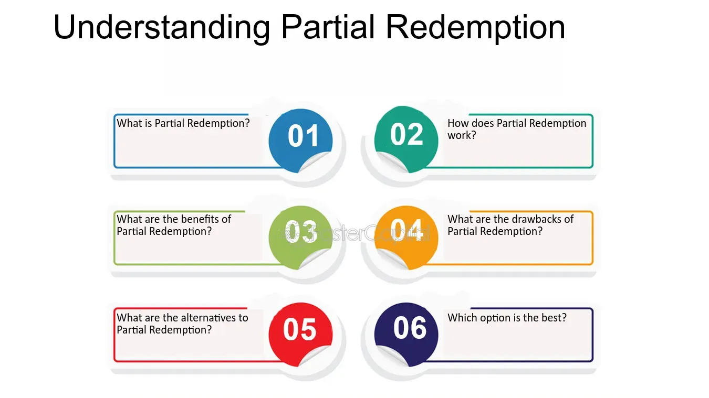

## Table of Contents

## What is partial redemption?

Partial redemption is when a company or organization pays back only part of a bond or a loan before it is fully due. This means that instead of paying back the whole amount at once, they pay back a portion of it. This can happen for different reasons, like if the company wants to reduce its debt or if it has extra money to pay back some of the loan early.

When a bond is partially redeemed, the bondholders get some of their money back, but they still hold the remaining part of the bond until it matures. This can affect the value of the bond and how much interest the bondholders will earn in the future. It's important for investors to understand partial redemption because it can change their investment returns and how they plan their finances.

## How does partial redemption differ from full redemption?

Partial redemption and full redemption are two ways a company can pay back a bond or a loan. Partial redemption happens when a company pays back only part of the bond or loan before it's fully due. This means the bondholders or lenders get some of their money back early, but they still have to wait for the rest of the money until the bond or loan matures. Companies might choose partial redemption if they want to slowly reduce their debt or if they have some extra money to pay back part of the loan early.

On the other hand, full redemption is when a company pays back the entire bond or loan all at once before it's due. This means the bondholders or lenders get all their money back at the same time, and the bond or loan is completely paid off. Full redemption can happen if a company has enough money to pay everything back early or if they want to get rid of all their debt at once. Both partial and full redemption can affect how much interest bondholders earn and how they plan their investments.

## What are the common scenarios where partial redemption is applied?

Partial redemption often happens when a company wants to slowly pay back its debt. For example, if a company has a big loan or bond, it might not have enough money to pay it all back at once. So, they choose to pay back a little bit at a time. This can help the company manage its money better and slowly reduce how much it owes. It's like paying off a credit card in smaller chunks instead of all at once.

Another common scenario is when a company has some extra money and decides to use it to pay back part of its debt early. This can happen if the company has a good year and makes more profit than expected. By paying back part of the loan or bond, the company can save on interest payments in the future. It's a smart way to use extra money to reduce debt and improve the company's financial health.

## What are the benefits of partial redemption for investors?

Partial redemption can be good for investors because it means they get some of their money back earlier than expected. This can be helpful if they need the money for something else or if they want to use it to invest in something new. When a company pays back part of a bond, investors can take that money and put it into other investments that might give them a better return.

Another benefit is that partial redemption can make the remaining part of the bond more valuable. When a company pays back some of the bond, there are fewer bonds left, which can make the ones that are left worth more. This can be good for investors because it means the value of their investment goes up. Plus, if the company is doing well enough to pay back part of the bond, it might make investors feel more confident about the company's future, which can also be good for the bond's value.

## What are the potential risks or drawbacks of partial redemption?

Partial redemption can have some risks for investors. One big risk is that when a company pays back part of a bond, the amount of interest investors earn can go down. This is because they are getting less money back over time, so there's less money to earn interest on. If investors were counting on that interest to help them reach their financial goals, they might be disappointed.

Another drawback is that partial redemption can make it harder for investors to plan their finances. When a company pays back part of a bond early, it can be hard for investors to know when they will get the rest of their money. This can make it tricky to figure out how much money they will have in the future and how to use it. If investors need a certain amount of money at a certain time, partial redemption can throw off their plans.

## How is the amount determined in a partial redemption process?

When a company decides to do a partial redemption, they have to figure out how much money to pay back. This amount can be based on different things. Sometimes, the company might have a rule in the bond agreement that says how much they have to pay back if they do a partial redemption. Other times, the company might just decide on an amount that they can afford to pay back at that time. They might look at how much extra money they have and how much they want to reduce their debt.

The amount can also depend on what the company wants to achieve with the partial redemption. If they want to save on interest payments, they might pay back a bigger amount. If they just want to show investors that they are doing well, they might pay back a smaller amount. The company will think about all these things and then decide on the amount for the partial redemption. This way, they can make sure it fits with their financial plans and helps them reach their goals.

## What are the typical mechanisms or methods used to execute partial redemption?

When a company does a partial redemption, they usually follow a set of steps to make sure it's done right. First, they look at the bond agreement to see if there are any rules about how much they can pay back and when. If there are rules, they have to follow them. If there aren't any rules, the company can choose how much to pay back based on how much money they have and what they want to achieve. They might talk to their financial advisors to help them decide on the right amount.

Once the company knows how much they want to pay back, they tell the bondholders about the partial redemption. They do this by sending out a notice that explains how much money each bondholder will get and when they will get it. The company then sends the money to the bondholders, usually through a bank or a financial institution. This way, everyone knows what's happening and the partial redemption is done smoothly and fairly.

## Can partial redemption affect the overall value of an investment?

Partial redemption can change the overall value of an investment. When a company pays back part of a bond, the bondholders get some of their money back early. This can be good because it means they have more money to use for other things or to invest in something new. But it can also mean they earn less interest in the future because there's less money left in the bond to earn interest on. So, the value of the investment can go up or down depending on what the bondholders do with the money they get back and how much interest they lose.

Another way partial redemption can affect the value of an investment is by changing how much the remaining part of the bond is worth. When a company pays back some of the bond, there are fewer bonds left, which can make the ones that are left more valuable. This can be good for the bondholders because it means their investment is worth more. But if the company is paying back the bond because they are having money problems, it might make investors worried about the company's future. This can make the bond less valuable. So, partial redemption can have both good and bad effects on the overall value of an investment.

## How do regulatory frameworks influence partial redemption practices?

Regulatory frameworks play a big role in how companies handle partial redemption. These rules make sure that when a company decides to pay back part of a bond, they do it in a fair and clear way. For example, there might be rules that say how much notice a company has to give bondholders before they do a partial redemption. There could also be rules about how much money the company can pay back and when they can do it. These rules help protect investors by making sure they know what's happening and can plan their finances accordingly.

Different countries might have different rules about partial redemption. In some places, the rules might be very strict, which means companies have to be very careful about how they do partial redemption. In other places, the rules might be more relaxed, giving companies more freedom to decide how much to pay back and when. No matter where the company is, following these rules is important because it helps keep trust between the company and the investors. If a company doesn't follow the rules, they could get in trouble and it might hurt their reputation.

## What are the tax implications of partial redemption for investors?

When a company does a partial redemption, it can affect how much tax investors have to pay. If investors get some of their money back early, they might have to pay taxes on that money right away. This is because the money they get back is considered income, and income is usually taxed. The exact amount of tax depends on the investor's tax situation and the rules in their country. For example, if an investor is in a high tax bracket, they might have to pay more tax on the money they get from the partial redemption.

The tax implications can also depend on whether the bond was bought at a discount or a premium. If the bond was bought at a discount, the investor might have to pay taxes on the difference between what they paid for the bond and what they get back in the partial redemption. On the other hand, if the bond was bought at a premium, the investor might be able to deduct some of the premium from their taxes. It's important for investors to understand these tax rules so they can plan their finances and know how much money they will have after taxes.

## How do financial institutions manage the logistics of partial redemption?

Financial institutions play a big role in making sure partial redemption goes smoothly. When a company decides to do a partial redemption, they work with banks or other financial institutions to handle the money. The company tells the financial institution how much money they want to pay back and when they want to do it. The financial institution then makes sure the right amount of money goes to the right bondholders. They use special systems and processes to make sure everything is done correctly and on time. This way, the bondholders get their money without any problems.

Sometimes, the financial institution also helps the company figure out how much to pay back and when. They look at the bond agreement and any rules that need to be followed. They might also help the company talk to the bondholders and explain what's happening. This is important because it helps keep everything clear and fair. By working with financial institutions, companies can make sure partial redemption is done the right way and that everyone is happy with the result.

## What advanced strategies can investors employ to optimize outcomes from partial redemption?

Investors can use some smart strategies to make the most out of partial redemption. One way is to reinvest the money they get back from the partial redemption into other investments that might give them a better return. If they find a new investment that pays more interest or has a good chance of going up in value, they can use the money from the partial redemption to buy it. This way, they can keep their money working for them and maybe even make more money in the long run. Another strategy is to use the money to pay off other debts, like a credit card or a loan. By paying off these debts, investors can save on interest payments and improve their overall financial health.

Another advanced strategy is to pay close attention to the company's financial health and future plans. If the company is doing well and likely to keep paying back the bond, investors might want to hold onto the remaining part of the bond. This can be good because the bond might become more valuable as the company pays back more of it. But if the company is having money problems, investors might want to sell the remaining part of the bond before it loses value. By understanding the company's situation, investors can make smart choices about what to do with their investment. This can help them get the best possible outcome from the partial redemption.

## References & Further Reading

[1]: ["Advances in Financial Machine Learning"](https://www.amazon.com/Advances-Financial-Machine-Learning-Marcos/dp/1119482089) by Marcos Lopez de Prado

[2]: Aldridge, I. (2013). ["High-Frequency Trading: A Practical Guide to Algorithmic Strategies and Trading Systems."](https://www.amazon.com/High-Frequency-Trading-Practical-Algorithmic-Strategies/dp/1118343506) Wiley Finance.

[3]: ["Machine Learning for Algorithmic Trading"](https://github.com/stefan-jansen/machine-learning-for-trading) by Stefan Jansen

[4]: ["Quantitative Trading: How to Build Your Own Algorithmic Trading Business"](https://www.amazon.com/Quantitative-Trading-Build-Algorithmic-Business/dp/1119800064) by Ernest P. Chan

[5]: Fabozzi, F. J., Fuss, R., & Dieter, G. (Eds.). (2008). ["Handbook of Commodity Investments."](https://onlinelibrary.wiley.com/doi/book/10.1002/9781118267004) Wiley.

[6]: ["Evidence-Based Technical Analysis: Applying the Scientific Method and Statistical Inference to Trading Signals"](https://www.amazon.com/Evidence-Based-Technical-Analysis-Scientific-Statistical/dp/0470008741) by David Aronson

